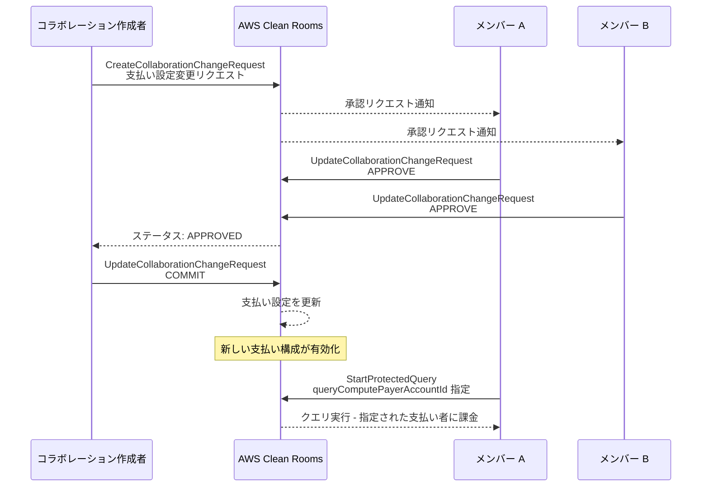

# AWS Clean Rooms - 可変支払い設定のサポート

**リリース日**: 2026 年 5 月 22 日
**サービス**: AWS Clean Rooms
**機能**: コラボレーションの可変支払い設定 (Mutable Payment Configurations)

[このアップデートのインフォグラフィックを見る](https://takech9203.github.io/aws-news-summary/20260522-aws-clean-rooms-mutable-payments.html)

## 概要

AWS Clean Rooms がコラボレーションに対する可変の細粒度支払い設定 (Mutable Fine-Grained Payment Configurations) をサポートしました。この機能により、コラボレーション作成後に支払い責任者を変更できるようになり、パートナー間でのコスト分担方法に大幅な柔軟性が加わります。

具体的には、SQL クエリ、PySpark ジョブ、ML モデルのトレーニングと推論ジョブ、合成データ生成など、特定のコストタイプごとに支払いを許可するパートナーを後から追加・削除できます。SQL および PySpark 分析では複数の支払い候補者 (Authorized Payers) を設定でき、分析送信時に実際の支払い者を選択できます。変更は「変更リクエスト」ワークフローを通じて行われ、コラボレーションメンバー全員の承認が必要です。

**アップデート前の課題**

- コラボレーション作成時に設定した支払い構成を後から変更できなかった
- 支払い責任者を変更するにはコラボレーションの再作成が必要だった
- パートナーとの新しいユースケース開発に伴う支払い条件の変更が困難だった
- コストタイプごとの柔軟な支払い分担ができなかった

**アップデート後の改善**

- コラボレーション作成後に変更リクエストを通じて支払い責任者の追加・削除が可能になった
- メンバー全員の承認ワークフローにより、安全かつ透明性のある支払い設定変更を実現
- SQL および PySpark 分析で複数の支払い候補者を設定し、実行時に選択可能になった
- ML モデルトレーニング、推論、合成データ生成のそれぞれに異なる支払い者を指定可能になった

## アーキテクチャ図



コラボレーション作成者が変更リクエストを送信し、メンバー全員の承認後にコミットすることで支払い設定が更新されます。その後の分析実行時に支払い者を指定できます。

## サービスアップデートの詳細

### 主要機能

1. **変更リクエストによる支払い設定の変更**
   - コラボレーション作成者が `CreateCollaborationChangeRequest` API で支払い設定の変更をリクエスト
   - 変更タイプとして `ADD_PAYER_CANDIDATE` および `REMOVE_PAYER_CANDIDATE` をサポート
   - メンバー全員の承認が必要で、安全な変更プロセスを保証
   - `isAutoApproved` フラグによる自動承認設定にも対応

2. **コストタイプ別の細粒度な支払い制御**
   - SQL クエリコンピュート (`queryCompute`)
   - PySpark ジョブコンピュート (`jobCompute`)
   - ML モデルトレーニング (`machineLearning.modelTraining`)
   - ML モデル推論 (`machineLearning.modelInference`)
   - 合成データ生成 (`machineLearning.syntheticDataGeneration`)

3. **分析実行時の支払い者選択**
   - `StartProtectedQuery` に `queryComputePayerAccountId` パラメータを追加
   - `StartProtectedJob` に `jobComputePayerAccountId` パラメータを追加
   - `CreateMLInputChannel` に `payerConfiguration` を追加 (computePayerAccountId, syntheticDataPayerAccountId)
   - `CreateTrainedModel` に `mlModelTrainingPayerAccountId` パラメータを追加
   - `StartTrainedModelInferenceJob` に `mlModelInferencePayerAccountId` パラメータを追加
   - 複数の支払い候補者が設定されている場合に、実行時に選択可能

4. **コラボレーションレベルの自動承認設定**
   - `autoApprovedChangeTypes` により特定の変更タイプを自動承認に設定可能
   - 対象: `ADD_MEMBER`、`GRANT_RECEIVE_RESULTS_ABILITY`、`REVOKE_RECEIVE_RESULTS_ABILITY`

5. **ML メンバー能力の管理**
   - `GRANT_CAN_RECEIVE_MODEL_OUTPUT` / `REVOKE_CAN_RECEIVE_MODEL_OUTPUT`
   - `GRANT_CAN_RECEIVE_INFERENCE_OUTPUT` / `REVOKE_CAN_RECEIVE_INFERENCE_OUTPUT`
   - 支払い設定変更と合わせて ML 関連の権限も同一リクエストで変更可能

## 技術仕様

### 変更リクエストのライフサイクル

| ステータス | 説明 |
|------|------|
| PENDING | リクエスト作成済み、承認待ち |
| APPROVED | 全メンバーが承認済み |
| COMMITTED | 変更が適用済み |
| DENIED | いずれかのメンバーが拒否 |
| CANCELLED | リクエスト作成者がキャンセル |

### 変更タイプ一覧

| タイプ | 説明 |
|------|------|
| ADD_PAYER_CANDIDATE | 支払い候補者の追加 |
| REMOVE_PAYER_CANDIDATE | 支払い候補者の削除 |
| ADD_MEMBER | メンバーの追加 |
| GRANT_RECEIVE_RESULTS_ABILITY | 結果受信権限の付与 |
| REVOKE_RECEIVE_RESULTS_ABILITY | 結果受信権限の取り消し |
| EDIT_AUTO_APPROVED_CHANGE_TYPES | 自動承認対象変更タイプの編集 |
| GRANT_CAN_RECEIVE_MODEL_OUTPUT | モデル出力受信権限の付与 |
| GRANT_CAN_RECEIVE_INFERENCE_OUTPUT | 推論出力受信権限の付与 |
| REVOKE_CAN_RECEIVE_MODEL_OUTPUT | モデル出力受信権限の取り消し |
| REVOKE_CAN_RECEIVE_INFERENCE_OUTPUT | 推論出力受信権限の取り消し |

### API 変更履歴

| 日付 | サービス | 変更内容 |
|------|----------|----------|
| 2026/05/21 | [cleanrooms](https://awsapichanges.com/archive/changes/8bd61f-cleanrooms.html) | 13 updated api methods - 支払い設定変更リクエスト関連 API の追加、クエリ/ジョブレスポンスへの支払い者 ID フィールド追加 |
| 2026/05/21 | [cleanrooms-ml](https://awsapichanges.com/archive/changes/8bd61f-cleanrooms-ml.html) | 15 updated api methods - ML 関連 API への支払い者設定パラメータ追加 |

### 主要 API メソッド (Clean Rooms Service)

| API メソッド | 変更内容 |
|------|------|
| CreateCollaborationChangeRequest | 変更リクエスト作成 (支払い設定含む) |
| GetCollaborationChangeRequest | 変更リクエストの詳細取得 |
| ListCollaborationChangeRequests | 変更リクエスト一覧取得 |
| UpdateCollaborationChangeRequest | 変更リクエストの承認/拒否/コミット/キャンセル |
| StartProtectedQuery | `queryComputePayerAccountId` パラメータ追加 |
| StartProtectedJob | `jobComputePayerAccountId` パラメータ追加 |
| GetProtectedQuery | レスポンスに `queryComputePayerAccountId` 追加 |
| GetProtectedJob | レスポンスに `jobComputePayerAccountId` 追加 |
| ListProtectedQueries | レスポンスに `queryComputePayerAccountId` 追加 |
| ListProtectedJobs | レスポンスに `jobComputePayerAccountId` 追加 |
| UpdateProtectedQuery | レスポンスに `queryComputePayerAccountId` 追加 |
| UpdateProtectedJob | レスポンスに `jobComputePayerAccountId` 追加 |
| UpdateMembership | `membershipPaymentConfiguration` パラメータ追加 |

### 主要 API メソッド (Clean Rooms ML)

| API メソッド | 変更内容 |
|------|------|
| CreateMLInputChannel | `payerConfiguration` (computePayerAccountId, syntheticDataPayerAccountId) 追加 |
| CreateTrainedModel | `mlModelTrainingPayerAccountId` パラメータ追加 |
| StartTrainedModelInferenceJob | `mlModelInferencePayerAccountId` パラメータ追加 |
| GetMLInputChannel | レスポンスに `payerConfiguration` 追加 |
| GetTrainedModel | レスポンスに `mlModelTrainingPayerAccountId` 追加 |
| GetTrainedModelInferenceJob | レスポンスに `mlModelInferencePayerAccountId` 追加 |
| GetCollaborationMLInputChannel | レスポンスに `payerConfiguration` 追加 |
| GetCollaborationTrainedModel | レスポンスに `mlModelTrainingPayerAccountId` 追加 |
| ListCollaborationMLInputChannels | レスポンスに `payerConfiguration` 追加 |
| ListCollaborationTrainedModels | レスポンスに `mlModelTrainingPayerAccountId` 追加 |
| ListCollaborationTrainedModelInferenceJobs | レスポンスに `mlModelInferencePayerAccountId` 追加 |
| ListMLInputChannels | レスポンスに `payerConfiguration` 追加 |
| ListTrainedModels | レスポンスに `mlModelTrainingPayerAccountId` 追加 |
| ListTrainedModelVersions | レスポンスに `mlModelTrainingPayerAccountId` 追加 |
| ListTrainedModelInferenceJobs | レスポンスに `mlModelInferencePayerAccountId` 追加 |

### API コード例

```python
# 支払い設定の変更リクエスト作成
client.create_collaboration_change_request(
    collaborationIdentifier='string',
    changes=[
        {
            'specificationType': 'MEMBER',
            'specification': {
                'member': {
                    'accountId': '123456789012',
                    'paymentConfiguration': {
                        'queryCompute': {
                            'isResponsible': True
                        },
                        'machineLearning': {
                            'modelTraining': {
                                'isResponsible': True
                            },
                            'modelInference': {
                                'isResponsible': True
                            },
                            'syntheticDataGeneration': {
                                'isResponsible': False
                            }
                        },
                        'jobCompute': {
                            'isResponsible': True
                        }
                    }
                }
            }
        }
    ]
)
```

```python
# 変更リクエストの承認
client.update_collaboration_change_request(
    collaborationIdentifier='string',
    changeRequestIdentifier='string',
    action='APPROVE'  # APPROVE | DENY | CANCEL | COMMIT
)
```

```python
# 支払い者を指定してクエリ実行
client.start_protected_query(
    type='SQL',
    membershipIdentifier='string',
    sqlParameters={
        'queryString': 'SELECT ...',
    },
    resultConfiguration={...},
    queryComputePayerAccountId='123456789012'
)
```

```python
# ML 入力チャネル作成時に支払い者を指定
client.create_ml_input_channel(
    membershipIdentifier='string',
    configuredModelAlgorithmAssociations=['string'],
    inputChannel={...},
    name='string',
    retentionInDays=30,
    payerConfiguration={
        'computePayerAccountId': '123456789012',
        'syntheticDataPayerAccountId': '987654321098'
    }
)
```

## 設定方法

### 前提条件

1. AWS Clean Rooms のコラボレーションが作成済みであること
2. コラボレーションに複数のメンバーが参加していること
3. 変更リクエストを作成する権限を持つ IAM ロールがあること (コラボレーション作成者)

### 手順

#### ステップ 1: 支払い設定の変更リクエストを作成

```bash
aws cleanrooms create-collaboration-change-request \
  --collaboration-identifier "collaboration-id" \
  --changes '[{
    "specificationType": "MEMBER",
    "specification": {
      "member": {
        "accountId": "123456789012",
        "paymentConfiguration": {
          "queryCompute": {"isResponsible": true},
          "jobCompute": {"isResponsible": true},
          "machineLearning": {
            "modelTraining": {"isResponsible": true},
            "modelInference": {"isResponsible": false},
            "syntheticDataGeneration": {"isResponsible": false}
          }
        }
      }
    }
  }]'
```

コラボレーション作成者が支払い責任者の変更リクエストを作成します。この例では、指定したアカウントに SQL クエリ、PySpark ジョブ、ML モデルトレーニングの支払い責任を追加しています。

#### ステップ 2: メンバーによる承認

```bash
aws cleanrooms update-collaboration-change-request \
  --collaboration-identifier "collaboration-id" \
  --change-request-identifier "change-request-id" \
  --action APPROVE
```

コラボレーションの各メンバーが変更リクエストを承認します。全メンバーが承認すると、ステータスが APPROVED に変わります。

#### ステップ 3: 変更のコミット

```bash
aws cleanrooms update-collaboration-change-request \
  --collaboration-identifier "collaboration-id" \
  --change-request-identifier "change-request-id" \
  --action COMMIT
```

全メンバーの承認後、コラボレーション作成者が変更をコミットして支払い設定を適用します。

#### ステップ 4: 支払い者を指定して分析を実行

```bash
aws cleanrooms start-protected-query \
  --type SQL \
  --membership-identifier "membership-id" \
  --sql-parameters '{"queryString": "SELECT ..."}' \
  --result-configuration '{"outputConfiguration": {"s3": {"resultFormat": "CSV", "bucket": "my-bucket"}}}' \
  --query-compute-payer-account-id "123456789012"
```

分析実行時に支払い者のアカウント ID を指定します。複数の支払い候補者が設定されている場合に使用します。

## メリット

### ビジネス面

- **運用の柔軟性**: コラボレーションの再作成なしに支払い構成を変更でき、ビジネス関係の変化に迅速に対応可能
- **コスト最適化**: 分析の種類や規模に応じて最適な支払い者を選択でき、公平なコスト分担が実現
- **パートナーシップの拡大**: 支払い条件の柔軟性により、新しいパートナーとのコラボレーション開始のハードルが低下
- **段階的な責任移行**: プロジェクトの進行に合わせて段階的に支払い責任を移行可能

### 技術面

- **API ベースの制御**: 変更リクエストの作成・承認・コミットをすべて API で実行可能で、自動化やワークフロー統合に対応
- **安全な変更プロセス**: 全メンバーの承認が必要なワークフローにより、意図しない支払い変更を防止
- **細粒度な設定**: コストタイプごとに異なる支払い者を設定でき、複雑な課金要件に対応
- **ML ワークロード対応**: トレーニング、推論、合成データ生成のそれぞれに個別の支払い者を設定可能

## デメリット・制約事項

### 制限事項

- 変更リクエストの作成はコラボレーション作成者のみが可能
- 全メンバーの承認が必要なため、メンバー数が多い場合は変更に時間がかかる可能性がある
- 進行中の分析には変更が影響しない (変更コミット後の新しい分析から適用)
- `autoApprovedChangeTypes` で自動承認できるのは一部の変更タイプのみ (支払い候補者の追加/削除は自動承認対象外)

### 考慮すべき点

- 支払い候補者として指定されたアカウントには適切な予算設定と IAM 権限が必要
- 変更リクエストのステータス管理と承認ワークフローの運用設計が必要
- 複数の支払い候補者が設定されている場合、分析実行時に支払い者を明示的に指定する必要がある
- 変更リクエストが DENIED された場合、新しいリクエストを作成し直す必要がある

## ユースケース

### ユースケース 1: 製薬会社と医療機関のコラボレーション

**シナリオ**: 製薬会社が複数の医療機関と臨床試験データの分析コラボレーションを実施。初期は製薬会社が全コストを負担していたが、プロジェクト進行に伴い、シンプルな SQL 分析は医療機関側が負担する形に変更したい。

**実装例**:
```python
# 医療機関を SQL クエリの支払い候補者として追加
client.create_collaboration_change_request(
    collaborationIdentifier='collab-pharma-hospital',
    changes=[{
        'specificationType': 'MEMBER',
        'specification': {
            'member': {
                'accountId': 'hospital-account-id',
                'paymentConfiguration': {
                    'queryCompute': {'isResponsible': True},
                    'machineLearning': {
                        'modelTraining': {'isResponsible': False},
                        'modelInference': {'isResponsible': False},
                        'syntheticDataGeneration': {'isResponsible': False}
                    },
                    'jobCompute': {'isResponsible': False}
                }
            }
        }
    }]
)
```

**効果**: 複雑な ML 分析は製薬会社が負担し、日常的な SQL クエリは医療機関が負担する形で公平なコスト分担を実現

### ユースケース 2: 小売業者間のデータ連携コスト分担

**シナリオ**: 複数の小売業者がマーケティング分析のためにコラボレーションを構築。季節ごとのキャンペーンに応じて、分析を主導するパートナーが変わるため、支払い責任も動的に変更したい。

**実装例**:
```python
# 夏季キャンペーンを主導するパートナー B に支払い責任を追加
client.create_collaboration_change_request(
    collaborationIdentifier='collab-retail',
    changes=[{
        'specificationType': 'MEMBER',
        'specification': {
            'member': {
                'accountId': 'partner-b-account',
                'paymentConfiguration': {
                    'queryCompute': {'isResponsible': True},
                    'jobCompute': {'isResponsible': True},
                    'machineLearning': {
                        'modelTraining': {'isResponsible': False},
                        'modelInference': {'isResponsible': False},
                        'syntheticDataGeneration': {'isResponsible': False}
                    }
                }
            }
        }
    }]
)

# 分析実行時に支払い者を選択
client.start_protected_query(
    type='SQL',
    membershipIdentifier='membership-id',
    sqlParameters={'queryString': 'SELECT ...'},
    resultConfiguration={...},
    queryComputePayerAccountId='partner-b-account'
)
```

**効果**: キャンペーンの主導者に応じて支払い責任を柔軟に変更し、プロジェクトのコスト配分を適切に管理

### ユースケース 3: ML モデルトレーニングと推論のコスト分離

**シナリオ**: 広告テクノロジー企業とパブリッシャーが共同でオーディエンスセグメンテーションモデルをトレーニング。モデルトレーニングは広告テクノロジー企業が、推論は利用するパブリッシャーが、合成データ生成は両者で分担するモデルに変更したい。

**実装例**:
```python
# パブリッシャーに推論コストの支払い責任を追加
client.create_collaboration_change_request(
    collaborationIdentifier='collab-adtech',
    changes=[{
        'specificationType': 'MEMBER',
        'specification': {
            'member': {
                'accountId': 'publisher-account',
                'paymentConfiguration': {
                    'queryCompute': {'isResponsible': False},
                    'jobCompute': {'isResponsible': False},
                    'machineLearning': {
                        'modelInference': {'isResponsible': True},
                        'modelTraining': {'isResponsible': False},
                        'syntheticDataGeneration': {'isResponsible': True}
                    }
                }
            }
        }
    }]
)

# 推論ジョブ実行時にパブリッシャーを支払い者として指定
client.start_trained_model_inference_job(
    membershipIdentifier='membership-id',
    name='audience-segmentation-inference',
    trainedModelArn='trained-model-arn',
    resourceConfig={...},
    outputConfiguration={...},
    dataSource={'mlInputChannelArn': 'ml-input-channel-arn'},
    mlModelInferencePayerAccountId='publisher-account'
)
```

**効果**: ML ワークロードのコストを役割に応じて分離し、各当事者が受益するサービスに対して支払う公正なモデルを実現

## 料金

AWS Clean Rooms の支払い設定変更自体に追加料金は発生しません。料金はコラボレーション内で実行される分析に対して、指定された支払い者のアカウントに課金されます。

### 料金例

| コストタイプ | 料金体系 |
|--------|------|
| SQL クエリコンピュート | スキャンされたデータ量に基づく料金 |
| PySpark ジョブ | コンピュートユニットの使用時間に基づく料金 |
| ML モデルトレーニング | トレーニングインスタンスの使用リソースに基づく料金 |
| ML モデル推論 | 推論インスタンスの使用リソースに基づく料金 |
| 合成データ生成 | 生成処理のリソース使用量に基づく料金 |

## 利用可能リージョン

AWS Clean Rooms が利用可能なすべてのリージョンでこの機能を使用できます。利用可能なリージョンの一覧は [AWS リージョン表](https://aws.amazon.com/about-aws/global-infrastructure/regional-product-services/) を参照してください。

## 関連サービス・機能

- **AWS Clean Rooms ML**: ML モデルのトレーニング・推論・合成データ生成における支払い設定の変更にも対応 (15 API メソッドが更新)
- **AWS Clean Rooms Differential Privacy**: 差分プライバシーを適用した分析でも支払い者指定が可能
- **AWS Organizations**: マルチアカウント環境での支払い管理と連携
- **AWS Cost Explorer**: 支払い者ごとのコスト可視化と分析
- **AWS Budgets**: 支払い候補者アカウントの予算管理と超過アラート

## 参考リンク

- [インフォグラフィック](https://takech9203.github.io/aws-news-summary/20260522-aws-clean-rooms-mutable-payments.html)
- [公式発表 (What's New)](https://aws.amazon.com/about-aws/whats-new/2026/05/aws-clean-rooms-mutable-payments)
- [AWS Clean Rooms ドキュメント](https://docs.aws.amazon.com/clean-rooms/latest/userguide/)
- [AWS Clean Rooms 料金ページ](https://aws.amazon.com/clean-rooms/pricing/)
- [AWS Clean Rooms API リファレンス](https://docs.aws.amazon.com/clean-rooms/latest/apireference/)

## まとめ

AWS Clean Rooms の可変支払い設定は、コラボレーションパートナー間のコスト分担に大きな柔軟性をもたらす重要なアップデートです。コラボレーションの再作成なしに支払い責任を変更できるため、ビジネス関係の変化や新しいユースケースの追加に迅速に対応できます。特に、複数のパートナーが参加する長期的なデータコラボレーションにおいて、コストタイプ別の細粒度な制御 (SQL、PySpark、ML トレーニング、推論、合成データ) と承認ワークフローによる安全な変更プロセスが有用です。Solutions Architect としては、コラボレーション設計時に将来的な支払い変更の可能性を考慮し、適切な IAM 権限設計と承認プロセスの運用設計を組み込むことを推奨します。
