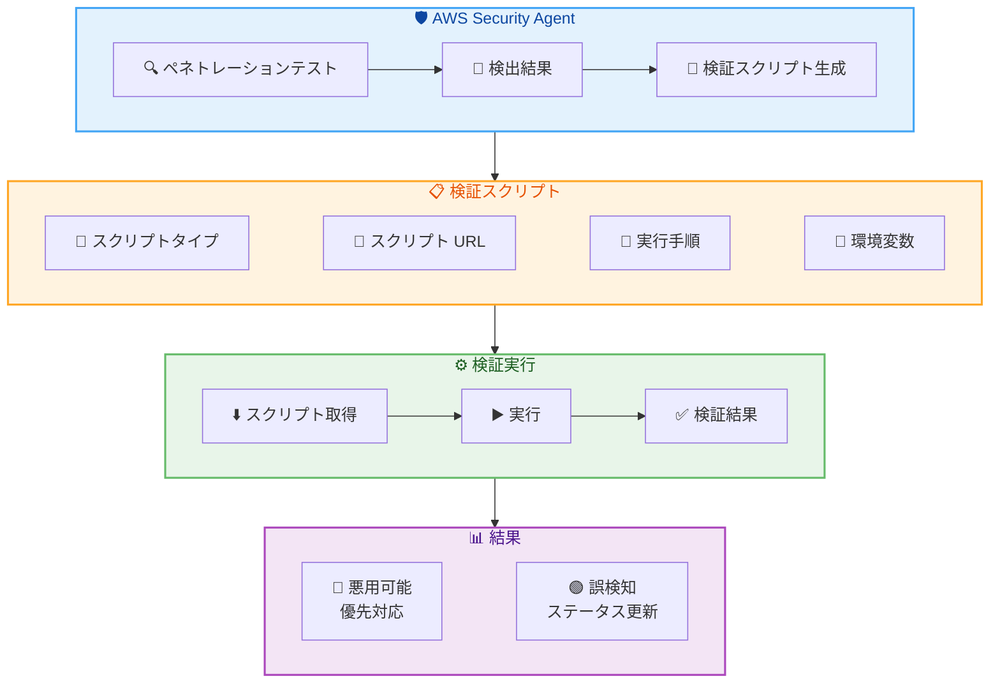

# AWS Security Agent - ペネトレーションテスト検出結果に対する検証スクリプト機能

**リリース日**: 2026 年 5 月 22 日
**サービス**: AWS Security Agent
**機能**: Verification Scripts for Pentest Findings (ペネトレーションテスト検出結果の検証スクリプト)

📊 [このアップデートのインフォグラフィックを見る](https://takech9203.github.io/aws-news-summary/20260522-aws-security-agent.html)

## 概要

AWS Security Agent に、ペネトレーションテストの検出結果に対する検証スクリプト (Verification Scripts) 機能が追加された。この機能により、セキュリティチームは検出された脆弱性が実際にターゲット環境で悪用可能かどうかを確認するための検証スクリプトを自動生成・実行できるようになる。

従来、ペネトレーションテストの検出結果には誤検知 (False Positive) が含まれる可能性があり、セキュリティチームは手動で各脆弱性の再現性を確認する必要があった。今回の機能追加により、検出された脆弱性ごとに実行可能な検証スクリプトが自動生成され、独立して脆弱性を再現・確認できるようになる。これにより、誤検知の削減とリメディエーション作業の効率化が実現する。

**アップデート前の課題**

- ペネトレーションテストの検出結果について、実際の悪用可能性を手動で検証する必要があった
- 誤検知 (False Positive) の判別に多大な工数がかかっていた
- セキュリティチームが脆弱性の再現手順を独自に作成する必要があり、属人化しやすかった
- 検出結果の優先度付けが困難で、リメディエーション作業の効率が低かった

**アップデート後の改善**

- 検出された脆弱性ごとに実行可能な検証スクリプトが自動生成されるようになった
- スクリプトには実行手順、必要な環境変数、スクリプトタイプが含まれ、即座に検証を開始可能
- 誤検知を効率的に排除し、真の脆弱性に集中してリメディエーション作業を行える
- チーム全体で一貫した検証プロセスを実現し、属人化を防止できるようになった

## アーキテクチャ図



ペネトレーションテストで検出された脆弱性に対して検証スクリプトが自動生成され、セキュリティチームが独立して脆弱性の再現性を確認できるフローを示している。

## サービスアップデートの詳細

### 主要機能

1. **検証スクリプトの自動生成**
   - ペネトレーションテストの各検出結果に対して、実行可能な検証スクリプトを自動生成
   - スクリプトタイプ (`scriptType`) により、実行環境や言語が明示される
   - 署名付き URL (`scriptUrl`) からスクリプトをダウンロード可能

2. **実行手順の提供**
   - 各検証スクリプトに対して、具体的な実行手順 (`instructions`) が提供される
   - ターゲット環境に合わせた環境変数 (`envVars`) が定義済み
   - セキュリティチームは手順に従うだけで検証を実施可能

3. **検出結果ステータスとの連携**
   - 検証結果に基づいて、検出結果のステータスを `ACTIVE`、`RESOLVED`、`ACCEPTED`、`FALSE_POSITIVE` に更新可能
   - 信頼度 (`confidence`) フィールドと組み合わせて、脆弱性の優先度を効率的に判断可能

## 技術仕様

### API レスポンス構造

検証スクリプト情報は `BatchGetFindings` API のレスポンスに含まれる `verificationScript` オブジェクトとして提供される。

| 項目 | 型 | 説明 |
|------|------|------|
| `scriptType` | string | スクリプトの種類・実行環境 |
| `scriptUrl` | string | スクリプトのダウンロード URL |
| `instructions` | string | 実行手順の説明 |
| `envVars` | array | 必要な環境変数のリスト |
| `envVars[].name` | string | 環境変数名 |
| `envVars[].value` | string | 環境変数の値 |

### API 変更履歴

| 日付 | サービス | 変更内容 |
|------|----------|----------|
| 2026/05/22 | [securityagent](https://awsapichanges.com/archive/changes/f23ff3-securityagent.html) | 1 updated api method - BatchGetFindings レスポンスに verificationScript フィールドを追加 |

### レスポンス例

```json
{
  "findings": [
    {
      "findingId": "finding-abc123",
      "name": "SQL Injection in login endpoint",
      "status": "ACTIVE",
      "riskLevel": "HIGH",
      "confidence": "HIGH",
      "verificationScript": {
        "scriptType": "bash",
        "scriptUrl": "https://security-agent-scripts.s3.amazonaws.com/verify-abc123.sh",
        "instructions": "Run the script against the target endpoint to verify SQL injection vulnerability.",
        "envVars": [
          {
            "name": "TARGET_URL",
            "value": "https://app.example.com/api/login"
          },
          {
            "name": "PAYLOAD_TYPE",
            "value": "union-based"
          }
        ]
      }
    }
  ]
}
```

## 設定方法

### 前提条件

1. AWS Security Agent の Agent Space が構築済みであること
2. ペネトレーションテストが実行済みで、検出結果が存在すること
3. `BatchGetFindings` API を呼び出す IAM 権限が付与されていること

### 手順

#### ステップ 1: 検出結果の取得

```bash
aws securityagent batch-get-findings \
  --finding-ids "finding-abc123" \
  --agent-space-id "space-xyz789"
```

ペネトレーションテストの検出結果を取得する。レスポンスに `verificationScript` フィールドが含まれる。

#### ステップ 2: 検証スクリプトのダウンロード

```bash
# レスポンスから scriptUrl を取得してスクリプトをダウンロード
curl -o verify_finding.sh "https://security-agent-scripts.s3.amazonaws.com/verify-abc123.sh"
chmod +x verify_finding.sh
```

レスポンスの `verificationScript.scriptUrl` からスクリプトをダウンロードし、実行権限を付与する。

#### ステップ 3: 環境変数の設定と実行

```bash
# レスポンスに含まれる環境変数を設定
export TARGET_URL="https://app.example.com/api/login"
export PAYLOAD_TYPE="union-based"

# 検証スクリプトの実行
./verify_finding.sh
```

`verificationScript.envVars` に定義された環境変数を設定し、スクリプトを実行して脆弱性の再現性を確認する。

## メリット

### ビジネス面

- **リメディエーション工数の削減**: 誤検知の自動排除により、真の脆弱性への対応に集中でき、セキュリティチームの生産性が向上する
- **セキュリティ対応の迅速化**: 脆弱性の検証から修正までのサイクルタイムを短縮し、リスク露出期間を最小化できる
- **監査対応の効率化**: 検証スクリプトの実行結果を証跡として利用でき、コンプライアンス報告が容易になる

### 技術面

- **再現性の確保**: 自動生成されたスクリプトにより、脆弱性の再現手順が標準化され、チーム間で一貫した検証が可能
- **環境固有の検証**: ターゲット環境に合わせた環境変数が提供されるため、環境差異による検証漏れを防止できる
- **API 統合の容易さ**: `BatchGetFindings` API のレスポンスに含まれるため、既存の自動化パイプラインに容易に組み込み可能

## デメリット・制約事項

### 制限事項

- 検証スクリプトの実行はユーザー側の環境で行う必要があり、AWS マネージドな実行環境は提供されない
- すべての検出結果に対して検証スクリプトが生成されるわけではなく、スクリプト生成可能な脆弱性タイプに限定される
- スクリプト URL には有効期限がある可能性があり、取得後は速やかに実行する必要がある

### 考慮すべき点

- 検証スクリプトは本番環境に対して実行する場合、サービスへの影響を考慮し、メンテナンスウィンドウ内での実行を推奨
- 検証スクリプトの実行結果は環境に依存するため、ステージング環境での事前検証を推奨
- 環境変数に含まれる情報のセキュリティ管理に注意が必要

## ユースケース

### ユースケース 1: 大規模ペネトレーションテスト後の効率的なトリアージ

**シナリオ**: エンタープライズ環境で数百件の検出結果が報告されたペネトレーションテスト後に、セキュリティチームが限られた時間で真の脆弱性を特定する必要がある。

**実装例**:
```python
import boto3

client = boto3.client('securityagent')

# 全検出結果を取得
response = client.batch_get_findings(
    findingIds=finding_ids,
    agentSpaceId='space-xyz789'
)

# HIGH/CRITICAL のみ検証スクリプトを実行
for finding in response['findings']:
    if finding['riskLevel'] in ['HIGH', 'CRITICAL']:
        script = finding.get('verificationScript')
        if script:
            print(f"Verifying: {finding['name']}")
            print(f"Script URL: {script['scriptUrl']}")
            print(f"Instructions: {script['instructions']}")
```

**効果**: 数百件の検出結果から、高リスクかつ実際に悪用可能な脆弱性を迅速に特定し、修正優先度を明確化できる。

### ユースケース 2: CI/CD パイプラインへの検証プロセス統合

**シナリオ**: DevSecOps チームが、ペネトレーションテスト後の検証プロセスを CI/CD パイプラインに組み込み、自動的に脆弱性の再現性を確認したい。

**実装例**:
```yaml
# GitHub Actions の例
- name: Verify Security Findings
  run: |
    FINDINGS=$(aws securityagent batch-get-findings \
      --finding-ids ${{ env.FINDING_IDS }} \
      --agent-space-id ${{ env.AGENT_SPACE_ID }} \
      --query 'findings[?verificationScript!=null]')
    
    echo "$FINDINGS" | jq -r '.[].verificationScript.scriptUrl' | while read url; do
      curl -o verify.sh "$url"
      chmod +x verify.sh
      ./verify.sh || echo "Vulnerability confirmed"
    done
```

**効果**: 検証プロセスの自動化により、リリースサイクルを遅延させることなくセキュリティ検証を継続的に実施できる。

### ユースケース 3: セキュリティ修正の効果確認

**シナリオ**: 開発チームが脆弱性の修正を適用した後、検証スクリプトを再実行して修正が有効であることを確認したい。

**実装例**:
```bash
# 修正前: 脆弱性が確認される
export TARGET_URL="https://app.example.com/api/login"
./verify_finding.sh
# Output: VULNERABLE - SQL injection confirmed

# 修正適用後: 再度検証
./verify_finding.sh
# Output: NOT VULNERABLE - Input properly sanitized
```

**効果**: 修正の有効性を客観的に確認でき、修正漏れや不完全な対策を早期に検出できる。

## 料金

AWS Security Agent の検証スクリプト機能は、既存のペネトレーションテスト機能の一部として提供される。追加料金は発生しない。AWS Security Agent の料金は Agent Space の利用状況に基づいて課金される。

## 利用可能リージョン

AWS Security Agent が利用可能なすべてのリージョンでこの機能を利用可能。

## 関連サービス・機能

- **AWS Security Agent - ペネトレーションテスト**: 検証スクリプトの生成元となるペネトレーションテスト機能
- **AWS Security Agent - Full Repository Code Review**: コードベース全体のセキュリティ分析機能との連携で包括的なセキュリティ評価が可能
- **AWS Security Hub**: 検出結果の集約・管理基盤として、検証済み脆弱性の統合管理に活用可能
- **Amazon Inspector**: 継続的な脆弱性スキャンとの組み合わせにより、多層的なセキュリティ評価を実現

## 参考リンク

- 📊 [インフォグラフィック](https://takech9203.github.io/aws-news-summary/20260522-aws-security-agent.html)
- [公式発表 (What's New)](https://aws.amazon.com/about-aws/whats-new/2026/05/aws-security-agent/)
- [AWS Security Agent ドキュメント](https://docs.aws.amazon.com/security-agent/)
- [API 変更履歴](https://awsapichanges.com/archive/changes/f23ff3-securityagent.html)

## まとめ

AWS Security Agent の検証スクリプト機能は、ペネトレーションテストの検出結果に対する検証プロセスを自動化し、誤検知の効率的な排除と真の脆弱性への迅速な対応を実現する。セキュリティチームは `BatchGetFindings` API から取得した検証スクリプトを実行するだけで脆弱性の再現性を確認でき、リメディエーション作業の優先度付けと効率化に大きく貢献する。既存のペネトレーションテストワークフローや CI/CD パイプラインへの統合も容易であるため、早期の活用を推奨する。
