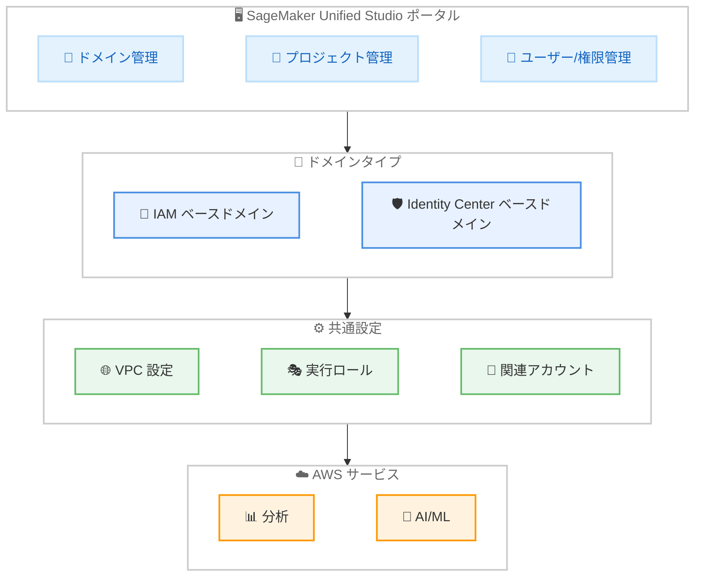

# Amazon SageMaker Unified Studio - ドメイン管理機能の Identity Center ドメインへの拡張

**リリース日**: 2026年5月22日
**サービス**: Amazon SageMaker Unified Studio
**機能**: Identity Center ベースドメインのドメイン管理

📊 [このアップデートのインフォグラフィックを見る](https://takech9203.github.io/aws-news-summary/20260522-domain-management-iam-idc.html)

## 概要

Amazon SageMaker Unified Studio において、これまで IAM ベースのドメインでのみ利用可能だったドメイン管理機能が、Identity Center ベースのドメインにも拡張された。これにより、管理者は AWS コンソール外の SageMaker Unified Studio ポータルから直接、Identity Center ベースのドメインを管理できるようになった。

このアップデートにより、管理者やデータ管理チームは SageMaker Unified Studio ポータル上でプロジェクトの作成・管理、ワークフォース ID の設定、ユーザーと権限の管理、プロジェクトのネットワーク設定を統一的に行えるようになる。特に、プロジェクトごとに構成可能な実行ロールにより、AWS の分析、AI、ML サービスへのアクセスを柔軟に制御できる。

**アップデート前の課題**

- Identity Center ベースのドメイン管理は AWS コンソールからのみ可能で、SageMaker Unified Studio ポータルでは操作できなかった
- IAM ベースのドメインと Identity Center ベースのドメインで管理体験が異なり、運用の複雑さが増していた
- Identity Center ドメインのプロジェクト作成時に、実行ロールの柔軟な設定ができなかった

**アップデート後の改善**

- Identity Center ベースのドメインでも SageMaker Unified Studio ポータルから直接ドメイン管理が可能になった
- 両ドメインタイプで一貫した VPC 設定が利用可能になり、すべてのプロジェクトに継承される
- プロジェクトごとに構成可能な実行ロールで、AWS サービスへのアクセスを細かく制御できるようになった
- 関連アカウントの管理が可能になり、他の AWS アカウントからのデータ公開・消費ができるようになった

## アーキテクチャ図



SageMaker Unified Studio ポータルから IAM / Identity Center 両方のドメインタイプを統一的に管理し、共通の VPC 設定と実行ロールを通じて AWS サービスにアクセスする構成を示している。

## サービスアップデートの詳細

### 主要機能

1. **プロジェクト管理の拡張**
   - Identity Center ベースのドメインで SageMaker Unified Studio ポータルからプロジェクトを作成・管理可能
   - プロジェクトごとに構成可能な実行ロールを設定でき、AWS の分析、AI、ML サービスへのアクセスを定義
   - 実行ロールによりプロジェクト単位のアクセス制御が実現

2. **統一された VPC 設定**
   - VPC 構成が両ドメインタイプで一貫しており、すべてのプロジェクトに自動的に継承される
   - VPC、サブネット、セキュリティグループの編集が可能
   - ドメインレベルでのネットワーク設定がプロジェクト全体に適用される

3. **クロスアカウントデータ共有**
   - 関連アカウントの管理が可能で、ユーザーは他の AWS アカウントのデータを公開・消費可能
   - SageMaker Unified Studio 内でマルチアカウント環境のデータガバナンスを実現

4. **ワークフォース ID とユーザー管理**
   - Identity Center を通じたワークフォース ID の設定が可能
   - ユーザーと権限の管理を SageMaker Unified Studio ポータルから直接実施

## 技術仕様

### ドメインタイプの比較

| 項目 | IAM ベースドメイン | Identity Center ベースドメイン |
|------|-------------------|-------------------------------|
| ポータル管理 | 対応済み | 今回新たに対応 |
| プロジェクト作成 | 対応済み | 今回新たに対応 |
| VPC 設定 | プロジェクト継承 | プロジェクト継承 |
| 実行ロール | 構成可能 | 構成可能 |
| クロスアカウント | 対応 | 今回新たに対応 |
| 認証方式 | IAM ユーザー/ロール | AWS IAM Identity Center |

### API 変更履歴

| 日付 | サービス | 変更内容 |
|------|----------|----------|
| 2026/05/21 | [Amazon SageMaker Service](https://awsapichanges.com/archive/changes/8bd61f-api.sagemaker.html) | 3 updated api methods - CreateDomain, DescribeDomain, UpdateDomain に HomeEfsFileSystemCreation パラメータ追加 |

### VPC 設定の継承モデル

```json
{
  "DomainSettings": {
    "VpcConfiguration": {
      "VpcId": "vpc-xxxxxxxx",
      "SubnetIds": ["subnet-xxxxxxxx", "subnet-yyyyyyyy"],
      "SecurityGroupIds": ["sg-xxxxxxxx"]
    }
  },
  "Projects": {
    "InheritedNetworkConfig": true,
    "ExecutionRole": "arn:aws:iam::123456789012:role/SageMakerProjectRole"
  }
}
```

## 設定方法

### 前提条件

1. Amazon SageMaker Unified Studio が有効化されていること
2. AWS IAM Identity Center が設定済みであること
3. 管理者権限を持つユーザーアカウントが存在すること

### 手順

#### ステップ 1: SageMaker Unified Studio ポータルへのアクセス

SageMaker Unified Studio ポータルにアクセスし、管理者としてサインインする。Identity Center ベースのドメインの管理者は、ポータルのドメイン管理セクションにアクセスできるようになった。

#### ステップ 2: プロジェクトの作成と実行ロールの設定

ドメイン管理画面からプロジェクトを作成し、実行ロールを指定する。実行ロールにより、プロジェクトがアクセスできる AWS の分析、AI、ML サービスが決定される。

#### ステップ 3: VPC 設定の構成

ドメインレベルで VPC、サブネット、セキュリティグループを設定する。この設定はドメイン内の全プロジェクトに継承される。必要に応じて編集も可能。

#### ステップ 4: 関連アカウントの設定

他の AWS アカウントとのデータ共有が必要な場合、関連アカウントを追加する。これにより、ユーザーは他アカウントのデータを公開・消費できるようになる。

## メリット

### ビジネス面

- **統一された管理体験**: IAM と Identity Center 両方のドメインタイプで同じポータルから管理でき、運用負荷が軽減される
- **マルチアカウントデータガバナンス**: クロスアカウントのデータ共有を一元管理でき、組織全体のデータ活用が促進される
- **セルフサービスの実現**: 管理者が AWS コンソールを使わずにポータルから直接操作できるため、IT 部門への依存が減少する

### 技術面

- **一貫したネットワーク設定**: VPC 構成がドメインレベルで管理され、全プロジェクトに自動継承されるため設定ミスが減少する
- **きめ細かなアクセス制御**: プロジェクト単位の実行ロールにより、最小権限の原則を容易に実現できる
- **Identity Center 統合**: 企業の既存の ID 管理基盤と統合し、シングルサインオンやグループベースのアクセス管理が可能

## デメリット・制約事項

### 制限事項

- VPC 設定はドメインレベルで全プロジェクトに継承されるため、プロジェクト個別の VPC 設定はできない
- SageMaker Unified Studio が利用可能なリージョンに限定される
- Identity Center の事前設定が必要であり、IAM のみの環境からの移行にはセットアップが必要

### 考慮すべき点

- 既存の IAM ベースドメインの運用に影響はないが、Identity Center への移行を検討する場合は計画的な移行が推奨される
- クロスアカウントデータ共有にはアカウント間の信頼関係設定が別途必要な場合がある

## ユースケース

### ユースケース 1: エンタープライズのデータサイエンスチーム管理

**シナリオ**: 大企業で Identity Center を利用して組織全体の ID 管理を行っており、複数のデータサイエンスチームが SageMaker を使用している。各チームのプロジェクトに異なるアクセス権限を付与したい。

**実装例**:
```
1. Identity Center ベースのドメインを SageMaker Unified Studio で作成
2. チームごとにプロジェクトを作成し、それぞれに適切な実行ロールを設定
3. VPC 設定をドメインレベルで統一し、セキュリティグループでチーム間の通信を制御
```

**効果**: 各チームが必要な AWS サービスのみにアクセスでき、セキュリティとガバナンスを維持しながらセルフサービスで ML ワークロードを実行できる。

### ユースケース 2: マルチアカウント環境でのデータ共有

**シナリオ**: データレイクアカウント、分析アカウント、ML アカウントを分離している組織で、各アカウントのデータを SageMaker Unified Studio から横断的に利用したい。

**実装例**:
```
1. SageMaker Unified Studio の関連アカウント機能でデータレイクアカウントを追加
2. ユーザーが他アカウントのデータカタログからデータセットを検索・利用
3. 分析結果を他アカウントに公開し、組織全体で活用
```

**効果**: アカウント分離によるセキュリティを維持しながら、データの発見性と再利用性が向上する。

### ユースケース 3: セキュアなネットワーク環境での ML 開発

**シナリオ**: 規制産業の企業で、すべての ML ワークロードをプライベートサブネット内で実行する必要がある。複数プロジェクトに一貫したネットワークポリシーを適用したい。

**実装例**:
```
1. ドメインレベルで VPC 設定を構成し、プライベートサブネットとセキュリティグループを指定
2. 全プロジェクトが自動的にこのネットワーク設定を継承
3. 必要に応じて VPC エンドポイントを追加し、AWS サービスへのプライベートアクセスを確保
```

**効果**: ネットワークセキュリティポリシーがドメイン全体で一貫して適用され、個別プロジェクトでの設定漏れを防止できる。

## 料金

SageMaker Unified Studio のドメイン管理機能自体に追加料金は発生しない。料金は使用する AWS の分析、AI、ML サービス、および VPC 内のリソース使用量に基づいて課金される。

## 利用可能リージョン

Amazon SageMaker Unified Studio が利用可能なすべての AWS リージョンで使用可能。詳細なリージョン一覧は [サポートされているリージョンのドキュメント](https://docs.aws.amazon.com/sagemaker-unified-studio/latest/adminguide/supported-regions.html) を参照。

## 関連サービス・機能

- **AWS IAM Identity Center**: SageMaker Unified Studio ドメインの認証基盤として使用。シングルサインオンとグループベースのアクセス管理を提供
- **Amazon SageMaker Unified Studio**: 分析、AI、ML のための統合ポータル。今回のアップデートの対象サービス
- **AWS Organizations**: マルチアカウント環境の管理基盤。クロスアカウントデータ共有の前提条件

## 参考リンク

- 📊 [インフォグラフィック](https://takech9203.github.io/aws-news-summary/20260522-domain-management-iam-idc.html)
- [公式発表 (What's New)](https://aws.amazon.com/about-aws/whats-new/2026/05/domain-management-iam-idc/)
- [ドメイン管理ドキュメント (Identity Center)](https://docs.aws.amazon.com/sagemaker-unified-studio/latest/adminguide/access-domain-admin-portal-idc.html)
- [サポートされているリージョン](https://docs.aws.amazon.com/sagemaker-unified-studio/latest/adminguide/supported-regions.html)

## まとめ

今回のアップデートにより、Amazon SageMaker Unified Studio のドメイン管理機能が Identity Center ベースのドメインにも拡張され、IAM と Identity Center 両方のドメインタイプで一貫した管理体験が実現された。企業の ID 管理基盤として広く採用されている Identity Center を使用している組織にとって、SageMaker Unified Studio ポータルからの直接管理が可能になったことは運用効率の大幅な向上を意味する。マルチアカウント環境でのデータ共有やプロジェクト単位のきめ細かなアクセス制御も実現でき、エンタープライズ向けの ML プラットフォーム運用が強化された。
