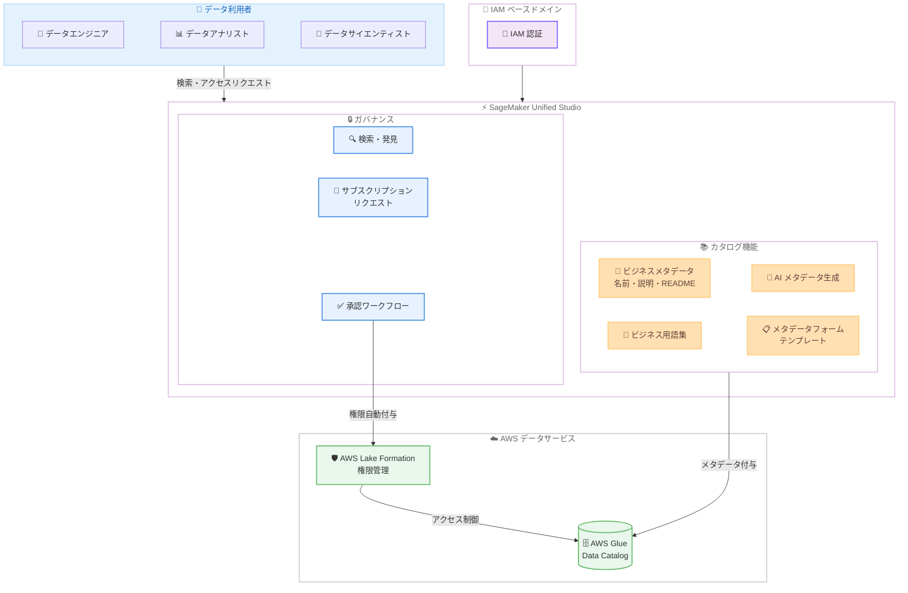

# Amazon SageMaker Unified Studio - IAM ベースドメインでのビジネスメタデータとガバナンス機能

**リリース日**: 2026年5月22日
**サービス**: Amazon SageMaker Unified Studio
**機能**: IAM ベースドメインにおけるビジネスメタデータおよびデータガバナンス

📊 [このアップデートのインフォグラフィックを見る](https://takech9203.github.io/aws-news-summary/20260522-sagemaker-catalog-iam-domains.html)

## 概要

Amazon SageMaker Unified Studio が、IAM ベースドメインにおいてビジネスコンテキスト、メタデータ、データガバナンス機能をサポートするようになりました。これにより、IAM 認証モードを使用しているドメインでも、AWS Glue Data Catalog テーブルにビジネス名、説明、README ドキュメントなどのビジネスコンテキストを付与できるようになります。

このアップデートは、データエンジニア、アナリスト、データサイエンティストがデータアセットを効率的に発見・活用し、組織全体で一貫したデータ定義を維持する必要がある企業に向けたものです。AI を活用したメタデータの自動生成機能により、大量のテーブルをカタログ化する作業負担が大幅に軽減されます。

さらに、サブスクリプションベースのアクセスリクエストと承認ワークフローにより、管理者はデータへのアクセスを体系的に制御でき、承認時には AWS Lake Formation の権限が自動的に付与されます。

**アップデート前の課題**

- IAM ベースドメインではビジネスメタデータやガバナンス機能が利用できず、SSO ベースドメインに限定されていた
- データテーブルにビジネス名や説明を付与する手段が限られ、技術名のみでデータを検索する必要があった
- 組織全体で「ARR」や「解約率」などのビジネス用語の定義が統一されておらず、チーム間で解釈のばらつきがあった
- データへのアクセス権限管理が手動で行われ、Lake Formation の設定を個別に行う必要があった

**アップデート後の改善**

- IAM ベースドメインでも AWS Glue Data Catalog テーブルにビジネス名、説明、README ドキュメントを追加可能になった
- AI によるメタデータ自動生成で、大量テーブルのカタログ化作業が効率化された
- ビジネス用語集を作成し、組織全体で一貫した用語定義を共有できるようになった
- メタデータフォームテンプレートでデータ分類、保持ポリシー、所有者情報などの構造化属性を記録可能になった
- サブスクリプションベースのアクセスリクエストと自動承認ワークフローにより、Lake Formation 権限が自動付与されるようになった

## アーキテクチャ図

IAM ベースドメインのユーザーが SageMaker Unified Studio を通じてデータカタログにアクセスし、ビジネスメタデータの付与、検索、アクセスリクエストを行う全体的なフローを示しています。承認後は AWS Lake Formation の権限が自動的にプロジェクトに付与されます。

## サービスアップデートの詳細

### 主要機能

1. **ビジネスコンテキストの付与**
   - AWS Glue Data Catalog テーブルにビジネス名を追加可能
   - テーブルの説明や README ドキュメントを記述可能
   - 技術的なテーブル名に加え、ビジネス上の意味を持つ名前でデータを管理

2. **AI によるメタデータ自動生成**
   - テーブル構造やカラム情報から AI がビジネス名や説明を自動生成
   - 大量のテーブルを効率的にカタログ化
   - 手動でのメタデータ入力作業を大幅に削減

3. **ビジネス用語集**
   - 組織全体で共通のビジネス用語とその定義を管理
   - 「ARR」「解約率」「MRR」などの用語を統一的に定義
   - チーム間でのデータ解釈のばらつきを解消

4. **メタデータフォームテンプレート**
   - データ分類、保持ポリシー、所有者情報などの構造化属性を定義
   - テンプレートベースで一貫したメタデータを収集
   - コンプライアンス要件に対応した属性管理

5. **検索・発見機能**
   - ドメイン全体のテーブルを横断的に検索
   - ビジネス用語集やメタデータフォームのフィールドでフィルタリング
   - データアセットの発見性を向上

6. **サブスクリプションベースのアクセス管理**
   - ユーザーがデータへのアクセスをリクエスト
   - 管理者による承認ワークフロー
   - 承認時に AWS Lake Formation 権限が自動的にプロジェクトに付与
   - 管理者がリクエストを待たずに直接アクセス権を付与することも可能

## 技術仕様

### 認証モード対応

| 項目 | 詳細 |
|------|------|
| 対応認証モード | IAM ベースドメイン |
| データカタログ | AWS Glue Data Catalog |
| 権限管理 | AWS Lake Formation |
| メタデータ生成 | AI による自動生成対応 |

### API 変更履歴

| 日付 | サービス | 変更内容 |
|------|----------|----------|
| 2026/05/22 | [Amazon DataZone](https://awsapichanges.com/archive/changes/f23ff3-datazone.html) | 4 updated api methods - VPC 接続サポートの追加 |
| 2026/05/21 | [Amazon SageMaker Service](https://awsapichanges.com/archive/changes/8bd61f-api.sagemaker.html) | 3 updated api methods - ドメインの Home EFS ファイルシステム作成無効化サポート |

### ガバナンス構成要素

| 要素 | 説明 |
|------|------|
| ビジネス名 | テーブルに付与するビジネス上の名称 |
| 説明 | テーブルの目的や内容を記述するテキスト |
| README | テーブルの詳細な利用ガイド |
| ビジネス用語集 | 組織共通の用語定義集 |
| メタデータフォーム | 構造化属性のテンプレート |
| サブスクリプション | アクセスリクエストと承認の仕組み |

## 設定方法

### 前提条件

1. Amazon SageMaker Unified Studio の IAM ベースドメインが作成済みであること
2. AWS Glue Data Catalog にテーブルが登録されていること
3. AWS Lake Formation の設定が完了していること
4. ドメイン管理者権限を持つ IAM ユーザーまたはロールがあること

### 手順

#### ステップ 1: ビジネスメタデータの追加

SageMaker Unified Studio のカタログ画面から対象テーブルを選択し、ビジネス名、説明、README を追加します。AI による自動生成を使用する場合は、メタデータ生成機能を有効化します。

#### ステップ 2: ビジネス用語集の作成

組織全体で使用するビジネス用語を定義します。用語名、定義、関連するデータアセットを登録し、チーム間での用語の統一を図ります。

#### ステップ 3: メタデータフォームテンプレートの定義

データ分類 (公開、内部、機密など)、保持ポリシー、データオーナー情報など、組織のコンプライアンス要件に応じた構造化属性のテンプレートを作成します。

#### ステップ 4: アクセス管理の設定

サブスクリプションベースのアクセスリクエストワークフローを設定します。承認者を指定し、承認時に自動で Lake Formation 権限が付与されるように構成します。

## メリット

### ビジネス面

- **データの民主化**: 技術者以外のビジネスユーザーもデータを容易に発見・理解可能
- **コンプライアンス強化**: メタデータフォームテンプレートにより、データ分類や保持ポリシーを体系的に管理
- **組織間連携の改善**: ビジネス用語集により、部門を超えたデータの一貫した理解を促進

### 技術面

- **カタログ化の効率化**: AI による自動メタデータ生成で大規模なデータレイクのカタログ化が加速
- **アクセス管理の自動化**: サブスクリプション承認時に Lake Formation 権限が自動付与され、手動設定が不要
- **IAM 認証との統合**: 既存の IAM ベースのセキュリティモデルを維持しつつガバナンス機能を利用可能

## デメリット・制約事項

### 制限事項

- IAM ベースドメインでの利用が前提 (SSO ベースドメインでは既に利用可能)
- AWS Glue Data Catalog テーブルが対象であり、他のデータストアへの直接適用は不可
- AI メタデータ生成の精度はテーブル構造やカラム名の命名規則に依存

### 考慮すべき点

- ビジネス用語集やメタデータフォームテンプレートの初期設計には組織横断的な合意形成が必要
- Lake Formation の権限モデルが適切に設計されていることが前提
- 大規模組織ではアクセスリクエストの承認フローが管理者のボトルネックになる可能性

## ユースケース

### ユースケース 1: 大規模データレイクのカタログ化

**シナリオ**: 数千のテーブルを持つデータレイクを運用する企業が、技術的なテーブル名だけでは利用者がデータを見つけられない課題を抱えている。

**実装例**:
1. AI メタデータ自動生成で全テーブルにビジネス名と説明を一括付与
2. ビジネス用語集で「売上」「顧客」「契約」などの主要用語を定義
3. メタデータフォームでデータオーナーと更新頻度を記録

**効果**: データアナリストがビジネス用語で検索してデータを発見でき、セルフサービス型のデータ活用が促進される。

### ユースケース 2: コンプライアンス対応

**シナリオ**: 金融機関が GDPR や社内データガバナンスポリシーに準拠したデータ管理を求められている。

**実装例**:
1. メタデータフォームテンプレートでデータ分類 (PII、機密、公開)、保持期間、利用目的を定義
2. 全テーブルに対してテンプレートを適用し、構造化されたガバナンス情報を記録
3. サブスクリプションワークフローで PII データへのアクセスを承認制に設定

**効果**: 監査時にデータの分類、アクセス履歴、保持ポリシーを即座に確認可能。

### ユースケース 3: 部門横断データ共有

**シナリオ**: マーケティング部門がデータエンジニアリング部門が管理する顧客セグメントデータにアクセスしたいが、適切なテーブルを特定できず、アクセス権限の取得にも時間がかかっている。

**実装例**:
1. ビジネス用語集で「顧客セグメント」「LTV」「アクティブユーザー」を定義
2. テーブルにビジネス名と用語集のタグを付与
3. マーケティング部門のユーザーがカタログで検索しサブスクリプションリクエストを送信
4. データオーナーが承認すると Lake Formation 権限が自動付与

**効果**: データアクセスのリードタイムが数日から数分に短縮。

## 料金

SageMaker Unified Studio のビジネスメタデータおよびガバナンス機能の料金は、SageMaker Unified Studio の利用料金に含まれます。追加料金の詳細については、AWS 公式料金ページを確認してください。

関連する料金要素として以下があります。

| サービス | 課金対象 |
|----------|----------|
| Amazon SageMaker Unified Studio | ドメインおよびユーザーの利用 |
| AWS Glue Data Catalog | カタログに保存されるテーブルおよびパーティション数 |
| AWS Lake Formation | Lake Formation 自体の追加料金は不要 |

## 利用可能リージョン

Amazon SageMaker Unified Studio がサポートされている全ての AWS リージョンで利用可能です。

## 関連サービス・機能

- **AWS Glue Data Catalog**: テーブルメタデータの保存先であり、ビジネスメタデータの付与対象
- **AWS Lake Formation**: データアクセス権限の管理基盤。サブスクリプション承認時に権限を自動付与
- **Amazon DataZone**: SageMaker Unified Studio のデータガバナンス機能の基盤技術
- **Amazon SageMaker Unified Studio**: データ分析、ML 開発を統合する開発環境

## 参考リンク

- 📊 [インフォグラフィック](https://takech9203.github.io/aws-news-summary/20260522-sagemaker-catalog-iam-domains.html)
- [公式発表 (What's New)](https://aws.amazon.com/about-aws/whats-new/2026/05/sagemaker-catalog-iam-domains/)
- [Amazon SageMaker Unified Studio ドキュメント](https://docs.aws.amazon.com/sagemaker-unified-studio/latest/userguide/)
- [AWS Glue Data Catalog](https://docs.aws.amazon.com/glue/latest/dg/catalog-and-crawler.html)
- [AWS Lake Formation](https://docs.aws.amazon.com/lake-formation/latest/dg/what-is-lake-formation.html)
- [Amazon SageMaker 料金](https://aws.amazon.com/sagemaker/pricing/)

## まとめ

今回のアップデートにより、IAM ベースドメインを使用している組織でも SageMaker Unified Studio の強力なデータカタログおよびガバナンス機能を活用できるようになりました。AI によるメタデータ自動生成、ビジネス用語集、サブスクリプションベースのアクセス管理により、データの発見性と管理性が大幅に向上します。既に IAM ベースドメインでデータ分析環境を構築している組織は、この機能を活用してデータガバナンスの強化とデータ民主化の推進を検討することを推奨します。
