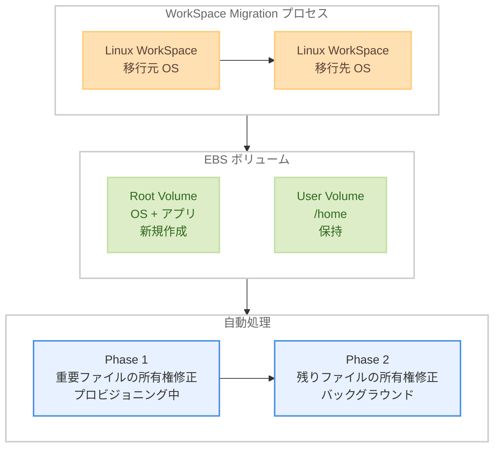

# Amazon WorkSpaces Personal - Linux WorkSpaces のマイグレーション対応

**リリース日**: 2026年5月22日
**サービス**: Amazon WorkSpaces Personal
**機能**: WorkSpace Migration for Linux WorkSpaces

[このアップデートのインフォグラフィックを見る](https://takech9203.github.io/aws-news-summary/20260522-workspaces-linux-migration.html)

## 概要

Amazon WorkSpaces Personal が Linux WorkSpaces のマイグレーション機能をサポートした。これにより、管理者は Linux WorkSpaces を異なる OS バンドル間で自動的に移行できるようになった。ユーザーのホームディレクトリ (`/home`) のデータは移行中も保持される。

従来、WorkSpace Migration 機能は Windows WorkSpaces でのみ利用可能であり、Linux WorkSpaces の OS 変更にはユーザーデータの手動コピーや新規 WorkSpace の再構築が必要だった。今回のアップデートにより、Amazon Linux 2、Ubuntu、RHEL、Rocky Linux 間の自動移行が可能になった。

**アップデート前の課題**

- Linux WorkSpaces の OS をアップグレードする際、手動でデータをバックアップし新規 WorkSpace を構築する必要があった
- Amazon Linux 2 のサポート終了 (EOL) に伴い、新しい OS への移行が急務だが自動化された手段がなかった
- 異なる Linux ディストリビューション間の移行では、ユーザー ID の不整合やデスクトップ環境の互換性問題を手動で解決する必要があった

**アップデート後の改善**

- Linux WorkSpaces を異なる OS バンドル間で自動マイグレーション可能になった
- ホームディレクトリ (`/home`) のデータが自動的に保持される
- Amazon Linux 2 からの移行時、ファイル所有権の修正やデスクトップ環境のクリーンアップが自動実行される
- マイグレーション所要時間は 20-30 分程度

## アーキテクチャ図



マイグレーションプロセスでは、ルートボリュームが新しい OS バンドルで再作成される一方、ユーザーボリューム (`/home`) は別の EBS ボリュームとして保持され再アタッチされる。Amazon Linux 2 からの移行時は 2 フェーズで所有権修正が自動実行される。

## サービスアップデートの詳細

### 主要機能

1. **クロスディストリビューション移行**
   - Amazon Linux 2、Ubuntu 22.04/24.04、RHEL 8/9、Rocky Linux 8/9 間での移行をサポート
   - ディストリビューションファミリーを跨いだ移行も可能 (例: Rocky 9 から Ubuntu 24.04)
   - バージョンアップグレード (例: RHEL 8 から RHEL 9) およびダウングレードにも対応

2. **ユーザーデータの自動保持**
   - ホームディレクトリ (`/home/username`) の全ファイルが保持される
   - ドキュメント、SSH キー、シェル設定、アプリケーションデータが維持される
   - ユーザーボリュームを別 EBS ボリュームとしてデタッチし再アタッチする仕組み

3. **Amazon Linux 2 からの移行自動化**
   - Winbind から SSSD への切り替えに伴うファイル所有権の自動修正 (2 フェーズ)
   - MATE デスクトップ環境設定の自動クリーンアップとバックアップ
   - SELinux コンテキストの自動復元 (RHEL/Rocky ターゲット時)
   - RFC 2307 ホームディレクトリパスの自動修正

## 技術仕様

### サポートされる移行パス

| 移行元 OS | 移行先 OS |
|------|------|
| Amazon Linux 2 (PCoIP/WSP) | Ubuntu 22.04, Ubuntu 22.04 Graphics, Ubuntu 24.04, RHEL 8/9, Rocky 8/9 |
| Ubuntu 22.04 / 24.04 | 他の全 Linux ディストリビューション (相互移行可能) |
| RHEL 8 / 9 | 他の全 Linux ディストリビューション (相互移行可能) |
| Rocky Linux 8 / 9 | 他の全 Linux ディストリビューション (相互移行可能) |

**注意**: Amazon Linux 2 は移行元としてのみサポート。EOL のため移行先には指定不可。

### 所有権修正の 2 フェーズアーキテクチャ

| フェーズ | 実行タイミング | 対象 | 特徴 |
|------|------|------|------|
| Phase 1 | プロビジョニング中 | `~/.ssh/`, `~/.config/`, シェルプロファイル等 | 即座にログイン可能にするための重要ファイル |
| Phase 2 | 再起動後バックグラウンド | 残りの全ファイル | idle I/O 優先度で実行、ユーザー作業に影響なし |

### API 変更履歴

本アップデートに関連する API 変更は確認されなかった。既存の `MigrateWorkspace` API が Linux WorkSpaces にも対応を拡張した形となる。

## 設定方法

### 前提条件

1. WorkSpace が `AVAILABLE` 状態であること
2. ディレクトリに Active Directory Forest Trust が設定されていないこと (SSSD が Forest Trust 非対応)
3. 十分な EBS ストレージが確保されていること

### 手順

#### ステップ 1: AWS マネジメントコンソールでの移行

1. Amazon WorkSpaces コンソールを開く
2. ナビゲーションペインで **WorkSpaces** を選択
3. 移行対象の WorkSpace を選択
4. **Actions** > **Migrate WorkSpace** を選択
5. ターゲット OS バンドルを選択
6. **Migrate** を選択

#### ステップ 2: AWS CLI での移行

```bash
# WorkSpace を別のバンドルに移行
aws workspaces migrate-workspace \
    --source-workspace-id ws-1234567890abcdef0 \
    --bundle-id wsb-jttwgmx20 \
    --region us-east-1
```

利用可能なターゲットバンドル ID の確認には以下を使用する。

```bash
# Linux バンドルの一覧を取得
aws workspaces describe-workspace-bundles \
    --query 'Bundles[?contains(Name, `Ubuntu`) || contains(Name, `Rocky`) || contains(Name, `RHEL`)].{Name:Name,BundleId:BundleId}' \
    --output table
```

#### ステップ 3: 移行状態の確認

```bash
# WorkSpace の状態を確認
aws workspaces describe-workspaces \
    --workspace-ids ws-1234567890abcdef0 \
    --query 'Workspaces[0].State' \
    --output text
```

状態遷移: `AVAILABLE` -> `PENDING` -> `AVAILABLE` (成功時) または `ERROR` (失敗時)。移行には通常 20-30 分かかる。

#### ステップ 4: 移行後の検証

```bash
# Phase 2 バックグラウンド処理の完了確認
systemctl is-active ws-migrate-phase2.service 2>/dev/null
# "inactive" または "not found" = 完了

# 移行ログの確認 (AL2 からの移行時)
cat ~/workspace-migration-log-*/user-id-migration.txt
```

## メリット

### ビジネス面

- **運用コスト削減**: 手動でのデータ移行作業が不要になり、管理者の工数を大幅に削減
- **ダウンタイム最小化**: 移行所要時間は 20-30 分で、ユーザーへの影響を最小限に抑制
- **EOL 対応の加速**: Amazon Linux 2 の EOL に伴う大規模な OS 移行を効率的に実施可能

### 技術面

- **データ整合性の保証**: EBS ボリュームレベルでのデータ保持により、ファイル損失リスクを排除
- **自動ロールバック**: 移行失敗時は元の WorkSpace が自動復元される
- **ユーザー ID 整合性の自動解決**: Winbind から SSSD への切り替えに伴う UID 不整合を 2 フェーズで自動修正
- **SELinux コンテキスト復元**: RHEL/Rocky ターゲット時のセキュリティラベルを自動設定

## デメリット・制約事項

### 制限事項

- Amazon Linux 2 を移行先として指定することはできない (EOL のため)
- Active Directory Forest Trust が設定されたディレクトリでは移行不可
- 完了したマイグレーションのロールバックは不可 (新規マイグレーションが必要)
- リージョン間のマイグレーションは非対応

### 考慮すべき点

- ルートボリューム上のインストール済みアプリケーションは保持されない (ターゲットバンドルのデフォルトに置換)
- Amazon Linux 2 からの移行時、MATE デスクトップのカスタマイズは GNOME 3.x に自動変換されない (バックアップは保持)
- 大規模なホームディレクトリ (数百万ファイル) の場合、Phase 2 の所有権修正に数時間かかる可能性がある
- マイグレーション中は新しい WorkSpace ID、コンピューター名、IP アドレスが割り当てられる

## ユースケース

### ユースケース 1: Amazon Linux 2 EOL 対応

**シナリオ**: 組織内で数百台の Amazon Linux 2 WorkSpaces を運用しており、EOL に伴い Ubuntu 24.04 への一括移行が必要。

**実装例**:
```bash
# バッチ移行スクリプト (25台ずつ)
for ws_id in $(aws workspaces describe-workspaces \
    --query 'Workspaces[?WorkspaceProperties.OperatingSystemName==`AMAZON_LINUX_2`].WorkspaceId' \
    --output text | head -25); do
    aws workspaces migrate-workspace \
        --source-workspace-id "$ws_id" \
        --bundle-id wsb-ubuntu2404-standard
done
```

**効果**: ユーザーデータを保持したまま EOL OS からの移行を自動化。手動作業を最小限に抑えつつ、セキュリティコンプライアンスを維持。

### ユースケース 2: 開発チームのディストリビューション標準化

**シナリオ**: 開発チームが複数の Linux ディストリビューションを混在利用しているが、運用効率化のため RHEL 9 に標準化したい。

**実装例**:
```bash
# Ubuntu WorkSpaces を RHEL 9 に移行
aws workspaces migrate-workspace \
    --source-workspace-id ws-ubuntu-dev01 \
    --bundle-id wsb-rhel9-power
```

**効果**: 開発者のホームディレクトリ (ソースコード、SSH キー、設定ファイル等) を保持したまま、組織のセキュリティポリシーに準拠したディストリビューションに統一できる。

### ユースケース 3: GPU ワークロードへの対応

**シナリオ**: データサイエンティストが通常の Ubuntu 22.04 WorkSpace を使用しているが、GPU を活用した機械学習ワークロードに対応するため Ubuntu 22.04 Graphics バンドルに移行したい。

**実装例**:
```bash
# Graphics バンドルへの移行
aws workspaces migrate-workspace \
    --source-workspace-id ws-datascience01 \
    --bundle-id wsb-ubuntu2204-graphics
```

**効果**: Jupyter Notebook、学習済みモデル、データセットへの参照等を保持したまま GPU 対応環境に移行。環境再構築の手間を省き、生産性を維持。

## 料金

WorkSpace Migration 自体に追加料金は発生しない。マイグレーション月は、元の WorkSpace と新しい WorkSpace の両方について日割り計算で課金される。

### 料金例

| シナリオ | 課金内容 |
|--------|------------------|
| 月の 10 日に移行 | 元 WorkSpace: 1-10 日分 + 新 WorkSpace: 11-30 日分 |
| バンドルタイプ変更を伴う移行 | 各バンドルの料金で日割り計算 |

## 利用可能リージョン

Amazon WorkSpaces Personal が利用可能な全ての AWS 商用リージョンおよび AWS GovCloud (US) リージョンで利用可能。

## 関連サービス・機能

- **Amazon WorkSpaces Personal**: 仮想デスクトップサービス本体。個人用 WorkSpace の管理基盤
- **AWS Directory Service**: WorkSpaces の認証基盤。Active Directory 統合を提供
- **Amazon EBS**: WorkSpace のルートボリュームおよびユーザーボリュームのストレージ基盤

## 参考リンク

- [インフォグラフィック](https://takech9203.github.io/aws-news-summary/20260522-workspaces-linux-migration.html)
- [公式発表 (What's New)](https://aws.amazon.com/about-aws/whats-new/2026/05/workspaces-linux-migration)
- [Migrate a Linux WorkSpace - 管理者ガイド](https://docs.aws.amazon.com/workspaces/latest/adminguide/migrate-linux-workspaces.html)
- [WorkSpaces Personal 料金ページ](https://aws.amazon.com/workspaces/pricing/)

## まとめ

Amazon WorkSpaces Personal の Linux WorkSpaces マイグレーション対応は、特に Amazon Linux 2 の EOL 対応を迫られている組織にとって大きな価値がある。ユーザーデータの自動保持、UID 不整合の自動修正、SELinux コンテキスト復元など、Linux 特有の技術的課題を自動的に解決する点が重要である。Linux WorkSpaces を運用中の組織は、OS 移行計画の見直しとテスト移行の実施を推奨する。
