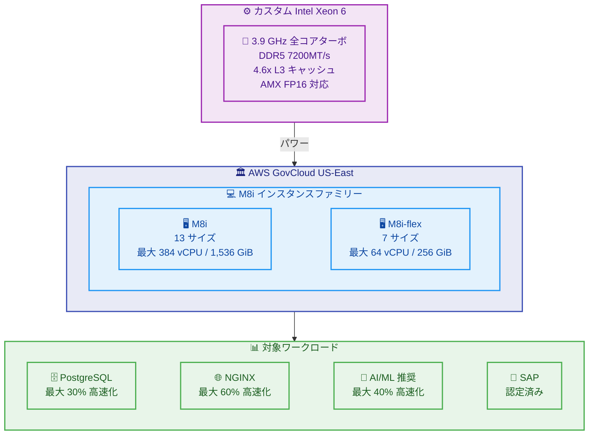

# Amazon EC2 - M8i / M8i-flex インスタンスが GovCloud (US-East) で利用可能に

**リリース日**: 2026年05月26日
**サービス**: Amazon EC2
**機能**: M8i および M8i-flex 汎用インスタンス

📊 [このアップデートのインフォグラフィックを見る](https://takech9203.github.io/aws-news-summary/20260526-amazon-ec2-m8i-m8i-flex-govcloud-east.html)

## 概要

AWS は 2026 年 5 月 26 日、Amazon EC2 M8i および M8i-flex インスタンスが AWS GovCloud (US-East) リージョンで利用可能になったことを発表しました。これらのインスタンスは、AWS 専用のカスタム Intel Xeon 6 プロセッサーを搭載しており、クラウドで利用可能な同等の Intel プロセッサーの中で最高のパフォーマンスと最速のメモリ帯域幅を提供します。

M8i および M8i-flex インスタンスは、前世代の Intel ベースのインスタンスと比較して、最大 15% 優れた価格パフォーマンスと 2.5 倍のメモリ帯域幅を提供します。M7i および M7i-flex インスタンスと比較して最大 20% 高いパフォーマンスを実現し、PostgreSQL データベースで最大 30% 高速化、NGINX ウェブアプリケーションで最大 60% 高速化、AI ディープラーニング推奨モデルで最大 40% 高速化を実現します。

GovCloud リージョンでの提供により、米国政府機関や規制対象のワークロードを扱う組織が、最新のインスタンスファミリーによるパフォーマンス向上とコスト効率を活用できるようになります。

**アップデート前の課題**

- GovCloud (US-East) リージョンでは M8i および M8i-flex インスタンスが利用できず、最新の Intel Xeon 6 プロセッサーによる汎用コンピューティング性能を活用できなかった
- 前世代の M7i インスタンスと比較して、メモリ帯域幅とコンピューティング性能に制限があり、データベースや Web アプリケーションのパフォーマンスが頭打ちになっていた
- 政府系ワークロードで高い価格パフォーマンスを実現するためのインスタンス選択肢が限られていた

**アップデート後の改善**

- GovCloud (US-East) で M8i および M8i-flex インスタンスが利用可能になり、最新の Intel Xeon 6 プロセッサーの性能を政府系ワークロードでも活用できるようになった
- M7i と比較して最大 20% のパフォーマンス向上と 2.5 倍のメモリ帯域幅により、データベースや Web アプリケーションのスループットが大幅に改善された
- M8i-flex は large から 16xlarge までの一般的なサイズを提供し、コスト効率の高い汎用コンピューティングの選択肢が拡大した

## アーキテクチャ図



この図は、GovCloud (US-East) で利用可能になった M8i インスタンスファミリーの構成と、カスタム Intel Xeon 6 プロセッサーによる各ワークロードへのパフォーマンス向上を示しています。

## サービスアップデートの詳細

### 主要機能

1. **M8i-flex インスタンス**
   - 汎用ワークロードで最も優れた価格パフォーマンスを実現する選択肢
   - large から 16xlarge までの最も一般的な 7 サイズを提供
   - すべてのコンピューティングリソースを完全に活用しないアプリケーションに最適
   - Web / アプリケーションサーバー、マイクロサービス、中小規模データストア、仮想デスクトップ、エンタープライズアプリケーションに適する
   - ベースラインレベルのパフォーマンスを提供し、95% の時間でフルコンピューティングパフォーマンスにスケールアップ可能

2. **M8i インスタンス**
   - すべての汎用ワークロードに最適で、特に最大のインスタンスサイズまたは継続的な高 CPU 使用率が必要なワークロードに適する
   - 2 つのベアメタルサイズと新しい 96xlarge サイズを含む 13 サイズを提供
   - SAP 認定済みで、エンタープライズアプリケーションの厳格な要件に対応
   - 最大 384 vCPU、1,536 GiB メモリで大規模ワークロードに対応
   - EFA (Elastic Fabric Adapter) サポート: 48xlarge、96xlarge、metal サイズで利用可能

3. **パフォーマンス向上**
   - 前世代の Intel ベースインスタンスと比較して最大 15% 優れた価格パフォーマンス
   - 2.5 倍のメモリ帯域幅 (DDR5 7200MT/s)
   - M7i / M7i-flex と比較して最大 20% 高いパフォーマンス
   - PostgreSQL データベースで最大 30% 高速化
   - NGINX ウェブアプリケーションで最大 60% 高速化
   - AI ディープラーニング推奨モデルで最大 40% 高速化

## 技術仕様

### M8i-flex インスタンスサイズ

| インスタンスサイズ | vCPU | メモリ (GiB) | ストレージ | ネットワーク帯域幅 (Gbps) | EBS 帯域幅 (Gbps) |
|-------------------|------|-------------|-----------|--------------------------|-------------------|
| m8i-flex.large | 2 | 8 | EBS のみ | 最大 12.5 | 最大 10 |
| m8i-flex.xlarge | 4 | 16 | EBS のみ | 最大 12.5 | 最大 10 |
| m8i-flex.2xlarge | 8 | 32 | EBS のみ | 最大 15 | 最大 10 |
| m8i-flex.4xlarge | 16 | 64 | EBS のみ | 最大 15 | 最大 10 |
| m8i-flex.8xlarge | 32 | 128 | EBS のみ | 最大 15 | 最大 10 |
| m8i-flex.12xlarge | 48 | 192 | EBS のみ | 最大 22.5 | 最大 15 |
| m8i-flex.16xlarge | 64 | 256 | EBS のみ | 最大 30 | 最大 20 |

### M8i インスタンスサイズ

| インスタンスサイズ | vCPU | メモリ (GiB) | ストレージ | ネットワーク帯域幅 (Gbps) | EBS 帯域幅 (Gbps) |
|-------------------|------|-------------|-----------|--------------------------|-------------------|
| m8i.large | 2 | 8 | EBS のみ | 最大 12.5 | 最大 10 |
| m8i.xlarge | 4 | 16 | EBS のみ | 最大 12.5 | 最大 10 |
| m8i.2xlarge | 8 | 32 | EBS のみ | 最大 15 | 最大 10 |
| m8i.4xlarge | 16 | 64 | EBS のみ | 最大 15 | 最大 10 |
| m8i.8xlarge | 32 | 128 | EBS のみ | 15 | 10 |
| m8i.12xlarge | 48 | 192 | EBS のみ | 22.5 | 15 |
| m8i.16xlarge | 64 | 256 | EBS のみ | 30 | 20 |
| m8i.24xlarge | 96 | 384 | EBS のみ | 40 | 30 |
| m8i.32xlarge | 128 | 512 | EBS のみ | 50 | 40 |
| m8i.48xlarge | 192 | 768 | EBS のみ | 75 | 60 |
| m8i.96xlarge | 384 | 1,536 | EBS のみ | 100 | 80 |
| m8i.metal-48xl | 192 | 768 | EBS のみ | 75 | 60 |
| m8i.metal-96xl | 384 | 1,536 | EBS のみ | 100 | 80 |

### パフォーマンス比較

| 指標 | M8i/M8i-flex vs M7i/M7i-flex | M8i/M8i-flex vs 前世代 Intel |
|------|------------------------------|------------------------------|
| 全体パフォーマンス | 最大 20% 向上 | 最大 15% 優れた価格パフォーマンス |
| メモリ帯域幅 | - | 2.5 倍 |
| PostgreSQL | 最大 30% 高速化 | - |
| NGINX | 最大 60% 高速化 | - |
| AI/ML 推奨モデル | 最大 40% 高速化 | - |

### プロセッサー仕様

| 項目 | 詳細 |
|------|------|
| プロセッサー | カスタム Intel Xeon 6 (AWS 専用) |
| 全コアターボ周波数 | 3.9 GHz |
| メモリタイプ | DDR5 7200MT/s |
| L3 キャッシュ | 前世代比 4.6 倍 |
| アクセラレーター | AMX (FP16 対応) |
| 基盤 | AWS Nitro System (第 6 世代 Nitro Card) |

## 設定方法

### 前提条件

1. AWS GovCloud (US-East) リージョンへのアクセス権限を持つ AWS GovCloud アカウント
2. 適切な IAM 権限 (EC2 インスタンスの起動権限)
3. GovCloud リージョン内の VPC およびサブネット設定

### 手順

#### ステップ 1: GovCloud リージョンで利用可能なインスタンスタイプを確認

```bash
# GovCloud (US-East) で利用可能な M8i インスタンスタイプを確認
aws ec2 describe-instance-types \
  --filters "Name=instance-type,Values=m8i*" \
  --region us-gov-east-1 \
  --query "InstanceTypes[].{Type:InstanceType,vCPU:VCpuInfo.DefaultVCpus,Memory:MemoryInfo.SizeInMiB}" \
  --output table
```

このコマンドは、GovCloud (US-East) リージョンで利用可能な M8i インスタンスタイプとそのスペックを一覧表示します。

#### ステップ 2: M8i-flex インスタンスを起動

```bash
# M8i-flex インスタンスを GovCloud (US-East) で起動
aws ec2 run-instances \
  --image-id ami-xxxxxxxxxxxxxxxxx \
  --instance-type m8i-flex.xlarge \
  --region us-gov-east-1 \
  --subnet-id subnet-xxxxxxxxxxxxxxxxx \
  --security-group-ids sg-xxxxxxxxxxxxxxxxx \
  --key-name my-govcloud-key
```

このコマンドは、GovCloud (US-East) リージョンで m8i-flex.xlarge インスタンスを起動します。AMI ID は GovCloud リージョン固有のものを使用する必要があります。

#### ステップ 3: 購入オプションを選択

M8i および M8i-flex インスタンスは、以下の購入オプションで利用可能です。

- **オンデマンドインスタンス**: 使用した分だけ支払い、コミットメント不要
- **Savings Plans**: 1 年または 3 年のコミットメントで割引価格を適用
- **Reserved Instances**: 特定のインスタンスタイプに対する予約割引
- **スポットインスタンス**: 未使用の EC2 容量を大幅な割引で利用

## メリット

### ビジネス面

- **コスト効率の向上**: 前世代と比較して最大 15% 優れた価格パフォーマンスにより、GovCloud 環境でのコンピューティングコストを削減
- **コンプライアンス対応**: GovCloud リージョンでの提供により、ITAR、FedRAMP High、DoD SRG など米国政府のコンプライアンス要件を満たしつつ最新のインスタンス性能を活用可能
- **SAP 認定**: M8i インスタンスは SAP 認定済みのため、政府機関の SAP ワークロードを GovCloud で安心して実行可能

### 技術面

- **高性能プロセッサー**: AWS 専用のカスタム Intel Xeon 6 プロセッサーによる最高のパフォーマンス (全コアターボ 3.9 GHz)
- **大幅なメモリ帯域幅向上**: DDR5 7200MT/s により前世代比 2.5 倍のメモリ帯域幅を実現
- **大容量 L3 キャッシュ**: 前世代比 4.6 倍の L3 キャッシュにより、データアクセスレイテンシーを削減
- **高ネットワーク帯域幅**: M8i で最大 100 Gbps のネットワーク帯域幅と最大 80 Gbps の EBS 帯域幅
- **EFA サポート**: 大型インスタンスで Elastic Fabric Adapter をサポートし、HPC ワークロードに対応

## デメリット・制約事項

### 制限事項

- GovCloud リージョンへのアクセスには、米国市民権または永住権が必要であり、アカウント取得に審査プロセスがある
- GovCloud で利用可能な AMI は商用リージョンと異なるため、移行時には AMI の互換性確認が必要
- M8i-flex はベースラインパフォーマンスモデルのため、継続的な高 CPU 使用率のワークロードには M8i を選択すべき

### 考慮すべき点

- 既存の M7i / M7i-flex インスタンスからの移行時には、アプリケーション互換性テストを実施することを推奨
- Instance Bandwidth Configuration を利用してネットワークまたは EBS 帯域幅を 25% スケールアップ可能だが、追加料金が発生する
- ベアメタルインスタンス (metal-48xl、metal-96xl) は特定のユースケース向けであり、一般的なワークロードでは仮想インスタンスの方がコスト効率が高い

## ユースケース

### ユースケース 1: 政府機関向け PostgreSQL データベース

**シナリオ**: 連邦政府機関が、機密性の高い市民データを管理する PostgreSQL データベースを GovCloud で運用しており、パフォーマンスの向上を求めている

**実装例**:
```bash
# M8i インスタンスで PostgreSQL データベースサーバーを起動
aws ec2 run-instances \
  --image-id ami-xxxxxxxxxxxxxxxxx \
  --instance-type m8i.8xlarge \
  --region us-gov-east-1 \
  --block-device-mappings '[{"DeviceName":"/dev/sda1","Ebs":{"VolumeSize":500,"VolumeType":"gp3","Iops":16000,"Throughput":1000}}]' \
  --subnet-id subnet-xxxxxxxxxxxxxxxxx \
  --security-group-ids sg-xxxxxxxxxxxxxxxxx
```

**効果**: M7i と比較して PostgreSQL で最大 30% のパフォーマンス向上により、クエリ応答時間が短縮され、市民向けサービスの応答性が改善

### ユースケース 2: 防衛関連の AI/ML 推奨システム

**シナリオ**: 防衛省の関連組織が、脅威検知のためのディープラーニング推奨モデルをリアルタイムで実行する必要がある

**実装例**:
```bash
# M8i 大型インスタンスで AI 推論ワークロードを実行
aws ec2 run-instances \
  --image-id ami-xxxxxxxxxxxxxxxxx \
  --instance-type m8i.24xlarge \
  --region us-gov-east-1 \
  --iam-instance-profile Name=GovCloud-ML-Inference-Role \
  --subnet-id subnet-xxxxxxxxxxxxxxxxx
```

**効果**: AI ディープラーニング推奨モデルで最大 40% の高速化により、脅威検知のレイテンシーが大幅に低減し、リアルタイム分析能力が向上

### ユースケース 3: GovCloud 上の SAP ワークロード

**シナリオ**: 政府の調達機関が SAP ERP システムを GovCloud で運用しており、大規模な処理を必要としている

**実装例**:
```bash
# SAP 認定 M8i インスタンスで SAP HANA ワークロードを実行
aws ec2 run-instances \
  --image-id ami-xxxxxxxxxxxxxxxxx \
  --instance-type m8i.48xlarge \
  --region us-gov-east-1 \
  --block-device-mappings file://sap-storage-config.json \
  --iam-instance-profile Name=SAP-GovCloud-Role
```

**効果**: SAP 認定の M8i インスタンスにより、192 vCPU と 768 GiB メモリで大規模な SAP ワークロードを GovCloud のコンプライアンス要件を満たしながら高性能に実行可能

## 料金

M8i および M8i-flex インスタンスの料金は、インスタンスサイズと購入オプションによって異なります。GovCloud リージョンの料金は、商用リージョンと比較して若干高い傾向があります。具体的な料金については、[Amazon EC2 料金ページ](https://aws.amazon.com/ec2/pricing/) をご確認ください。

### 料金例

GovCloud (US-East) でのオンデマンド料金の例 (参考値):

| インスタンスタイプ | vCPU | メモリ (GiB) | 備考 |
|-------------------|------|-------------|------|
| m8i-flex.large | 2 | 8 | 小規模ワークロード向け |
| m8i-flex.8xlarge | 32 | 128 | 中規模ワークロード向け |
| m8i.24xlarge | 96 | 384 | 大規模ワークロード向け |
| m8i.96xlarge | 384 | 1,536 | 最大規模ワークロード向け |

**注**: GovCloud リージョンの具体的な料金は、AWS GovCloud 料金ページで確認してください。前世代と比較して最大 15% 優れた価格パフォーマンスを提供します。

## 利用可能リージョン

**今回の新規対応リージョン (2026年5月26日)**:
- AWS GovCloud (US-East) - us-gov-east-1

**既存対応リージョン**:
- 米国東部 (バージニア北部) - us-east-1
- 米国東部 (オハイオ) - us-east-2
- 米国西部 (オレゴン) - us-west-2
- 欧州 (アイルランド) - eu-west-1
- アジアパシフィック (東京) - ap-northeast-1
- その他の商用リージョン

M8i および M8i-flex インスタンスの最新のリージョン対応状況については、[EC2 インスタンスタイプのリージョン別対応表](https://aws.amazon.com/ec2/pricing/on-demand/)をご確認ください。

## 関連サービス・機能

- **AWS GovCloud**: 米国政府のコンプライアンス要件 (ITAR、FedRAMP High、DoD SRG) に対応した分離環境
- **Amazon EC2 Auto Scaling**: M8i インスタンスのワークロードに応じた自動スケーリング
- **AWS Nitro System**: 第 6 世代 Nitro Card による高いセキュリティとパフォーマンスの分離
- **Elastic Fabric Adapter**: M8i 大型インスタンスで HPC やクラスタリングワークロードに対応
- **AWS Savings Plans**: 長期利用による GovCloud インスタンスのコスト最適化

## 参考リンク

- 📊 [インフォグラフィック](https://takech9203.github.io/aws-news-summary/20260526-amazon-ec2-m8i-m8i-flex-govcloud-east.html)
- [公式発表 (What's New)](https://aws.amazon.com/about-aws/whats-new/2026/05/amazon-ec2-m8i-m8i-flex-govcloud-east/)
- [M8i インスタンス製品ページ](https://aws.amazon.com/ec2/instance-types/m8i/)
- [Amazon EC2 料金ページ](https://aws.amazon.com/ec2/pricing/)
- [AWS GovCloud (US) リージョン](https://aws.amazon.com/govcloud-us/)
- [Amazon EC2 ドキュメント](https://docs.aws.amazon.com/ec2/)

## まとめ

Amazon EC2 M8i および M8i-flex インスタンスが AWS GovCloud (US-East) リージョンで利用可能になったことにより、米国政府機関や規制対象のワークロードを扱う組織が、カスタム Intel Xeon 6 プロセッサーによる最新のパフォーマンスとコスト効率を活用できるようになりました。M7i と比較して最大 20% のパフォーマンス向上、2.5 倍のメモリ帯域幅、PostgreSQL で 30% 高速化、NGINX で 60% 高速化といった大幅な改善により、GovCloud 環境での汎用ワークロードを効率的に実行できます。GovCloud でデータベース、Web アプリケーション、SAP、AI/ML ワークロードを運用している場合は、M8i または M8i-flex への移行を検討してください。
