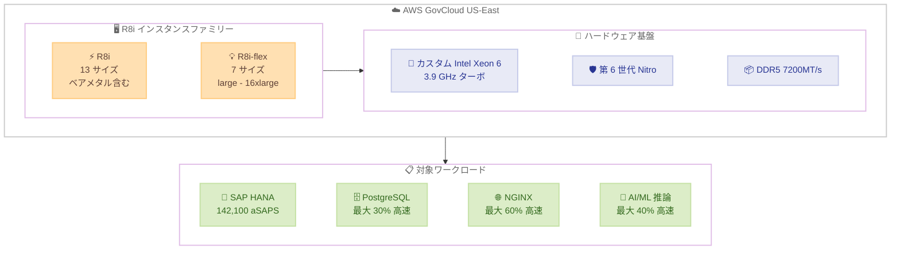

# Amazon EC2 - R8i / R8i-flex インスタンスが GovCloud (US-East) で利用可能に

**リリース日**: 2026年5月26日
**サービス**: Amazon EC2
**機能**: R8i および R8i-flex インスタンスの AWS GovCloud (US-East) リージョン対応

📊 [このアップデートのインフォグラフィックを見る](https://takech9203.github.io/aws-news-summary/20260526-amazon-ec2-r8i-r8i-flex-govcloud-east.html)

## 概要

Amazon EC2 R8i および R8i-flex インスタンスが AWS GovCloud (US-East) リージョンで利用可能になりました。R8i インスタンスは AWS 専用のカスタム Intel Xeon 6 プロセッサを搭載し、クラウドにおける同等の Intel プロセッサの中で最高のパフォーマンスと最速のメモリ帯域幅を提供します。

GovCloud リージョンでの提供開始により、米国政府機関や規制対象の業界のお客様が、最新世代のメモリ最適化インスタンスを活用して、ミッションクリティカルなワークロードを実行できるようになります。R8i は SAP 認定を取得しており、142,100 aSAPS を提供する高パフォーマンスインスタンスです。

**アップデート前の課題**

- GovCloud (US-East) リージョンでは R8i/R8i-flex インスタンスが利用できず、前世代のメモリ最適化インスタンスに依存する必要があった
- 政府機関や規制対象のワークロードで最新の Intel Xeon 6 プロセッサのパフォーマンス向上を活用できなかった
- GovCloud 環境で SAP ワークロードを実行する際、最新世代の SAP 認定インスタンスが利用不可だった

**アップデート後の改善**

- GovCloud (US-East) のお客様が R8i/R8i-flex の最大 15% の価格パフォーマンス向上と 2.5 倍のメモリ帯域幅を活用可能に
- SAP 認定の R8i インスタンスにより、GovCloud 環境でミッションクリティカルな SAP ワークロードを最新ハードウェアで実行可能に
- R8i-flex により、リソースを完全に使用しないメモリ集約型ワークロードに対してコスト効率の高い選択肢を提供

## アーキテクチャ図



R8i インスタンスファミリーの構成と、GovCloud (US-East) で対応する主要ワークロードを示しています。カスタム Intel Xeon 6 プロセッサと第 6 世代 Nitro System を基盤として、高パフォーマンスなメモリ最適化コンピューティングを提供します。

## サービスアップデートの詳細

### 主要機能

1. **R8i インスタンス**
   - ベアメタルを含む 13 サイズ (新しい 96xlarge サイズを含む)
   - SAP 認定済み (142,100 aSAPS を提供)
   - 最大 384 vCPU、3,072 GiB メモリ
   - 最大 100 Gbps ネットワーク帯域幅、80 Gbps EBS 帯域幅
   - 48xlarge 以上で EFA (Elastic Fabric Adapter) をサポート

2. **R8i-flex インスタンス**
   - AWS 初のメモリ最適化 Flex インスタンス
   - large から 16xlarge までの 7 サイズを提供
   - 最大 64 vCPU、512 GiB メモリ
   - コンピューティングリソースを 95% の時間でフルパフォーマンスまでスケール可能
   - すべてのコンピューティングリソースを完全に使用しないアプリケーションに最適

3. **カスタム Intel Xeon 6 プロセッサ**
   - AWS 専用に設計されたカスタムプロセッサ
   - 全コア持続ターボ周波数 3.9 GHz
   - DDR5 7200MT/s メモリ
   - L3 キャッシュが前世代比 4.6 倍大容量
   - Advanced Matrix Extensions (AMX) と FP16 サポート
   - 常時メモリ暗号化

## 技術仕様

### パフォーマンス比較

| 項目 | R8i vs R7i | R8i vs 前世代 Intel |
|------|-----------|-------------------|
| 全般パフォーマンス | 最大 20% 向上 | 最大 15% 価格パフォーマンス向上 |
| メモリ帯域幅 | - | 2.5 倍 |
| PostgreSQL | 最大 30% 高速 | - |
| NGINX | 最大 60% 高速 | - |
| AI/ML 推薦モデル | 最大 40% 高速 | - |

### R8i インスタンスサイズ一覧

| サイズ | vCPU | メモリ (GiB) | ネットワーク (Gbps) | EBS (Gbps) |
|--------|------|-------------|-------------------|-----------|
| r8i.large | 2 | 16 | 最大 12.5 | 最大 10 |
| r8i.xlarge | 4 | 32 | 最大 12.5 | 最大 10 |
| r8i.2xlarge | 8 | 64 | 最大 15 | 最大 10 |
| r8i.4xlarge | 16 | 128 | 最大 15 | 最大 10 |
| r8i.8xlarge | 32 | 256 | 15 | 10 |
| r8i.12xlarge | 48 | 384 | 22.5 | 15 |
| r8i.16xlarge | 64 | 512 | 30 | 20 |
| r8i.24xlarge | 96 | 768 | 40 | 30 |
| r8i.32xlarge | 128 | 1024 | 50 | 40 |
| r8i.48xlarge | 192 | 1536 | 75 | 60 |
| r8i.96xlarge | 384 | 3072 | 100 | 80 |
| r8i.metal-48xl | 192 | 1536 | 75 | 60 |
| r8i.metal-96xl | 384 | 3072 | 100 | 80 |

### R8i-flex インスタンスサイズ一覧

| サイズ | vCPU | メモリ (GiB) | ネットワーク (Gbps) | EBS (Gbps) |
|--------|------|-------------|-------------------|-----------|
| r8i-flex.large | 2 | 16 | 最大 12.5 | 最大 10 |
| r8i-flex.xlarge | 4 | 32 | 最大 12.5 | 最大 10 |
| r8i-flex.2xlarge | 8 | 64 | 最大 15 | 最大 10 |
| r8i-flex.4xlarge | 16 | 128 | 最大 15 | 最大 10 |
| r8i-flex.8xlarge | 32 | 256 | 最大 15 | 最大 10 |
| r8i-flex.12xlarge | 48 | 384 | 最大 22.5 | 最大 15 |
| r8i-flex.16xlarge | 64 | 512 | 最大 30 | 最大 20 |

### SAP 認定詳細

| 項目 | 詳細 |
|------|------|
| aSAPS スコア | 142,100 |
| 認定サイズ | 13 サイズすべて |
| 対応ワークロード | SAP HANA、SAP S/4HANA、SAP BW/4HANA |
| 最大メモリ | 3,072 GiB (96xlarge/metal-96xl) |

### Instance Bandwidth Configuration (IBC)

R8i および R8i-flex は Instance Bandwidth Configuration をサポートしており、ネットワーク帯域幅と EBS 帯域幅の間でリソース配分を柔軟に変更可能です。ネットワークまたは EBS の帯域幅を 25% スケール可能です。

## 設定方法

### 前提条件

1. AWS GovCloud (US-East) アカウントへのアクセス権限
2. R8i/R8i-flex インスタンスタイプのサービスクォータの確認・申請
3. GovCloud で利用可能な AMI の確認

### 手順

#### ステップ 1: サービスクォータの確認

```bash
aws service-quotas get-service-quota \
  --region us-gov-east-1 \
  --service-code ec2 \
  --quota-code L-417A185B
```

GovCloud (US-East) リージョンで Running On-Demand Standard インスタンスのクォータを確認します。新しいインスタンスタイプの場合、クォータの引き上げが必要な場合があります。

#### ステップ 2: R8i インスタンスの起動

```bash
aws ec2 run-instances \
  --region us-gov-east-1 \
  --instance-type r8i.2xlarge \
  --image-id ami-xxxxxxxxxxxxxxxxx \
  --key-name my-govcloud-key \
  --security-group-ids sg-xxxxxxxxx \
  --subnet-id subnet-xxxxxxxxx
```

GovCloud (US-East) リージョンで R8i インスタンスを起動します。AMI ID はリージョンごとに異なるため、GovCloud 用の適切な AMI を指定してください。

#### ステップ 3: R8i-flex インスタンスの起動

```bash
aws ec2 run-instances \
  --region us-gov-east-1 \
  --instance-type r8i-flex.xlarge \
  --image-id ami-xxxxxxxxxxxxxxxxx \
  --key-name my-govcloud-key \
  --security-group-ids sg-xxxxxxxxx \
  --subnet-id subnet-xxxxxxxxx
```

コンピューティングリソースを常時フルに使用しないワークロードには、R8i-flex を選択することでコスト効率を向上できます。

## メリット

### ビジネス面

- **GovCloud コンプライアンス対応**: FedRAMP High、DoD SRG、ITAR などの規制要件を満たしながら最新世代のインスタンスを利用可能
- **SAP ワークロードの最適化**: 142,100 aSAPS の SAP 認定により、政府機関のミッションクリティカルな SAP ワークロードを GovCloud 環境で高パフォーマンスに実行可能
- **コスト効率の向上**: 最大 15% の価格パフォーマンス向上により、同じワークロードをより低コストで実行、または同じコストでより高い処理能力を獲得

### 技術面

- **メモリ帯域幅の大幅改善**: DDR5 7200MT/s により 2.5 倍のメモリ帯域幅を実現し、メモリ集約型処理を高速化
- **AMX アクセラレータ**: FP16 対応の Advanced Matrix Extensions により、AI/ML 推論ワークロードのパフォーマンスが最大 40% 向上
- **Flex インスタンスの柔軟性**: R8i-flex によりベースラインパフォーマンスと 95% の時間でフルパフォーマンスにスケール可能な柔軟なリソース管理を提供

## デメリット・制約事項

### 制限事項

- GovCloud リージョンでは商用リージョンと比較してサービスクォータのデフォルト値が低い場合がある
- GovCloud アカウントの作成には追加の認証プロセスが必要
- 一部の AMI やマーケットプレイス製品が GovCloud で利用できない場合がある

### 考慮すべき点

- R8i-flex はベースラインを超えるバーストパフォーマンスを 95% の時間で提供するが、常時フル CPU を必要とするワークロードには通常の R8i が適切
- 前世代 (R7i) からの移行時は、アプリケーションの互換性テストを事前に実施することを推奨
- Instance Bandwidth Configuration を活用する場合、ネットワークと EBS のトレードオフを理解した上で設定する必要がある

## ユースケース

### ユースケース 1: 政府機関の SAP S/4HANA 移行

**シナリオ**: 米国連邦政府機関が既存の SAP ECC システムを SAP S/4HANA に移行し、GovCloud 環境で ITAR 準拠のデータ処理を行う必要がある。

**実装例**:
```bash
# SAP HANA 用の大規模 R8i インスタンスを起動
aws ec2 run-instances \
  --region us-gov-east-1 \
  --instance-type r8i.24xlarge \
  --image-id ami-xxxxxxxxxxxxxxxxx \
  --placement "Tenancy=dedicated" \
  --block-device-mappings '[{"DeviceName":"/dev/sda1","Ebs":{"VolumeSize":500,"VolumeType":"gp3"}}]'
```

**効果**: 142,100 aSAPS の処理能力により、大規模な SAP HANA データベースを高パフォーマンスで稼働。前世代比 20% のパフォーマンス向上により、バッチ処理時間の短縮とレスポンスタイムの改善を実現。

### ユースケース 2: 機密データのリアルタイムデータベース処理

**シナリオ**: 国防関連機関が機密レベルの PostgreSQL データベースを GovCloud で運用し、リアルタイムのデータ分析と報告を行う。

**実装例**:
```bash
# PostgreSQL 用の R8i インスタンス
aws ec2 run-instances \
  --region us-gov-east-1 \
  --instance-type r8i.8xlarge \
  --image-id ami-xxxxxxxxxxxxxxxxx \
  --block-device-mappings '[{"DeviceName":"/dev/sda1","Ebs":{"VolumeSize":1000,"VolumeType":"io2","Iops":64000}}]'
```

**効果**: PostgreSQL で最大 30% のパフォーマンス向上を実現。2.5 倍のメモリ帯域幅により、大規模なインメモリ操作やインデックススキャンが高速化。常時メモリ暗号化により機密データの保護も強化。

### ユースケース 3: コスト効率の高い Web アプリケーション基盤

**シナリオ**: 政府系の公開 Web ポータルで NGINX を使用し、ピーク時以外はリソースをフルに使用しない Web アプリケーションを GovCloud で運用する。

**実装例**:
```bash
# NGINX Web サーバー用の R8i-flex インスタンス
aws ec2 run-instances \
  --region us-gov-east-1 \
  --instance-type r8i-flex.4xlarge \
  --image-id ami-xxxxxxxxxxxxxxxxx \
  --count 3
```

**効果**: R8i-flex により 95% の時間でフルパフォーマンスにスケール可能でありながら、コスト効率を最適化。NGINX で最大 60% のパフォーマンス向上により、同じインスタンス数でより多くのリクエストを処理可能。

## 料金

GovCloud リージョンの料金は商用リージョンと異なり、一般的にプレミアムが加算されます。具体的な料金は AWS GovCloud 料金ページを参照してください。

### 料金の考え方

| インスタンスタイプ | 特徴 | コスト傾向 |
|-------------------|------|-----------|
| R8i | 全サイズで安定したパフォーマンス | R7i 比で最大 15% 価格パフォーマンス向上 |
| R8i-flex | バースト型、95% でフルパフォーマンス | R8i より低コスト、リソース未使用時に最適 |

**選択の指針**: 常時フル CPU を使用するワークロードには R8i、間欠的な負荷パターンのワークロードには R8i-flex がコスト効率に優れます。

## 利用可能リージョン

R8i および R8i-flex インスタンスは以下のリージョンで利用可能です。

- **今回追加**: AWS GovCloud (US-East)
- **既存対応リージョン**: 米国東部 (バージニア北部)、米国東部 (オハイオ)、米国西部 (オレゴン)、欧州 (アイルランド)、アジアパシフィック (ニュージーランド)、中東 (UAE) など複数の商用リージョン
- **AWS Outposts**: R8i は Outposts でも利用可能

## 関連サービス・機能

- **AWS Nitro System**: 第 6 世代 Nitro カードによるセキュリティとパフォーマンスの基盤
- **Amazon EBS**: R8i で最大 80 Gbps の EBS 帯域幅をサポート、io2 Block Express との組み合わせで高 IOPS を実現
- **Elastic Fabric Adapter (EFA)**: r8i.48xlarge 以上のサイズで HPC/ML ワークロード向けの高速ネットワーキングを提供
- **Instance Bandwidth Configuration (IBC)**: ネットワークと EBS 間の帯域幅配分を柔軟に調整可能
- **R8i バリアント**: R8id (NVMe SSD)、R8in (高ネットワーク)、R8idn (高ネットワーク + NVMe)、R8ib (高 EBS) など用途別バリアントも展開中

## 参考リンク

- 📊 [インフォグラフィック](https://takech9203.github.io/aws-news-summary/20260526-amazon-ec2-r8i-r8i-flex-govcloud-east.html)
- [公式発表 (What's New)](https://aws.amazon.com/about-aws/whats-new/2026/05/amazon-ec2-r8i-r8i-flex-govcloud-east/)
- [EC2 R8i インスタンスタイプ詳細](https://aws.amazon.com/ec2/instance-types/r8i/)
- [EC2 料金ページ](https://aws.amazon.com/ec2/pricing/on-demand/)
- [AWS GovCloud (US) リージョン](https://aws.amazon.com/govcloud-us/)

## まとめ

Amazon EC2 R8i および R8i-flex インスタンスの AWS GovCloud (US-East) リージョン対応により、米国政府機関や規制対象の業界のお客様が、最新のカスタム Intel Xeon 6 プロセッサの性能を活用できるようになりました。特に SAP 認定による 142,100 aSAPS のパフォーマンスと、前世代比 2.5 倍のメモリ帯域幅は、ミッションクリティカルなワークロードに大きな価値を提供します。GovCloud 環境で最新世代のメモリ最適化インスタンスを必要とするお客様は、サービスクォータを確認の上、移行を検討することを推奨します。
