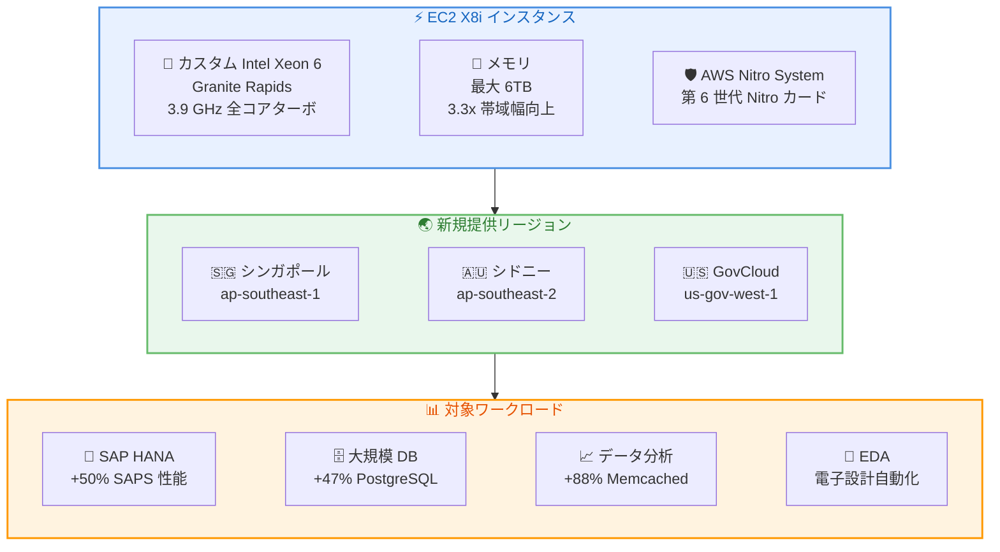

# Amazon EC2 X8i インスタンス - 追加リージョンでの提供開始

**リリース日**: 2026年05月26日
**サービス**: Amazon EC2
**機能**: X8i インスタンスのリージョン拡張 (シンガポール、シドニー、GovCloud)

📊 [このアップデートのインフォグラフィックを見る](https://takech9203.github.io/aws-news-summary/20260526-amazon-ec2-x8i-instances-SIN-SYD-PDT-region.html)

## 概要

Amazon EC2 X8i インスタンスが、アジアパシフィック (シンガポール)、アジアパシフィック (シドニー)、AWS GovCloud (US-West) の 3 リージョンで新たに利用可能になりました。X8i インスタンスは AWS 専用のカスタム Intel Xeon 6 プロセッサ (Granite Rapids) を搭載し、前世代の X2i と比較して最大 43% の性能向上、1.5 倍のメモリ容量 (最大 6TB)、3.3 倍のメモリ帯域幅を提供します。

X8i インスタンスは SAP 認定を取得しており、クラウド上の同等 Intel プロセッサの中で最高性能と最速メモリ帯域幅を実現しています。SAP HANA、大規模データベース、データ分析、EDA (電子設計自動化) などメモリ集約型ワークロードに最適化されています。

今回のリージョン拡張により、アジアパシフィック地域および米国政府系ワークロードにおいて、X8i の高性能メモリコンピューティング能力をレイテンシーの低い環境で活用できるようになりました。

**アップデート前の課題**

- X8i インスタンスはアジアパシフィック (シンガポール) およびアジアパシフィック (シドニー) で利用できず、同地域のメモリ集約型ワークロードには前世代インスタンスの使用が必要だった
- AWS GovCloud リージョンで X8i が未提供のため、政府系ワークロードでは最新のメモリ最適化インスタンスを利用できなかった
- アジアパシフィック地域のユーザーは他リージョンの X8i を利用する場合、レイテンシーの増加やデータレジデンシーの課題に直面していた

**アップデート後の改善**

- シンガポール、シドニー、GovCloud (US-West) で X8i インスタンスが利用可能になり、地理的なカバレッジが拡大
- アジアパシフィック地域のメモリ集約型ワークロードを低レイテンシーで実行可能に
- GovCloud ユーザーが最新世代のメモリ最適化インスタンスを政府要件に準拠した環境で利用可能に

## アーキテクチャ図



X8i インスタンスのアーキテクチャ構成と、新規リージョンでの提供開始による対象ワークロードへの展開を示しています。

## サービスアップデートの詳細

### 主要機能

1. **カスタム Intel Xeon 6 プロセッサ**
   - AWS 専用のカスタム Intel Xeon 6 (Granite Rapids) プロセッサを搭載
   - 全コア持続ターボ周波数 3.9 GHz を実現
   - クラウド上の同等 Intel プロセッサの中で最高性能を達成
   - 常時メモリ暗号化をサポート

2. **大幅な性能向上**
   - 前世代 X2i 比で最大 43% の全体性能向上
   - SAPS 性能が最大 50% 向上 (SAP ワークロード)
   - PostgreSQL が最大 47% 高速化
   - Memcached が最大 88% 高速化
   - AI 推論が最大 46% 高速化

3. **拡張されたメモリ容量と帯域幅**
   - 最大 6TB (6,144 GiB) のメモリ容量
   - X2i 比 1.5 倍のメモリ容量
   - X2i 比 3.3 倍のメモリ帯域幅
   - SAP HANA などインメモリワークロードに最適

4. **AWS Nitro System 基盤**
   - 第 6 世代 Nitro カードによる高性能 I/O
   - EBS 専用ストレージ構成
   - Instance Bandwidth Configuration (IBC) によるネットワークと EBS 帯域幅の柔軟な配分

## 技術仕様

### インスタンスサイズ一覧

| インスタンスサイズ | vCPU | メモリ (GiB) | ネットワーク帯域幅 (Gbps) | EBS 帯域幅 (Gbps) |
|---|---|---|---|---|
| x8i.large | 2 | 32 | 最大 12.5 | 最大 10 |
| x8i.xlarge | 4 | 64 | 最大 12.5 | 最大 10 |
| x8i.2xlarge | 8 | 128 | 最大 15 | 最大 10 |
| x8i.4xlarge | 16 | 256 | 最大 15 | 最大 10 |
| x8i.8xlarge | 32 | 512 | 15 | 10 |
| x8i.12xlarge | 48 | 768 | 22.5 | 15 |
| x8i.16xlarge | 64 | 1,024 | 30 | 20 |
| x8i.24xlarge | 96 | 1,536 | 40 | 30 |
| x8i.32xlarge | 128 | 2,048 | 50 | 40 |
| x8i.48xlarge | 192 | 3,072 | 75 | 60 |
| x8i.64xlarge | 256 | 4,096 | 80 | 70 |
| x8i.96xlarge | 384 | 6,144 | 100 | 80 |
| x8i.metal-48xl | 192 | 3,072 | 75 | 60 |
| x8i.metal-96xl | 384 | 6,144 | 100 | 80 |

### 性能比較 (X8i vs X2i)

| 指標 | 向上率 |
|------|--------|
| 全体性能 | 最大 43% 向上 |
| メモリ容量 | 1.5 倍 (最大 6TB) |
| メモリ帯域幅 | 3.3 倍 |
| SAPS 性能 | 最大 50% 向上 |
| PostgreSQL 性能 | 最大 47% 向上 |
| Memcached 性能 | 最大 88% 向上 |
| AI 推論性能 | 最大 46% 向上 |

## 設定方法

### 前提条件

1. AWS アカウントで対象リージョン (ap-southeast-1、ap-southeast-2、us-gov-west-1) が有効であること
2. EC2 インスタンスの起動権限を持つ IAM ロールまたはユーザー
3. 適切な VPC とサブネットが設定済みであること

### 手順

#### ステップ 1: AWS CLI で X8i インスタンスを起動

```bash
aws ec2 run-instances \
  --instance-type x8i.4xlarge \
  --image-id ami-xxxxxxxx \
  --region ap-southeast-1 \
  --subnet-id subnet-xxxxxxxx \
  --security-group-ids sg-xxxxxxxx \
  --key-name my-key-pair
```

AWS CLI を使用して、シンガポールリージョンに x8i.4xlarge インスタンスを起動します。AMI ID、サブネット ID、セキュリティグループ ID は環境に合わせて変更してください。

#### ステップ 2: インスタンスの状態確認

```bash
aws ec2 describe-instances \
  --instance-ids i-xxxxxxxx \
  --region ap-southeast-1 \
  --query 'Reservations[].Instances[].{State:State.Name,Type:InstanceType,Memory:InstanceType}'
```

起動したインスタンスの状態とインスタンスタイプを確認します。

#### ステップ 3: Savings Plans の確認

```bash
aws savingsplans describe-savings-plans \
  --region us-east-1 \
  --query 'SavingsPlans[?SavingsPlanType==`ComputeSavingsPlans`]'
```

X8i インスタンスに適用可能な Compute Savings Plans を確認します。既存のプランがある場合は自動的に割引が適用されます。

## メリット

### ビジネス面

- **アジアパシフィック地域でのレイテンシー削減**: シンガポールおよびシドニーリージョンの利用により、ASEAN および豪州のエンドユーザーに低レイテンシーでサービスを提供可能
- **政府要件への準拠**: GovCloud での提供により、FedRAMP High や DoD Impact Level 要件を満たしたメモリ集約型ワークロードの実行が可能
- **コスト最適化の選択肢**: Savings Plans、オンデマンド、スポットインスタンスの 3 つの購入オプションにより、ワークロードに応じた最適なコスト管理が可能

### 技術面

- **最大 6TB メモリ**: 大規模 SAP HANA や巨大インメモリデータベースを単一インスタンスで実行可能
- **3.3 倍のメモリ帯域幅**: データ分析やリアルタイム処理で大幅なスループット向上
- **ベアメタルオプション**: ハードウェアへの直接アクセスが必要なワークロードに対応し、ネストされた仮想化やカスタム OS 環境を実現
- **Instance Bandwidth Configuration**: ネットワークと EBS 帯域幅を柔軟に配分し、ワークロード特性に最適化

## デメリット・制約事項

### 制限事項

- EBS 専用ストレージのため、ローカルインスタンスストレージは提供されない
- ベアメタルインスタンスは x8i.metal-48xl と x8i.metal-96xl の 2 サイズのみ
- 全リージョンで均一に提供されているわけではなく、利用可能リージョンの確認が必要

### 考慮すべき点

- 前世代 X2i からの移行時は、OS やアプリケーションの互換性検証が推奨される
- 大型インスタンス (48xlarge 以上) は需要が高いため、キャパシティ予約の活用を検討すべき
- メモリ容量が大きいインスタンスほどオンデマンド料金が高額になるため、Savings Plans による割引の活用が重要

## ユースケース

### ユースケース 1: SAP HANA のアジアパシフィック展開

**シナリオ**: グローバル企業がシンガポールリージョンで SAP S/4HANA を稼働させ、ASEAN 地域の拠点に低レイテンシーでサービスを提供する。

**実装例**:
```bash
aws ec2 run-instances \
  --instance-type x8i.48xlarge \
  --image-id ami-sap-hana-certified \
  --region ap-southeast-1 \
  --placement "GroupName=sap-cluster,Tenancy=dedicated" \
  --block-device-mappings '[{"DeviceName":"/dev/xvda","Ebs":{"VolumeSize":500,"VolumeType":"gp3","Iops":16000}}]'
```

**効果**: SAPS 性能 50% 向上により、SAP トランザクション処理能力が大幅に向上。3,072 GiB メモリにより大規模 HANA データベースを単一インスタンスで収容可能。

### ユースケース 2: 大規模 PostgreSQL データベース

**シナリオ**: オーストラリアのフィンテック企業がシドニーリージョンで大規模なリアルタイムトランザクションデータベースを運用する。

**実装例**:
```bash
aws ec2 run-instances \
  --instance-type x8i.32xlarge \
  --image-id ami-xxxxxxxx \
  --region ap-southeast-2 \
  --block-device-mappings '[{"DeviceName":"/dev/xvda","Ebs":{"VolumeSize":2000,"VolumeType":"io2","Iops":64000}}]'
```

**効果**: PostgreSQL 性能が 47% 向上し、大量の同時トランザクション処理が高速化。2,048 GiB メモリによりデータベースのワーキングセットを完全にメモリ上に保持可能。

### ユースケース 3: GovCloud での AI 推論ワークロード

**シナリオ**: 米国政府機関が GovCloud (US-West) で機密データに対する AI 推論処理を実行し、セキュリティ要件を満たしながら高性能を実現する。

**実装例**:
```bash
aws ec2 run-instances \
  --instance-type x8i.96xlarge \
  --image-id ami-govcloud-ai \
  --region us-gov-west-1 \
  --enclave-options 'Enabled=true'
```

**効果**: AI 推論性能が X2i 比 46% 向上。6TB メモリにより大規模言語モデルの推論やベクトル検索をメモリ上で高速に実行可能。常時メモリ暗号化により機密データの保護も実現。

## 料金

X8i インスタンスは、オンデマンド、Savings Plans、スポットインスタンスの 3 つの購入オプションで利用可能です。具体的な料金はリージョンおよびインスタンスサイズにより異なります。

### 購入オプション

| 購入方法 | 特徴 |
|----------|------|
| オンデマンド | 長期契約不要、秒単位課金 |
| Compute Savings Plans | 最大 66% 割引、1 年または 3 年契約 |
| スポットインスタンス | 最大 90% 割引、中断の可能性あり |

## 利用可能リージョン

今回の拡張で追加されたリージョンを含め、X8i インスタンスは以下のリージョンで利用可能です。

**今回追加されたリージョン:**
- アジアパシフィック (シンガポール) - ap-southeast-1
- アジアパシフィック (シドニー) - ap-southeast-2
- AWS GovCloud (US-West) - us-gov-west-1

## 関連サービス・機能

- **Amazon EBS**: X8i は EBS 専用ストレージを使用し、最大 80 Gbps の EBS 帯域幅を提供。io2 Block Express との組み合わせで高 IOPS を実現
- **AWS Nitro System**: 第 6 世代 Nitro カードによるセキュリティ、ネットワーク、ストレージの高速化基盤
- **EC2 Instance Bandwidth Configuration**: ネットワークと EBS の帯域幅配分を最大 25% まで柔軟に調整可能
- **Compute Savings Plans**: X8i を含む全 EC2 インスタンスに適用可能な割引プラン
- **EC2 Capacity Reservations**: 大型インスタンスのキャパシティを事前に確保し、確実な起動を保証

## 参考リンク

- 📊 [インフォグラフィック](https://takech9203.github.io/aws-news-summary/20260526-amazon-ec2-x8i-instances-SIN-SYD-PDT-region.html)
- [公式発表 (What's New)](https://aws.amazon.com/about-aws/whats-new/2026/02/amazon-ec2-x8i-instances-SIN-SYD-PDT-region/)
- [EC2 X8i インスタンスタイプページ](https://aws.amazon.com/ec2/instance-types/x8i/)
- [EC2 料金ページ](https://aws.amazon.com/ec2/pricing/)
- [EC2 ユーザーガイド](https://docs.aws.amazon.com/AWSEC2/latest/UserGuide/)

## まとめ

Amazon EC2 X8i インスタンスのアジアパシフィック (シンガポール、シドニー) および GovCloud (US-West) への拡張は、メモリ集約型ワークロードをこれらのリージョンで実行するユーザーにとって重要なアップデートです。前世代 X2i 比で最大 43% の性能向上と 6TB のメモリ容量により、SAP HANA、大規模データベース、AI 推論などのワークロードを大幅に高速化できます。アジアパシフィック地域で SAP やインメモリデータベースを運用中の組織は、X8i への移行を検討することで、性能向上とコスト効率の両立を実現できるでしょう。
