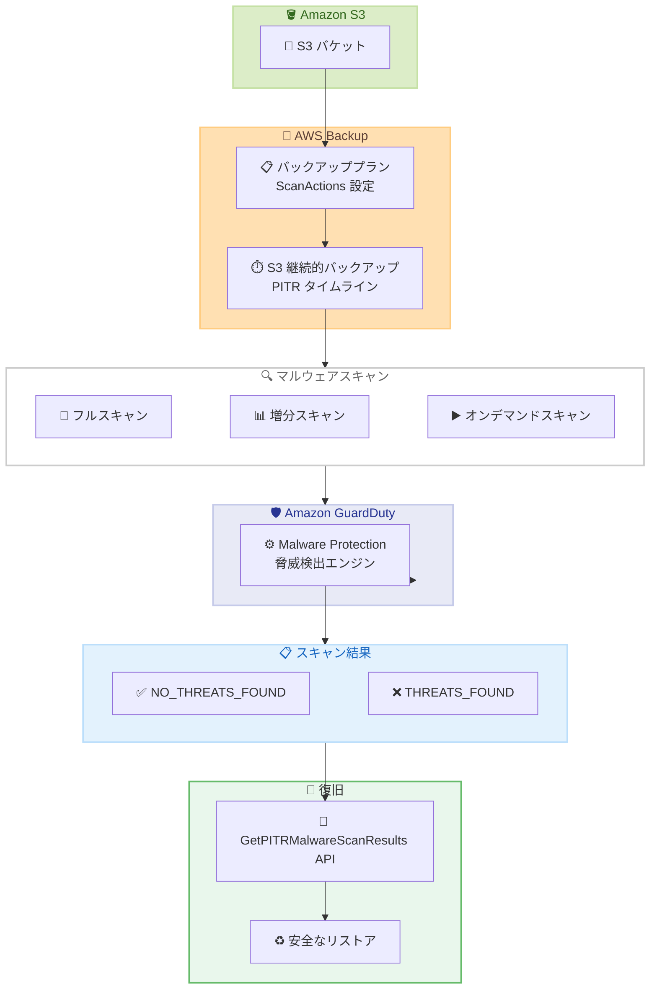

# Amazon GuardDuty Malware Protection for AWS Backup - Amazon S3 継続的バックアップ対応

**リリース日**: 2026 年 5 月 26 日
**サービス**: Amazon GuardDuty / AWS Backup
**機能**: Malware Protection for AWS Backup における Amazon S3 継続的バックアップのサポート

📊 [このアップデートのインフォグラフィックを見る](https://takech9203.github.io/aws-news-summary/20260526-amazon-guardduty-aws-backup-s3-continuous.html)

## 概要

Amazon GuardDuty Malware Protection for AWS Backup が Amazon S3 の継続的バックアップ (PITR: Point-in-Time Recovery) に対応しました。これにより、S3 継続的バックアップのタイムライン全体にわたってマルウェアスキャンを実行し、安全にリストア可能なクリーンなポイントインタイムを特定できるようになりました。

この機能は、ランサムウェアやマルウェア攻撃からの復旧において、バックアップデータの安全性を確認してからリストアを実行したい組織に向けたものです。バックアッププラン内でフルスキャンまたは増分スキャンを有効化できるほか、任意のリストア可能なポイントインタイムに対してオンデマンドスキャンを実行することも可能です。

新しい `GetPITRMalwareScanResults` API により、継続的バックアップ内の任意の時点におけるマルウェアスキャンの状態を照会でき、リストアを開始する前に特定の復旧時点がクリーンであるかどうかを検証できます。

**アップデート前の課題**

- S3 継続的バックアップに対するマルウェアスキャンが利用できず、PITR リストア時にバックアップデータの安全性を事前に確認できなかった
- 継続的バックアップのタイムライン上でどの時点がクリーンかを特定する手段がなかった
- S3 の PITR バックアップに対して増分スキャンやオンデマンドスキャンを実行できなかった

**アップデート後の改善**

- S3 継続的バックアップに対してフルスキャンおよび増分スキャンを自動実行できるようになった
- `GetPITRMalwareScanResults` API で任意の時点のスキャン結果を照会し、クリーンなリストアポイントを特定可能になった
- オンデマンドスキャンにより、任意のリストア可能なポイントインタイムまでスキャンを実行可能になった

## アーキテクチャ図



S3 継続的バックアップのマルウェアスキャンフローを示しています。バックアッププランで設定されたスキャンが GuardDuty Malware Protection エンジンで実行され、`GetPITRMalwareScanResults` API を通じてクリーンなポイントインタイムを特定し、安全なリストアを実現します。

## サービスアップデートの詳細

### 主要機能

1. **S3 継続的バックアップのマルウェアスキャン**
   - バックアッププラン内で S3 継続的バックアップに対するマルウェアスキャンを有効化
   - フルスキャンと増分スキャンの両方をサポート
   - スキャンはバックアップルールのスケジュール頻度に従って自動実行

2. **GetPITRMalwareScanResults API**
   - 継続的バックアップ内の任意のポイントインタイムにおけるマルウェアスキャン状態を照会
   - リストア前に特定の復旧時点がクリーンであるかを検証
   - スキャン未実施の時点を照会した場合は `unknown` の結果を返却
   - AWS Backup コンソールからも同等の情報を確認可能

3. **オンデマンドスキャン**
   - 任意のリストア可能なポイントインタイムに対してスキャンを実行
   - S3 継続的バックアップのオンデマンドスキャンでは増分スキャンは非対応 (フルスキャンのみ)
   - リストア操作前の最終確認として推奨

4. **クリーンなポイントインタイムの特定**
   - バックアップタイムライン全体にわたってクリーンな復旧ポイントを識別
   - 最新のクリーンなリストア可能時点を AWS Backup コンソールまたは API で確認

## 技術仕様

### スキャンタイプの比較

| 項目 | フルスキャン | 増分スキャン |
|------|-------------|-------------|
| スキャン対象 | リカバリポイント全体 | 前回スキャンからの差分データのみ |
| コスト | 高い (全データ対象) | 低い (差分のみ) |
| 処理時間 | 長い | 短い |
| 推奨用途 | 定期的な包括スキャン、リストア前確認 | 日常的なバックアップ後の脅威検出 |
| オンデマンド対応 | 対応 | S3 継続的バックアップでは非対応 |

### IAM ロール要件

| ロール | マネージドポリシー | 信頼関係 |
|--------|-------------------|----------|
| バックアップロール | `AWSBackupServiceRolePolicyForBackup` または `AWSBackupServiceRolePolicyForScans` | AWS Backup サービス |
| スキャナーロール | `AWSBackupGuardDutyRolePolicyForScans` | `malware-protection.guardduty.amazonaws.com` |

### API 変更履歴

| 日付 | サービス | 変更内容 |
|------|----------|----------|
| 2026/05/26 | AWS Backup | `GetPITRMalwareScanResults` API 追加 - S3 継続的バックアップの任意時点のスキャン結果照会 |

### スキャン設定例

```json
{
  "BackupPlan": {
    "BackupPlanName": "s3-continuous-malware-scan",
    "Rules": [
      {
        "RuleName": "s3-continuous-full-scan",
        "TargetBackupVaultName": "Default",
        "ScheduleExpression": "cron(0 0 * * ? *)",
        "EnableContinuousBackup": true,
        "ScanActions": [
          {
            "MalwareScanner": "GUARDDUTY",
            "ScanMode": "FULL_SCAN"
          }
        ]
      },
      {
        "RuleName": "s3-continuous-incremental-scan",
        "TargetBackupVaultName": "Default",
        "ScheduleExpression": "cron(0 */6 * * ? *)",
        "EnableContinuousBackup": true,
        "ScanActions": [
          {
            "MalwareScanner": "GUARDDUTY",
            "ScanMode": "INCREMENTAL_SCAN"
          }
        ]
      }
    ],
    "ScanSettings": [
      {
        "MalwareScanner": "GUARDDUTY",
        "ResourceTypes": ["S3"],
        "ScannerRoleArn": "arn:aws:iam::123456789012:role/BackupScannerRole"
      }
    ]
  }
}
```

## 設定方法

### 前提条件

1. Amazon GuardDuty が有効化されたアカウント
2. AWS Backup で S3 継続的バックアップが設定済み
3. バックアップロールに `AWSBackupServiceRolePolicyForScans` ポリシーがアタッチ済み
4. スキャナーロールに `AWSBackupGuardDutyRolePolicyForScans` ポリシーがアタッチ済み (信頼関係: `malware-protection.guardduty.amazonaws.com`)

### 手順

#### ステップ 1: スキャナーロールの作成

```bash
# スキャナーロールの信頼ポリシーを作成
cat > trust-policy.json << 'EOF'
{
  "Version": "2012-10-17",
  "Statement": [
    {
      "Effect": "Allow",
      "Principal": {
        "Service": "malware-protection.guardduty.amazonaws.com"
      },
      "Action": "sts:AssumeRole"
    }
  ]
}
EOF

# IAM ロールを作成
aws iam create-role \
    --role-name BackupScannerRole \
    --assume-role-policy-document file://trust-policy.json

# マネージドポリシーをアタッチ
aws iam attach-role-policy \
    --role-name BackupScannerRole \
    --policy-arn arn:aws:iam::aws:policy/AWSBackupGuardDutyRolePolicyForScans
```

GuardDuty Malware Protection がバックアップデータにアクセスするためのスキャナーロールを作成し、必要な権限をアタッチしています。

#### ステップ 2: バックアッププランでマルウェアスキャンを有効化

```bash
aws backup create-backup-plan \
    --region us-east-1 \
    --cli-input-json '{
      "BackupPlan": {
        "BackupPlanName": "s3-continuous-with-malware-scan",
        "Rules": [
          {
            "RuleName": "daily-full-scan",
            "TargetBackupVaultName": "Default",
            "ScheduleExpression": "cron(0 0 * * ? *)",
            "StartWindowMinutes": 120,
            "CompletionWindowMinutes": 6000,
            "Lifecycle": {
              "DeleteAfterDays": 35
            },
            "EnableContinuousBackup": true,
            "ScanActions": [
              {
                "MalwareScanner": "GUARDDUTY",
                "ScanMode": "FULL_SCAN"
              }
            ]
          }
        ],
        "ScanSettings": [
          {
            "MalwareScanner": "GUARDDUTY",
            "ResourceTypes": ["S3"],
            "ScannerRoleArn": "arn:aws:iam::123456789012:role/BackupScannerRole"
          }
        ]
      }
    }'
```

S3 継続的バックアップとマルウェアスキャンを有効にしたバックアッププランを作成しています。`EnableContinuousBackup` を `true` に設定し、`ScanActions` でフルスキャンを指定しています。

#### ステップ 3: PITR スキャン結果の照会

```bash
# 特定のポイントインタイムのスキャン結果を照会
aws backup get-pitr-malware-scan-results \
    --recovery-point-arn "arn:aws:backup:us-east-1:123456789012:recovery-point:continuous:s3-example" \
    --point-in-time "2026-05-26T12:00:00Z"
```

`GetPITRMalwareScanResults` API を使用して、指定した時点のマルウェアスキャン結果を取得しています。リストアを実行する前にこの API で対象時点の安全性を確認することが推奨されます。

## メリット

### ビジネス面

- **ランサムウェア対策の強化**: バックアップデータの安全性を復旧前に確認でき、感染データをリストアしてしまうリスクを排除
- **コンプライアンス対応**: バックアップのマルウェアスキャン履歴を保持し、監査要件への対応が容易
- **復旧時間の最適化**: クリーンなポイントインタイムを事前に特定することで、リストア試行の繰り返しを防止

### 技術面

- **タイムライン全体の可視化**: 継続的バックアップの任意の時点におけるセキュリティ状態を照会可能
- **自動化対応**: API ベースでスキャン結果を取得でき、EventBridge と組み合わせた自動復旧ワークフローの構築が可能
- **増分スキャンによるコスト効率**: 差分データのみをスキャンすることで、日常的なスキャンコストを抑制

## デメリット・制約事項

### 制限事項

- S3 継続的バックアップのオンデマンドスキャンでは増分スキャンが非対応 (フルスキャンのみ)
- アカウントあたり同時実行スキャン数は最大 150、リソースタイプあたりは最大 5
- スキャン未実施の時点を `GetPITRMalwareScanResults` で照会した場合、結果は `unknown` となる
- GuardDuty の検出結果の保持期間は 365 日間

### 考慮すべき点

- マルウェアスキャンの料金は GuardDuty 側で課金され、フリーティアやフリートライアルは提供されない
- フルスキャンは全データを対象とするため、大容量バケットでは処理時間とコストが増大する可能性がある
- スキャナーロールとバックアップロールの両方を適切に設定する必要があり、IAM 設定の管理が複雑になる

## ユースケース

### ユースケース 1: ランサムウェア攻撃後の安全な復旧

**シナリオ**: ランサムウェアに感染した S3 バケットを感染前のクリーンな状態に復旧する必要がある。

**実装例**:
```bash
# 感染前のクリーンな時点を特定
aws backup get-pitr-malware-scan-results \
    --recovery-point-arn "arn:aws:backup:us-east-1:123456789012:recovery-point:continuous:infected-bucket" \
    --point-in-time "2026-05-25T08:00:00Z"

# クリーンであることを確認後、リストアを実行
aws backup start-restore-job \
    --recovery-point-arn "arn:aws:backup:us-east-1:123456789012:recovery-point:continuous:infected-bucket" \
    --metadata '{"RestoreTime": "2026-05-25T08:00:00Z"}' \
    --iam-role-arn "arn:aws:iam::123456789012:role/BackupRestoreRole"
```

**効果**: 感染前の正確な時点を特定してリストアすることで、データ損失を最小限に抑えつつ安全な復旧を実現。

### ユースケース 2: コンプライアンス監査のためのスキャン自動化

**シナリオ**: 医療データを保持する S3 バケットに対して、規制要件に基づき定期的なマルウェアスキャンを実施し、監査証跡を残す。

**実装例**:
```json
{
  "Rules": [
    {
      "RuleName": "compliance-daily-incremental",
      "ScheduleExpression": "cron(0 2 * * ? *)",
      "EnableContinuousBackup": true,
      "ScanActions": [
        {
          "MalwareScanner": "GUARDDUTY",
          "ScanMode": "INCREMENTAL_SCAN"
        }
      ]
    },
    {
      "RuleName": "compliance-weekly-full",
      "ScheduleExpression": "cron(0 3 ? * SUN *)",
      "EnableContinuousBackup": true,
      "ScanActions": [
        {
          "MalwareScanner": "GUARDDUTY",
          "ScanMode": "FULL_SCAN"
        }
      ]
    }
  ]
}
```

**効果**: 日次の増分スキャンと週次のフルスキャンの組み合わせにより、コスト効率と包括的なセキュリティカバレッジの両立を実現。

### ユースケース 3: EventBridge 連携による自動アラート

**シナリオ**: マルウェアが検出された場合に自動で通知を送信し、該当バケットのリストア操作を一時停止するワークフローを構築する。

**実装例**:
```json
{
  "source": ["aws.backup"],
  "detail-type": ["Backup Scan Job State Change"],
  "detail": {
    "scanResult": ["THREATS_FOUND"],
    "resourceType": ["S3"]
  }
}
```

**効果**: マルウェア検出時に即座に対応チームへ通知が届き、感染データのリストアを未然に防止。

## 料金

マルウェアスキャンの料金は Amazon GuardDuty 側で課金されます。AWS Backup 側での追加料金は発生しません。フリーティアおよびフリートライアルは提供されていません。

### 料金例

| 使用量 | 月額料金 (概算) |
|--------|-----------------|
| 初回フルスキャン 1,250 GB | $62.50 |
| 増分スキャン 275 GB | $13.75 |
| 合計 (初回 + 増分) | $76.25 |

**料金レート**: スキャンデータ 1 GB あたり $0.05 (米国東部バージニア北部リージョン)

※ AWS Backup のストレージ料金は別途発生します。

## 利用可能リージョン

Amazon GuardDuty Malware Protection for AWS Backup がサポートされているすべての AWS リージョンで利用可能です。

## 関連サービス・機能

- **Amazon GuardDuty Malware Protection for S3**: S3 バケットへの直接アップロード時のリアルタイムマルウェアスキャン
- **AWS Backup**: バックアッププラン、リカバリポイント管理、PITR の基盤サービス
- **Amazon EventBridge**: スキャン結果に基づく自動ワークフローのトリガー
- **AWS CloudTrail**: スキャン操作やデータアクセスの監査ログ
- **Amazon GuardDuty Malware Protection for EC2**: EBS ボリュームのマルウェアスキャン機能

## 参考リンク

- 📊 [インフォグラフィック](https://takech9203.github.io/aws-news-summary/20260526-amazon-guardduty-aws-backup-s3-continuous.html)
- [公式発表 (What's New)](https://aws.amazon.com/about-aws/whats-new/2026/05/amazon-guardduty-aws-backup-s3-continuous/)
- [AWS Backup マルウェア保護ドキュメント](https://docs.aws.amazon.com/aws-backup/latest/devguide/malware-protection.html)
- [Amazon GuardDuty 料金ページ](https://aws.amazon.com/guardduty/pricing/)

## まとめ

Amazon GuardDuty Malware Protection for AWS Backup が S3 継続的バックアップに対応したことで、PITR タイムライン全体にわたるマルウェアスキャンとクリーンな復旧ポイントの特定が可能になりました。ランサムウェアやマルウェア攻撃への備えとして、S3 の継続的バックアップを利用している組織はバックアッププランでのスキャン有効化を検討することを推奨します。新しい `GetPITRMalwareScanResults` API を活用することで、リストア前の安全性確認を自動化し、インシデント対応の迅速化が期待できます。
