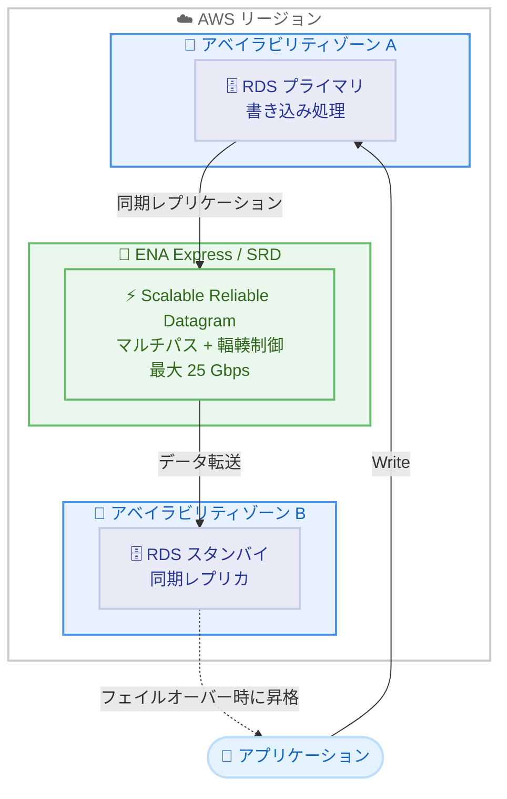

# Amazon RDS - ENA Express によるマルチ AZ レプリケーション

**リリース日**: 2026 年 5 月 26 日
**サービス**: Amazon RDS
**機能**: ENA Express for Multi-AZ replication

📊 [このアップデートのインフォグラフィックを見る](https://takech9203.github.io/aws-news-summary/20260526-amazon-rds-ena-express-multiAZ.html)

## 概要

Amazon RDS のマルチ AZ インスタンスが、アベイラビリティゾーン (AZ) 間のレプリケーショントラフィックに ENA Express を使用するようになった。ENA Express は AWS の Scalable Reliable Datagram (SRD) プロトコルを活用し、AZ 間レプリケーションの単一フロー帯域幅を最大 25 Gbps まで向上させるとともに、高度な輻輳制御とマルチパスルーティングにより書き込みスループットの向上とレイテンシーの安定化を実現する。

RDS マルチ AZ 構成では、高可用性と自動フェイルオーバーを提供するために、異なる AZ のスタンバイインスタンスへデータを同期的にレプリケーションしている。このアップデートにより、書き込み集中型のデータベースワークロードにおいて、追加料金なしでパフォーマンスが改善される。対象は Amazon RDS for MariaDB、MySQL、PostgreSQL、Db2、Oracle である。

**アップデート前の課題**

- マルチ AZ レプリケーションのネットワークパフォーマンスが標準の ENA に依存しており、単一フロー帯域幅が制限されていた
- 書き込み集中型ワークロードでは AZ 間レプリケーションのレイテンシー変動が書き込みパフォーマンスに影響していた
- ネットワーク輻輳時にレプリケーション遅延が発生し、フェイルオーバー時のデータ損失リスクが増加する可能性があった
- 高スループットな書き込みを行うアプリケーションでは、レプリケーションがボトルネックとなることがあった

**アップデート後の改善**

- SRD プロトコルによりレプリケーション帯域幅が最大 25 Gbps の単一フロー帯域幅に向上
- マルチパスルーティングによりネットワーク輻輳の影響を動的に回避
- 書き込みスループットの向上と書き込みレイテンシーの低減を実現
- レイテンシー変動 (ジッター) が低減され、より安定したレプリケーション性能を提供

## アーキテクチャ図



RDS マルチ AZ 構成において、プライマリインスタンスからスタンバイインスタンスへの同期レプリケーションが ENA Express (SRD) を経由して行われる。SRD がマルチパスルーティングと輻輳制御を自動的に適用し、高帯域幅かつ低レイテンシーなレプリケーションを実現する。

## サービスアップデートの詳細

### 主要機能

1. **SRD プロトコルによるレプリケーション最適化**
   - AWS Scalable Reliable Datagram (SRD) プロトコルを RDS マルチ AZ レプリケーションに適用
   - 単一フロー帯域幅が最大 25 Gbps に向上
   - トラフィックを複数のネットワークパスに動的に分散

2. **高度な輻輳制御**
   - リアルタイムでネットワーク輻輳を検知し、トラフィックを代替パスにルーティング
   - レイテンシー変動を低減し、安定したレプリケーション性能を維持
   - 書き込みレイテンシーの予測可能性が向上

3. **書き込みパフォーマンスの向上**
   - 書き込み集中型ワークロードでの書き込みスループットが向上
   - 同期レプリケーションのオーバーヘッドが軽減
   - 書き込みレイテンシーが低減

4. **マネージドサービスとしての透過的な適用**
   - RDS が自動的に ENA Express を活用 (ユーザーによる ENA Express の手動設定は不要)
   - 既存インスタンスへの適用にはスタートストップまたはコンピュートスケーリングが必要
   - アプリケーション側の変更は一切不要

## 技術仕様

### パフォーマンス特性

| 項目 | 詳細 |
|------|------|
| レプリケーション帯域幅 | 最大 25 Gbps (単一フロー) |
| プロトコル | AWS SRD (Scalable Reliable Datagram) |
| パス制御 | マルチパスルーティング |
| 輻輳制御 | リアルタイム適応型 |
| レイテンシー改善 | 変動 (ジッター) の低減 |

### 対象データベースエンジン

| エンジン | サポート状況 |
|----------|-------------|
| Amazon RDS for MySQL | 対応 |
| Amazon RDS for PostgreSQL | 対応 |
| Amazon RDS for MariaDB | 対応 |
| Amazon RDS for Oracle | 対応 |
| Amazon RDS for Db2 | 対応 |
| Amazon RDS for SQL Server | 未記載 |

### API 変更履歴

今回のアップデートに関連する新規 API 変更は確認されていない。ENA Express の適用は RDS マネージドサービスの内部最適化として実装されており、ユーザー側で新しい API を呼び出す必要はない。

## 設定方法

### 前提条件

1. Amazon RDS マルチ AZ 構成のインスタンスであること
2. 対象のデータベースエンジン (MariaDB、MySQL、PostgreSQL、Db2、Oracle) を使用していること
3. ENA Express 対応のリージョンで運用していること

### 手順

#### ステップ 1: 現在のマルチ AZ 構成の確認

```bash
aws rds describe-db-instances \
  --db-instance-identifier my-db-instance \
  --query "DBInstances[].{DBInstanceId:DBInstanceIdentifier,MultiAZ:MultiAZ,Engine:Engine,DBInstanceClass:DBInstanceClass}"
```

対象の RDS インスタンスがマルチ AZ 構成であることを確認する。

#### ステップ 2: ENA Express の有効化 (既存インスタンスの場合)

**方法 A: スタートストップによる適用**

```bash
# インスタンスを停止
aws rds stop-db-instance \
  --db-instance-identifier my-db-instance

# インスタンスを開始
aws rds start-db-instance \
  --db-instance-identifier my-db-instance
```

インスタンスの停止と再開を行うことで、ENA Express がレプリケーションに適用される。この操作にはダウンタイムが伴う。

**方法 B: コンピュートスケーリングによる適用**

```bash
# インスタンスクラスの変更 (例: db.m6i.xlarge -> db.m6i.2xlarge)
aws rds modify-db-instance \
  --db-instance-identifier my-db-instance \
  --db-instance-class db.m6i.2xlarge \
  --apply-immediately
```

コンピュートスケーリング操作を実行することで、ENA Express が適用される。メンテナンスウィンドウまたは即時適用を選択可能。

#### ステップ 3: 適用の確認

```bash
# インスタンスの状態確認
aws rds describe-db-instances \
  --db-instance-identifier my-db-instance \
  --query "DBInstances[].{Status:DBInstanceStatus,MultiAZ:MultiAZ}"
```

インスタンスが正常に稼働していることを確認する。ENA Express の適用はインフラレベルで行われるため、RDS API での明示的な確認パラメータはない。CloudWatch メトリクスで書き込みレイテンシーの改善を監視することを推奨する。

#### ステップ 4: パフォーマンスの監視

```bash
# 書き込みレイテンシーの確認
aws cloudwatch get-metric-statistics \
  --namespace AWS/RDS \
  --metric-name WriteLatency \
  --dimensions Name=DBInstanceIdentifier,Value=my-db-instance \
  --start-time 2026-05-26T00:00:00Z \
  --end-time 2026-05-27T00:00:00Z \
  --period 300 \
  --statistics Average
```

ENA Express 適用後の書き込みレイテンシーを監視し、パフォーマンス改善を確認する。

## メリット

### ビジネス面

- **書き込みパフォーマンス向上による SLA 改善**: 書き込みレイテンシーの低減により、アプリケーションの応答時間が改善し、エンドユーザー体験が向上
- **追加コストなし**: ENA Express for RDS は追加料金なしで利用可能であり、既存のコスト構造を変更せずにパフォーマンスを改善可能
- **運用負荷の軽減**: RDS マネージドサービスとして自動的に最適化されるため、ネットワーク層の手動チューニングが不要

### 技術面

- **最大 25 Gbps の単一フロー帯域幅**: AZ 間レプリケーションのスループットが大幅に向上し、大量書き込み時のボトルネックを解消
- **レイテンシー変動の低減**: SRD のマルチパスルーティングと輻輳制御により、安定したレプリケーション性能を実現
- **フェイルオーバー時のデータ整合性向上**: 同期レプリケーションの効率化により、スタンバイとの同期状態がより確実に維持される
- **アプリケーション変更不要**: インフラレベルの最適化であるため、データベースクライアントやアプリケーションの変更は一切不要

## デメリット・制約事項

### 制限事項

- 既存のインスタンスに適用するにはスタートストップまたはコンピュートスケーリングが必要 (ダウンタイムまたはフェイルオーバーが発生)
- Amazon RDS for SQL Server への対応は現時点で未確認
- ENA Express 対応のインスタンスタイプおよびリージョンでのみ利用可能
- 新規作成されるマルチ AZ インスタンスでの自動適用の有無は明記されていない

### 考慮すべき点

- スタートストップによる適用はダウンタイムを伴うため、メンテナンスウィンドウでの計画的な実施を推奨
- パフォーマンス改善の度合いはワークロード特性 (書き込みパターン、データサイズ) に依存する
- 軽量な書き込みワークロードでは改善効果が限定的な場合がある
- ENA Express の効果を定量的に測定するには、適用前後の CloudWatch メトリクス比較が必要

## ユースケース

### ユースケース 1: 高頻度トランザクション処理システム

**シナリオ**: EC サイトや金融系アプリケーションで、ピーク時に大量の書き込みトランザクションが発生する。マルチ AZ のレプリケーション遅延が書き込みレイテンシーに影響し、ピーク時のレスポンスタイム劣化が課題となっていた。

**実装例**:
```bash
# 既存のマルチ AZ インスタンスに ENA Express を適用
# メンテナンスウィンドウでスタートストップを実施
aws rds stop-db-instance \
  --db-instance-identifier prod-transaction-db

# 停止完了を待機後に再開
aws rds start-db-instance \
  --db-instance-identifier prod-transaction-db
```

**効果**: SRD のマルチパスルーティングによりレプリケーションレイテンシーの変動が低減され、ピーク時でも安定した書き込みレイテンシーを実現。レスポンスタイムの P99 レイテンシーが改善する。

### ユースケース 2: バッチ書き込みを伴うデータウェアハウスのソースデータベース

**シナリオ**: ETL 処理やバッチジョブが定期的に大量のデータを書き込む OLTP データベース。バッチ書き込み中にレプリケーションが遅延し、その間のフェイルオーバー時にデータ損失のリスクがあった。

**実装例**:
```bash
# コンピュートスケーリングで適用 (ダウンタイムを最小化)
aws rds modify-db-instance \
  --db-instance-identifier etl-source-db \
  --db-instance-class db.r6i.4xlarge \
  --apply-immediately
```

**効果**: 最大 25 Gbps のレプリケーション帯域幅により、バッチ書き込み中でもスタンバイとの同期を高速に維持。RPO (Recovery Point Objective) が事実上ゼロに近い状態を維持しやすくなる。

### ユースケース 3: IoT データ収集基盤の書き込み集中型データベース

**シナリオ**: 数万台の IoT デバイスからセンサーデータを受信し、RDS PostgreSQL に書き込む基盤。データ量の増加に伴い、同期レプリケーションがボトルネックとなり、書き込みスループットが頭打ちになっていた。

**実装例**:
```bash
# 新規マルチ AZ インスタンスを作成 (ENA Express が自動適用される想定)
aws rds create-db-instance \
  --db-instance-identifier iot-sensor-db \
  --db-instance-class db.m6i.4xlarge \
  --engine postgres \
  --multi-az \
  --allocated-storage 500
```

**効果**: ENA Express による高帯域幅レプリケーションにより、同期レプリケーションのオーバーヘッドが軽減され、書き込みスループットが向上。IoT デバイス数の増加に対するスケーラビリティが改善する。

## 料金

ENA Express for Amazon RDS は追加料金なしで利用可能。

| 項目 | 料金 |
|------|------|
| ENA Express 機能利用料 | 無料 |
| RDS マルチ AZ インスタンス | 通常のマルチ AZ 料金が適用 (シングル AZ の約 2 倍) |
| AZ 間データ転送 | RDS マルチ AZ レプリケーションのデータ転送は RDS 料金に含まれる |

**注意**: ENA Express 自体は無料だが、RDS マルチ AZ 構成のインスタンス料金は引き続き通常通り適用される。コンピュートスケーリングで適用する場合、新しいインスタンスクラスの料金が適用される。

## 利用可能リージョン

東京リージョンを含む多くのリージョンで利用可能。

- **アジアパシフィック**: 東京、大阪、ソウル、シンガポール、シドニー、ムンバイ、香港
- **米国**: バージニア北部、オハイオ、オレゴン、北カリフォルニア
- **ヨーロッパ**: フランクフルト、アイルランド、ロンドン、パリ、ストックホルム、ミラノ、スペイン
- **カナダ**: セントラル
- **南米**: サンパウロ

**注意**: 具体的な対応リージョンの全一覧は AWS 公式ドキュメントを参照。ENA Express の AZ 間サポートが提供されているリージョンで利用可能。

## 関連サービス・機能

- **ENA Express (EC2)**: 同じ SRD プロトコルを EC2 インスタンス間の通信に適用する機能。2026 年 5 月に AZ 間サポートが追加された
- **Amazon RDS Multi-AZ**: 高可用性と自動フェイルオーバーを提供するデプロイメントオプション。今回の ENA Express 統合の基盤
- **AWS Scalable Reliable Datagram (SRD)**: ENA Express の基盤となるトランスポートプロトコル。マルチパスルーティングと高度な輻輳制御を提供
- **Amazon RDS Proxy**: データベース接続のプーリングと管理を提供。フェイルオーバー時の接続管理を簡素化
- **Amazon CloudWatch**: RDS のパフォーマンスメトリクス (WriteLatency、WriteThroughput 等) を監視し、ENA Express 適用の効果を測定

## 参考リンク

- 📊 [インフォグラフィック](https://takech9203.github.io/aws-news-summary/20260526-amazon-rds-ena-express-multiAZ.html)
- [公式発表 (What's New)](https://aws.amazon.com/about-aws/whats-new/2026/05/amazon-rds-ena-express-multiAZ/)
- [Amazon RDS マルチ AZ ドキュメント](https://docs.aws.amazon.com/AmazonRDS/latest/UserGuide/Concepts.MultiAZ.html)
- [ENA Express ドキュメント](https://docs.aws.amazon.com/AWSEC2/latest/UserGuide/ena-express.html)
- [Amazon RDS 料金ページ](https://aws.amazon.com/rds/pricing/)

## まとめ

Amazon RDS マルチ AZ インスタンスへの ENA Express 適用は、書き込み集中型ワークロードにおけるレプリケーション性能を追加コストなしで向上させる重要なアップデートである。SRD プロトコルのマルチパスルーティングと高度な輻輳制御により、書き込みスループットの向上とレイテンシー変動の低減が実現される。既存のマルチ AZ インスタンスに適用するにはスタートストップまたはコンピュートスケーリングが必要なため、メンテナンスウィンドウでの計画的な適用を推奨する。
