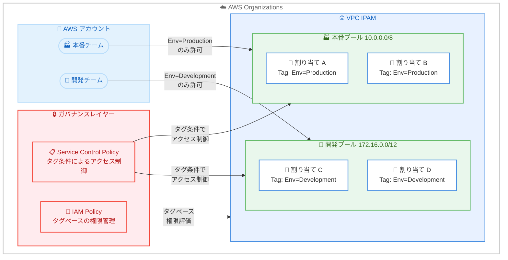

# Amazon VPC IPAM - プール割り当てのタグサポート

**リリース日**: 2026 年 5 月 26 日
**サービス**: Amazon VPC IP Address Manager (IPAM)
**機能**: Tags on IPAM pool allocations

📊 [このアップデートのインフォグラフィックを見る](https://takech9203.github.io/aws-news-summary/20260526-amazon-vpc-ipam-tags.html)

## 概要

Amazon VPC IP Address Manager (IPAM) が、IPAM プール割り当て (pool allocations) に対するタグ付けをサポートした。これにより、個々の IP アドレス割り当てに対して、他の AWS リソースと同じタグ付けワークフローを使用して整理、ガバナンス、アクセス制御を行うことが可能になった。

タグは割り当て作成時に付与することも、既存の割り当てに後から追加することもできる。これらのタグは AWS IAM ポリシーおよびサービスコントロールポリシー (SCP) で参照でき、大規模環境における IP アドレス使用の一元的なガバナンスを実現する。さらに、すべての IPAM プールにわたってタグによる割り当ての検索とフィルタリングが可能になり、大規模なマルチアカウント環境での特定の IP アドレス範囲の特定が迅速になった。

**アップデート前の課題**

- IPAM プール割り当てにタグを付与できず、個々の割り当てを論理的にグループ化する手段がなかった
- IAM ポリシーや SCP でタグベースのアクセス制御を割り当て単位で適用できなかったため、プール単位でしかガバナンスを実装できなかった
- 大規模なマルチアカウント環境で特定の IP アドレス範囲を検索する際、タグによるフィルタリングができず、手動での特定に時間がかかっていた
- 環境 (本番/開発) やチーム別の IP 割り当て管理を体系的に行う仕組みがなかった

**アップデート後の改善**

- IPAM プール割り当てに対して AWS 標準のタグ付けワークフローでタグを付与可能になった
- IAM ポリシーおよび SCP でタグ条件を使用した割り当てレベルのアクセス制御が実装可能になった
- すべての IPAM プールにわたるタグベースの検索・フィルタリングにより、IP アドレス範囲の特定が迅速化した
- 追加コストなしで利用でき、IPAM が利用可能なすべての AWS リージョンで使用可能

## アーキテクチャ図



IPAM プール割り当てにタグを付与し、IAM ポリシーおよび SCP のタグ条件を組み合わせることで、環境ごとの IP アドレス割り当てアクセス制御を実現する。本番チームは本番プールの割り当てのみ、開発チームは開発プールの割り当てのみにアクセスを制限できる。

## サービスアップデートの詳細

### 主要機能

1. **IPAM プール割り当てへのタグ付与**
   - 割り当て作成時にタグを指定可能
   - 既存の割り当てに対して後からタグを追加・変更可能
   - AWS 標準のタグ付けワークフローと一貫した操作

2. **タグベースのアクセス制御**
   - IAM ポリシーの条件キーとしてタグを参照可能
   - Service Control Policy (SCP) でのタグ条件による組織レベルのガバナンス
   - 環境・チーム・プロジェクト等の属性に基づく細粒度のアクセス制御

3. **タグによる検索・フィルタリング**
   - すべての IPAM プールにわたるタグベースの横断検索
   - 大規模マルチアカウント環境での IP アドレス範囲の迅速な特定
   - 複数のタグキー・バリューの組み合わせによるフィルタリング

## 技術仕様

### タグ付けの仕様

| 項目 | 詳細 |
|------|------|
| 対象リソース | IPAM プール割り当て (pool allocations) |
| タグ付与タイミング | 作成時および作成後 |
| IAM 条件キー | `aws:ResourceTag`、`aws:RequestTag`、`aws:TagKeys` |
| SCP サポート | タグ条件によるアクセス制御に対応 |
| 追加コスト | なし |

### 対応する IAM 条件キー

| 条件キー | 用途 |
|----------|------|
| `aws:ResourceTag/${TagKey}` | リソースに付与されたタグに基づくアクセス制御 |
| `aws:RequestTag/${TagKey}` | リクエスト時に指定されたタグに基づく制御 |
| `aws:TagKeys` | リクエストに含まれるタグキーの制限 |

## 設定方法

### 前提条件

1. VPC IPAM が有効化されていること
2. IPAM プールが作成済みであること
3. IAM ポリシーまたは SCP を管理する権限があること

### 手順

#### ステップ 1: IPAM プール割り当て作成時にタグを付与

```bash
aws ec2 allocate-ipam-pool-cidr \
    --ipam-pool-id ipam-pool-0123456789abcdef0 \
    --netmask-length 24 \
    --tag-specifications 'ResourceType=ipam-pool-allocation,Tags=[{Key=Environment,Value=Production},{Key=Team,Value=NetworkOps}]'
```

IPAM プールから CIDR を割り当てる際に `--tag-specifications` パラメータでタグを指定する。

#### ステップ 2: 既存の割り当てにタグを追加

```bash
aws ec2 create-tags \
    --resources ipam-pool-alloc-0123456789abcdef0 \
    --tags Key=Environment,Value=Production Key=CostCenter,Value=CC-1234
```

既存の IPAM プール割り当てに対して `create-tags` コマンドでタグを追加する。

#### ステップ 3: タグベースの IAM ポリシーを設定

```json
{
    "Version": "2012-10-17",
    "Statement": [
        {
            "Sid": "AllowProductionPoolAllocation",
            "Effect": "Allow",
            "Action": [
                "ec2:AllocateIpamPoolCidr"
            ],
            "Resource": "arn:aws:ec2:*:*:ipam-pool/*",
            "Condition": {
                "StringEquals": {
                    "aws:RequestTag/Environment": "Production"
                }
            }
        },
        {
            "Sid": "DenyNonProductionTagOnProductionPool",
            "Effect": "Deny",
            "Action": [
                "ec2:AllocateIpamPoolCidr"
            ],
            "Resource": "arn:aws:ec2:*:*:ipam-pool/ipam-pool-prod*",
            "Condition": {
                "StringNotEquals": {
                    "aws:RequestTag/Environment": "Production"
                }
            }
        }
    ]
}
```

本番ネットワーキングロールのみが本番プールから割り当て可能とし、開発チームが本番プールにアクセスすることを防止する IAM ポリシーの例。

#### ステップ 4: SCP によるタグ強制

```json
{
    "Version": "2012-10-17",
    "Statement": [
        {
            "Sid": "RequireEnvironmentTag",
            "Effect": "Deny",
            "Action": [
                "ec2:AllocateIpamPoolCidr"
            ],
            "Resource": "*",
            "Condition": {
                "Null": {
                    "aws:RequestTag/Environment": "true"
                }
            }
        }
    ]
}
```

すべての IPAM プール割り当てに Environment タグの付与を必須化する SCP の例。タグなしでの割り当てを組織全体で拒否する。

#### ステップ 5: タグによる割り当ての検索

```bash
aws ec2 get-ipam-pool-allocations \
    --ipam-pool-id ipam-pool-0123456789abcdef0 \
    --filters Name=tag:Environment,Values=Production
```

タグを使用して特定の環境の割り当てをフィルタリングし、該当する IP アドレス範囲を一覧表示する。

## メリット

### ビジネス面

- **ガバナンスの強化**: 環境・チーム・プロジェクト別に IP アドレス割り当てのアクセス制御を実装でき、コンプライアンス要件への対応が容易になる
- **運用効率の向上**: タグベースの検索により、大規模環境での IP アドレス管理に要する時間を削減
- **コスト管理の改善**: コストセンターやプロジェクトタグを使用した IP アドレス使用量の追跡が可能になる

### 技術面

- **細粒度のアクセス制御**: プール単位ではなく割り当て単位で IAM/SCP による権限管理が可能
- **既存ワークフローとの統合**: AWS 標準のタグ付けと同じ操作で管理でき、学習コストが低い
- **スケーラブルな管理**: マルチアカウント環境で一貫したタグポリシーを適用し、横断的な検索が可能

## デメリット・制約事項

### 制限事項

- AWS 標準のタグ制限が適用される (リソースあたり最大 50 タグ、キー最大 128 文字、バリュー最大 256 文字)
- 既存の割り当てへのタグ付けは手動で行う必要があり、既存環境での一括タグ付与には追加の作業が必要
- タグベースのアクセス制御は IAM ポリシー評価のタイミングで適用されるため、タグ変更後の即座の反映にはポリシー伝播時間を考慮する必要がある

### 考慮すべき点

- タグの命名規則を組織内で事前に統一しておく必要がある (大文字小文字の区別あり)
- タグベースの SCP を適用する前に、既存の割り当てワークフローへの影響を事前検証することを推奨
- IPAM の委任管理者アカウントでのタグ管理権限の設計が重要

## ユースケース

### ユースケース 1: 環境別アクセス制御

**シナリオ**: ネットワーク管理者が本番環境と開発環境の IP アドレスプールを管理しており、開発チームが誤って本番プールから IP を割り当てることを防止したい。

**実装例**:
```json
{
    "Version": "2012-10-17",
    "Statement": [
        {
            "Sid": "RestrictDevTeamToDevPool",
            "Effect": "Deny",
            "Action": "ec2:AllocateIpamPoolCidr",
            "Resource": "arn:aws:ec2:*:*:ipam-pool/*",
            "Condition": {
                "StringEquals": {
                    "aws:ResourceTag/Environment": "Production"
                },
                "ArnNotLike": {
                    "aws:PrincipalArn": "arn:aws:iam::*:role/ProductionNetworkAdmin"
                }
            }
        }
    ]
}
```

**効果**: 本番ネットワーキングロールのみが本番プールから割り当てを行い、開発チームは開発プールに限定される。環境間の IP アドレスの混在を防止し、本番環境の安定性を確保する。

### ユースケース 2: マルチアカウント IP 管理

**シナリオ**: 100 以上のアカウントを持つ組織で、各事業部門に割り当てられた IP アドレス範囲を追跡し、特定のアカウントや事業部門の割り当て状況を迅速に把握したい。

**実装例**:
```bash
# 事業部門別に割り当てをタグ付け
aws ec2 create-tags \
    --resources ipam-pool-alloc-abc123 \
    --tags Key=BusinessUnit,Value=FinanceDiv Key=AccountId,Value=123456789012

# 特定の事業部門の全割り当てを検索
aws ec2 get-ipam-pool-allocations \
    --ipam-pool-id ipam-pool-0123456789abcdef0 \
    --filters Name=tag:BusinessUnit,Values=FinanceDiv
```

**効果**: マルチアカウント環境で事業部門ごとの IP 使用状況を一覧化でき、キャパシティプランニングや IP アドレスの重複検出が容易になる。

### ユースケース 3: コンプライアンス・監査対応

**シナリオ**: PCI DSS や SOC 2 などのコンプライアンス要件に基づき、セグメント化されたネットワークの IP アドレス割り当てが適切に管理されていることを証明する必要がある。

**実装例**:
```json
{
    "Version": "2012-10-17",
    "Statement": [
        {
            "Sid": "EnforceComplianceTagging",
            "Effect": "Deny",
            "Action": "ec2:AllocateIpamPoolCidr",
            "Resource": "*",
            "Condition": {
                "ForAllValues:StringNotEquals": {
                    "aws:TagKeys": ["Environment", "DataClassification", "ComplianceScope"]
                }
            }
        }
    ]
}
```

**効果**: すべての IP アドレス割り当てに対してコンプライアンス関連タグの付与を強制し、監査時に環境分離やデータ分類に基づくネットワークセグメンテーションの証跡を提供できる。

## 料金

本機能は追加コストなしで利用可能。IPAM の既存の料金体系のみが適用される。

| 項目 | 料金 |
|------|------|
| IPAM プール割り当てのタグ付け | 無料 |
| IPAM (Advanced Tier) | アクティブな IP アドレスあたり $0.00027/時間 |
| IPAM (Free Tier) | 単一アカウント、単一リージョンでの使用は無料 |

## 利用可能リージョン

IPAM が利用可能なすべての AWS リージョンで使用可能。主要なリージョンは以下の通り。

- 米国東部 (バージニア北部、オハイオ)
- 米国西部 (オレゴン、北カリフォルニア)
- アジアパシフィック (東京、大阪、ソウル、シンガポール、シドニー、ムンバイ、ジャカルタ、香港)
- 欧州 (アイルランド、フランクフルト、ロンドン、パリ、ストックホルム、ミラノ、スペイン)
- カナダ (中部)
- 南米 (サンパウロ)
- 中東 (バーレーン、UAE)
- アフリカ (ケープタウン)

## 関連サービス・機能

- **Amazon VPC IPAM**: IP アドレスの計画、追跡、モニタリングを行う一元管理サービス
- **AWS IAM**: タグ条件を使用したアイデンティティベースのアクセス制御
- **AWS Organizations / SCP**: 組織全体のタグポリシーとアクセス制御の強制
- **AWS Config**: タグコンプライアンスの監視とルール適用
- **AWS Resource Groups**: タグベースのリソースグルーピングと管理

## 参考リンク

- 📊 [インフォグラフィック](https://takech9203.github.io/aws-news-summary/20260526-amazon-vpc-ipam-tags.html)
- [公式発表 (What's New)](https://aws.amazon.com/about-aws/whats-new/2026/05/amazon-vpc-ipam-tags/)
- [IPAM プール CIDR 割り当てドキュメント](https://docs.aws.amazon.com/vpc/latest/ipam/allocate-cidrs-ipam.html)
- [VPC IPAM ユーザーガイド](https://docs.aws.amazon.com/vpc/latest/ipam/what-it-is-ipam.html)
- [VPC IPAM 料金](https://aws.amazon.com/vpc/pricing/)

## まとめ

Amazon VPC IPAM のプール割り当てタグサポートにより、大規模なマルチアカウント環境での IP アドレスガバナンスが大幅に強化された。IAM ポリシーや SCP とタグ条件を組み合わせることで、環境別・チーム別のきめ細かなアクセス制御を追加コストなしで実装できる。IP アドレス管理を行うネットワーク管理者は、既存の割り当てにタグを付与し、タグベースのポリシーを段階的に導入することを推奨する。
