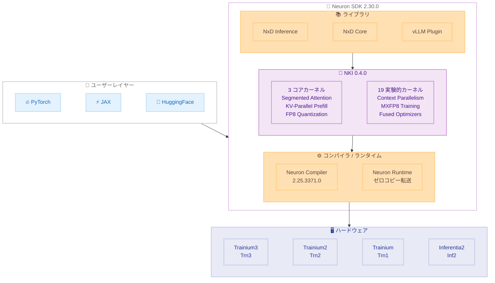

# AWS Neuron SDK - Neuron 2.30.0 / NKI 0.4.0 リリース

**リリース日**: 2026年5月26日
**サービス**: AWS Neuron SDK
**機能**: NKI (Neuron Kernel Interface) 0.4.0 および 22 の新規 NKI Library カーネル

📊 [このアップデートのインフォグラフィックを見る](https://takech9203.github.io/aws-news-summary/20260526-aws-announce-neuron-2-30-0.html)

## 概要

AWS Neuron 2.30.0 が一般提供開始された。本リリースの目玉は NKI (Neuron Kernel Interface) 0.4.0 へのアップグレードと、22 の新規 NKI Library カーネルの追加である。これにより、AWS Trainium および Inferentia チップ上でのカスタムカーネル開発と ML ワークロードの最適化が大幅に強化される。

本リリースは、カスタムカーネルを開発する ML エンジニア、トレーニングや推論ワークロードを最適化するデータサイエンティスト、および HuggingFace モデルを AWS Trainium/Inferentia にポートする開発者を主な対象としている。NKI 0.4.0 では Trainium3 (Trn3) 向けの新命令サポートや OCP FP8 入力対応など、次世代ハードウェアへの最適化が進められている。

**アップデート前の課題**

- カスタムカーネル開発時にタイルサイズの計算が複雑で、バイト単位の制約を手動で管理する必要があった
- Trainium3 の Scalar Engine を活用するための命令が限定されていた
- FP8 量子化、セグメント化アテンション、KV パラレルプリフィルなどの高度な最適化を独自に実装する必要があった
- HuggingFace モデルを NxD Inference にポートする作業が手動で煩雑だった

**アップデート後の改善**

- NKI 0.4.0 の Bytes-aware タイルサイズ定数により、カーネル開発が簡素化された
- Trainium3 向け activate2 Scalar Engine 命令により、新しい最適化パターンが利用可能になった
- 22 の新規カーネルにより、セグメント化アテンションや FP8 量子化などの高度な最適化を即座に活用できるようになった
- Neuron Agentic Development の新スキルにより、モデルポーティングと数値等価性検証が自動化された

## アーキテクチャ図



Neuron SDK 2.30.0 のスタック構成を示す。ユーザーは PyTorch や JAX からライブラリ層を経由し、NKI 0.4.0 の最適化カーネルを活用してハードウェアアクセラレーションを得る。

## サービスアップデートの詳細

### 主要機能

1. **NKI 0.4.0 の新機能**
   - activate2 Scalar Engine 命令: Trainium3 (Trn3) 専用の新しいスカラー演算命令
   - OCP FP8 入力サポート: 行列乗算操作で OCP (Open Compute Project) FP8 フォーマットに対応
   - Bytes-aware タイルサイズ定数: メモリレイアウトの制約をコンパイラが自動管理し、カーネル開発を簡素化

2. **22 の新規 NKI Library カーネル**
   - 3 つのコアカーネル: Segmented Attention、KV-Parallel Prefill、FP8 Quantization
   - 19 の実験的カーネル: Context Parallelism、MXFP8 Training、State-space Models、Fused Optimizers
   - 29 カーネル分の PyTorch リファレンス実装を提供

3. **Neuron Agentic Development の新スキル**
   - neuron-framework-autoport: HuggingFace モデルを NxD Inference にエンドツーエンドで自動ポート
   - neuron-framework-equivalence: ポートされたモデルの数値等価性を自動検証
   - 全 Neuron DLAMI および Deep Learning Containers にデフォルトで含まれる

4. **インフラストラクチャ改善**
   - Neuron DRA Driver: Kubernetes Dynamic Resource Allocation 対応で、トポロジー認識スケジューリングを実現
   - Neuron Graph Compiler: コンパイル時間の大幅な改善
   - Neuron Runtime: ゼロコピーホスト - デバイス転送をデフォルトで有効化

## 技術仕様

### コンポーネントバージョン

| コンポーネント | バージョン |
|---------------|-----------|
| Neuron SDK | 2.30.0 |
| Neuron Kernel Interface (NKI) | 0.4.0 |
| Neuron Compiler | 2.25.3371.0 |
| Neuron Runtime Library | 2.32.31.0 |
| Neuron Driver | 2.28.0.0 |
| Neuron Collectives | 2.31.24.0 |
| Neuron Agentic Development | 1.1 |
| NKI Library | 2.30.0 |

### NKI 0.4.0 新規カーネル一覧

| カテゴリ | カーネル名 | 用途 |
|---------|-----------|------|
| コア | Segmented Attention | 長いシーケンスのアテンション処理を効率化 |
| コア | KV-Parallel Prefill | KV キャッシュの並列プリフィル |
| コア | FP8 Quantization | 低精度量子化による高速推論 |
| 実験的 | Context Parallelism | コンテキスト並列処理 |
| 実験的 | MXFP8 Training | 混合精度 FP8 トレーニング |
| 実験的 | State-space Models | SSM アーキテクチャの最適化 |
| 実験的 | Fused Optimizers | 融合オプティマイザ |

### API 変更履歴

本リリースは SDK/ライブラリのリリースであり、AWS API サービスレベルでの変更は確認されなかった。

### 対応インスタンスタイプ

| インスタンス | チップ | 用途 |
|-------------|--------|------|
| Trn1 | Trainium | トレーニング / 推論 |
| Trn2 | Trainium2 | トレーニング / 推論 |
| Trn3 | Trainium3 | トレーニング / 推論 |
| Inf2 | Inferentia2 | 推論 |
| Inf1 | Inferentia | 推論 |

## 設定方法

### 前提条件

1. EC2 Trn1/Trn2/Inf2 インスタンス、または対応する Amazon SageMaker 環境
2. Neuron DLAMI または Neuron Deep Learning Container
3. Python 3.8 以上

### 手順

#### ステップ 1: Neuron SDK のアップグレード

```bash
# Neuron リポジトリの設定 (Ubuntu)
sudo tee /etc/apt/sources.list.d/neuron.list > /dev/null <<EOF
deb https://apt.repos.neuron.amazonaws.com focal main
EOF

# Neuron ドライバーのアップグレード
sudo apt-get update
sudo apt-get install aws-neuronx-dkms=2.28.0.0
sudo apt-get install aws-neuronx-runtime-lib=2.32.31.0
```

Neuron ドライバーとランタイムライブラリを最新バージョンにアップグレードする。

#### ステップ 2: NKI 0.4.0 のインストール

```bash
# Python 仮想環境で NKI をアップグレード
pip install --upgrade neuronx-cc==2.25.3371.0
pip install --upgrade aws-neuronx-nki==0.4.0
```

NKI 0.4.0 をインストールし、新しいカーネル API とライブラリカーネルを利用可能にする。

#### ステップ 3: NKI Library カーネルの利用

```python
import neuronxcc.nki as nki
import neuronxcc.nki.language as nl
from neuronxcc.nki.kernels import segmented_attention, fp8_quantization

# FP8 量子化カーネルの使用例
output = fp8_quantization(input_tensor, scale_factor=1.0)

# セグメント化アテンションの使用例
attn_output = segmented_attention(
    query, key, value,
    segment_ids=segment_ids
)
```

NKI Library から提供される最適化済みカーネルをインポートして利用する。

#### ステップ 4: Neuron Agentic Development の利用

```bash
# DLAMI 環境では追加インストール不要
# モデルの自動ポート
neuron-agent autoport --model "meta-llama/Llama-3-8B" --target nxd-inference

# 数値等価性の検証
neuron-agent equivalence --original "meta-llama/Llama-3-8B" --ported ./ported_model/
```

Neuron Agentic Development スキルを使用して、HuggingFace モデルの自動ポートと検証を行う。

## メリット

### ビジネス面

- **開発期間の短縮**: 22 の新規カーネルにより、カスタム最適化の実装工数を大幅に削減
- **コスト効率の向上**: FP8 量子化やゼロコピー転送により、同じハードウェアでより多くの推論を処理可能
- **モデルポーティングの自動化**: Neuron Agentic Development により、GPU モデルから Trainium への移行コストを削減

### 技術面

- **Trainium3 対応の先行投資**: NKI 0.4.0 で Trn3 向け命令をサポートし、次世代ハードウェアへの準備が可能
- **コンパイル時間の短縮**: Neuron Graph Compiler の改善により、開発イテレーションが高速化
- **メモリ効率の改善**: ゼロコピーホスト - デバイス転送により、データ転送のオーバーヘッドを削減

## デメリット・制約事項

### 制限事項

- activate2 Scalar Engine 命令は Trainium3 (Trn3) 専用であり、Trn1/Trn2 では利用不可
- 19 の実験的カーネルは API が変更される可能性がある
- NKI 0.4.0 の一部機能は Inf1 では利用できない

### 考慮すべき点

- Neuron SDK 2.30.0 へのアップグレードにはドライバーの更新が必要で、インスタンスの再起動が伴う
- 実験的カーネルを本番環境で使用する場合は、十分なテストと性能検証が推奨される
- コンパイル済みモデルは SDK バージョン間で互換性がない場合があり、再コンパイルが必要になることがある

## ユースケース

### ユースケース 1: 大規模言語モデルの推論最適化

**シナリオ**: LLM の推論レイテンシを削減したい場合。セグメント化アテンションと KV-Parallel Prefill カーネルを組み合わせることで、長いコンテキストの処理を効率化できる。

**実装例**:
```python
from neuronxcc.nki.kernels import segmented_attention, kv_parallel_prefill

# 長いシーケンスをセグメントに分割して処理
output = segmented_attention(
    query, key, value,
    segment_size=2048
)

# KV キャッシュの並列プリフィル
kv_cache = kv_parallel_prefill(
    key_states, value_states,
    num_parallel=4
)
```

**効果**: 長いコンテキスト (32K+ トークン) での推論レイテンシが改善され、リアルタイムアプリケーションでのユーザー体験が向上する。

### ユースケース 2: FP8 量子化によるスループット向上

**シナリオ**: 推論コストを削減しつつ精度を維持したい場合。NKI Library の FP8 量子化カーネルを使用して、モデルの量子化を効率的に実行する。

**実装例**:
```python
from neuronxcc.nki.kernels import fp8_quantization

# モデル重みの FP8 量子化
quantized_weights = fp8_quantization(
    model_weights,
    scale_factor=compute_scale(model_weights)
)
```

**効果**: メモリ使用量が約半分に削減され、同じインスタンスでより多くの並列リクエストを処理可能になる。

### ユースケース 3: HuggingFace モデルの自動ポーティング

**シナリオ**: 既存の HuggingFace モデルを GPU から Trainium に移行したい場合。Neuron Agentic Development を使用して、手動作業を最小限に抑えながらモデルをポートする。

**実装例**:
```bash
# HuggingFace モデルを NxD Inference に自動ポート
neuron-agent autoport \
    --model "mistralai/Mixtral-8x7B-v0.1" \
    --target nxd-inference \
    --output ./ported_model/

# ポートされたモデルの数値等価性を検証
neuron-agent equivalence \
    --original "mistralai/Mixtral-8x7B-v0.1" \
    --ported ./ported_model/ \
    --tolerance 1e-3
```

**効果**: モデルポーティングの工数が数週間から数時間に短縮され、GPU から Trainium への移行障壁が大幅に低下する。

## 料金

AWS Neuron SDK 自体は無料で提供される。料金は使用する EC2 インスタンスタイプに依存する。

### 料金例

| インスタンスタイプ | 月額料金 (概算、オンデマンド、us-east-1) |
|------------------|----------------------------------------|
| trn1.2xlarge | 約 $1.34/時間 |
| trn1.32xlarge | 約 $21.50/時間 |
| inf2.xlarge | 約 $0.76/時間 |
| inf2.48xlarge | 約 $12.98/時間 |

## 利用可能リージョン

EC2 Trn1、Trn2、Inf2、Inf1 インスタンスが提供されている全てのリージョンで利用可能。主要なリージョンは以下の通り。

- US East (N. Virginia) - us-east-1
- US East (Ohio) - us-east-2
- US West (Oregon) - us-west-2
- Asia Pacific (Tokyo) - ap-northeast-1
- Europe (Ireland) - eu-west-1

## 関連サービス・機能

- **Amazon EC2 Trn1/Trn2 インスタンス**: Neuron SDK の主要な実行環境で、Trainium チップによるトレーニング/推論を提供
- **Amazon EC2 Inf2 インスタンス**: Inferentia2 チップによる高効率推論に特化したインスタンス
- **Amazon SageMaker**: Neuron SDK と統合されたマネージド ML プラットフォームで、トレーニングと推論のデプロイを簡素化
- **AWS Deep Learning AMI**: Neuron SDK がプリインストールされた AMI で、環境構築の手間を削減
- **Amazon EKS**: Neuron DRA Driver により、Kubernetes 上での Trainium ワークロードのスケジューリングを最適化

## 参考リンク

- 📊 [インフォグラフィック](https://takech9203.github.io/aws-news-summary/20260526-aws-announce-neuron-2-30-0.html)
- [公式発表 (What's New)](https://aws.amazon.com/about-aws/whats-new/2026/05/aws-announce-neuron-2-30-0)
- [Neuron SDK リリースノート](https://awsdocs-neuron.readthedocs-hosted.com/en/latest/release-notes/index.html)
- [NKI ドキュメント](https://awsdocs-neuron.readthedocs-hosted.com/en/latest/general/nki/index.html)
- [AWS Neuron 製品ページ](https://aws.amazon.com/ai/machine-learning/neuron/)

## まとめ

AWS Neuron 2.30.0 は、NKI 0.4.0 と 22 の新規カーネルにより、Trainium/Inferentia 上でのカスタムカーネル開発と ML ワークロード最適化を大きく前進させるリリースである。特に Trainium3 向けの新命令サポートと Neuron Agentic Development によるモデルポーティングの自動化は、GPU から AWS カスタムチップへの移行を加速させる重要な進化といえる。Trainium/Inferentia を活用中、または移行を検討している ML チームは、NKI Library カーネルの活用と Neuron Agentic Development の検証を推奨する。
