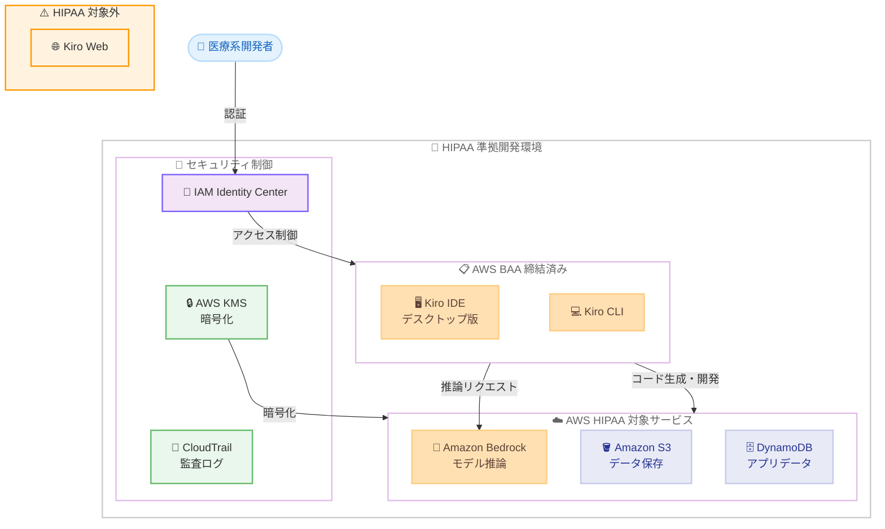

# Kiro - HIPAA 対象サービスに追加

**リリース日**: 2026 年 05 月 26 日
**サービス**: Kiro
**機能**: HIPAA Eligible Service

📊 [このアップデートのインフォグラフィックを見る](https://takech9203.github.io/aws-news-summary/20260526-kiro-changelog-2026-05-26.html)

## 概要

Kiro が AWS HIPAA Eligible Services Reference に追加されました。これにより、医療機関や医療関連企業が HIPAA コンプライアンス要件の下で保護対象医療情報 (PHI) を取り扱う環境において、Kiro を使用したソフトウェア開発が可能になります。

Kiro は AWS が提供するエージェント型 AI 搭載 IDE であり、スペック駆動開発によりプロトタイプから本番環境への移行を支援します。今回の HIPAA 対象サービス追加により、ヘルスケア分野での AI 支援開発ツールの選択肢が広がり、規制要件を満たしながら開発効率を向上させることが可能になりました。なお、Kiro Web は HIPAA 対象から除外されており、デスクトップ版 Kiro IDE および Kiro CLI が対象となります。

**アップデート前の課題**

- 医療機関や医療関連企業が HIPAA 準拠環境で AI 支援開発ツールを使用する際、Kiro は HIPAA 対象サービスに含まれていなかった
- ePHI を処理する可能性のある開発環境では、Kiro の利用が制限されていた
- HIPAA 準拠が必要な医療系ソフトウェア開発プロジェクトで、エージェント型 AI IDE を活用できなかった

**アップデート後の改善**

- AWS Business Associate Agreement (BAA) の締結により、Kiro を HIPAA 準拠環境で利用可能
- ePHI を取り扱う開発ワークフローにおいて、Kiro IDE および CLI によるエージェント型 AI 開発が可能に
- 医療系ソフトウェア開発の効率化と品質向上を、コンプライアンスを維持しながら実現可能

## アーキテクチャ図



この図は、HIPAA 準拠環境における Kiro の開発ワークフローを示しています。AWS BAA の締結を前提に、Kiro IDE/CLI からの開発作業が他の HIPAA 対象 AWS サービスと連携し、セキュリティ制御の下で ePHI を安全に取り扱う構成です。Kiro Web は HIPAA 対象外であることに注意が必要です。

## サービスアップデートの詳細

### 主要機能

1. **HIPAA Eligible Service としての認定**
   - Kiro が AWS HIPAA Eligible Services Reference に正式に追加
   - 電子保護対象医療情報 (ePHI) の作成、受信、処理、保持、送信に利用可能
   - AWS が HIPAA 要件への準拠を実証済み

2. **対象範囲**
   - Kiro IDE (デスクトップ版) が HIPAA 対象
   - Kiro CLI が HIPAA 対象
   - Kiro Web は HIPAA 対象から除外
   - 一般提供されている機能は、特に明記がない限り HIPAA 対象

3. **共有責任モデルに基づくコンプライアンス**
   - AWS 側: Kiro サービスの HIPAA 要件への準拠を保証
   - 顧客側: HIPAA 要件に合致するようサービスを設定する責任
   - BAA の締結が ePHI 利用の前提条件

## 技術仕様

### HIPAA コンプライアンス要件

| 項目 | 詳細 |
|------|------|
| 対象サービス | Kiro IDE (デスクトップ版)、Kiro CLI |
| 除外対象 | Kiro Web |
| 前提条件 | AWS Business Associate Agreement (BAA) の締結 |
| 責任モデル | AWS 共有責任モデル |
| データ保護 | ePHI の作成、受信、処理、保持、送信が可能 |
| 暗号化 | TLS 1.2 以上での通信暗号化 |
| 監査 | AWS CloudTrail による監査ログ取得 |

### BAA の詳細

| 項目 | 詳細 |
|------|------|
| BAA 対象者 | HIPAA で定義される Covered Entity または Business Associate |
| 締結方法 | AWS マネジメントコンソールの AWS Artifact から締結 |
| 適用範囲 | BAA 締結済みの AWS アカウント内での Kiro 利用 |
| 遵守事項 | HIPAA 要件に合致するサービス設定は顧客の責任 |

### セキュリティ管理策

| 管理策 | 内容 |
|--------|------|
| アクセス制御 | IAM Identity Center によるユーザー認証・認可 |
| 暗号化 (転送中) | TLS 1.2 以上 |
| 暗号化 (保存時) | AWS KMS によるデータ暗号化 |
| 監査ログ | CloudTrail によるアクティビティ記録 |
| ネットワーク制御 | VPC、セキュリティグループによるアクセス制限 |

## 設定方法

### 前提条件

1. AWS アカウントで AWS BAA が締結済みであること
2. HIPAA アカウントとして構成された AWS アカウントであること
3. AWS IAM Identity Center が設定済みであること
4. Kiro IDE (デスクトップ版) または Kiro CLI がインストール済みであること

### 手順

#### ステップ 1: AWS BAA の締結

AWS マネジメントコンソールの AWS Artifact から BAA を締結します。

1. AWS マネジメントコンソールにサインイン
2. AWS Artifact に移動
3. 「Agreements」セクションから AWS BAA を確認
4. BAA の内容を確認し、締結を完了

BAA の締結により、対象 AWS サービスで ePHI を取り扱う法的基盤が確立されます。

#### ステップ 2: HIPAA 準拠環境の構成

HIPAA アカウントとして適切なセキュリティ制御を設定します。

```json
{
  "SecurityControls": {
    "Encryption": {
      "AtRest": "AWS KMS Customer Managed Keys",
      "InTransit": "TLS 1.2+"
    },
    "AccessControl": {
      "Authentication": "IAM Identity Center",
      "Authorization": "Least Privilege IAM Policies"
    },
    "Auditing": {
      "CloudTrail": "Enabled - All Regions",
      "LogRetention": "Minimum 6 years"
    }
  }
}
```

上記は HIPAA 準拠環境で推奨されるセキュリティ制御の構成例です。

#### ステップ 3: Kiro IDE での開発作業

Kiro IDE (デスクトップ版) を使用して HIPAA 準拠環境で開発を開始します。

1. Kiro IDE を起動し、IAM Identity Center で認証
2. HIPAA アカウント内のリソースに接続
3. スペック駆動開発で医療系アプリケーションのコードを生成
4. ePHI を含むデータに関する開発作業を実施

**重要**: Kiro Web は HIPAA 対象外のため、ePHI を含む開発作業にはデスクトップ版 Kiro IDE または Kiro CLI を使用してください。

## メリット

### ビジネス面

- **ヘルスケア市場への対応**: 医療機関や医療関連企業に対して、AI 支援開発ツールを HIPAA 準拠で提供可能
- **開発効率の向上**: HIPAA 準拠を維持しながら、エージェント型 AI による医療系ソフトウェア開発の生産性を向上
- **コンプライアンスコストの削減**: AWS の共有責任モデルにより、HIPAA 準拠のインフラストラクチャ管理負担を軽減
- **市場投入時間の短縮**: AI 支援によるコード生成で医療系アプリケーションの開発サイクルを短縮

### 技術面

- **エンドツーエンドの暗号化**: TLS 1.2 以上による通信暗号化と AWS KMS によるデータ保存時暗号化
- **監査証跡**: CloudTrail による包括的な監査ログで HIPAA 監査要件に対応
- **統合された開発環境**: HIPAA 対象の他の AWS サービスとシームレスに連携した開発が可能
- **スペック駆動開発**: 仕様書に基づいたコード生成により、医療系システムの品質と追跡可能性を向上

## デメリット・制約事項

### 制限事項

- Kiro Web は HIPAA 対象外。ePHI を取り扱う開発作業にはデスクトップ版 IDE または CLI を使用する必要がある
- AWS BAA の事前締結が必須。BAA なしでの ePHI 利用は HIPAA 違反となる
- 顧客側で HIPAA 要件に合致するサービス設定を行う責任がある (共有責任モデル)
- HIPAA 対象サービスのリストに含まれない AWS サービスでは ePHI を処理・保存できない

### 考慮すべき点

- HIPAA 準拠環境の構築と維持には、追加のセキュリティ設定と運用管理が必要
- 開発チーム全員に HIPAA セキュリティ意識向上トレーニングの実施が推奨される
- Kiro で生成されたコードが ePHI を取り扱う場合、そのコードの HIPAA 準拠性も確認が必要
- ePHI を含まない開発作業については、従来どおり Kiro Web を含むすべての Kiro 機能を利用可能

## ユースケース

### ユースケース 1: 電子カルテシステムの開発

**シナリオ**: 医療機関が患者の電子カルテ (EHR) を管理するシステムを開発する必要がある。患者データ (ePHI) を取り扱うため、開発環境自体も HIPAA 準拠が求められる。

**実装例**:
```
# Kiro IDE でスペック駆動開発
# 1. 要件をプロンプトで記述
"患者の検査結果を表示するダッシュボードを作成。
データは DynamoDB から取得し、転送時・保存時ともに暗号化。
アクセスログは CloudTrail に記録。"

# 2. Kiro がスペック、実装コード、テストを自動生成
# 3. HIPAA 準拠の AWS サービスとの連携コードも生成
```

**効果**: ePHI を含む開発環境で AI 支援によるコード生成が可能になり、HIPAA 準拠を維持しながら EHR システムの開発期間を短縮できる

### ユースケース 2: 医療デバイス連携アプリケーション

**シナリオ**: 医療デバイスメーカーが、患者のバイタルデータを収集・分析するクラウドアプリケーションを開発する。FDA 規制と HIPAA の両方に準拠する必要がある。

**実装例**:
```
# Kiro CLI でバッチ処理のコード生成
kiro generate --spec "IoT デバイスからのバイタルデータ収集パイプライン。
AWS IoT Core でデータ受信、Kinesis Data Streams で処理、
S3 に暗号化保存。すべて HIPAA 対象サービスを使用。"

# スペック駆動開発で追跡可能な実装を生成
```

**効果**: スペック駆動開発により、規制当局への提出に必要な設計ドキュメントとコードの追跡可能性を確保しながら、開発を効率化できる

### ユースケース 3: 医療保険請求処理システム

**シナリオ**: 医療保険会社が保険請求処理を自動化するシステムを開発する。請求データには患者の医療情報 (ePHI) が含まれるため、開発プロセス全体で HIPAA 準拠が必要。

**実装例**:
```
# Kiro IDE で MCP 接続を活用
# 1. 既存の請求処理データベースに MCP で接続
# 2. データスキーマを理解した上でコード生成
# 3. テストデータの匿名化処理も自動生成

"保険請求の自動審査ロジックを実装。
Amazon Bedrock で請求内容を分析し、
承認/否認/手動レビューに振り分け。
すべての判定結果を監査ログに記録。"
```

**効果**: MCP 接続で既存のデータベーススキーマを理解した AI 支援開発により、複雑な請求処理ロジックの実装を加速しつつ、監査要件を満たすコードを生成できる

## 料金

Kiro の標準料金プランが適用されます。HIPAA 対象サービスとしての追加料金はありません。

| プラン | 月額料金 | クレジット |
|--------|----------|-----------|
| Free | $0 | 50 クレジット/月 |
| Pro | $20 | 1,000 クレジット/月 |
| Pro+ | $40 | 2,000 クレジット/月 |
| Power | $200 | 10,000 クレジット/月 |

**注意**: HIPAA 準拠環境の構築に必要な他の AWS サービス (CloudTrail、KMS、IAM Identity Center 等) の料金は別途発生します。詳細は [Kiro 料金ページ](https://kiro.dev/pricing/) を参照してください。

## 利用可能リージョン

グローバル

Kiro はグローバルサービスとして利用可能です。HIPAA 対象サービスとしての利用は、AWS BAA が締結された AWS アカウントで Kiro IDE (デスクトップ版) または Kiro CLI を使用する場合に適用されます。

## 関連サービス・機能

- **AWS Artifact**: BAA の締結と管理に使用するサービス
- **Amazon Bedrock**: Kiro のモデル推論基盤 (HIPAA 対象サービス)
- **AWS IAM Identity Center**: Kiro の認証基盤 (HIPAA 対象サービス)
- **AWS CloudTrail**: 監査ログの記録 (HIPAA 対象サービス)
- **AWS KMS**: データ暗号化 (HIPAA 対象サービス)
- **Amazon Bedrock AgentCore**: エージェント実行基盤 (HIPAA 対象サービス)

## 参考リンク

- 📊 [インフォグラフィック](https://takech9203.github.io/aws-news-summary/20260526-kiro-changelog-2026-05-26.html)
- [Kiro Changelog](https://kiro.dev/changelog/)
- [AWS HIPAA Eligible Services Reference](https://aws.amazon.com/compliance/hipaa-eligible-services-reference/)
- [AWS HIPAA コンプライアンス](https://aws.amazon.com/compliance/hipaa-compliance/)
- [Kiro 製品ページ](https://kiro.dev)
- [Kiro ドキュメント](https://kiro.dev/docs/)
- [Kiro 料金ページ](https://kiro.dev/pricing/)

## まとめ

Kiro が AWS HIPAA Eligible Services Reference に追加され、医療機関や医療関連企業が HIPAA 準拠環境でエージェント型 AI 開発を活用できるようになりました。デスクトップ版 Kiro IDE および Kiro CLI が対象であり、Kiro Web は除外されている点に注意が必要です。ヘルスケア分野でのソフトウェア開発を加速させたい組織は、AWS BAA を締結した上で、Kiro を HIPAA 準拠の開発ワークフローに組み込むことを検討してください。
