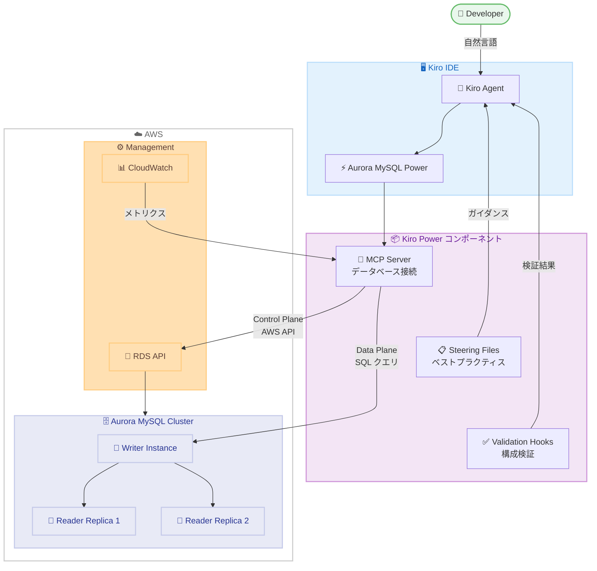

# Amazon Aurora MySQL - Kiro Powers インテグレーション

**リリース日**: 2026 年 5 月 27 日
**サービス**: Amazon Aurora MySQL-Compatible Edition
**機能**: Kiro Powers による Aurora MySQL 開発ワークフロー統合

📊 [このアップデートのインフォグラフィックを見る](https://takech9203.github.io/aws-news-summary/20260527-amazon-aurora-mysql-kiro-powers.html)

## 概要

Amazon Aurora MySQL が Kiro Powers との統合をサポートし、AI エージェントを活用したデータベース開発ワークフローが大幅に強化された。Kiro Powers は、キュレーションされた Model Context Protocol (MCP) サーバー、ステアリングファイル、バリデーションフックをパッケージ化したもので、Kiro パートナーによって検証されている。

この統合により、開発者は自然言語での対話を通じて Aurora MySQL のデータプレーン操作 (クエリ実行、テーブル作成、スキーマ管理) とコントロールプレーン操作 (クラスター作成・管理) の両方を実行できるようになった。Kiro エージェントがタスクに応じた Aurora MySQL のベストプラクティスを動的にロードし、情報過多を防ぎながら最適なガイダンスを提供する。

特に注目すべきは、RDS MySQL から Aurora MySQL へのニアゼロダウンタイム移行をガイド付きで実行できる点である。互換性チェック、移行方法の推奨、コマンド生成までを AI エージェントがサポートし、各ステップでユーザーの明示的な確認を経てから実行される。

**アップデート前の課題**

- Aurora MySQL の移行作業には深い専門知識が必要で、手動での互換性チェックやパラメータ設定に多くの時間を要していた
- ベストプラクティスの適用が開発者個人の経験に依存しており、一貫性のある品質を維持するのが困難だった
- データプレーンとコントロールプレーンの操作を行うには、複数のツールやコンソールを切り替える必要があった

**アップデート後の改善**

- 自然言語での対話により、Aurora MySQL の操作やスキーマ設計が効率化された
- キュレーションされたベストプラクティスが動的にロードされ、一貫した高品質なデータベース構成が可能になった
- Kiro IDE 内から一元的にデータプレーンとコントロールプレーンの操作が完結するようになった
- Read Replica プロモーションパスによるニアゼロダウンタイム移行が、ガイド付きで実行可能になった

## アーキテクチャ図



Kiro Powers の 3 つのコンポーネント (MCP Server、Steering Files、Validation Hooks) が連携し、開発者の自然言語による指示を Aurora MySQL のデータプレーン操作と AWS API コールに変換する。

## サービスアップデートの詳細

### 主要機能

1. **データプレーン操作**
   - データベースクエリの実行と結果の取得
   - テーブル作成、スキーマ設計、インデックス最適化
   - データ型の推奨とストレージエンジンの検証
   - クエリパフォーマンスの分析と最適化提案

2. **コントロールプレーン操作**
   - Aurora MySQL クラスターの作成と管理
   - パラメータグループの設定と最適化
   - Read Replica の追加とインスタンスクラスの推奨
   - Aurora Global Database のセットアップ

3. **ガイド付き移行機能**
   - RDS MySQL から Aurora MySQL へのニアゼロダウンタイム移行
   - 4 フェーズの移行プロセス: 評価 (Assess) → 移行 (Migrate) → 昇格 (Promote) → 切替 (Switch)
   - 互換性チェック、バイナリログ検証、ストレージエンジン評価を自動化
   - レプリカラグ監視とゼロラグ到達時の昇格推奨

4. **動的コンテキストロード**
   - タスクに応じて関連するガイダンスのみを動的にロード
   - Aurora MySQL Serverless スケーリング設定
   - レプリケーション構成の最適化
   - 情報過多を防ぎ、必要な情報のみを提示

## 技術仕様

### 要件と互換性

| 項目 | 詳細 |
|------|------|
| ソース MySQL バージョン | 5.7.44 以上または 8.0.28 以上 |
| バイナリログ | 自動バックアップ有効 (保持期間 1 日以上) |
| アカウント/リージョン | 同一 AWS アカウントおよび同一リージョンのみ |
| ストレージエンジン | InnoDB のみ (MyISAM テーブルは事前に変換が必要) |
| Kiro バージョン | 1.0 以降 |
| VPC 要件 | 2 つ以上の AZ にまたがるサブネットと DB サブネットグループ |
| セキュリティグループ | 開発環境からの MySQL ポート 3306 のインバウンド許可 |
| カットオーバー時ダウンタイム | 数十秒 |

### Kiro Power の構成要素

| コンポーネント | 役割 |
|---------------|------|
| MCP Server | Kiro を Aurora MySQL や AWS API に接続し、RDS インスタンスステータスの確認やパラメータグループの読み取りを実行 |
| Steering Files | ドメインエキスパートがキュレーションしたベストプラクティスをエンコードし、一般的な LLM 出力ではなく最新の標準に従った推奨を提供 |
| Validation Hooks | デプロイ前に構成をベストプラクティスに対して検証し、問題をフラグ付け |

### API 変更履歴

本アップデートに関連する RDS/Aurora API の変更は、調査期間 (過去 7 日間) 内には確認されなかった。

## 設定方法

### 前提条件

1. AWS アカウントを所有していること
2. Kiro IDE (バージョン 1.0 以降) へのアクセスがあること
3. Aurora MySQL が利用可能なリージョンで作業していること
4. VPC に 2 つ以上の AZ にまたがるサブネットが構成されていること

### 手順

#### ステップ 1: Kiro IDE から Aurora MySQL Power をインストール

Kiro IDE のサイドバーを開き、**Powers** パネルを選択する。

```
Kiro IDE サイドバー → Powers → AVAILABLE パネル → Amazon Aurora MySQL → Install
```

Kiro IDE の Powers セクションから Aurora MySQL Power を検索し、ワンクリックでインストールする。

#### ステップ 2: Kiro Web からのインストール (代替方法)

```
https://kiro.dev/powers/ にアクセス → Aurora MySQL Power を検索 → [Add to Kiro +] をクリック
```

Kiro Powers マーケットプレイスからブラウザ経由でもインストールが可能である。

#### ステップ 3: データベース接続の設定

```sql
-- セキュリティグループで開発環境からのアクセスを許可
-- ポート 3306 へのインバウンドルールを追加

-- Kiro エージェントに自然言語で指示
-- 例: "Aurora MySQL クラスターに接続して、テーブル一覧を表示して"
```

インストール完了後、自然言語で Aurora MySQL クラスターへの接続を指示する。MCP Server が認証情報を使用して安全に接続を確立する。

## メリット

### ビジネス面

- **開発生産性の向上**: 自然言語でのデータベース操作により、SQL やAWS CLI の詳細な知識がなくてもデータベース管理が可能
- **移行リスクの低減**: ガイド付き移行プロセスにより、ニアゼロダウンタイムでの移行が確実に実行可能
- **運用コストの削減**: ベストプラクティスの自動適用により、パフォーマンスチューニングやトラブルシューティングの工数を削減

### 技術面

- **一貫したベストプラクティス適用**: Steering Files によりチーム全体で統一された構成品質を維持
- **安全な操作モデル**: すべての変更操作にユーザーの明示的な確認を必要とし、意図しない変更を防止
- **動的コンテキストローディング**: タスクに応じた最適な情報のみを提示し、コンテキストウィンドウを効率的に活用

## デメリット・制約事項

### 制限事項

- 同一 AWS アカウントおよび同一リージョンでのみ移行が可能 (クロスアカウント/クロスリージョン移行は非対応)
- ストレージエンジンは InnoDB のみサポートされ、MyISAM テーブルは事前変換が必要
- 高負荷の書き込みワークロードではレプリカラグが増加する可能性があり、移行カットオーバーのタイミングに影響する場合がある

### 考慮すべき点

- Kiro Power は AWS リソースを直接変更せず、各ステップで確認を求めるが、生成されたコマンドの内容を理解した上で実行する必要がある
- バイナリログの有効化 (自動バックアップ保持期間 1 日以上) が移行の前提条件であり、既存の RDS インスタンスで無効の場合は事前設定が必要
- Kiro IDE のバージョン 1.0 以降が必要であり、レガシー環境では利用できない

## ユースケース

### ユースケース 1: RDS MySQL から Aurora MySQL への移行

**シナリオ**: 増加するトラフィックに対応するため、既存の RDS MySQL 5.7 インスタンスを Aurora MySQL にニアゼロダウンタイムで移行したい。

**実装例**:
```
# Kiro エージェントへの指示
"RDS MySQL インスタンス my-prod-db を Aurora MySQL に移行したい。
ダウンタイムを最小限に抑える方法を提案して。"

# エージェントが自動的に以下を実行:
# 1. 互換性チェック (MySQL バージョン、バイナリログ、ストレージエンジン)
# 2. Read Replica プロモーションパスの提案
# 3. 各フェーズのコマンド生成と確認
```

**効果**: 移行計画の策定から実行まで、専門知識がなくてもベストプラクティスに沿った安全な移行が可能。カットオーバー時のダウンタイムは数十秒に抑えられる。

### ユースケース 2: Aurora MySQL のスキーマ設計と最適化

**シナリオ**: 新しいマイクロサービスのためにデータベーススキーマを設計し、パフォーマンスを考慮したインデックスを作成したい。

**実装例**:
```
# Kiro エージェントへの指示
"E コマースの注文管理システム用のスキーマを設計して。
注文テーブル、注文明細テーブル、顧客テーブルが必要。
読み取りが多いワークロードに最適化して。"

# エージェントが以下を生成:
# - テーブル定義 (適切なデータ型、制約)
# - インデックス戦略 (カバリングインデックス、複合インデックス)
# - パーティショニングの推奨
```

**効果**: Aurora MySQL のベストプラクティスに基づいたスキーマ設計が迅速に完了し、後からのリファクタリングコストを削減できる。

### ユースケース 3: Read Replica の追加と Global Database 構成

**シナリオ**: レポーティングワークロードの分離と災害復旧 (DR) のために、Read Replica と Global Database を構成したい。

**実装例**:
```
# Kiro エージェントへの指示
"現在の Aurora MySQL クラスターに分析用の Read Replica を追加して。
また、東京リージョンからバージニアリージョンへの
Global Database も構成したい。"

# エージェントが以下を提案:
# - ワークロードパターンに基づくインスタンスクラスの推奨
# - パラメータチューニング (分析ワークロード向け)
# - Global Database の RPO/RTO 要件に基づく構成
```

**効果**: Read Replica のインスタンスクラス選定や Global Database の構成を、要件に基づいて最適化された形で実現できる。

## 料金

Kiro Powers による Aurora MySQL 統合自体の追加料金は発表されていない。Aurora MySQL の通常の利用料金 (インスタンス時間、ストレージ、I/O) が適用される。Kiro IDE の利用料金については kiro.dev を参照。

## 利用可能リージョン

Aurora MySQL が利用可能なすべての AWS リージョンで、Kiro Powers を通じたクラスターの作成および管理が可能。

## 関連サービス・機能

- **Kiro IDE**: AWS が提供する AI 搭載 IDE。Powers マーケットプレイスを通じて各種 AWS サービスとの統合を提供
- **Model Context Protocol (MCP)**: AI エージェントと外部サービスを接続するためのオープンプロトコル
- **Amazon RDS for MySQL**: 移行元として使用される、マネージド MySQL サービス
- **Aurora PostgreSQL Power**: 同様のインテグレーションが Aurora PostgreSQL 向けにも提供されている
- **Amazon CloudWatch**: 移行後の監視やパフォーマンスメトリクスの確認に使用

## 参考リンク

- 📊 [インフォグラフィック](https://takech9203.github.io/aws-news-summary/20260527-amazon-aurora-mysql-kiro-powers.html)
- [公式発表 (What's New)](https://aws.amazon.com/about-aws/whats-new/2026/05/amazon-aurora-mysql-kiro-powers/)
- [AWS Blog - Guide your Amazon Aurora MySQL migration with Kiro Powers](https://aws.amazon.com/blogs/database/guide-your-amazon-aurora-mysql-migration-with-kiro-powers)
- [Aurora MySQL MCP Server ドキュメント](https://awslabs.github.io/mcp/servers/mysql-mcp-server)
- [Kiro Powers マーケットプレイス](https://kiro.dev/powers/)

## まとめ

Amazon Aurora MySQL と Kiro Powers の統合は、AI エージェントを活用したデータベース開発の新しいパラダイムを示している。特に RDS MySQL からのニアゼロダウンタイム移行のガイド機能は、多くの企業の Aurora 移行プロジェクトを加速させる可能性がある。Aurora MySQL を利用している、または移行を検討しているチームは、Kiro IDE から Aurora MySQL Power をインストールして開発ワークフローの効率化を検討されたい。
