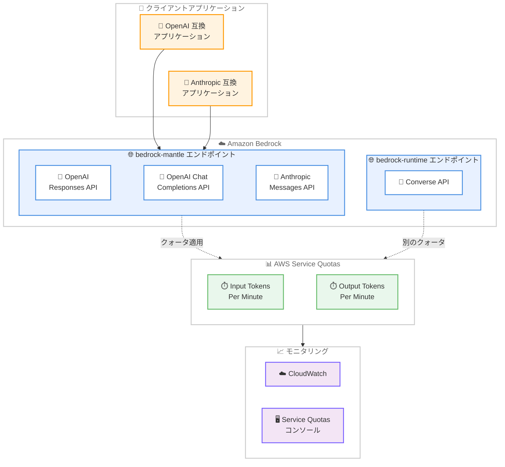

# Amazon Bedrock - Service Quotas サポートの拡張

**リリース日**: 2026 年 5 月 27 日
**サービス**: Amazon Bedrock
**機能**: bedrock-mantle エンドポイントの Service Quotas 統合

📊 [このアップデートのインフォグラフィックを見る](https://takech9203.github.io/aws-news-summary/20260527-amazon-bedrock-service-quotas.html)

## 概要

Amazon Bedrock が AWS Service Quotas のサポートを拡張し、bedrock-mantle エンドポイントの推論クォータを Service Quotas コンソールで確認できるようになった。bedrock-mantle エンドポイントは OpenAI Responses API、OpenAI Chat Completions API、Anthropic Messages API を提供するエンドポイントであり、既存の OpenAI や Anthropic ベースのアプリケーションを最小限のコード変更で Amazon Bedrock 上で実行できる。

今回のアップデートにより、bedrock-runtime エンドポイントと同様に、bedrock-mantle エンドポイントのモデルごとのトークン制限を一元的に確認・管理できるようになった。これにより本番環境のキャパシティプランニングが容易になる。

**アップデート前の課題**

- bedrock-mantle エンドポイントのクォータが Service Quotas コンソールに表示されず、制限値の確認が困難だった
- スロットリング発生時に現在のクォータ値を即座に把握する手段がなかった
- bedrock-runtime エンドポイントとは異なる管理方法が必要で、運用が複雑だった

**アップデート後の改善**

- Service Quotas コンソールで bedrock-mantle エンドポイントのモデルごとの入力/出力トークンクォータを直接確認可能になった
- CloudWatch メトリクスと組み合わせた使用量モニタリングが容易になった
- 他の AWS サービスと一貫したクォータ管理体験が実現された

## アーキテクチャ図



bedrock-mantle エンドポイントに対する推論リクエストが Service Quotas のモデルごとの入力/出力トークンクォータによって管理され、Service Quotas コンソールや CloudWatch で確認できる構成を示している。

## サービスアップデートの詳細

### 主要機能

1. **bedrock-mantle エンドポイントのクォータ可視化**
   - Service Quotas コンソールで「Amazon Bedrock」を選択し「Bedrock Mantle」で検索することで、現在のクォータを確認可能
   - モデルごとに入力トークン/分と出力トークン/分の 2 種類のクォータが表示される

2. **独立したクォータ管理**
   - bedrock-mantle と bedrock-runtime のクォータは完全に独立して管理される
   - 同一モデルを使用していても、エンドポイントごとに別々のクォータ枠が割り当てられる
   - 両方のエンドポイントを使用する場合、各エンドポイントのキャパシティを個別に計画する必要がある

3. **クォータ評価の仕組み**
   - 入力トークン/分: リクエストの入力トークン数 + max_tokens の値で評価。超過時は HTTP 429 レスポンスを返す
   - 出力トークン/分: モデルの生成中に出力トークンをカウント。クォータ到達時は生成が停止する
   - レスポンス完了後、未使用分の入力トークン予約は返還される

## 技術仕様

### クォータの種類

| クォータ | スコープ | 説明 |
|---------|---------|------|
| Bedrock Mantle input tokens per minute | モデルごと、リージョンごと | bedrock-mantle エンドポイントでモデルに送信できる 1 分あたりの最大入力トークン数 |
| Bedrock Mantle output tokens per minute | モデルごと、リージョンごと | bedrock-mantle エンドポイントでモデルが生成できる 1 分あたりの最大出力トークン数 |

### デフォルトクォータ値

| モデル | デフォルト入力 TPM | デフォルト出力 TPM |
|--------|-------------------|-------------------|
| Anthropic Claude Opus 4.7 | 20,000,000 | 4,000,000 |

### API 変更履歴

| 日付 | サービス | 変更内容 |
|------|----------|----------|
| 2026/05/28 | [Amazon Bedrock](https://awsapichanges.com/archive/changes/364f28-bedrock.html) | 1 updated api methods - CreateCustomModel に ModelPackageArn サポートを追加 |
| 2026/05/28 | [Amazon Bedrock Runtime](https://awsapichanges.com/archive/changes/364f28-bedrock-runtime.html) | 3 updated api methods - Converse, ConverseStream, CountTokens の更新 |

### 重要な技術的ポイント

- **プロンプトキャッシュ**: キャッシュされた入力トークンの読み取りは input-tokens-per-minute クォータにカウントされない
- **RPM 制限なし**: bedrock-mantle エンドポイントではリクエスト/分 (RPM) のクォータは適用されない。スロットリングはトークンクォータのみで管理される
- **bedrock-runtime との違い**: bedrock-runtime は入力と出力トークンを合計した単一のモデルごとクォータを使用するが、bedrock-mantle は入力と出力を個別に管理する

## 設定方法

### 前提条件

1. AWS アカウントで Amazon Bedrock が有効化されていること
2. Service Quotas コンソールへのアクセス権限があること
3. bedrock-mantle エンドポイントが利用可能なリージョンを使用していること

### 手順

#### ステップ 1: 現在のクォータを確認

```bash
# AWS CLI で bedrock-mantle のクォータを一覧表示
aws service-quotas list-service-quotas \
  --service-code bedrock \
  --query "Quotas[?contains(QuotaName, 'Bedrock Mantle')]"
```

Service Quotas API を使用して、bedrock-mantle エンドポイントに関連するすべてのクォータとその現在値を取得する。

#### ステップ 2: Service Quotas コンソールで確認

1. AWS マネジメントコンソールで Service Quotas を開く
2. サービス一覧から「Amazon Bedrock」を選択
3. 検索ボックスに「Bedrock Mantle」と入力して関連クォータをフィルタリング

コンソールからモデルごとの入力トークン/分と出力トークン/分の現在値を視覚的に確認できる。

#### ステップ 3: クォータ増加をリクエスト

```bash
# AWS Support でクォータ増加リクエストを作成
aws support create-case \
  --subject "Amazon Bedrock mantle endpoint quota increase" \
  --service-code "bedrock" \
  --category-code "service-limit-increase" \
  --communication-body "Endpoint: bedrock-mantle
Region: us-east-1
Model: Anthropic Claude Opus 4.7
Quota: Input tokens per minute
Requested value: 40000000
Current usage: [CloudWatch メトリクスから取得した使用量を記載]"
```

クォータ増加は Service Quotas コンソールからではなく、AWS Support の制限引き上げフォームから申請する必要がある。承認は現在の使用量に基づいて判断されるため、CloudWatch や Service Quotas コンソールからの使用量情報を含めること。

## メリット

### ビジネス面

- **キャパシティプランニングの改善**: 本番環境のスケールを事前に計画し、スロットリングによるサービス影響を防止
- **運用コストの削減**: クォータの可視化により、過剰なプロビジョニングや不足による機会損失を最適化
- **コンプライアンス対応**: リソース制限の一元管理により、ガバナンスレポートの作成が容易に

### 技術面

- **一貫した管理体験**: 他の AWS サービスと同じ Service Quotas の仕組みでクォータを管理可能
- **プロアクティブなモニタリング**: CloudWatch アラームと連携し、クォータ使用率が閾値に達した際に通知を設定可能
- **マルチエンドポイント戦略**: bedrock-runtime と bedrock-mantle のクォータを独立して管理することで、ワークロードに応じた最適な配分が可能

## デメリット・制約事項

### 制限事項

- クォータ増加リクエストは Service Quotas コンソールからは処理されず、AWS Support 経由での申請が必要
- 現時点で公開されている TPM クォータは Anthropic Claude Opus 4.7 のみ。他のモデルは内部サービス容量で管理される
- 新しい AWS アカウントではデフォルト値より低いクォータが設定される場合がある

### 考慮すべき点

- bedrock-runtime と bedrock-mantle のクォータは独立しているため、同じモデルを両エンドポイントで使用する場合は両方のクォータを監視する必要がある
- クォータの評価方法 (入力トークン + max_tokens) を理解していないと、実際の入力トークン数よりも多くのクォータが消費されるように見える場合がある
- 内部的なレート制限が Service Quotas に表示されない場合があるため、エクスポネンシャルバックオフによるリトライロジックの実装が推奨される

## ユースケース

### ユースケース 1: OpenAI 互換アプリケーションの移行と運用

**シナリオ**: 既存の OpenAI API を使用しているアプリケーションを Amazon Bedrock に移行し、本番環境で安定的に運用したい。

**実装例**:
```bash
# CloudWatch アラームでクォータ使用率を監視
aws cloudwatch put-metric-alarm \
  --alarm-name "BedrockMantle-InputTPM-High" \
  --metric-name "InputTokensPerMinute" \
  --namespace "AWS/Bedrock" \
  --statistic Sum \
  --period 60 \
  --threshold 16000000 \
  --comparison-operator GreaterThanThreshold \
  --evaluation-periods 3 \
  --alarm-actions "arn:aws:sns:us-east-1:123456789012:bedrock-alerts"
```

**効果**: クォータの 80% に達した時点でアラートを発報し、スロットリング発生前にクォータ増加リクエストを提出できる。

### ユースケース 2: マルチエンドポイント戦略によるスループット最大化

**シナリオ**: 大量の推論リクエストを処理する必要があり、単一エンドポイントのクォータでは不足する。

**実装例**:
```python
import boto3

# 両エンドポイントのクォータを確認して負荷分散
sq_client = boto3.client('service-quotas')

# bedrock-mantle のクォータ確認
mantle_quotas = sq_client.list_service_quotas(
    ServiceCode='bedrock',
    QuotaCode='bedrock-mantle-input-tpm'
)

# 使用量に応じてエンドポイントを切り替え
def route_request(input_tokens, current_mantle_usage, mantle_limit):
    if current_mantle_usage + input_tokens < mantle_limit * 0.9:
        return "bedrock-mantle"
    else:
        return "bedrock-runtime"
```

**効果**: bedrock-mantle と bedrock-runtime のクォータを別々に消費することで、合計スループットを最大化できる。

### ユースケース 3: コスト最適化のためのクォータモニタリング

**シナリオ**: 複数チームが共有する AWS アカウントで、各チームの Bedrock 使用量を把握し、コスト配分を最適化したい。

**実装例**:
```bash
# Service Quotas の使用率を定期的に取得してレポート化
aws service-quotas get-service-quota \
  --service-code bedrock \
  --quota-code "bedrock-mantle-output-tpm-claude-opus-4-7" \
  --query '{QuotaName: Quota.QuotaName, Value: Quota.Value, UsageMetric: Quota.UsageMetric}'
```

**効果**: チームごとの使用量を可視化し、クォータの適切な配分と不要なクォータ増加の抑制が可能になる。

## 料金

Service Quotas の利用自体に追加料金は発生しない。Amazon Bedrock の推論料金はモデルおよびエンドポイントに応じた従来の料金体系が適用される。

### 参考: bedrock-mantle エンドポイントの主要モデル料金

| モデル | 入力トークン料金 | 出力トークン料金 |
|--------|----------------|----------------|
| Anthropic Claude Opus 4.7 | 料金は Bedrock 料金ページを参照 | 料金は Bedrock 料金ページを参照 |

## 利用可能リージョン

bedrock-mantle エンドポイントの Service Quotas は以下のリージョンで利用可能。

| 地域 | リージョン |
|------|----------|
| 米国 | US East (N. Virginia)、US East (Ohio)、US West (Oregon) |
| アジアパシフィック | Mumbai、Tokyo、Sydney、Jakarta |
| 欧州 | Frankfurt、Ireland、London、Milan、Stockholm |
| 南米 | Sao Paulo |

## 関連サービス・機能

- **AWS Service Quotas**: AWS サービスのクォータを一元管理するサービス。今回 bedrock-mantle エンドポイントのクォータが追加された
- **Amazon CloudWatch**: クォータ使用量のモニタリングとアラーム設定に使用
- **Amazon Bedrock bedrock-runtime エンドポイント**: 従来の Converse API を提供するエンドポイント。bedrock-mantle とは独立したクォータを持つ
- **AWS Support**: bedrock-mantle のクォータ増加リクエストの申請先

## 参考リンク

- 📊 [インフォグラフィック](https://takech9203.github.io/aws-news-summary/20260527-amazon-bedrock-service-quotas.html)
- [公式発表 (What's New)](https://aws.amazon.com/about-aws/whats-new/2026/5/amazon-bedrock-service-quotas/)
- [ドキュメント - Quotas for the bedrock-mantle endpoint](https://docs.aws.amazon.com/bedrock/latest/userguide/quotas-mantle.html)
- [料金ページ](https://aws.amazon.com/bedrock/pricing/)
- [Service Quotas ユーザーガイド](https://docs.aws.amazon.com/servicequotas/latest/userguide/)

## まとめ

Amazon Bedrock の bedrock-mantle エンドポイントが Service Quotas に統合されたことで、OpenAI 互換 API や Anthropic Messages API を利用する本番ワークロードのキャパシティ管理が大幅に改善される。特に大規模な推論ワークロードを運用するチームは、Service Quotas コンソールで現在のクォータ値を確認し、CloudWatch と組み合わせたプロアクティブなモニタリング体制を構築することを推奨する。
