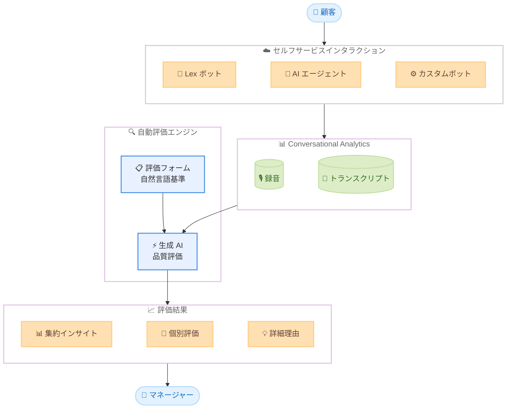

# Amazon Connect Customer - 生成 AI によるセルフサービスインタラクションの自動評価

**リリース日**: 2026 年 5 月 27 日
**サービス**: Amazon Connect Customer
**機能**: 生成 AI を活用したセルフサービスインタラクションの自動評価と集約インサイト

📊 [このアップデートのインフォグラフィックを見る](https://takech9203.github.io/aws-news-summary/20260527-amazon-connect-customer-gen-AI-evaluations-self-service.html)

## 概要

Amazon Connect Customer に、生成 AI を活用してセルフサービスインタラクションを自動的に評価し、集約されたインサイトを提供する機能が追加された。マネージャーは評価フォーム内で自然言語によるカスタム評価基準を定義でき (例: 「AI エージェントは顧客の問題をすべて解決したか?」)、生成 AI がセルフサービスインタラクションの品質を自動的に評価する。

この機能は、タッチトーン、Lex ボット、Connect Customer AI エージェント、カスタムボットなど、あらゆる種類のセルフサービスインタラクションを評価対象とする。評価結果には詳細な理由と会話トランスクリプトからの関連する参照ポイントが含まれ、マネージャーは集約レビューと個別コンタクトレビューの両方で品質改善の機会を特定できる。

**アップデート前の課題**

- セルフサービスインタラクション (AI エージェントやボットによる対応) の品質評価を手動で行う必要があり、大量のインタラクションに対応しきれなかった
- AI エージェントのパフォーマンスを体系的に評価する仕組みがなく、改善ポイントの特定が困難だった
- セルフサービスの品質に問題がある場合、顧客からのエスカレーションや満足度低下が発生するまで検知できなかった

**アップデート後の改善**

- 生成 AI が自然言語で定義された基準に基づき、セルフサービスインタラクションを自動評価するため、大規模な品質管理が可能になった
- 評価結果に詳細な理由とトランスクリプトの参照ポイントが付与され、具体的な改善アクションを特定しやすくなった
- 集約インサイトにより、AI エージェント全体のパフォーマンス傾向を把握し、プロアクティブな改善が実現された

## アーキテクチャ図



顧客がセルフサービスインタラクション (Lex ボット、AI エージェント、カスタムボット) を利用すると、Conversational Analytics が録音とトランスクリプトを生成し、生成 AI が評価フォームの自然言語基準に基づいて品質を自動評価する。マネージャーは集約インサイトと個別評価の両方から改善機会を特定できる。

## サービスアップデートの詳細

### 主要機能

1. **自然言語によるカスタム評価基準**
   - 評価フォーム内で自然言語を使用して評価基準を定義可能
   - 例: 「AI エージェントは顧客の問題をすべて解決したか?」「顧客に繰り返しを求めなかったか?」
   - `@` キーワードでシステム、AI エージェント、ボットを参照可能 (相互に置換可能)
   - 質問の指示文と回答オプションも生成 AI が解釈に使用

2. **生成 AI による自動品質評価**
   - 生成 AI がトランスクリプトを分析し、定義された基準に基づいてインタラクション品質を評価
   - 単一選択、複数選択、数値型の質問に対応
   - 評価フォームの「Option 3: Generative AI」として設定
   - 人間によるレビューを含む AI アシスト評価モードも利用可能

3. **詳細な理由と参照ポイントの提供**
   - 各評価に対して生成 AI が詳細な理由を記述
   - 会話トランスクリプトから関連する箇所を参照ポイントとして提示
   - 評価根拠の透明性が確保される

4. **集約インサイトと個別コンタクトレビュー**
   - 複数のセルフサービスインタラクションにわたるパフォーマンス傾向を集約表示
   - 個別コンタクトの録音・トランスクリプトと評価を並べて確認可能
   - AI エージェントの改善機会を体系的に特定

5. **ルールベースの自動評価トリガー**
   - AI エージェントの識別、カスタムコンタクト属性、セグメント属性を条件に自動評価を実行
   - 特定の AI エージェントバージョンに対する評価も設定可能
   - 評価フォームの自動送信ルールを設定し、完全自動化を実現

## 技術仕様

### 自動化オプション

| オプション | 説明 | 適用場面 |
|------|------|------|
| Generative AI | 生成 AI がトランスクリプトを分析して回答 | 複雑な品質判断、自然言語での基準定義 |
| Contact categories (ルール) | セマンティックマッチやコンタクト属性で判定 | 定型的な条件判断、エスカレーション検知 |
| Contact metrics | 顧客センチメントスコアなどの数値指標 | 定量的な品質測定 |

### 評価フォーム構成例

| セクション | 評価項目 | 質問タイプ |
|------|------|------|
| セルフサービス成功 | 人間エージェントへの転送なしで処理されたか | 単一選択 |
| セルフサービス成功 | 顧客の要求を少なくとも 1 つ解決できたか | 単一選択 |
| 顧客体験 | セルフサービス中の顧客センチメントスコア | 数値 |
| 顧客体験 | 顧客がフラストレーションを表明したか | 単一選択 |
| AI エージェント動作 | 顧客に繰り返しを求めたか | 単一選択 |
| AI エージェント動作 | AI エージェントが失礼または攻撃的だったか | 単一選択 |

### セマンティックマッチキーワード

| キーワード | 意味 |
|------|------|
| System | ボットまたは AI エージェント |
| Agent | 人間のエージェント |
| Customer | コンタクトセンターとやり取りする顧客 |
| Automated interaction | 人間エージェントが会話に参加していないインタラクション部分 |
| Human agent interaction | 人間エージェントとの顧客インタラクション |

## 設定方法

### 前提条件

1. Amazon Connect インスタンスが設定済みであること
2. Connect Customer (with unlimited AI) プランが有効であること
3. Conversational Analytics が有効化されていること (自動化インタラクションを含む)

### 手順

#### ステップ 1: 評価フォームの作成

Amazon Connect 管理コンソールで評価フォームを新規作成する。追加設定で「Contact interaction type」を「Automated interaction」に設定する。セクションと質問を追加し、セルフサービスの品質を測定する基準を自然言語で記述する。

#### ステップ 2: 自動化の設定

各質問に対して自動化オプションを選択する。生成 AI を使用する場合は「Option 3: Generative AI」を選択し、質問テキストと指示文、回答オプションを設定する。生成 AI はこれらのテキストとトランスクリプトを分析して評価を実行する。

#### ステップ 3: 自動送信ルールの設定

「Analytics and optimization」から「Rules」を選択し、新規ルールを作成する。「Conversational analytics」を選び、条件として AI エージェントの識別やカスタムコンタクト属性を設定する。アクションとして「Submit automated evaluation」を選択し、作成した評価フォームを指定する。

## メリット

### ビジネス面

- **大規模な品質管理の実現**: 従来は手動レビューが必要だったセルフサービスインタラクションを自動評価することで、全件評価が可能になる
- **AI エージェントの継続的改善**: 集約インサイトにより、AI エージェントの弱点パターンを体系的に発見し、トレーニングデータやプロンプトの改善につなげられる
- **顧客体験の向上**: 品質問題を早期に検知し、顧客からの苦情やエスカレーションが発生する前にプロアクティブに対処できる

### 技術面

- **自然言語による柔軟な基準定義**: プログラミング不要で、ビジネスユーザーが直接評価基準を定義・変更できる
- **マルチモーダルな自動化**: 生成 AI、ルールベース、メトリクスベースの 3 つの自動化方式を組み合わせて包括的な評価が可能
- **AI アシスト評価モード**: 完全自動化の前に、人間がレビューする半自動モードでテスト・最適化できる

## デメリット・制約事項

### 制限事項

- Connect Customer (with unlimited AI) プランが必要であり、標準プランでは利用できない
- Conversational Analytics の有効化が前提条件であり、録音とトランスクリプトが生成されていないインタラクションは評価対象外
- 生成 AI の評価精度は質問の記述方法に依存するため、適切な基準定義にはイテレーションが必要

### 考慮すべき点

- 自動評価の結果を運用に組み込む前に、AI アシスト評価モードで精度を検証することを推奨
- 評価基準の変更が既存の評価結果に影響を与えないよう、バージョン管理を意識した運用が必要
- セマンティックマッチのキーワード (System、Agent、Customer 等) は現時点で英語のみサポート

## ユースケース

### ユースケース 1: AI エージェントの品質モニタリング

**シナリオ**: EC サイトのカスタマーサポートで、AI エージェントが注文状況の問い合わせ、返品手続き、商品情報の提供を担当している。1 日数千件のインタラクションが発生し、手動レビューが追いつかない。

**実装例**:
```
評価フォーム:
- セクション 1: 解決力
  Q1: "AI エージェントは顧客の問い合わせを完全に解決したか?" (生成 AI)
  Q2: "顧客が人間エージェントへの転送を要求したか?" (ルール)
- セクション 2: コミュニケーション品質
  Q3: "AI エージェントは正確な情報を提供したか?" (生成 AI)
  Q4: "顧客センチメントスコア" (メトリクス)
```

**効果**: 全件自動評価により、AI エージェントの解決率低下や情報の不正確さを即座に検知し、プロンプトやナレッジベースの改善に反映できる。

### ユースケース 2: ボットのエスカレーション分析

**シナリオ**: 銀行のコールセンターで、Lex ボットが残高照会やカード紛届出の初期対応を担当している。エスカレーション率が高い特定のインテントを特定し、ボットの応答を改善したい。

**実装例**:
```
評価フォーム:
- セクション 1: 理解力
  Q1: "ボットは顧客の意図を正しく理解したか?" (生成 AI)
  Q2: "顧客に繰り返しを求めた回数" (ルール - セマンティックマッチ)
- セクション 2: エスカレーション
  Q3: "エスカレーションは適切なタイミングで行われたか?" (生成 AI)

ルール条件: AI Agent Escalation = "Escalated to human"
```

**効果**: エスカレーションの根本原因を体系的に分析し、ボットの自然言語理解の改善やフローの最適化につなげられる。

### ユースケース 3: マルチチャネルセルフサービスの品質統一

**シナリオ**: 通信事業者がチャットボットと音声 IVR の両方でセルフサービスを提供している。チャネル間で品質のばらつきがあり、統一的な評価基準で管理したい。

**実装例**:
```
評価フォーム:
- セクション 1: チャネル共通品質
  Q1: "顧客の要求は 1 回のインタラクションで解決されたか?" (生成 AI)
  Q2: "応答は正確かつ最新の情報に基づいているか?" (生成 AI)
- セクション 2: 顧客満足度
  Q3: "顧客センチメントスコア" (メトリクス)

ルール: post-call analysis / post-chat analysis の両方で実行
```

**効果**: チャネルを横断した統一基準による品質評価が実現し、品質の低いチャネルへの優先的な改善投資が可能になる。

## 料金

この機能は Amazon Connect Customer (with unlimited AI) プランに含まれる。パフォーマンス評価機能と Conversational Analytics は追加料金なしで利用可能。Connect Customer の基本料金はチャネルごとの従量課金制。

### 料金例

| チャネル | 単価 |
|--------|------------------|
| 音声 | $0.038 / 分 (テレフォニー別途) |
| チャット | $0.010 / メッセージ |
| メール | $0.080 / メール |
| SMS / サードパーティメッセージング | $0.014 / メッセージ |

※ リージョンや通信タイプにより料金が異なる場合がある。詳細は [Connect Customer 料金ページ](https://aws.amazon.com/products/connect/customer/pricing/) を参照。

## 利用可能リージョン

以下の AWS リージョンで利用可能。

- 米国東部 (バージニア北部)
- 米国西部 (オレゴン)
- アジアパシフィック (ソウル)
- アジアパシフィック (シンガポール)
- アジアパシフィック (シドニー)
- アジアパシフィック (東京)
- 欧州 (フランクフルト)

## 関連サービス・機能

- **Amazon Connect Conversational Analytics**: セルフサービスインタラクションの録音・トランスクリプト生成を担い、自動評価の入力データを提供する
- **Amazon Connect 評価フォーム**: 評価基準を定義するフレームワーク。今回のアップデートで生成 AI による自動化オプションが追加された
- **Amazon Connect Rules**: コンタクト属性やセマンティックマッチに基づくルールエンジン。自動評価のトリガーや条件判定に使用される
- **Amazon Connect AI Agent**: Connect Customer のセルフサービス AI エージェント。今回の機能により、そのパフォーマンスを体系的に評価・改善できる

## 参考リンク

- 📊 [インフォグラフィック](https://takech9203.github.io/aws-news-summary/20260527-amazon-connect-customer-gen-AI-evaluations-self-service.html)
- [公式発表 (What's New)](https://aws.amazon.com/about-aws/whats-new/2026/05/amazon-connect-customer-gen-AI-evaluations-self-service)
- [ドキュメント - セルフサービスインタラクションの自動評価](https://docs.aws.amazon.com/connect/latest/adminguide/performance-evaluations-automated-interactions.html)
- [Amazon Connect Conversational Analytics](https://aws.amazon.com/products/connect/customer/conversational-analytics/)
- [Connect Customer 料金ページ](https://aws.amazon.com/products/connect/customer/pricing/)

## まとめ

Amazon Connect Customer に生成 AI を活用したセルフサービスインタラクションの自動評価機能が追加されたことで、AI エージェントやボットのパフォーマンスを大規模かつ体系的に管理できるようになった。自然言語で評価基準を定義できる手軽さと、詳細な理由・参照ポイントを伴う透明性の高い評価が特徴である。セルフサービスの品質向上に取り組む組織は、まず AI アシスト評価モードでテストを行い、精度を確認した上で自動評価ルールの設定に進むことを推奨する。
