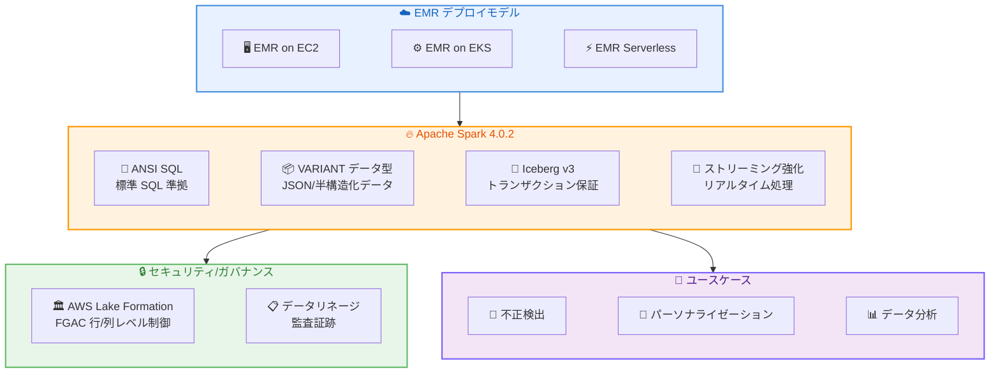

# Amazon EMR - Apache Spark 4.0.2 一般提供開始

**リリース日**: 2026 年 05 月 27 日
**サービス**: Amazon EMR
**機能**: Apache Spark 4.0.2 サポート (GA)

📊 [このアップデートのインフォグラフィックを見る](https://takech9203.github.io/aws-news-summary/20260527-amazon-emr-apache-spark.html)

## 概要

Amazon EMR が Apache Spark 4.0.2 の一般提供 (GA) を開始しました。EMR on EC2、EMR on EKS、EMR Serverless の 3 つすべてのデプロイモデルで利用可能です。このリリースにより、ANSI SQL 準拠、VARIANT データ型、Apache Iceberg v3 テーブルフォーマット、強化されたストリーミング機能など、Apache Spark の最新機能を AWS 上で活用できるようになります。

Apache Spark 4.0.2 は、データエンジニアリングをより幅広いユーザーに開放する標準 SQL サポート、JSON や半構造化データをネイティブに扱える VARIANT データ型、そして AWS Lake Formation との統合による行レベル・列レベルのきめ細かなアクセス制御 (FGAC) を提供します。また、Apache Iceberg v3 テーブルフォーマットにより、規制コンプライアンスに必要なトランザクション保証やデータリネージ追跡が強化されています。

既存の EMR アプリケーションからのアップグレードを支援する Spark アップグレードエージェントも提供されており、既存ワークロードの移行を加速できます。この機能は、Amazon EMR が利用可能なすべてのリージョンで提供されています。

**アップデート前の課題**

以前の Apache Spark バージョンでは、以下の制限がありました。

- Spark 固有の構文や API を理解する必要があり、SQL に精通したアナリストがデータエンジニアリングに参加しにくい状況でした
- JSON や半構造化データの処理には複雑なスキーマ定義やパース処理が必要で、柔軟性に欠けていました
- Lake Formation テーブルに対する行レベル・列レベルのアクセス制御が限定的で、セキュリティ要件の厳しい環境での利用が困難でした
- 旧バージョンの Iceberg テーブルフォーマットではトランザクション保証やデータリネージ機能が限定的でした

**アップデート後の改善**

今回のアップデートにより、以下の機能が利用可能になりました。

- ANSI SQL 準拠により、標準 SQL の知識だけでデータエンジニアリングタスクを実行でき、より多くのユーザーがデータ処理に参加可能になりました
- VARIANT データ型によりスキーマレスな JSON や半構造化データをネイティブに処理でき、ETL パイプラインの簡素化が実現しました
- AWS Lake Formation 登録テーブルに対する読み取り・書き込み両方の操作で行レベル・列レベルのきめ細かなアクセス制御が適用可能になりました
- Apache Iceberg v3 テーブルフォーマットにより、強力なトランザクション保証、データリネージ追跡、監査証跡が利用可能になりました

## アーキテクチャ図



この図は、Amazon EMR の 3 つのデプロイモデルで Apache Spark 4.0.2 の主要機能がどのように提供され、セキュリティ/ガバナンス機能とユースケースに接続されるかを示しています。

## サービスアップデートの詳細

### 主要機能

1. **ANSI SQL サポート**
   - 標準 SQL 準拠により、Spark 固有の構文を学習する必要がなくなりました
   - SQL に精通したアナリストやビジネスユーザーがデータエンジニアリングに直接参加可能
   - 既存の SQL スキルセットを活用した迅速なデータ処理ワークフローの構築が可能

2. **VARIANT データ型**
   - JSON や半構造化データをネイティブに処理するための新しいデータ型
   - 事前のスキーマ定義なしで柔軟なデータ処理が可能
   - 多様なデータフォーマットに対応し、ETL パイプラインの簡素化を実現

3. **きめ細かなアクセス制御 (FGAC)**
   - AWS Lake Formation 登録テーブルに対する行レベル・列レベルのアクセス制御
   - 読み取りおよび書き込み操作の両方で適用可能
   - セキュリティ要件の厳しいエンタープライズ環境での利用を支援

4. **Apache Iceberg v3 テーブルフォーマット**
   - 強力なトランザクション保証により、データの整合性を確保
   - データリネージ追跡により、データの出自と変換履歴を完全に記録
   - 規制コンプライアンスに必要な監査証跡を提供

5. **強化されたストリーミング機能**
   - 複雑なステートフル操作の管理が簡素化
   - 改善されたモニタリング機能
   - 不正検出やパーソナライゼーションなどリアルタイムアプリケーションの迅速なデプロイが可能

6. **Spark アップグレードエージェント**
   - 既存の EMR アプリケーションから Spark 4.0.2 へのアップグレードを支援
   - コード互換性の確認と移行手順の自動化

## 技術仕様

### デプロイモデル対応

| デプロイモデル | サポート状況 | 特徴 |
|--------------|------------|------|
| EMR on EC2 | GA | カスタマイズ性が高く、既存クラスタワークロードに最適 |
| EMR on EKS | GA | Kubernetes 環境との統合、マルチテナント対応 |
| EMR Serverless | GA | インフラ管理不要、オンデマンドスケーリング |

### Apache Spark 4.0.2 主要技術要素

| 機能 | 説明 |
|------|------|
| ANSI SQL | 標準 SQL 準拠のクエリ実行 |
| VARIANT 型 | JSON/半構造化データのネイティブサポート |
| Iceberg v3 | ACID トランザクション、データリネージ、監査証跡 |
| FGAC | Lake Formation 連携の行/列レベルアクセス制御 |
| ストリーミング | ステートフル操作の簡素化とモニタリング強化 |

### API 変更履歴

| 日付 | サービス | 変更内容 |
|------|----------|----------|
| 2026/05/27 | Amazon EMR | Apache Spark 4.0.2 の一般提供開始、3 つのデプロイモデルすべてで利用可能 |

## 設定方法

### 前提条件

1. AWS アカウントが有効であること
2. AWS CLI がインストールされ、適切な IAM 権限が設定されていること
3. Amazon EMR の利用に必要な IAM ロールとポリシーが設定されていること

### 手順

#### ステップ 1: EMR Serverless で Spark 4.0.2 アプリケーションを作成

```bash
# EMR Serverless で Spark 4.0.2 アプリケーションを作成
aws emr-serverless create-application \
    --name "spark-4-application" \
    --release-label "emr-7.8.0" \
    --type "SPARK"
```

このコマンドは、Spark 4.0.2 を含む EMR リリースを使用して、新しい EMR Serverless アプリケーションを作成します。アプリケーションが作成されると、Spark 4.0.2 の全機能を利用できます。

#### ステップ 2: VARIANT データ型を使用した Spark SQL クエリの実行

```sql
-- VARIANT データ型を使用した JSON データの処理
CREATE TABLE events (
    event_id BIGINT,
    event_data VARIANT
);

-- JSON データの挿入
INSERT INTO events VALUES
    (1, PARSE_JSON('{"user": "alice", "action": "login", "metadata": {"ip": "192.168.1.1"}}')),
    (2, PARSE_JSON('{"user": "bob", "action": "purchase", "amount": 99.99}'));

-- VARIANT 型のフィールドにアクセス
SELECT
    event_id,
    event_data:user::STRING AS user_name,
    event_data:action::STRING AS action
FROM events;
```

VARIANT データ型により、スキーマレスな JSON データをネイティブに格納・クエリできます。事前にスキーマを定義する必要がなく、柔軟なデータ処理が可能です。

#### ステップ 3: Apache Iceberg v3 テーブルの作成

```sql
-- Iceberg v3 テーブルの作成
CREATE TABLE catalog.db.transactions (
    transaction_id BIGINT,
    customer_id BIGINT,
    amount DECIMAL(10, 2),
    transaction_time TIMESTAMP,
    status STRING
)
USING iceberg
TBLPROPERTIES (
    'format-version' = '3',
    'write.data-lineage.enabled' = 'true'
);
```

Iceberg v3 フォーマットを指定してテーブルを作成します。バージョン 3 では、強力なトランザクション保証とデータリネージ追跡が利用可能になります。

#### ステップ 4: 既存アプリケーションのアップグレード

```bash
# Spark アップグレードエージェントを使用して互換性を確認
aws emr spark-upgrade-agent analyze \
    --application-path "s3://my-bucket/spark-apps/" \
    --source-version "3.5" \
    --target-version "4.0.2"
```

Spark アップグレードエージェントを使用すると、既存のアプリケーションコードの互換性を分析し、必要な変更を特定できます。これにより、移行作業を大幅に効率化できます。

## メリット

### ビジネス面

- **データ民主化の促進**: ANSI SQL サポートにより、SQL スキルを持つ幅広いビジネスユーザーがデータ処理に参加でき、データエンジニアへの依存を軽減します
- **コンプライアンス要件への対応**: Iceberg v3 のデータリネージと FGAC による行/列レベルのアクセス制御により、規制要件の厳しい業界でも安心して利用できます
- **リアルタイムビジネスインサイト**: 強化されたストリーミング機能により、不正検出やパーソナライゼーションなどのリアルタイムアプリケーションを迅速に構築・デプロイできます

### 技術面

- **開発効率の向上**: VARIANT データ型により、スキーマ定義やデータパース処理のコードが不要になり、ETL パイプラインの開発工数を大幅に削減できます
- **データ整合性の強化**: Iceberg v3 の ACID トランザクション保証により、並行処理環境でもデータの整合性が確保されます
- **移行コストの最小化**: Spark アップグレードエージェントにより、既存アプリケーションの互換性分析と移行計画の策定が自動化されます

## デメリット・制約事項

### 制限事項

- Spark 3.x から 4.0.2 へのアップグレードでは、一部の非推奨 API が削除されているため、既存コードの修正が必要になる場合があります
- ANSI SQL モードでは、以前の Spark SQL で許容されていた暗黙的な型変換が厳格化されており、一部のクエリで動作が変わる可能性があります
- VARIANT データ型は新しいデータ型であるため、既存のデータ処理ツールやライブラリとの互換性を事前に確認する必要があります

### 考慮すべき点

- 本番環境へのアップグレード前に、Spark アップグレードエージェントを使用した互換性テストの実施を推奨します
- ANSI SQL モードの厳格な型チェックにより、既存のクエリが予期しないエラーを返す場合があるため、テスト環境での検証が重要です
- Iceberg v3 への移行には、テーブルの再作成またはフォーマットのアップグレード手順が必要です

## ユースケース

### ユースケース 1: リアルタイム不正検出システム

**シナリオ**: 金融サービス企業が、クレジットカード取引のリアルタイム不正検出システムを構築する必要があります。取引データは JSON 形式で流入し、複雑なルールベースとマシンラーニングモデルを組み合わせて不正を検知します。

**実装例**:
```sql
-- ストリーミングデータの処理とリアルタイム不正検出
CREATE TABLE fraud_alerts
USING iceberg
TBLPROPERTIES ('format-version' = '3')
AS
SELECT
    transaction_data:transaction_id::STRING AS txn_id,
    transaction_data:amount::DECIMAL(10,2) AS amount,
    transaction_data:merchant::STRING AS merchant,
    CASE
        WHEN transaction_data:amount::DECIMAL(10,2) > 10000 THEN 'HIGH_RISK'
        WHEN transaction_data:country::STRING != customer_profile.home_country THEN 'MEDIUM_RISK'
        ELSE 'LOW_RISK'
    END AS risk_level
FROM streaming_transactions
JOIN customer_profile ON transaction_data:customer_id::STRING = customer_profile.id;
```

**効果**: VARIANT データ型で JSON 取引データを直接処理し、Iceberg v3 の ACID トランザクションで結果を確実に保存。ストリーミング強化機能により、サブ秒のレイテンシで不正検出アラートを生成できます。

### ユースケース 2: マルチテナント分析プラットフォーム

**シナリオ**: SaaS 企業が、複数のテナント (顧客企業) のデータを同一のデータレイク上で処理する分析プラットフォームを運用しています。各テナントが自社データのみにアクセスできるよう、厳格なアクセス制御が必要です。

**実装例**:
```sql
-- Lake Formation FGAC による行レベルのアクセス制御
-- テナントごとに自社データのみアクセス可能
SELECT
    customer_id,
    order_date,
    total_amount
FROM catalog.analytics.orders
WHERE tenant_id = current_user_tenant();
-- Lake Formation のポリシーにより、他テナントの行は自動的にフィルタリング
```

**効果**: Lake Formation の FGAC により、コードレベルでのフィルタリングロジックを実装する必要がなくなり、セキュリティポリシーの一元管理と確実な適用が実現します。ANSI SQL 準拠により、テナントの SQL アナリストが直接クエリを実行できます。

### ユースケース 3: データリネージを伴う規制対応データパイプライン

**シナリオ**: 医療機関が、患者データの処理パイプラインを運用しています。HIPAA や GDPR などの規制により、データの出自、変換履歴、アクセス記録の完全な追跡が求められています。

**実装例**:
```sql
-- Iceberg v3 のデータリネージ追跡を有効化したテーブル
CREATE TABLE catalog.healthcare.patient_records (
    patient_id STRING,
    diagnosis_code STRING,
    treatment_plan STRING,
    last_updated TIMESTAMP
)
USING iceberg
TBLPROPERTIES (
    'format-version' = '3',
    'write.data-lineage.enabled' = 'true',
    'write.audit-trail.enabled' = 'true'
);

-- データ変換時にリネージ情報が自動的に記録される
INSERT INTO catalog.healthcare.patient_records
SELECT
    anonymize(raw_patient_id) AS patient_id,
    diagnosis_code,
    treatment_plan,
    current_timestamp() AS last_updated
FROM raw_medical_records;
```

**効果**: Iceberg v3 のデータリネージ機能により、各データレコードの変換履歴が自動的に記録され、規制当局の監査要求に迅速に対応できます。FGAC との組み合わせにより、データアクセスの完全な制御と追跡が実現します。

## 料金

Amazon EMR の Apache Spark 4.0.2 サポート自体に追加料金はかかりません。通常の Amazon EMR の料金体系が適用されます。

料金はデプロイモデルによって異なります。

### 料金例

| デプロイモデル | 料金体系 |
|--------------|----------|
| EMR on EC2 | EC2 インスタンス料金 + EMR 料金 (インスタンス時間あたり) |
| EMR on EKS | EKS クラスタ料金 + EMR 料金 (vCPU/メモリ時間あたり) |
| EMR Serverless | vCPU 時間 + メモリ時間 + ストレージ時間による従量課金 |

具体的な料金は使用するリージョンやインスタンスタイプによって異なります。詳細は [Amazon EMR 料金ページ](https://aws.amazon.com/emr/pricing/) をご確認ください。

## 利用可能リージョン

Apache Spark 4.0.2 は、Amazon EMR が利用可能なすべての AWS リージョンで提供されています。

主要なリージョンを含む全リージョンで利用可能です。利用可能なリージョンの最新リストは、[AWS リージョンテーブル](https://aws.amazon.com/about-aws/global-infrastructure/regional-product-services/) をご確認ください。

## 関連サービス・機能

- **AWS Lake Formation**: EMR Spark 4.0.2 と連携し、行/列レベルのきめ細かなアクセス制御を提供。データガバナンスの中核サービス
- **Apache Iceberg**: Spark 4.0.2 で v3 フォーマットをサポート。ACID トランザクション、データリネージ、タイムトラベルなどの高度なテーブル管理機能を提供
- **Amazon Kinesis Data Streams**: Spark Structured Streaming と連携し、リアルタイムデータ取り込みとストリーミング処理を実現
- **AWS Glue Data Catalog**: Iceberg テーブルのメタデータ管理と EMR Spark からのテーブル検出に使用

## 参考リンク

- 📊 [インフォグラフィック](https://takech9203.github.io/aws-news-summary/20260527-amazon-emr-apache-spark.html)
- [公式発表 (What's New)](https://aws.amazon.com/about-aws/whats-new/2026/05/amazon-emr-apache-spark/)
- [Amazon EMR ドキュメント](https://docs.aws.amazon.com/emr/)
- [Amazon EMR リリースノート](https://docs.aws.amazon.com/emr/latest/ReleaseGuide/)
- [Apache Spark 4.0 リリースノート](https://spark.apache.org/releases/spark-release-4-0-0.html)
- [Amazon EMR 料金ページ](https://aws.amazon.com/emr/pricing/)

## まとめ

Amazon EMR での Apache Spark 4.0.2 一般提供開始により、ANSI SQL サポート、VARIANT データ型、Iceberg v3、FGAC など、データ処理の生産性とガバナンスを大幅に強化する機能群が利用可能になりました。3 つすべてのデプロイモデルで利用でき、Spark アップグレードエージェントによる移行支援も提供されているため、既存の EMR ユーザーは段階的にアップグレードを計画し、新機能の恩恵を受けることを推奨します。
