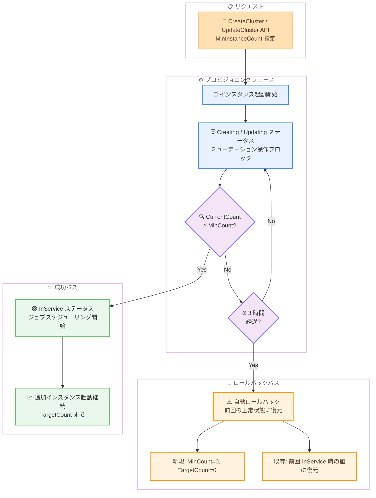

# Amazon SageMaker HyperPod - Slurm クラスター向け MinCount による最小キャパシティ要件

**リリース日**: 2026 年 5 月 27 日
**サービス**: Amazon SageMaker HyperPod
**機能**: Minimum Capacity Requirements (MinCount) with Continuous Provisioning

📊 [このアップデートのインフォグラフィックを見る](https://takech9203.github.io/aws-news-summary/20260527-amazon-sagemaker-hyperpod-mincount.html)

## 概要

Amazon SageMaker HyperPod の Slurm オーケストレーション環境において、継続的プロビジョニング (Continuous Provisioning) と組み合わせて使用できる最小キャパシティ要件 (MinCount) 機能がリリースされました。この機能により、インスタンスグループが InService ステータスに遷移する前に、最低限プロビジョニングされるべきインスタンス数を指定できるようになります。

継続的プロビジョニングは 2026 年 3 月にリリースされた機能で、利用可能な部分的キャパシティでクラスターをプロビジョニングし、ジョブを迅速に開始できるようにするものです。MinCount はこの動作に下限値を追加し、クラスターが「準備完了」と見なされる前に保証される最小ノード数を確保します。

この機能は、PyTorch FSDP、Megatron-LM、NVIDIA NeMo などの分散トレーニングフレームワークを使用するワークロードや、SLA またはコスト効率の目標を満たすためにベースラインの GPU 数を保証する必要があるチームに特に有用です。

**アップデート前の課題**

- 継続的プロビジョニングでは、1 台でもインスタンスが起動すればクラスターが InService に遷移するため、分散トレーニングに必要な最小ノード数が揃う前にジョブスケジューリングが開始される可能性があった
- 固定ノード数が必要な分散トレーニングワークロードでは、部分的なキャパシティでは正しく動作しない場合があった
- SLA やコスト効率の目標を満たすために必要な最小 GPU 数を保証する仕組みがなかった
- クラスターのプロビジョニングが不完全な状態で InService になった場合、手動での確認と制御が必要だった

**アップデート後の改善**

- `MinInstanceCount` パラメータを指定することで、最小限のインスタンス数が確保されるまでインスタンスグループが InService に遷移しないよう制御可能になった
- 分散トレーニングに必要な固定ノード数が揃ってからジョブスケジューリングが開始されるようになった
- 3 時間以内に MinCount を満たせない場合は自動ロールバックにより、無期限の待機状態を防止できるようになった
- MinCount 達成後も TargetCount まで追加インスタンスの起動が継続され、段階的なスケールアップが可能になった

## アーキテクチャ図



MinCount プロビジョニングフローを示した図です。API リクエスト後、インスタンスグループは Creating/Updating ステータスで MinCount の閾値が満たされるのを待ちます。閾値達成で InService に遷移し、3 時間のタイムアウトで自動ロールバックが実行されます。

## サービスアップデートの詳細

### 主要機能

1. **最小キャパシティ要件 (MinCount)**
   - `MinInstanceCount` パラメータでインスタンスグループの最小プロビジョニング数を指定
   - 値は 0 から `InstanceCount` の間で設定可能
   - デフォルト値は 0 (標準の継続的プロビジョニング動作を維持)
   - Controller および Login インスタンスグループのデフォルトは 1

2. **ステータス管理とミューテーション制御**
   - MinCount 未達成時は Creating/Updating ステータスを維持
   - Creating/Updating 中は `BatchAddClusterNodes`、`BatchDeleteClusterNodes`、`UpdateClusterSoftware` がブロックされる
   - MinCount と TargetCount の変更は常に許可される
   - クラスターおよびインスタンスグループの削除は常に許可される

3. **自動ロールバック機構**
   - 3 時間以内に MinCount を満たせない場合、自動ロールバックを実行
   - 新規インスタンスグループ: MinCount と TargetCount を (0, 0) にリセット
   - 既存インスタンスグループ: 前回 InService 時の値に復元
   - ロールバック時のインスタンス終了順序: 異常なインスタンスが優先、次に最近プロビジョニングされたもの
   - ロールバック後は即座に InService に遷移

4. **イベント通知**
   - 最小キャパシティ達成時にイベントを発行
   - ロールバック開始時にイベントを発行
   - `ListClusterEvents` API で進捗を監視可能

## 技術仕様

### MinCount パラメータ仕様

| 項目 | 詳細 |
|------|------|
| パラメータ名 | `MinInstanceCount` |
| 対象 API | `CreateCluster`、`UpdateCluster` |
| 有効範囲 | 0 ~ `InstanceCount` |
| デフォルト値 | 0 (Compute)、1 (Controller/Login) |
| 前提条件 | `NodeProvisioningMode` が `Continuous` に設定されていること |
| タイムアウト | 3 時間 |

### インスタンスグループステータス遷移

| ステータス | 条件 | 許可される操作 |
|-----------|------|----------------|
| Creating | 新規作成時、CurrentCount < MinCount | MinCount/TargetCount 変更、削除 |
| Updating | 更新時、CurrentCount < MinCount | MinCount/TargetCount 変更、削除 |
| InService | MinCount ≤ CurrentCount ≤ TargetCount | 全ての操作 |

### API 変更履歴

| 日付 | サービス | 変更内容 |
|------|----------|----------|
| 2026/05/27 | Amazon SageMaker | MinInstanceCount パラメータを CreateCluster および UpdateCluster API に追加 |

### API リクエスト例

```json
{
    "ClusterName": "my-training-cluster",
    "NodeProvisioningMode": "Continuous",
    "Orchestrator": {
        "Slurm": {}
    },
    "InstanceGroups": [
        {
            "InstanceGroupName": "controller-group",
            "InstanceType": "ml.m5.xlarge",
            "InstanceCount": 1,
            "LifeCycleConfig": {
                "SourceS3Uri": "s3://my-bucket/lifecycle-scripts/",
                "OnCreate": "on_create.sh"
            },
            "ExecutionRole": "arn:aws:iam::111122223333:role/my-role",
            "SlurmConfig": {
                "NodeType": "Controller"
            }
        },
        {
            "InstanceGroupName": "worker-gpu",
            "InstanceType": "ml.p5.48xlarge",
            "MinInstanceCount": 8,
            "InstanceCount": 16,
            "LifeCycleConfig": {
                "SourceS3Uri": "s3://my-bucket/lifecycle-scripts/",
                "OnCreate": "on_create.sh"
            },
            "ExecutionRole": "arn:aws:iam::111122223333:role/my-role",
            "SlurmConfig": {
                "NodeType": "Compute",
                "PartitionNames": ["gpu-training"]
            }
        }
    ],
    "VpcConfig": {
        "SecurityGroupIds": ["sg-12345678"],
        "Subnets": ["subnet-12345678"]
    }
}
```

## 設定方法

### 前提条件

1. SageMaker HyperPod クラスターが Slurm オーケストレーションで構成されていること
2. `NodeProvisioningMode` が `Continuous` に設定されていること
3. Slurm プロビジョニングパラメータが API ペイロードの `SlurmConfig` フィールドで提供されていること (レガシーの `provisioning_parameters.json` は非対応)
4. 適切な IAM 実行ロールが設定されていること

### 手順

#### ステップ 1: クラスター作成リクエストの準備

```json
{
    "ClusterName": "distributed-training-cluster",
    "NodeProvisioningMode": "Continuous",
    "Orchestrator": {
        "Slurm": {}
    },
    "InstanceGroups": [
        {
            "InstanceGroupName": "controller",
            "InstanceType": "ml.c5.xlarge",
            "InstanceCount": 1,
            "SlurmConfig": {"NodeType": "Controller"},
            "LifeCycleConfig": {
                "SourceS3Uri": "s3://my-bucket/scripts/",
                "OnCreate": "on_create.sh"
            },
            "ExecutionRole": "arn:aws:iam::111122223333:role/my-role",
            "ThreadsPerCore": 2
        },
        {
            "InstanceGroupName": "gpu-workers",
            "InstanceType": "ml.p5.48xlarge",
            "MinInstanceCount": 8,
            "InstanceCount": 16,
            "SlurmConfig": {
                "NodeType": "Compute",
                "PartitionNames": ["training"]
            },
            "LifeCycleConfig": {
                "SourceS3Uri": "s3://my-bucket/scripts/",
                "OnCreate": "on_create.sh"
            },
            "ExecutionRole": "arn:aws:iam::111122223333:role/my-role",
            "ThreadsPerCore": 1
        }
    ],
    "VpcConfig": {
        "SecurityGroupIds": ["sg-12345678"],
        "Subnets": ["subnet-12345678"]
    }
}
```

`MinInstanceCount` を 8、`InstanceCount` を 16 に設定することで、最低 8 台が起動した時点で InService に遷移し、残りの 8 台は非同期で追加されます。

#### ステップ 2: クラスターの作成

```bash
aws sagemaker create-cluster \
    --cli-input-json file://create_cluster.json
```

CreateCluster API を実行してクラスターを作成します。レスポンスとしてクラスター ARN が返されます。

#### ステップ 3: プロビジョニング進捗の監視

```bash
aws sagemaker describe-cluster \
    --cluster-name distributed-training-cluster

aws sagemaker list-cluster-events \
    --cluster-name distributed-training-cluster
```

`describe-cluster` でインスタンスグループのステータスと現在のインスタンス数を確認し、`list-cluster-events` で MinCount 達成やロールバックのイベントを監視します。

#### ステップ 4: 既存クラスターの MinCount 更新

```bash
aws sagemaker update-cluster \
    --cluster-name distributed-training-cluster \
    --instance-groups '[
        {
            "InstanceGroupName": "gpu-workers",
            "InstanceType": "ml.p5.48xlarge",
            "MinInstanceCount": 12,
            "InstanceCount": 16,
            "SlurmConfig": {
                "NodeType": "Compute",
                "PartitionNames": ["training"]
            },
            "LifeCycleConfig": {
                "SourceS3Uri": "s3://my-bucket/scripts/",
                "OnCreate": "on_create.sh"
            },
            "ExecutionRole": "arn:aws:iam::111122223333:role/my-role"
        }
    ]'
```

UpdateCluster API で既存インスタンスグループの MinCount を変更できます。タイムアウトは更新時点からリセットされます。

## メリット

### ビジネス面

- **SLA 保証の確保**: 最小 GPU 数を保証することで、分散トレーニングジョブの SLA を確実に満たせる
- **コスト効率の最適化**: 必要最小限のリソースが確保されてからジョブを開始することで、部分的キャパシティでの無駄な実行を防止
- **運用の自動化**: 3 時間タイムアウトと自動ロールバックにより、手動介入なしで異常状態から回復

### 技術面

- **分散トレーニングの信頼性向上**: PyTorch FSDP、Megatron-LM、NVIDIA NeMo などのフレームワークで必要な固定ノード数が保証される
- **段階的スケーリング**: MinCount 達成後も TargetCount まで非同期でインスタンスが追加され、柔軟なキャパシティ拡張が可能
- **イベント駆動型監視**: ListClusterEvents API でプロビジョニング進捗をリアルタイムに追跡可能
- **既存ワークフローとの互換性**: MinCount を 0 に設定すれば従来の継続的プロビジョニング動作を維持

## デメリット・制約事項

### 制限事項

- MinCount は継続的プロビジョニング (`NodeProvisioningMode: Continuous`) が有効なクラスターでのみ利用可能
- レガシーの `provisioning_parameters.json` を使用するクラスターでは継続的プロビジョニング自体が非対応
- MinCount は永続的な最小キャパシティ保証ではなく、InService 遷移時の閾値のみを保証する
- 通常運用中の異常インスタンス交換やメンテナンス時に MinCount を一時的に下回る可能性がある
- `SlurmConfigStrategy` パラメータは継続的プロビジョニングと併用不可
- マルチヘッドノード構成は継続的プロビジョニングでは非対応

### 考慮すべき点

- 3 時間のタイムアウトはリージョンのキャパシティ状況によっては不十分な場合があり、ロールバック後に再試行が必要になる可能性がある
- Creating/Updating 中はミューテーション操作がブロックされるため、大規模クラスターのプロビジョニング中は一部の管理操作が制限される
- MinCount を InstanceCount と同値に設定すると実質的に all-or-nothing 動作となり、継続的プロビジョニングのメリットが失われる
- タイムアウトは MinCount 更新のたびにリセットされるため、頻繁な変更は遅延を招く可能性がある

## ユースケース

### ユースケース 1: PyTorch FSDP による大規模言語モデルトレーニング

**シナリオ**: 70B パラメータの LLM を PyTorch FSDP で分散トレーニングする場合、モデルのシャーディングに固定数のノードが必要。16 ノードでトレーニングを計画しているが、最低 8 ノードあればトレーニング設定を調整して開始可能。

**実装例**:
```json
{
    "InstanceGroupName": "fsdp-workers",
    "InstanceType": "ml.p5.48xlarge",
    "MinInstanceCount": 8,
    "InstanceCount": 16,
    "SlurmConfig": {
        "NodeType": "Compute",
        "PartitionNames": ["fsdp-training"]
    }
}
```

**効果**: 8 ノードが確保された時点でトレーニングを開始でき、残りの 8 ノードは非同期で追加される。部分的キャパシティでの無効なジョブ開始を防止しつつ、利用可能なリソースを迅速に活用できる。

### ユースケース 2: NVIDIA NeMo による Megatron 並列トレーニング

**シナリオ**: テンソル並列度 8、パイプライン並列度 4 の設定で Megatron-LM トレーニングを実行する場合、最低 32 GPU (4 ノード x 8 GPU) が必要で、部分的なノードでは実行不可。

**実装例**:
```json
{
    "InstanceGroupName": "megatron-workers",
    "InstanceType": "ml.p5.48xlarge",
    "MinInstanceCount": 4,
    "InstanceCount": 4,
    "SlurmConfig": {
        "NodeType": "Compute",
        "PartitionNames": ["megatron"]
    }
}
```

**効果**: MinCount を InstanceCount と同値に設定することで、全ノードがプロビジョニングされるまで InService に遷移しない all-or-nothing 動作を実現。3 時間以内に全ノードが確保できない場合は自動ロールバックされる。

### ユースケース 3: SLA 保証付きマルチテナントトレーニング環境

**シナリオ**: 複数チームが共有する HyperPod クラスターで、各チームに最低限の GPU リソースを保証する必要がある。チーム A には最低 8 ノード、チーム B には最低 4 ノードを確保する。

**実装例**:
```json
{
    "InstanceGroups": [
        {
            "InstanceGroupName": "team-a-workers",
            "InstanceType": "ml.p5.48xlarge",
            "MinInstanceCount": 8,
            "InstanceCount": 12,
            "SlurmConfig": {
                "NodeType": "Compute",
                "PartitionNames": ["team-a"]
            }
        },
        {
            "InstanceGroupName": "team-b-workers",
            "InstanceType": "ml.p4d.24xlarge",
            "MinInstanceCount": 4,
            "InstanceCount": 8,
            "SlurmConfig": {
                "NodeType": "Compute",
                "PartitionNames": ["team-b"]
            }
        }
    ]
}
```

**効果**: 各チームのインスタンスグループが個別に MinCount を管理するため、一方のチームのキャパシティ不足がもう一方に影響しない。SLA の定量的保証が API レベルで実現できる。

## 料金

MinCount 機能自体には追加料金は発生しません。SageMaker HyperPod の標準料金体系が適用されます。

### 料金に関する考慮事項

| 項目 | 詳細 |
|------|------|
| インスタンス課金 | ライフサイクルスクリプトの実行開始時点から課金開始 |
| 起動失敗時 | インスタンス起動に失敗した場合は課金されない |
| ロールバック時 | 終了処理に入ったインスタンスはその時点で課金停止 |
| 課金粒度 | インスタンスレベルの個別メータリング |

## 利用可能リージョン

Amazon SageMaker HyperPod がサポートされている全ての AWS リージョンで利用可能です。

## 関連サービス・機能

- **Amazon SageMaker HyperPod Continuous Provisioning**: MinCount の前提機能。部分的キャパシティでクラスターを起動し、残りを非同期でプロビジョニングする
- **AWS Slurm オーケストレーション**: HyperPod のジョブスケジューリングエンジン。MinCount 達成後に Slurm ノードが登録される
- **Amazon EC2 キャパシティ**: MinCount のプロビジョニング成否はリージョンの EC2 キャパシティに依存する
- **Amazon CloudWatch**: ListClusterEvents と組み合わせて MinCount 関連イベントの監視とアラート設定が可能
- **PyTorch FSDP / Megatron-LM / NVIDIA NeMo**: MinCount の主要ユースケースとなる分散トレーニングフレームワーク

## 参考リンク

- 📊 [インフォグラフィック](https://takech9203.github.io/aws-news-summary/20260527-amazon-sagemaker-hyperpod-mincount.html)
- [公式発表 (What's New)](https://aws.amazon.com/about-aws/whats-new/2026/05/amazon-sagemaker-hyperpod-mincount/)
- [ドキュメント - Minimum capacity requirements (MinCount)](https://docs.aws.amazon.com/sagemaker/latest/dg/sagemaker-hyperpod-scaling-slurm.html#sagemaker-hyperpod-scaling-slurm-mincount)
- [ドキュメント - Continuous provisioning for Slurm clusters](https://docs.aws.amazon.com/sagemaker/latest/dg/sagemaker-hyperpod-scaling-slurm.html)

## まとめ

Amazon SageMaker HyperPod の MinCount 機能は、継続的プロビジョニングの柔軟性と分散トレーニングに必要な最小キャパシティ保証を両立させる重要なアップデートです。PyTorch FSDP や Megatron-LM などの固定ノード数を必要とするワークロードを運用しているチームは、`MinInstanceCount` パラメータを活用することで、部分的キャパシティでの無効なジョブ実行を防止しつつ、利用可能なリソースを迅速に活用できます。まず既存のトレーニングジョブの最小ノード要件を確認し、適切な MinCount 値を設定することが推奨されます。
