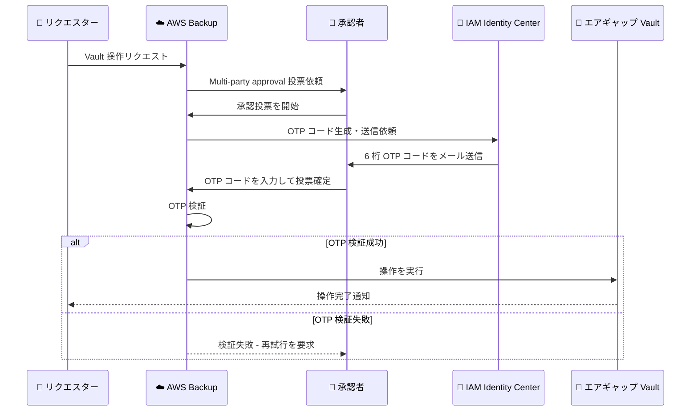

# AWS Backup - Multi-party approval での OTP 検証の追加

**リリース日**: 2026 年 05 月 27 日
**サービス**: AWS Backup
**機能**: Multi-party approval に対する OTP 検証 (論理的にエアギャップされた Vault)

📊 [このアップデートのインフォグラフィックを見る](https://takech9203.github.io/aws-news-summary/20260527-aws-backup-otp-multi-party-approval-lag.html)

## 概要

AWS Backup は、論理的にエアギャップされた Vault (Logically Air-Gapped Vault) に対する Multi-party approval アクションにおいて、承認者が投票する際にワンタイムパスワード (OTP) 検証を必須とする機能を追加しました。承認者が Multi-party approval リクエストに投票する際、AWS IAM Identity Center に登録されたメールアドレスに送信される 6 桁のコードを入力する必要があります。

この機能により、承認者本人のみが保護された Vault 操作を認可できることが保証され、ランサムウェアやインサイダー脅威に対するデータ保護がさらに強化されます。OTP 検証は、論理的にエアギャップされた Vault に対するすべての既存および新規の Multi-party approval セッションに自動的に適用されるため、追加の設定やコストは不要です。

このアップデートは、セキュリティチーム、バックアップ管理者、コンプライアンス担当者など、重要なデータ保護ポリシーを管理する組織を対象としています。

**アップデート前の課題**

Multi-party approval が論理的にエアギャップされた Vault を保護していましたが、以下の課題がありました。

- 承認者の IAM 認証情報が侵害された場合、攻撃者がその認証情報を使用して承認アクションを実行できる可能性がありました
- 承認投票時に追加の本人確認メカニズムがなく、認証情報ベースの攻撃に対する防御層が不十分でした
- 内部脅威のシナリオでは、共有された認証情報や権限昇格によって Multi-party approval が回避されるリスクがありました

**アップデート後の改善**

今回のアップデートにより、以下の改善が実現しました。

- 承認者が投票する際に、登録メールアドレスへの OTP 送信による帯域外 (out-of-band) 認証が必須となり、認証情報侵害だけでは承認操作を完了できなくなりました
- 自動適用により、既存のすべての Multi-party approval セッションにも即座に保護が拡張され、設定変更なしでセキュリティが強化されました
- IAM Identity Center のメールアドレスとの連携により、承認者の身元確認が多要素認証レベルで実施されるようになりました

## アーキテクチャ図



この図は、Multi-party approval における OTP 検証フローを示しています。承認者が投票する際に、IAM Identity Center 経由でメール送信された 6 桁の OTP コードを入力し、検証に成功した場合のみ Vault 操作が実行されます。

## サービスアップデートの詳細

### 主要機能

1. **OTP によるメールベース検証**
   - 承認者が投票する際に、6 桁のワンタイムパスワードが IAM Identity Center に登録されたメールアドレスに送信されます
   - コードの入力が完了するまで、承認投票は確定されません
   - 帯域外認証により、認証情報のみの攻撃では承認操作を完了できません

2. **自動適用**
   - 追加の設定やオプトインは不要です
   - 既存のすべての Multi-party approval セッションに即座に適用されます
   - 新規に作成される Multi-party approval セッションにも自動的に適用されます

3. **IAM Identity Center 統合**
   - 承認者は AWS IAM Identity Center にメールアドレスが登録されている必要があります
   - IAM Identity Center のユーザー管理と一元的に連携します
   - 組織のアイデンティティ管理基盤を活用した検証が実現します

## 技術仕様

### OTP 検証の仕様

| 項目 | 詳細 |
|------|------|
| OTP コードの桁数 | 6 桁 |
| 送信先 | IAM Identity Center 登録メールアドレス |
| 対象操作 | 論理的にエアギャップされた Vault への Multi-party approval アクション |
| 適用範囲 | 既存および新規の全セッション |
| 追加料金 | なし |
| セットアップ | 不要 (自動適用) |

### 対応する Vault 操作

| 操作カテゴリ | 説明 |
|-------------|------|
| リカバリポイントの削除 | エアギャップ Vault 内のバックアップ削除リクエスト |
| Vault アクセスポリシーの変更 | Vault のアクセス権限に関するポリシー変更 |
| ライフサイクル設定の変更 | リカバリポイントの保持期間やライフサイクルルールの変更 |

### API 変更履歴

| 日付 | サービス | 変更内容 |
|------|----------|----------|
| 2026/05/27 | AWS Backup | Multi-party approval の投票時に OTP 検証を必須化。論理的にエアギャップされた Vault 対象 |

### IAM Identity Center の要件

```json
{
  "Version": "2012-10-17",
  "Statement": [
    {
      "Sid": "AllowBackupMultiPartyApproval",
      "Effect": "Allow",
      "Action": [
        "backup:PutBackupVaultApproval",
        "backup:GetBackupVaultApproval"
      ],
      "Resource": "arn:aws:backup:*:*:backup-vault:*"
    }
  ]
}
```

承認者には、上記のような IAM ポリシーに加えて、IAM Identity Center にメールアドレスが正しく登録されている必要があります。

## 設定方法

### 前提条件

1. AWS Backup の論理的にエアギャップされた Vault が作成済みであること
2. Multi-party approval が有効化されていること
3. 承認者が AWS IAM Identity Center にユーザーとして登録され、有効なメールアドレスが設定されていること

### 手順

#### ステップ 1: IAM Identity Center のメールアドレス確認

```bash
# IAM Identity Center のユーザー情報を確認
aws identitystore list-users \
    --identity-store-id d-1234567890 \
    --filters AttributePath=UserName,AttributeValue=approver@example.com
```

このコマンドは、IAM Identity Center に承認者のユーザーアカウントが登録されているか確認します。OTP はここに登録されたメールアドレスに送信されます。

#### ステップ 2: 論理的にエアギャップされた Vault の確認

```bash
# 論理的にエアギャップされた Vault の一覧を確認
aws backup list-backup-vaults \
    --by-vault-type LOGICALLY_AIR_GAPPED
```

このコマンドは、アカウント内の論理的にエアギャップされた Vault を一覧表示します。OTP 検証はこれらの Vault に対する Multi-party approval セッションに自動適用されます。

#### ステップ 3: OTP 検証の動作確認

OTP 検証は自動的に適用されるため、追加の設定は不要です。承認者が Multi-party approval リクエストに投票する際、以下のフローで OTP が要求されます。

1. AWS Backup コンソール、SDK、または CLI から承認投票を開始します
2. IAM Identity Center に登録されたメールアドレスに 6 桁のコードが送信されます
3. 受信したコードを入力して投票を確定します

```bash
# Multi-party approval セッションの状態確認
aws backup list-restore-testing-plans
```

このコマンドにより、現在の承認セッションの状態を確認できます。

## メリット

### ビジネス面

- **コンプライアンス強化**: 承認者の本人確認が多要素認証レベルで実施されるため、規制要件 (SOC 2、ISO 27001 等) への適合が容易になります
- **ランサムウェア対策の深化**: 認証情報が侵害されても、メールベースの OTP がなければ承認操作を完了できないため、ランサムウェア攻撃者がバックアップを削除するリスクが大幅に軽減されます
- **追加コストゼロ**: セキュリティ強化に対する追加課金がないため、すべての組織が即座に恩恵を受けられます

### 技術面

- **帯域外認証**: IAM 認証とは独立したメールチャネルでの検証により、単一障害点を排除します
- **設定不要の即時適用**: インフラ変更やコード修正なしで全セッションに適用されるため、運用負荷ゼロでセキュリティが向上します
- **IAM Identity Center 統合**: 既存のアイデンティティ管理基盤を活用し、承認者のメールアドレス管理を一元化できます

## デメリット・制約事項

### 制限事項

- OTP 送信先は IAM Identity Center に登録されたメールアドレスに限定されており、SMS やモバイルアプリによる認証は現時点ではサポートされていません
- メールの遅延やスパムフィルタリングにより OTP の受信が遅れる場合、承認プロセスに遅延が生じる可能性があります
- IAM Identity Center が未設定の環境では、事前にセットアップが必要です

### 考慮すべき点

- 承認者のメールアドレスが最新であることを定期的に確認し、メールが確実に届く環境を維持する必要があります
- 緊急時のバックアップ復元シナリオでは、OTP 検証によるわずかな遅延を考慮して、インシデント対応手順を更新することが推奨されます
- 複数の承認者が必要な場合、各承認者がそれぞれ OTP 検証を完了する必要があるため、全員が迅速にメールを確認できる体制が重要です

## ユースケース

### ユースケース 1: ランサムウェア攻撃からのバックアップ保護

**シナリオ**: 攻撃者が組織の管理者認証情報を窃取し、バックアップデータの削除を試みます。Multi-party approval により複数の承認が必要ですが、攻撃者は複数の IAM ユーザーの認証情報も窃取しています。

**実装例**:
```
攻撃者の試行:
1. 窃取した認証情報で Vault 操作をリクエスト
2. 別の窃取した認証情報で承認投票を試行
3. OTP コードが正規承認者のメールに送信される
4. 攻撃者はメールにアクセスできないため、承認を完了できない
→ バックアップデータは安全に保護される
```

**効果**: IAM 認証情報が侵害されても、帯域外の OTP 検証により攻撃者がバックアップを削除することが不可能になります。

### ユースケース 2: 金融機関の規制コンプライアンス対応

**シナリオ**: 金融機関が、SOX 法や金融庁ガイドラインに準拠したデータ保護体制を構築する必要があります。重要なバックアップデータへの操作には、本人確認済みの複数人による承認が求められます。

**実装例**:
```
コンプライアンス要件への対応:
1. 論理的にエアギャップされた Vault で重要データを保護
2. Multi-party approval で複数人の承認を要求
3. OTP 検証で各承認者の本人確認を実施
4. 監査ログにより全承認プロセスを記録
→ 規制当局に対して多層的なデータ保護体制を証明
```

**効果**: 多要素認証レベルの本人確認が組み込まれた承認フローにより、規制要件への適合を証明でき、監査対応の負荷を軽減します。

### ユースケース 3: 内部脅威対策

**シナリオ**: 退職予定の管理者が、不正に重要なバックアップデータを削除しようとする内部脅威シナリオです。この管理者は十分な IAM 権限を持っていますが、単独での操作は Multi-party approval により制限されています。

**実装例**:
```
内部脅威の防止フロー:
1. 不正な管理者が Vault 操作をリクエスト
2. 他の承認者に承認依頼が送信される
3. 承認者が投票する際、各自の OTP 検証が必要
4. 正当な理由がない場合、他の承認者が拒否
5. 仮に共謀があっても、各自が OTP を受信する必要があるため追跡可能
→ 不正操作の実行が困難になり、証跡も残る
```

**効果**: 各承認者が個別に OTP 検証を完了する必要があるため、共謀による不正操作のハードルが大幅に上がり、すべての承認アクションが追跡可能になります。

## 料金

OTP 検証機能に追加料金はかかりません。AWS Backup および論理的にエアギャップされた Vault の通常料金が適用されます。

### 料金例

| 項目 | 料金 |
|------|------|
| OTP 検証機能 | 無料 (追加課金なし) |
| 論理的にエアギャップされた Vault ストレージ | バックアップストレージ料金に準拠 |
| Multi-party approval | 追加課金なし |

具体的な AWS Backup の料金は、リージョンやストレージ量によって異なります。詳細は [AWS Backup 料金ページ](https://aws.amazon.com/backup/pricing/) をご確認ください。

## 利用可能リージョン

OTP 検証機能は、論理的にエアギャップされた Vault がサポートされているすべての AWS リージョンで利用可能です。

対象リージョンの最新リストは、[AWS Backup のリージョン別サービス可用性](https://aws.amazon.com/about-aws/global-infrastructure/regional-product-services/) をご確認ください。

## 関連サービス・機能

- **AWS IAM Identity Center**: OTP コードの送信先メールアドレスの管理基盤。承認者のアイデンティティ管理を提供
- **AWS Backup 論理的にエアギャップされた Vault**: バックアップデータをソースアカウントから論理的に分離し、ランサムウェアからの保護を提供する Vault タイプ
- **AWS Backup Multi-party approval**: 重要な Vault 操作に対して複数人の承認を要求するガバナンス機能。OTP 検証はこの機能の追加セキュリティレイヤー
- **AWS CloudTrail**: Multi-party approval の投票・OTP 検証イベントを監査ログとして記録し、コンプライアンス要件への対応を支援

## 参考リンク

- 📊 [インフォグラフィック](https://takech9203.github.io/aws-news-summary/20260527-aws-backup-otp-multi-party-approval-lag.html)
- [公式発表 (What's New)](https://aws.amazon.com/about-aws/whats-new/2026/05/aws-backup-otp-multi-party-approval-lag/)
- [AWS Backup ドキュメント](https://docs.aws.amazon.com/aws-backup/latest/devguide/)
- [Multi-party approval ドキュメント](https://docs.aws.amazon.com/aws-backup/latest/devguide/multi-party-approval.html)
- [論理的にエアギャップされた Vault ドキュメント](https://docs.aws.amazon.com/aws-backup/latest/devguide/logically-air-gapped-backup-vaults.html)
- [AWS Backup 料金ページ](https://aws.amazon.com/backup/pricing/)

## まとめ

AWS Backup の Multi-party approval に OTP 検証が追加されたことで、論理的にエアギャップされた Vault に対する承認操作のセキュリティが多要素認証レベルに強化されました。設定不要で既存のすべてのセッションに自動適用されるため、追加の運用負荷なくランサムウェアや内部脅威に対するデータ保護を強化できます。論理的にエアギャップされた Vault を利用している組織は、承認者の IAM Identity Center メールアドレスが最新であることを確認し、インシデント対応手順に OTP 検証プロセスを反映することを推奨します。
