# AWS Glue - ラージおよびメモリ最適化ワーカーが Europe (Spain) リージョンで利用可能に

**リリース日**: 2026年05月27日
**サービス**: AWS Glue
**機能**: Large and Memory Optimized Workers (G.12X, G.16X, R.1X - R.8X)

📊 [このアップデートのインフォグラフィックを見る](https://takech9203.github.io/aws-news-summary/20260527-aws-glue-larger-memory-intensive-workers-spain.html)

## 概要

AWS Glue のラージワーカー (G.12X, G.16X) およびメモリ最適化ワーカー (R.1X, R.2X, R.4X, R.8X) が Europe (Spain) リージョンで利用可能になった。これにより、スペインリージョンのユーザーは、大規模なデータ処理やメモリ集約型の Spark ワークロードをローカルリージョンで実行できるようになる。

G.12X および G.16X ワーカーは、既存の G ワーカーラインナップを拡張し、追加のコンピュート、メモリ、ストレージを提供する。R シリーズワーカーは、対応する G ワーカーの 2 倍のメモリを提供し、キャッシュ、シャッフル、集約などのメモリ集約型 Spark オペレーションに最適化されている。

このアップデートにより、Europe (Spain) リージョンは G.4X、G.8X、G.12X、G.16X、R.1X - R.8X の全ワーカータイプをサポートするリージョンとなり、データレジデンシー要件のあるスペインおよび南欧のユーザーに、より柔軟なデータ処理オプションを提供する。

**アップデート前の課題**

- Europe (Spain) リージョンでは G.1X および G.2X ワーカーのみが利用可能で、大規模なデータ処理ワークロードに対応できなかった
- メモリ集約型のジョブでは OOM (Out of Memory) エラーが発生しやすく、ジョブの分割や別リージョンでの実行が必要だった
- スペインのデータレジデンシー要件があるユーザーは、大規模ワーカーを利用するために他のリージョンへデータを転送する必要があった

**アップデート後の改善**

- G.12X (48 vCPU, 192 GB メモリ) や G.16X (64 vCPU, 256 GB メモリ) による大規模コンピュートワークロードの処理が可能になった
- R シリーズワーカーにより、メモリ集約型の変換処理を OOM エラーなく実行可能になった
- EU データレジデンシー要件を満たしながら、高性能なデータ処理パイプラインを構築できるようになった

## アーキテクチャ図

```mermaid
flowchart TD
    subgraph Spain["☁️ Europe Spain Region eu-south-2"]
        subgraph General["⚙️ General Compute Workers"]
            direction LR
            G025["G.025X<br/>2 vCPU / 4 GB<br/>ストリーミング用"]
            G1["G.1X<br/>4 vCPU / 16 GB<br/>標準ワークロード"]
            G2["G.2X<br/>8 vCPU / 32 GB<br/>標準ワークロード"]
            G025 ~~~ G1 ~~~ G2
        end
        subgraph Large["🚀 Large Workers - NEW"]
            direction LR
            G4["G.4X<br/>16 vCPU / 64 GB<br/>高負荷処理"]
            G8["G.8X<br/>32 vCPU / 128 GB<br/>高負荷処理"]
            G12["G.12X<br/>48 vCPU / 192 GB<br/>大規模処理"]
            G16["G.16X<br/>64 vCPU / 256 GB<br/>最大規模処理"]
            G4 ~~~ G8 ~~~ G12 ~~~ G16
        end
        subgraph Memory["🧠 Memory Optimized Workers - NEW"]
            direction LR
            R1["R.1X<br/>1 DPU メモリ最適化<br/>メモリ集約型"]
            R2["R.2X<br/>2 DPU メモリ最適化<br/>メモリ集約型"]
            R4["R.4X<br/>4 DPU メモリ最適化<br/>大規模メモリ"]
            R8["R.8X<br/>8 DPU メモリ最適化<br/>最大メモリ"]
            R1 ~~~ R2 ~~~ R4 ~~~ R8
        end
    end

    User(["👤 データエンジニア"]) --> General
    User --> Large
    User --> Memory

    classDef cloud fill:none,stroke:#CCCCCC,stroke-width:2px,color:#666666
    classDef layer fill:none,stroke:#E1BEE7,stroke-width:2px,color:#666666
    classDef standard fill:#E8F1FF,stroke:#4A90E2,stroke-width:2px,color:#333333
    classDef large fill:#FFF3E0,stroke:#FF9800,stroke-width:2px,color:#333333
    classDef memory fill:#E8F5E9,stroke:#66BB6A,stroke-width:2px,color:#333333
    classDef user fill:#E3F2FD,stroke:#BBDEFB,stroke-width:2px,color:#1565C0

    class Spain cloud
    class General,Large,Memory layer
    class G025,G1,G2 standard
    class G4,G8,G12,G16 large
    class R1,R2,R4,R8 memory
    class User user
```



AWS Glue のワーカータイプ構成を示す図。NEW とマークされたラージワーカーおよびメモリ最適化ワーカーが、今回 Europe (Spain) リージョンで新たに利用可能になったワーカータイプである。

## サービスアップデートの詳細

### 主要機能

1. **ラージコンピュートワーカー (G.12X, G.16X)**
   - G.12X: 12 DPU (48 vCPU, 192 GB メモリ, 768 GB ディスク) を提供
   - G.16X: 16 DPU (64 vCPU, 256 GB メモリ, 1024 GB ディスク) を提供
   - 非常に大規模でリソース集約型のワークロードに最適
   - AWS Glue バージョン 4.0 以降で利用可能

2. **高負荷ワーカー (G.4X, G.8X)**
   - G.4X: 4 DPU (16 vCPU, 64 GB メモリ, 256 GB ディスク) を提供
   - G.8X: 8 DPU (32 vCPU, 128 GB メモリ, 512 GB ディスク) を提供
   - 最も要求の厳しい変換、集約、結合、クエリに最適
   - AWS Glue バージョン 3.0 以降で利用可能

3. **メモリ最適化ワーカー (R.1X - R.8X)**
   - 対応する G ワーカーの 2 倍のメモリを提供
   - OOM エラーが頻発するワークロードや、高いメモリ対 CPU 比率が必要な処理に最適
   - キャッシュ、シャッフル、集約などのメモリ集約型 Spark オペレーションに対応
   - AWS Glue バージョン 4.0 以降で利用可能

## 技術仕様

### ワーカータイプ別スペック

| ワーカータイプ | DPU | vCPU | メモリ | ディスク | 推奨ワークロード |
|---------------|-----|------|--------|----------|-----------------|
| G.025X | 0.25 | 2 | 4 GB | 84 GB | 低ボリュームストリーミング |
| G.1X | 1 | 4 | 16 GB | 94 GB | 標準的な変換、結合 |
| G.2X | 2 | 8 | 32 GB | 138 GB | 標準的な変換、結合 |
| G.4X | 4 | 16 | 64 GB | 256 GB | 高負荷な変換、集約 |
| G.8X | 8 | 32 | 128 GB | 512 GB | 高負荷な変換、集約 |
| G.12X | 12 | 48 | 192 GB | 768 GB | 大規模リソース集約型 |
| G.16X | 16 | 64 | 256 GB | 1024 GB | 最大規模の処理 |
| R.1X | 1 | - | メモリ最適化 | - | メモリ集約型 |
| R.2X | 2 | - | メモリ最適化 | - | メモリ集約型 |
| R.4X | 4 | - | メモリ最適化 | - | 大規模メモリ集約型 |
| R.8X | 8 | - | メモリ最適化 | - | 最大メモリ集約型 |

### API 変更履歴

直近 7 日間で AWS Glue に関連する API 変更は確認されなかった。ワーカータイプの選択は既存の CreateJob / UpdateJob API の `WorkerType` パラメータで指定する。

### ワーカータイプの指定

```json
{
  "Name": "my-large-etl-job",
  "Role": "arn:aws:iam::123456789012:role/GlueETLRole",
  "Command": {
    "Name": "glueetl",
    "ScriptLocation": "s3://my-bucket/scripts/transform.py"
  },
  "GlueVersion": "4.0",
  "WorkerType": "G.12X",
  "NumberOfWorkers": 10
}
```

## 設定方法

### 前提条件

1. AWS Glue バージョン 4.0 以降を使用すること (G.12X, G.16X, R シリーズの場合)
2. AWS Glue バージョン 3.0 以降を使用すること (G.4X, G.8X の場合)
3. Europe (Spain) リージョン (eu-south-2) にアクセス可能な IAM ロールを設定すること

### 手順

#### ステップ 1: AWS Glue Studio でジョブを作成

```bash
aws glue create-job \
  --name "my-spain-etl-job" \
  --role "arn:aws:iam::123456789012:role/GlueETLRole" \
  --command '{"Name":"glueetl","ScriptLocation":"s3://my-bucket/scripts/transform.py"}' \
  --glue-version "4.0" \
  --worker-type "G.12X" \
  --number-of-workers 10 \
  --region eu-south-2
```

AWS CLI を使用して Europe (Spain) リージョンに G.12X ワーカータイプのジョブを作成する。`--worker-type` パラメータで利用するワーカータイプを指定し、`--number-of-workers` で割り当てるワーカー数を設定する。

#### ステップ 2: メモリ最適化ワーカーの選択

```bash
aws glue create-job \
  --name "my-memory-intensive-job" \
  --role "arn:aws:iam::123456789012:role/GlueETLRole" \
  --command '{"Name":"glueetl","ScriptLocation":"s3://my-bucket/scripts/aggregate.py"}' \
  --glue-version "4.0" \
  --worker-type "R.4X" \
  --number-of-workers 5 \
  --region eu-south-2
```

メモリ集約型ワークロードの場合は、R シリーズワーカーを選択する。R.4X は対応する G.4X の 2 倍のメモリを提供し、大規模な集約処理やキャッシュ操作でのOOM エラーを防止する。

#### ステップ 3: AWS Glue Studio での設定

AWS Glue Studio のノートブックまたは Visual ETL エディタからも設定可能。ジョブの「Job details」タブで Worker type ドロップダウンからワーカータイプを選択する。

## メリット

### ビジネス面

- **データレジデンシーの遵守**: EU およびスペインのデータ保護規制に準拠しながら大規模データ処理が可能
- **レイテンシーの削減**: スペインおよび南欧のユーザーが地理的に近いリージョンで処理を実行可能
- **柔軟なコスト最適化**: ワークロードに適したワーカータイプを選択することで、過剰プロビジョニングを回避

### 技術面

- **大規模ワークロード対応**: G.16X で最大 64 vCPU / 256 GB メモリを利用した高並列処理が可能
- **OOM エラーの防止**: R シリーズワーカーのメモリ最適化構成により、メモリ不足による障害を削減
- **大容量ディスク**: G.16X で最大 1 TB のローカルディスクを利用可能、大規模シャッフルや中間データに対応

## デメリット・制約事項

### 制限事項

- G.12X、G.16X、R シリーズワーカーは AWS Glue バージョン 4.0 以降でのみ利用可能
- G.12X、G.16X、R シリーズワーカーは起動レイテンシーが高い傾向がある
- Flex 実行クラスは新しいワーカータイプ (G.12X, G.16X, R.1X - R.8X) をサポートしていない

### 考慮すべき点

- DPU 数が大きいワーカーは 1 時間あたりのコストが比例して増加するため、適切なワーカータイプの選択が重要
- ラージワーカーのスタートアップ時間が長いため、短時間のジョブには G.1X や G.2X が引き続き推奨される

## ユースケース

### ユースケース 1: 大規模 ETL パイプライン

**シナリオ**: スペインの金融機関が日次で数百 GB のトランザクションデータを処理し、データウェアハウスにロードする必要がある。

**実装例**:
```python
# G.16X ワーカーで大規模データを並列処理
job = glue_client.create_job(
    Name='financial-daily-etl',
    Role='arn:aws:iam::123456789012:role/GlueETLRole',
    Command={'Name': 'glueetl', 'ScriptLocation': 's3://bucket/scripts/financial_etl.py'},
    GlueVersion='4.0',
    WorkerType='G.16X',
    NumberOfWorkers=20
)
```

**効果**: 64 vCPU / 256 GB メモリの G.16X ワーカー 20 台により、大規模な結合処理と集約を高速に実行し、データレジデンシー要件を満たしながら処理時間を大幅に短縮。

### ユースケース 2: メモリ集約型のデータ集約

**シナリオ**: EC サイトのユーザー行動データを分析するため、大量のセッションデータをメモリ上でキャッシュし、複雑な集約処理を行う。

**実装例**:
```python
# R.8X でメモリ集約型の集約処理
job = glue_client.create_job(
    Name='user-behavior-aggregation',
    Role='arn:aws:iam::123456789012:role/GlueETLRole',
    Command={'Name': 'glueetl', 'ScriptLocation': 's3://bucket/scripts/user_agg.py'},
    GlueVersion='4.0',
    WorkerType='R.8X',
    NumberOfWorkers=10
)
```

**効果**: R.8X ワーカーの高メモリ構成により、大規模なデータセットをメモリ上にキャッシュし、OOM エラーなく複雑な集約やウィンドウ関数を実行可能。

### ユースケース 3: 機械学習用特徴量エンジニアリング

**シナリオ**: 機械学習モデルのトレーニングに向けて、数十のデータソースを結合し特徴量を生成する処理で、大量のメモリとディスク I/O が必要。

**実装例**:
```python
# G.12X で特徴量生成パイプライン
job = glue_client.create_job(
    Name='ml-feature-engineering',
    Role='arn:aws:iam::123456789012:role/GlueETLRole',
    Command={'Name': 'glueetl', 'ScriptLocation': 's3://bucket/scripts/features.py'},
    GlueVersion='4.0',
    WorkerType='G.12X',
    NumberOfWorkers=15
)
```

**効果**: G.12X の 768 GB ディスクと 192 GB メモリにより、大規模なシャッフル操作と多数テーブルの結合を効率的に処理し、特徴量生成のスループットを向上。

## 料金

AWS Glue ETL ジョブの料金は DPU-hour に基づいて秒単位で課金される。

### 料金例

| ワーカータイプ | DPU 数 x ワーカー数 | 1 時間の料金 (概算) |
|---------------|---------------------|---------------------|
| G.1X x 10 台 | 10 DPU | $4.40 |
| G.4X x 10 台 | 40 DPU | $17.60 |
| G.8X x 10 台 | 80 DPU | $35.20 |
| G.12X x 10 台 | 120 DPU | $52.80 |
| G.16X x 10 台 | 160 DPU | $70.40 |

- DPU-hour あたり $0.44 (標準実行クラス)
- 新しいワーカータイプ (G.12X, G.16X, R シリーズ) は Flex 実行クラス ($0.29/DPU-hour) を利用できない点に注意
- 料金はリージョンにより異なる場合がある

## 利用可能リージョン

G.12X、G.16X、R.1X - R.8X ワーカーは、以下のリージョンで利用可能。

- US East (N. Virginia) - us-east-1
- US East (Ohio) - us-east-2
- US West (Oregon) - us-west-2
- Europe (Ireland) - eu-west-1
- Europe (Frankfurt) - eu-central-1
- **Europe (Spain) - eu-south-2** (今回追加)
- Asia Pacific (Tokyo) - ap-northeast-1
- South America (Sao Paulo) - sa-east-1

G.4X、G.8X ワーカーは上記に加え、さらに多くのリージョンで利用可能 (US West (N. California)、Asia Pacific (Mumbai, Seoul, Singapore, Sydney)、Canada (Central)、Europe (London, Stockholm) など)。

## 関連サービス・機能

- **AWS Glue Studio**: ビジュアル ETL エディタおよびノートブックからワーカータイプを選択可能
- **AWS Glue Data Catalog**: ETL ジョブのメタデータ管理に使用
- **Amazon S3**: ETL ジョブの入出力データストアとして使用
- **Amazon Redshift / Athena**: ETL 処理後のデータ分析基盤として連携

## 参考リンク

- 📊 [インフォグラフィック](https://takech9203.github.io/aws-news-summary/20260527-aws-glue-larger-memory-intensive-workers-spain.html)
- [公式発表 (What's New)](https://aws.amazon.com/about-aws/whats-new/2026/05/aws-glue-larger-memory-intensive-workers-spain)
- [AWS Glue ジョブプロパティ設定ドキュメント](https://docs.aws.amazon.com/glue/latest/dg/add-job.html)
- [AWS Glue 料金ページ](https://aws.amazon.com/glue/pricing/)

## まとめ

AWS Glue のラージワーカー (G.12X, G.16X) およびメモリ最適化ワーカー (R.1X - R.8X) が Europe (Spain) リージョンで利用可能になったことで、スペインおよび南欧のユーザーは、データレジデンシー要件を満たしながら大規模かつメモリ集約型のデータ処理ワークロードを実行できるようになった。既存の G.4X、G.8X も同リージョンで利用可能であり、ワークロードの特性に応じて最適なワーカータイプを選択し、コストとパフォーマンスのバランスを最適化することが推奨される。
