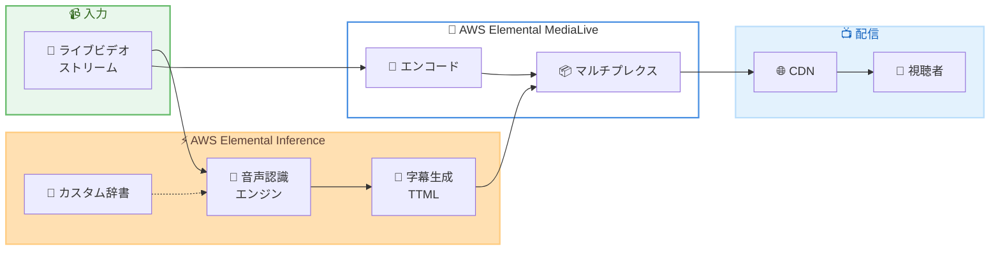

# AWS Elemental Inference - Smart Subtitles

**リリース日**: 2026 年 5 月 27 日
**サービス**: AWS Elemental Inference
**機能**: Smart Subtitles (自動ライブキャプショニング)

📊 [このアップデートのインフォグラフィックを見る](https://takech9203.github.io/aws-news-summary/20260527-elemental-inference-subtitles.html)

## 概要

AWS Elemental Inference に Smart Subtitles 機能が追加された。これは AI を活用した音声認識技術により、ライブビデオストリームからリアルタイムで字幕を自動生成する機能である。TTML (Timed Text Markup Language) 形式で低レイテンシーの字幕を配信し、手動キャプショニングやサードパーティサービスの利用を不要にする。

Smart Subtitles は英語 (米国、英国、オーストラリア)、フランス語、ドイツ語、イタリア語、ポルトガル語、スペイン語の 6 言語に対応している。また、カスタム辞書機能によりスポーツ選手の名前や専門用語など、特定のコンテンツに最適化された字幕生成が可能である。

この機能は AWS Elemental MediaLive とネイティブに統合されており、既存の Elemental Inference 機能 (スマートクロッピングやクリップ生成) と併用して利用できる。複数の機能を同一コンテンツに同時適用する場合は、非線形の料金体系により機能あたりのコストが低減される。

**アップデート前の課題**

- ライブ配信における字幕生成には、手動でのキャプショニング作業またはサードパーティサービスの導入が必要だった
- リアルタイム字幕の品質を維持するには、専門のオペレーターやカスタム構築のパイプラインが必要だった
- 専門用語やカスタム語彙に対応するためのキャリブレーションが困難だった

**アップデート後の改善**

- AI ベースの音声認識により、リアルタイムで自動字幕生成が可能になった
- カスタム辞書により、専門用語や固有名詞の認識精度を向上できるようになった
- AWS Elemental MediaLive との統合により、既存のライブ配信ワークフローに容易に字幕機能を追加できるようになった

## アーキテクチャ図



ライブビデオストリームが AWS Elemental Inference の音声認識エンジンに入力され、カスタム辞書を参照しながら TTML 形式の字幕がリアルタイム生成される。生成された字幕は AWS Elemental MediaLive のエンコードストリームと統合され、CDN 経由で視聴者に配信される。

## サービスアップデートの詳細

### 主要機能

1. **リアルタイム音声認識と字幕生成**
   - ライブビデオストリームの音声をリアルタイムで文字起こし
   - TTML (Timed Text Markup Language) 形式で字幕を出力
   - 低レイテンシーでの配信に対応

2. **カスタム辞書**
   - 専門用語、固有名詞、アスリート名などを登録可能
   - API またはコンソールから設定可能
   - 辞書の作成、更新、削除、エクスポートに対応
   - 対応言語: 英語、フランス語、ドイツ語、イタリア語、ポルトガル語、スペイン語

3. **不適切表現フィルタ**
   - `DISABLED`: フィルタなし
   - `CENSOR`: 不適切表現を伏せ字にする
   - `DROP`: 不適切表現を含む字幕を表示しない

4. **AWS Elemental MediaLive 統合**
   - MediaLive チャンネルとのネイティブ統合
   - 既存のスマートクロッピングやクリップ生成機能と併用可能
   - 複数機能の同時利用で非線形の料金体系が適用

## 技術仕様

### 対応言語

| 言語コード | 言語 |
|------|------|
| `eng-us` | 英語 (米国) |
| `eng-gb` | 英語 (英国) |
| `eng-au` | 英語 (オーストラリア) |
| `fra` | フランス語 |
| `deu` | ドイツ語 |
| `ita` | イタリア語 |
| `por` | ポルトガル語 |
| `spa` | スペイン語 |

### 字幕出力設定

| 項目 | 詳細 |
|------|------|
| 出力形式 | TTML (Timed Text Markup Language) |
| アスペクト比設定 | `width` / `height` でカスタム指定可能 |
| 不適切表現フィルタ | `DISABLED` / `CENSOR` / `DROP` |
| 辞書参照 | 辞書 ID で関連付け |

### API 変更履歴

| 日付 | サービス | 変更内容 |
|------|----------|----------|
| 2026/05/27 | [elemental-inference](https://awsapichanges.com/archive/changes/0a7d57-elemental-inference.html) | 6 new 4 updated api methods - Smart Subtitles 対応 |

### 新規 API メソッド

```python
# カスタム辞書の作成
client.create_dictionary(
    name='string',
    language='eng'|'fra'|'ita'|'deu'|'spa'|'por',
    entries='string',
    tags={'string': 'string'}
)

# 辞書一覧の取得
client.list_dictionaries(
    maxResults=123,
    nextToken='string'
)

# 辞書エントリのエクスポート
client.export_dictionary_entries(
    id='string'
)

# 辞書の更新
client.update_dictionary(
    id='string',
    name='string',
    language='eng'|'fra'|'ita'|'deu'|'spa'|'por',
    entries='string'
)

# 辞書の削除
client.delete_dictionary(
    id='string'
)

# 辞書情報の取得
client.get_dictionary(
    id='string'
)
```

### 更新された API メソッド (字幕設定の追加)

```python
# Feed の作成 (subtitling パラメータ追加)
client.create_feed(
    name='string',
    outputs=[
        {
            'name': 'string',
            'outputConfig': {
                'subtitling': {
                    'language': 'eng'|'eng-au'|'eng-gb'|'eng-us'|'fra'|'ita'|'deu'|'spa'|'por',
                    'aspectRatio': {
                        'width': 123,
                        'height': 123
                    },
                    'dictionary': 'string',
                    'profanityFilter': 'DISABLED'|'CENSOR'|'DROP'
                }
            },
            'status': 'ENABLED'|'DISABLED',
            'description': 'string'
        },
    ],
    tags={'string': 'string'}
)
```

## 設定方法

### 前提条件

1. AWS Elemental Inference が利用可能なリージョンの AWS アカウント
2. Elemental Inference フィード (Feed) が作成済みであること
3. IAM ポリシーで Elemental Inference の API アクセスが許可されていること

### 手順

#### ステップ 1: カスタム辞書の作成 (オプション)

```bash
aws elemental-inference create-dictionary \
    --name "sports-dictionary" \
    --language eng \
    --entries "athlete-names.txt"
```

専門用語や固有名詞を登録するカスタム辞書を作成する。辞書は字幕の認識精度向上に使用される。

#### ステップ 2: Feed に字幕出力を設定

```bash
aws elemental-inference create-feed \
    --name "live-stream-with-subtitles" \
    --outputs '[{
        "name": "subtitle-output",
        "outputConfig": {
            "subtitling": {
                "language": "eng-us",
                "aspectRatio": {"width": 1920, "height": 1080},
                "dictionary": "dictionary-id",
                "profanityFilter": "CENSOR"
            }
        },
        "status": "ENABLED",
        "description": "English subtitles for live stream"
    }]'
```

Feed を作成し、字幕出力の設定を行う。言語、アスペクト比、辞書、不適切表現フィルタを指定する。

#### ステップ 3: MediaLive チャンネルとの統合

```bash
aws elemental-inference associate-feed \
    --id "feed-id" \
    --associated-resource-name "arn:aws:medialive:us-east-1:123456789012:channel/channel-id" \
    --outputs '[{
        "name": "subtitle-output",
        "outputConfig": {
            "subtitling": {
                "language": "eng-us",
                "dictionary": "dictionary-id",
                "profanityFilter": "CENSOR"
            }
        },
        "status": "ENABLED"
    }]'
```

Elemental Inference Feed を MediaLive チャンネルに関連付ける。これにより、ライブストリームの字幕が自動的に MediaLive の出力に統合される。

## メリット

### ビジネス面

- **コスト削減**: 手動キャプショニングやサードパーティサービスの費用を削減できる
- **アクセシビリティ向上**: リアルタイム字幕により、聴覚障害者や音声をオフにしている視聴者にコンテンツを届けられる
- **規制準拠**: 多くの国で義務付けられているライブ配信の字幕提供要件に対応しやすくなる

### 技術面

- **低レイテンシー**: リアルタイム処理により視聴体験を損なわない
- **API ベースの管理**: Infrastructure as Code での設定が可能
- **多言語対応**: 6 言語のライブ字幕を単一のサービスで管理できる

## デメリット・制約事項

### 制限事項

- 対応言語は 6 言語に限定されている (日本語、中国語、韓国語などアジア言語は未対応)
- 利用可能リージョンが 4 リージョンに限られている
- カスタム辞書の言語コードは汎用コードのみ (地域バリアント非対応)

### 考慮すべき点

- 音声品質が低い場合や背景ノイズが大きい場合、字幕の精度が低下する可能性がある
- 専門的なコンテンツでは、カスタム辞書の初期設定に時間がかかる場合がある
- 複数言語の字幕を同時生成する場合は、言語ごとに Feed 出力を設定する必要がある

## ユースケース

### ユースケース 1: スポーツのライブ中継

**シナリオ**: 大規模スポーツイベントのライブ中継において、リアルタイムで字幕を生成し、複数言語で配信する。

**実装例**:
```python
# スポーツ専用辞書の作成
client.create_dictionary(
    name='fifa-world-cup-2026',
    language='eng',
    entries='player-names-and-team-names.txt'
)

# 字幕付き Feed の作成
client.create_feed(
    name='world-cup-live',
    outputs=[
        {
            'name': 'english-subtitles',
            'outputConfig': {
                'subtitling': {
                    'language': 'eng-us',
                    'dictionary': 'dictionary-id',
                    'profanityFilter': 'CENSOR'
                }
            },
            'status': 'ENABLED'
        }
    ]
)
```

**効果**: 選手名やチーム名の認識精度が向上し、視聴者にとって分かりやすい字幕が自動生成される。

### ユースケース 2: ニュースのライブ配信

**シナリオ**: 24 時間ニュースチャンネルのライブ配信において、コスト効率よくリアルタイム字幕を提供する。

**実装例**:
```python
# ニュース用辞書
client.create_dictionary(
    name='news-terminology',
    language='eng',
    entries='political-terms-and-place-names.txt'
)

# Feed の作成と MediaLive 統合
client.create_feed(
    name='news-24h-live',
    outputs=[
        {
            'name': 'subtitles',
            'outputConfig': {
                'subtitling': {
                    'language': 'eng-gb',
                    'profanityFilter': 'DROP'
                }
            },
            'status': 'ENABLED'
        }
    ]
)
```

**効果**: 従来の手動キャプショニングと比較して大幅なコスト削減を実現しつつ、規制要件に準拠した字幕配信が可能になる。

### ユースケース 3: 企業イベントの多言語配信

**シナリオ**: グローバル企業の全社ミーティングやプロダクト発表会を複数言語で同時配信する。

**実装例**:
```python
# 企業固有用語の辞書
client.create_dictionary(
    name='company-terms',
    language='eng',
    entries='product-names-and-acronyms.txt'
)

# 多言語出力の Feed
client.create_feed(
    name='corporate-event',
    outputs=[
        {
            'name': 'english-subs',
            'outputConfig': {
                'subtitling': {'language': 'eng-us', 'dictionary': 'dict-id'}
            },
            'status': 'ENABLED'
        },
        {
            'name': 'spanish-subs',
            'outputConfig': {
                'subtitling': {'language': 'spa', 'dictionary': 'dict-id-es'}
            },
            'status': 'ENABLED'
        }
    ]
)
```

**効果**: 単一のサービスで複数言語の字幕を同時生成し、グローバルな視聴者にリアルタイムでアクセシブルなコンテンツを提供できる。

## 料金

AWS Elemental Inference Smart Subtitles は、使用時間に基づく従量課金制である。複数の Elemental Inference 機能 (スマートクロッピング、クリップ生成、Smart Subtitles) を同一コンテンツに同時適用する場合は、非線形の料金体系により機能あたりのコストが低減される。

### 料金例

| 使用量 | 月額料金 (概算) |
|--------|------------------|
| 詳細は公式料金ページを参照 | - |

※ 具体的な料金は [AWS Elemental Inference 料金ページ](https://aws.amazon.com/elemental-inference/pricing/) を確認すること。

## 利用可能リージョン

| リージョン | リージョンコード |
|------|------|
| 米国東部 (バージニア北部) | us-east-1 |
| 米国西部 (オレゴン) | us-west-2 |
| アジアパシフィック (ムンバイ) | ap-south-1 |
| 欧州 (アイルランド) | eu-west-1 |

※ 東京リージョン (ap-northeast-1) は現時点で未対応。

## 関連サービス・機能

- **AWS Elemental MediaLive**: ライブビデオエンコーディングサービス。Smart Subtitles とネイティブに統合され、字幕付きライブストリームを配信する
- **AWS Elemental Inference スマートクロッピング**: ライブビデオの縦型動画向け自動クロッピング機能。Smart Subtitles と併用可能
- **AWS Elemental Inference クリップ生成**: ライブストリームからのハイライトクリップ自動生成機能。字幕機能と同時利用可能
- **Amazon Transcribe**: バッチおよびリアルタイム音声文字起こしサービス。非ライブメディアワークフローでの代替手段

## 参考リンク

- 📊 [インフォグラフィック](https://takech9203.github.io/aws-news-summary/20260527-elemental-inference-subtitles.html)
- [公式発表 (What's New)](https://aws.amazon.com/about-aws/whats-new/2026/05/elemental-inference-subtitles)
- [AWS Elemental Inference ドキュメント](https://docs.aws.amazon.com/elemental-inference/)
- [AWS Elemental Inference 料金ページ](https://aws.amazon.com/elemental-inference/pricing/)
- [AWS API Changes - Elemental Inference](https://awsapichanges.com/archive/changes/0a7d57-elemental-inference.html)

## まとめ

AWS Elemental Inference の Smart Subtitles 機能は、ライブ配信における字幕生成のワークフローを大幅に簡素化する重要なアップデートである。6 言語対応のリアルタイム字幕生成、カスタム辞書による認識精度向上、不適切表現フィルタ、MediaLive とのネイティブ統合により、放送事業者やメディア企業がアクセシブルなライブコンテンツを効率的に配信できるようになった。東京リージョンは未対応だが、ライブ配信におけるアクセシビリティ要件が高まっている現状を踏まえ、利用可能なリージョンでの早期検証を推奨する。
