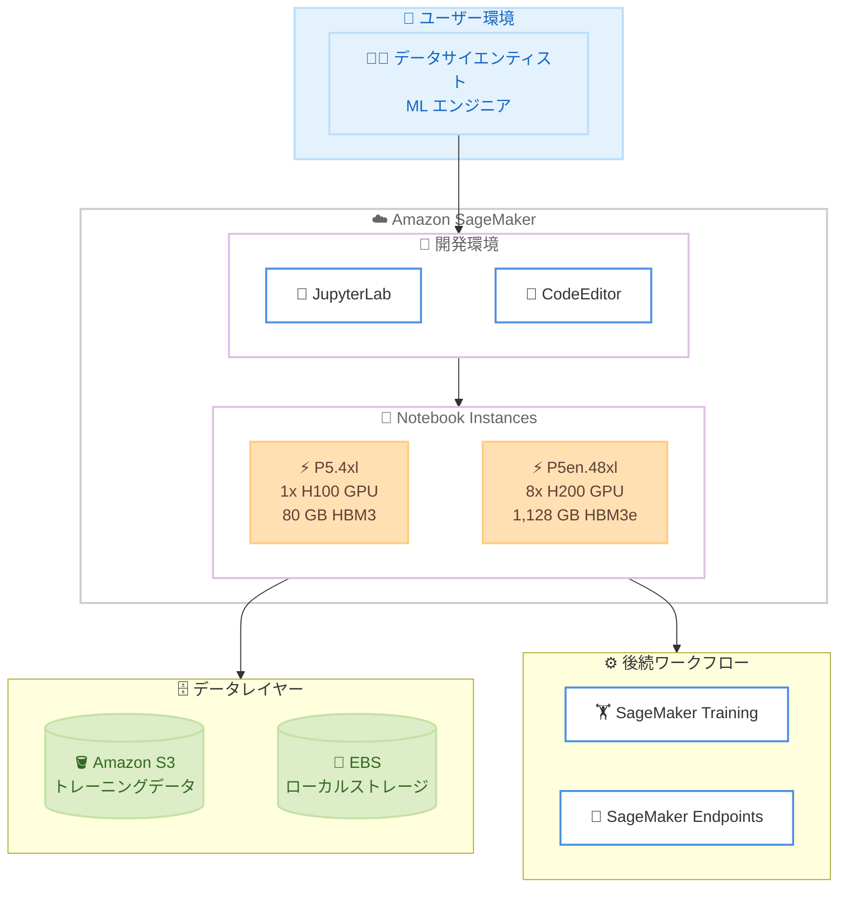

# Amazon SageMaker Notebook Instances - P5.4xl / P5en.48xl インスタンスタイプのサポート

**リリース日**: 2026 年 5 月 27 日
**サービス**: Amazon SageMaker
**機能**: SageMaker Notebook Instances における P5.4xl および P5en.48xl インスタンスタイプの追加

📊 [このアップデートのインフォグラフィックを見る](https://takech9203.github.io/aws-news-summary/20260527-g6-region-expansion-sagemaker-notebook-instances.html)

## 概要

Amazon SageMaker Notebook Instances で、NVIDIA H100 Tensor Core GPU を搭載した P5.4xl インスタンスタイプと、NVIDIA H200 GPU を搭載した P5en.48xl インスタンスタイプが利用可能になりました。これにより、ノートブック環境から直接、最新世代の GPU アクセラレーションを活用した大規模言語モデル (LLM) のトレーニング、推論、生成 AI ワークロードの開発が可能になります。

P5.4xl は前世代の GPU インスタンスと比較して最大 4 倍の処理速度向上と最大 40% のトレーニングコスト削減を実現します。P5en.48xl は 8 基の H200 GPU を搭載し、P5 インスタンスの H100 GPU と比較して 1.7 倍の GPU メモリ容量と 1.4 倍の GPU メモリ帯域幅を提供します。

対象ユーザーは、ディープラーニング、生成 AI、HPC ワークロードを SageMaker ノートブック上で開発・検証するデータサイエンティストや ML エンジニアです。

**アップデート前の課題**

- SageMaker Notebook Instances で利用可能な GPU インスタンスが旧世代に限られており、大規模モデルの開発に十分な計算リソースを確保できなかった
- LLM や大規模拡散モデルのプロトタイピングには別途 EC2 インスタンスの起動や SageMaker Training Job の利用が必要だった
- H100/H200 世代の GPU を活用するにはノートブック環境から離れる必要があり、インタラクティブな開発ワークフローが分断されていた

**アップデート後の改善**

- SageMaker Notebook Instances から直接 H100 GPU (P5.4xl) または H200 GPU (P5en.48xl) を利用可能になった
- ノートブック環境内でインタラクティブに大規模モデルの開発・デバッグ・推論テストが実行可能になった
- 前世代比で最大 4 倍の性能向上と 40% のコスト削減により、開発サイクルの大幅な短縮が実現した
- P5en.48xl の 1,128 GB HBM3e メモリにより、非常に大きなモデルもノートブック環境でロード可能になった

## アーキテクチャ図



P5.4xl および P5en.48xl インスタンスを使用した SageMaker Notebook のワークフローを示しています。ユーザーは JupyterLab または CodeEditor からノートブックインスタンスにアクセスし、GPU リソースを活用してモデル開発を行い、必要に応じて SageMaker Training や Endpoints に展開します。

## サービスアップデートの詳細

### 主要機能

1. **P5.4xl インスタンスサポート**
   - NVIDIA H100 Tensor Core GPU を 1 基搭載
   - 80 GB HBM3 GPU メモリ
   - 前世代 GPU 比で最大 4 倍の処理速度向上
   - ML モデルトレーニングコストを最大 40% 削減
   - 3.84 TB NVMe SSD インスタンスストレージ

2. **P5en.48xl インスタンスサポート**
   - NVIDIA H200 GPU を 8 基搭載
   - 1,128 GB HBM3e GPU メモリ (H100 比 1.7 倍)
   - 1.4 倍の GPU メモリ帯域幅
   - Gen5 PCIe により CPU-GPU 間帯域幅が最大 4 倍
   - 第 3 世代 EFA (Nitro v5) で 3,200 Gbps ネットワーク、レイテンシ最大 35% 改善

3. **開発環境との統合**
   - JupyterLab アプリケーションからの直接利用
   - CodeEditor アプリケーションからの直接利用
   - SageMaker Studio との連携

## 技術仕様

### インスタンスタイプ比較

| 項目 | P5.4xl | P5en.48xl |
|------|--------|-----------|
| vCPU | 16 | 192 |
| インスタンスメモリ | 256 GiB | 2 TiB |
| GPU | 1x NVIDIA H100 | 8x NVIDIA H200 |
| GPU メモリ | 80 GB HBM3 | 1,128 GB HBM3e |
| ネットワーク帯域幅 | 100 Gbps EFA | 3,200 Gbps EFA |
| GPU 間通信 | N/A | 900 GB/s NVSwitch |
| インスタンスストレージ | 3.84 TB NVMe SSD | 8x 3.84 TB NVMe SSD |
| EBS 帯域幅 | 10 Gbps | 100 Gbps |
| GPUDirect RDMA | 非対応 | 対応 |
| CPU | - | 第 4 世代 Intel Xeon Scalable |

### 主要なパフォーマンス指標

| 指標 | 詳細 |
|------|------|
| トレーニング速度向上 | 前世代 GPU 比最大 4 倍 (P5.4xl) |
| コスト削減 | ML モデルトレーニングコスト最大 40% 削減 |
| GPU メモリ向上 | H100 比 1.7 倍 (P5en.48xl) |
| メモリ帯域幅向上 | H100 比 1.4 倍 (P5en.48xl) |
| CPU-GPU 帯域幅 | Gen5 PCIe で最大 4 倍 (P5en.48xl) |
| ネットワークレイテンシ | P5 比最大 35% 改善 (P5en.48xl) |

## 設定方法

### 前提条件

1. AWS アカウントで対象リージョンにおける P5/P5en インスタンスのサービスクォータが承認されていること
2. SageMaker Notebook Instances の実行に必要な IAM ロールが設定されていること
3. 十分な EBS ストレージ割り当てがあること

### 手順

#### ステップ 1: サービスクォータの確認・申請

```bash
# 現在のクォータ値を確認
aws service-quotas get-service-quota \
  --service-code sagemaker \
  --quota-code L-[QUOTA-CODE] \
  --region us-east-1
```

P5/P5en インスタンスは需要が高いため、事前にサービスクォータの引き上げ申請が必要な場合があります。AWS Service Quotas コンソールから申請してください。

#### ステップ 2: ノートブックインスタンスの作成 (AWS CLI)

```bash
# P5.4xl インスタンスでノートブックを作成
aws sagemaker create-notebook-instance \
  --notebook-instance-name my-p5-notebook \
  --instance-type ml.p5.4xlarge \
  --role-arn arn:aws:iam::123456789012:role/SageMakerRole \
  --volume-size-in-gb 100 \
  --region us-east-1
```

指定したインスタンスタイプで SageMaker Notebook Instance を作成します。`--role-arn` には S3 やその他のリソースへのアクセス権限を持つ IAM ロールを指定します。

#### ステップ 3: ノートブックインスタンスの作成 (P5en.48xl)

```bash
# P5en.48xl インスタンスでノートブックを作成
aws sagemaker create-notebook-instance \
  --notebook-instance-name my-p5en-notebook \
  --instance-type ml.p5en.48xlarge \
  --role-arn arn:aws:iam::123456789012:role/SageMakerRole \
  --volume-size-in-gb 500 \
  --region us-east-1
```

P5en.48xl はメモリ容量が大きいため、大規模モデルのチェックポイント保存用に十分な EBS ボリュームサイズを確保することを推奨します。

#### ステップ 4: GPU の動作確認

```python
# ノートブック内で GPU の認識を確認
import torch
print(f"CUDA available: {torch.cuda.is_available()}")
print(f"GPU count: {torch.cuda.device_count()}")
print(f"GPU name: {torch.cuda.get_device_name(0)}")
print(f"GPU memory: {torch.cuda.get_device_properties(0).total_mem / 1e9:.1f} GB")
```

ノートブック起動後、PyTorch などのフレームワークから GPU が正しく認識されていることを確認します。

## メリット

### ビジネス面

- **開発サイクルの短縮**: ノートブック環境から直接最新 GPU にアクセスできるため、プロトタイピングから本番移行までの時間を大幅に削減
- **コスト最適化**: P5.4xl により前世代比 40% のトレーニングコスト削減を実現し、ML プロジェクトの ROI を向上
- **チームの生産性向上**: インタラクティブな開発環境で最新 GPU を利用でき、環境構築の手間なくすぐに実験を開始可能

### 技術面

- **大規模モデル対応**: P5en.48xl の 1,128 GB GPU メモリにより、数百億パラメータ規模のモデルをノートブック上で直接ロード・実験可能
- **高速ネットワーク**: 3,200 Gbps EFA と NVSwitch により、マルチ GPU でのモデル並列処理を効率的に実行
- **最新 GPU アーキテクチャ**: H100/H200 の Transformer Engine、FP8 演算など最新機能をインタラクティブに活用可能

## デメリット・制約事項

### 制限事項

- P5en.48xl は 4 リージョンのみで利用可能 (米国東部バージニア北部、オハイオ、米国西部オレゴン、アジアパシフィック東京)
- P5/P5en インスタンスはサービスクォータの引き上げが必要な場合が多く、即座に利用開始できない可能性がある
- 高性能インスタンスのため、使用時間に対するコストが高く、アイドル時間の管理が重要

### 考慮すべき点

- ノートブックインスタンスは停止しない限り課金が継続するため、ライフサイクル設定による自動停止の構成を推奨
- P5en.48xl は 192 vCPU/2 TiB メモリと非常に大規模なインスタンスであり、開発・検証用途では P5.4xl で十分な場合も多い
- GPU ドライバーや CUDA バージョンの互換性を事前に確認する必要がある

## ユースケース

### ユースケース 1: 大規模言語モデルのファインチューニング開発

**シナリオ**: データサイエンティストが数十億パラメータの LLM に対して、自社ドメインデータでファインチューニングのプロトタイピングを行う。

**実装例**:
```python
# P5en.48xl ノートブックでの LLM ファインチューニング
from transformers import AutoModelForCausalLM, AutoTokenizer, TrainingArguments
from peft import LoraConfig, get_peft_model

model = AutoModelForCausalLM.from_pretrained(
    "meta-llama/Llama-3-70B",
    device_map="auto",
    torch_dtype=torch.bfloat16
)

lora_config = LoraConfig(r=16, lora_alpha=32, target_modules=["q_proj", "v_proj"])
model = get_peft_model(model, lora_config)

training_args = TrainingArguments(
    output_dir="./results",
    per_device_train_batch_size=4,
    num_train_epochs=3,
    bf16=True,
)
```

**効果**: 8 基の H200 GPU と 1,128 GB GPU メモリにより、70B パラメータモデルもメモリ不足なくロードし、インタラクティブにファインチューニングパラメータを調整可能。

### ユースケース 2: 画像生成モデルの実験

**シナリオ**: ML エンジニアが大規模拡散モデルのプロンプトエンジニアリングと推論パイプラインの最適化をインタラクティブに行う。

**実装例**:
```python
# P5.4xl ノートブックでの画像生成
from diffusers import StableDiffusionXLPipeline
import torch

pipe = StableDiffusionXLPipeline.from_pretrained(
    "stabilityai/stable-diffusion-xl-base-1.0",
    torch_dtype=torch.float16,
    variant="fp16"
).to("cuda")

# H100 の高速推論で画像を生成
image = pipe(
    prompt="A futuristic Tokyo cityscape at sunset",
    num_inference_steps=30,
    guidance_scale=7.5
).images[0]
```

**効果**: H100 GPU の高いスループットにより、画像生成の推論が前世代比約 4 倍高速化され、パラメータ調整の反復サイクルを大幅に短縮。

### ユースケース 3: マルチモーダル AI 研究

**シナリオ**: 研究チームがビデオ理解モデルや音声認識モデルなど、大量の GPU メモリを必要とするマルチモーダルモデルの実験を行う。

**実装例**:
```python
# P5en.48xl でのマルチモーダルモデルロード
from transformers import AutoProcessor, AutoModel

model = AutoModel.from_pretrained(
    "large-multimodal-model",
    device_map="auto",
    torch_dtype=torch.bfloat16,
)
processor = AutoProcessor.from_pretrained("large-multimodal-model")

# 8 GPU に自動分散配置
inputs = processor(
    text="Describe this video",
    videos=video_frames,
    return_tensors="pt"
).to("cuda")

outputs = model.generate(**inputs, max_new_tokens=512)
```

**効果**: 1,128 GB の GPU メモリと NVSwitch によるGPU 間高速通信により、数百 GB 規模のマルチモーダルモデルを単一ノートブックインスタンスでロード・実験可能。

## 料金

SageMaker Notebook Instances の P5/P5en インスタンス料金は、使用時間に基づいて課金されます。具体的な時間単価はリージョンにより異なりますが、一般的に P5en.48xl は P5.4xl よりも大幅に高額です。

### 料金の目安

| インスタンスタイプ | 料金体系 | 備考 |
|-------------------|----------|------|
| ml.p5.4xlarge | 時間課金 | 個人開発・小規模実験向け |
| ml.p5en.48xlarge | 時間課金 | 大規模モデル・チーム利用向け |

**コスト最適化のポイント**:
- ライフサイクル設定で自動停止を構成し、アイドル時間の課金を防止
- 開発・検証には P5.4xl を使用し、大規模実験時のみ P5en.48xl にスケールアップ
- 長時間トレーニングには SageMaker Training Job の利用を検討

## 利用可能リージョン

### P5.4xl

| リージョン | リージョンコード |
|-----------|----------------|
| 米国東部 (バージニア北部) | us-east-1 |
| 米国東部 (オハイオ) | us-east-2 |
| 米国西部 (オレゴン) | us-west-2 |
| アジアパシフィック (ムンバイ) | ap-south-1 |
| アジアパシフィック (東京) | ap-northeast-1 |
| アジアパシフィック (ジャカルタ) | ap-southeast-3 |
| 南米 (サンパウロ) | sa-east-1 |

### P5en.48xl

| リージョン | リージョンコード |
|-----------|----------------|
| 米国東部 (バージニア北部) | us-east-1 |
| 米国東部 (オハイオ) | us-east-2 |
| 米国西部 (オレゴン) | us-west-2 |
| アジアパシフィック (東京) | ap-northeast-1 |

## 関連サービス・機能

- **Amazon EC2 P5/P5en インスタンス**: 基盤となる GPU コンピューティングインスタンス。SageMaker 外での直接利用も可能
- **Amazon SageMaker Training**: 大規模な分散トレーニングジョブの実行に最適。ノートブックでのプロトタイプ後に移行
- **Amazon SageMaker Studio**: JupyterLab と CodeEditor を提供する統合開発環境。P5/P5en インスタンスとの連携が可能
- **AWS Service Quotas**: P5/P5en インスタンスの利用にはクォータの確認・引き上げ申請が必要

## 参考リンク

- 📊 [インフォグラフィック](https://takech9203.github.io/aws-news-summary/20260527-g6-region-expansion-sagemaker-notebook-instances.html)
- [公式発表 - P5.4xl (What's New)](https://aws.amazon.com/about-aws/whats-new/2026/03/g6-region-expansion-sagemaker-notebook-instances/)
- [公式発表 - P5en.48xl (What's New)](https://aws.amazon.com/about-aws/whats-new/2026/02/g6-region-expansion-sagemaker-notebook-instances/)
- [Amazon EC2 P5 インスタンスタイプ](https://aws.amazon.com/ec2/instance-types/p5/)
- [SageMaker Notebook Instances ドキュメント](https://docs.aws.amazon.com/sagemaker/latest/dg/nbi.html)
- [SageMaker 料金ページ](https://aws.amazon.com/sagemaker/pricing/)

## まとめ

SageMaker Notebook Instances での P5.4xl および P5en.48xl サポートにより、最新の NVIDIA H100/H200 GPU をインタラクティブな開発環境から直接活用できるようになりました。特に東京リージョンで両インスタンスタイプが利用可能なため、日本のユーザーは低レイテンシで大規模 AI/ML ワークロードの開発・検証を行えます。まずはサービスクォータの確認・申請を行い、P5.4xl での小規模実験から開始することを推奨します。
