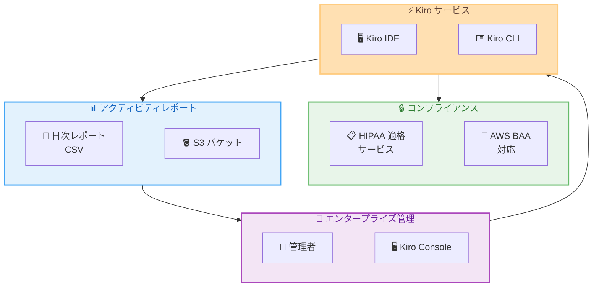

# Kiro - エンタープライズ対応強化: HIPAA 適格サービス指定とアクティビティレポートのメールアドレス対応

**リリース日**: 2026年5月27日
**サービス**: Kiro (AWS が提供する AI 搭載 IDE)
**機能**: HIPAA Eligible Service 指定 / User_Email in Activity Reports

📊 [このアップデートのインフォグラフィックを見る](https://takech9203.github.io/aws-news-summary/20260527-kiro-changelog-2026-05-27.html)

## 概要

Kiro に 2 つのエンタープライズ向けアップデートが発表された。1 つ目は Kiro が AWS HIPAA Eligible Services Reference に追加されたこと、2 つ目は日次ユーザーアクティビティレポートに User_Email カラムが追加されたことである。

これらのアップデートにより、医療業界をはじめとする規制の厳しい業界での Kiro 導入が可能になるとともに、エンタープライズ管理者がユーザーのアクティビティをより効率的に追跡・管理できるようになった。コンプライアンスと運用管理の両面で、Kiro のエンタープライズ対応が大幅に強化されている。

**アップデート前の課題**

- HIPAA 対象の組織では、Kiro を PHI (Protected Health Information) を扱うワークロードで使用できなかった
- アクティビティレポートでユーザーを特定するには、ユーザー ID を別のディレクトリと照合する必要があった
- エンタープライズ管理者が個々のユーザーの利用状況を迅速に把握することが困難だった

**アップデート後の改善**

- HIPAA 対象組織が Kiro IDE および CLI をコンプライアンス準拠のワークロードとして利用可能になった
- アクティビティレポートに User_Email カラムが追加され、ユーザーの即座の特定が可能になった
- 管理者がユーザー ID の照合作業なしに、直接メールアドレスでアクティビティを確認できるようになった

## アーキテクチャ図



Kiro のエンタープライズコンプライアンスアーキテクチャを示す図。HIPAA 適格サービスとしての認定と、S3 バケットに配信される日次アクティビティレポートの 2 つの柱でエンタープライズ管理を支援する構成となっている。

## サービスアップデートの詳細

### 主要機能

1. **HIPAA Eligible Service 指定**
   - Kiro が AWS HIPAA Eligible Services Reference に追加された
   - HIPAA の対象となる組織が、コンプライアンス準拠のワークロードの一部として Kiro を利用可能
   - 対象は Kiro IDE および Kiro CLI (Kiro Web は現時点で HIPAA 適格サービスに含まれない)
   - AWS Business Associate Agreement (BAA) の対象サービスとして利用可能

2. **User_Email カラムの追加**
   - 日次ユーザーアクティビティレポートに User_Email カラムが新規追加
   - S3 バケットに配信される CSV ファイルに、各ユーザーのメールアドレスが含まれるように変更
   - 既存の Total_Messages などのフィールドと並んで表示される
   - エンタープライズ管理者がユーザー ID を別システムで照合する必要がなくなった

3. **エンタープライズガバナンスの強化**
   - コンプライアンス要件と運用管理の両面でエンタープライズ対応を拡充
   - 規制業界での AI 搭載 IDE の導入障壁を低減
   - 管理者の運用効率を向上させるレポート改善

## 技術仕様

### アクティビティレポートの構成

| 項目 | 詳細 |
|------|------|
| レポート形式 | CSV ファイル |
| 配信先 | S3 バケット |
| 配信頻度 | 日次 |
| 新規カラム | User_Email |
| 既存カラム | User_Id、Total_Messages など |

### HIPAA 適格サービスの対象範囲

| 対象 | HIPAA 適格 |
|------|-----------|
| Kiro IDE | 対象 |
| Kiro CLI | 対象 |
| Kiro Web | 対象外 |

## 設定方法

### 前提条件

1. Kiro のエンタープライズプランを利用していること
2. AWS Organizations と連携済みであること
3. アクティビティレポートの配信先 S3 バケットが設定済みであること

### 手順

#### ステップ 1: HIPAA ワークロードでの利用開始

HIPAA 対象のワークロードで Kiro を利用するには、AWS BAA (Business Associate Agreement) が締結されていることを確認する。

```bash
# AWS アカウントの BAA ステータスを確認
aws artifact get-agreement --agreement-type BAA
```

BAA が有効であることを確認し、Kiro IDE または CLI を HIPAA 準拠のワークロードで使用可能となる。

#### ステップ 2: アクティビティレポートの確認

日次アクティビティレポートは設定済みの S3 バケットに自動配信される。新しい User_Email カラムは追加設定なしで利用可能。

```bash
# S3 バケットから最新のアクティビティレポートを確認
aws s3 ls s3://your-kiro-reports-bucket/activity-reports/ --recursive | tail -5

# レポートをダウンロードして内容を確認
aws s3 cp s3://your-kiro-reports-bucket/activity-reports/latest-report.csv ./
```

ダウンロードした CSV ファイルに User_Email カラムが含まれていることを確認する。

## メリット

### ビジネス面

- **医療業界への展開**: HIPAA 適格サービスとなったことで、医療機関やヘルスケア企業での AI 搭載 IDE 導入が可能になった
- **コンプライアンスの簡素化**: AWS BAA の対象として、既存のコンプライアンスフレームワーク内で Kiro を管理可能
- **運用コストの削減**: アクティビティレポートでのユーザー特定作業が効率化され、管理者の工数が削減

### 技術面

- **監査対応の強化**: User_Email カラムにより、監査時のユーザー特定と追跡が容易に
- **レポート統合の容易化**: メールアドレスベースでの他システムとの連携が簡単に実現可能
- **セキュリティ態勢の向上**: PHI を扱う開発環境でも適切なセキュリティ管理下で AI IDE を利用可能

## デメリット・制約事項

### 制限事項

- Kiro Web は現時点で HIPAA 適格サービスに含まれない
- HIPAA 準拠で利用するには AWS BAA の締結が必須
- アクティビティレポートはエンタープライズプランでのみ利用可能

### 考慮すべき点

- PHI を含む開発ワークロードでは、Kiro の利用に加えて適切なアクセス制御と暗号化の設定が必要
- User_Email カラムの追加により、レポートに PII (個人識別情報) が含まれるため、レポート保管先の S3 バケットのアクセス制御を適切に設定する必要がある

## ユースケース

### ユースケース 1: 医療系スタートアップでの AI 開発環境導入

**シナリオ**: ヘルスケアアプリケーションを開発するスタートアップが、HIPAA 準拠の開発環境で AI 搭載 IDE を利用したい。

**実装例**:
```
1. AWS BAA を締結
2. Kiro IDE をエンタープライズプランで導入
3. PHI を含むデータを扱う開発ワークロードで Kiro IDE/CLI を使用
4. コンプライアンス監査時に Kiro の利用を HIPAA 適格サービスとして報告
```

**効果**: HIPAA 準拠を維持しながら、AI を活用した高生産性の開発環境を実現できる。

### ユースケース 2: 大規模組織でのユーザー利用状況監視

**シナリオ**: 500 名以上の開発者が Kiro を利用する企業で、管理者が各ユーザーの利用状況を効率的に把握したい。

**実装例**:
```
1. アクティビティレポートの S3 配信を設定
2. 日次レポートの User_Email カラムを活用
3. 社内の ID 管理システムとメールアドレスベースで連携
4. 利用状況のダッシュボードを構築
```

**効果**: ユーザー ID の手動照合が不要になり、管理者の運用工数を大幅に削減できる。

### ユースケース 3: コンプライアンス監査への対応

**シナリオ**: 規制業界の企業が、AI ツールの利用に関するコンプライアンス監査を受ける際に、ユーザーごとの利用実績を提出する必要がある。

**実装例**:
```
1. S3 バケットに蓄積された日次アクティビティレポートを収集
2. User_Email カラムで監査対象ユーザーをフィルタリング
3. Total_Messages と組み合わせて利用実績レポートを作成
4. HIPAA 適格サービスとしての証跡を提出
```

**効果**: 監査対応に必要なデータを迅速に収集・提出でき、コンプライアンス対応の工数を削減できる。

## 料金

Kiro の料金プランは以下の通り。今回のアップデートによる追加料金は発生しない。

| プラン | 月額料金 | クレジット |
|--------|----------|-----------|
| Free | $0 | 50 クレジット/月 |
| Pro | $20 | 1,000 クレジット/月 |
| Pro+ | $40 | 2,000 クレジット/月 |
| Power | $200 | 10,000 クレジット/月 |

HIPAA 適格サービスとしての利用およびアクティビティレポートの User_Email カラム対応は、エンタープライズプラン (要問い合わせ) で利用可能。

## 利用可能リージョン

グローバル - Kiro はグローバルサービスとして提供されており、世界中から利用可能。HIPAA 適格サービスとしての利用は AWS BAA が締結されたアカウントで有効となる。

## 関連サービス・機能

- **AWS IAM Identity Center**: Kiro のエンタープライズ向け ID 管理と SSO 連携に使用
- **Amazon S3**: アクティビティレポートの配信先バケットとして使用
- **AWS Artifact**: BAA (Business Associate Agreement) の管理と確認に使用
- **AWS Organizations**: エンタープライズアカウントの組織管理に使用

## 参考リンク

- 📊 [インフォグラフィック](https://takech9203.github.io/aws-news-summary/20260527-kiro-changelog-2026-05-27.html)
- [Kiro Changelog](https://kiro.dev/changelog/)
- [Kiro コンプライアンス検証ドキュメント](https://kiro.dev/docs/privacy-and-security/compliance-validation/)
- [AWS HIPAA Eligible Services Reference](https://aws.amazon.com/compliance/hipaa-eligible-services-reference/)
- [Kiro 料金ページ](https://kiro.dev/pricing/)

## まとめ

今回のアップデートにより、Kiro は HIPAA 適格サービスとしての認定とアクティビティレポートの改善という 2 つの側面でエンタープライズ対応を強化した。医療業界を含む規制の厳しい業界での AI 搭載 IDE の導入が可能になるとともに、大規模組織での運用管理が効率化される。エンタープライズで Kiro を利用している組織は、HIPAA 準拠のワークロードでの活用を検討し、アクティビティレポートの新しい User_Email カラムを活用した運用改善に取り組むことを推奨する。
