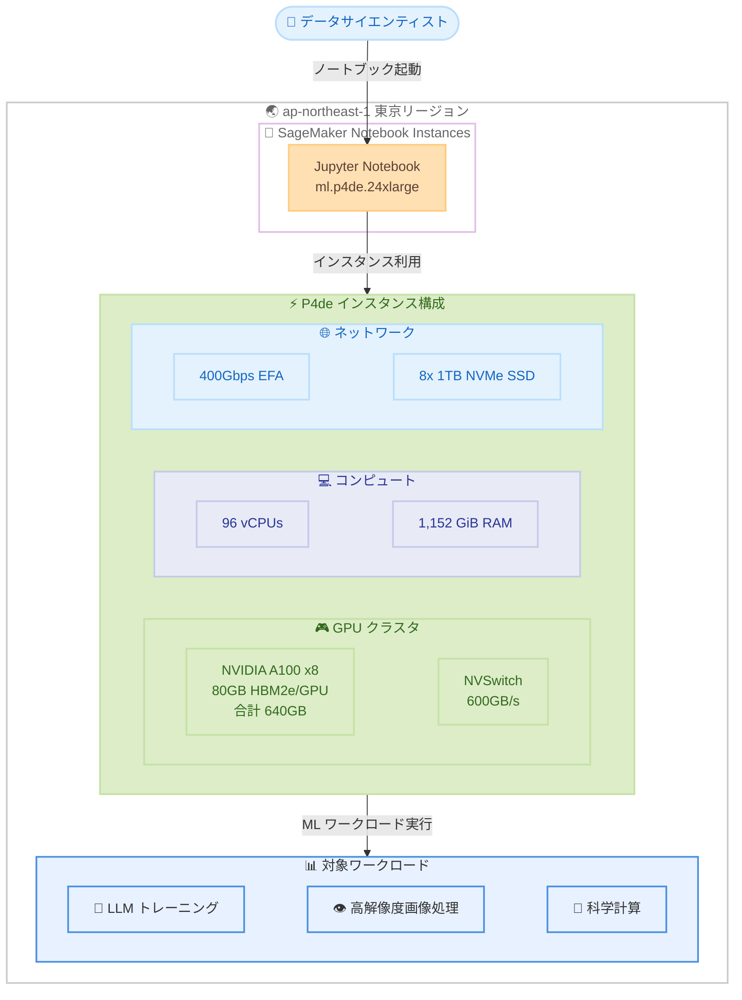

# Amazon SageMaker Notebook Instances - P4de インスタンスのリージョン拡張

**リリース日**: 2026 年 5 月 27 日
**サービス**: Amazon SageMaker Notebook Instances
**機能**: P4de インスタンスのリージョン拡張 (東京)

📊 [このアップデートのインフォグラフィックを見る](https://takech9203.github.io/aws-news-summary/20260527-p4de-region-expansion-sagemaker-notebook-instances.html)

## 概要

Amazon EC2 P4de インスタンスが、SageMaker Notebook Instances 上でアジアパシフィック (東京) リージョンにて一般提供開始されました。P4de インスタンスは 8 基の NVIDIA A100 Tensor Core GPU を搭載し、GPU あたり 80GB の高性能 HBM2e メモリを備えています。これは現行の P4d インスタンスの 2 倍のメモリ容量であり、大規模データセットや高解像度データを用いたトレーニングワークロードに最適化されています。

P4de インスタンスは合計 640GB の GPU メモリを提供し、P4d インスタンスと比較して最大 60% の ML トレーニング性能向上と 20% のトレーニングコスト削減を実現します。これにより、モデルのトレーニング時間を大幅に短縮し、市場投入までの時間を加速できます。

今回のアップデートは SageMaker Notebook Instances を対象としたリージョン拡張であり、2026 年 5 月 11 日に発表された SageMaker Studio ノートブックでの P4de 対応に続くものです。これにより、従来の SageMaker Notebook Instances を利用しているお客様も、東京リージョンで高性能 GPU コンピューティングリソースを活用できるようになりました。

**アップデート前の課題**

- SageMaker Notebook Instances での P4de インスタンスの利用が限られたリージョンでのみ可能であり、東京リージョンのお客様はデータを他リージョンに転送する必要がありました
- 東京リージョンで SageMaker Notebook Instances を使用するお客様は P4d インスタンス (GPU あたり 40GB) に制限されており、大規模モデルのトレーニングにおいてメモリ制約がありました
- データレジデンシー要件のある日本のお客様は、高性能 GPU インスタンスの利用と法規制遵守の間でトレードオフを迫られていました

**アップデート後の改善**

- 東京リージョンで P4de インスタンスを SageMaker Notebook Instances から直接利用できるようになりました
- GPU あたり 80GB のメモリ (合計 640GB) により、大規模モデルのトレーニングがローカルリージョンで可能になりました
- P4d 比で最大 60% の性能向上と 20% のコスト削減を享受しながら、日本国内のデータレジデンシー要件を満たせるようになりました

## アーキテクチャ図



この図は、東京リージョンの SageMaker Notebook Instances で P4de インスタンスを利用する構成を示しています。8 基の NVIDIA A100 GPU、96 vCPUs、1,152 GiB RAM、400Gbps EFA ネットワークを活用して、大規模な ML トレーニングワークロードを実行できます。

## サービスアップデートの詳細

### 主要機能

1. **P4de インスタンスの東京リージョン対応**
   - アジアパシフィック (東京) ap-northeast-1 で SageMaker Notebook Instances から利用可能
   - インスタンスタイプ `ml.p4de.24xlarge` として起動可能
   - JupyterLab および Jupyter Notebook インターフェースから直接アクセス

2. **NVIDIA A100 GPU の大容量メモリ**
   - GPU あたり 80GB の HBM2e メモリ (P4d の 40GB から 2 倍増)
   - 8 基の GPU で合計 640GB の GPU メモリ容量
   - 大規模モデルやデータセットのメモリ内処理が可能

3. **高性能コンピューティングアーキテクチャ**
   - NVSwitch による GPU 間 600GB/s の高速インターコネクト
   - 400Gbps EFA (Elastic Fabric Adapter) による低レイテンシーネットワーク
   - GPUDirect RDMA 対応による効率的な GPU 間通信
   - 8 x 1TB NVMe SSD のローカルストレージ

## 技術仕様

### P4de インスタンス仕様

| 項目 | P4de.24xlarge | P4d.24xlarge (参考) |
|------|---------------|---------------------|
| GPU | NVIDIA A100 Tensor Core x8 | NVIDIA A100 Tensor Core x8 |
| GPU メモリ (per GPU) | 80GB HBM2e | 40GB HBM2 |
| GPU メモリ (合計) | 640GB | 320GB |
| vCPUs | 96 | 96 |
| システムメモリ | 1,152 GiB | 1,152 GiB |
| GPU インターコネクト | NVSwitch 600GB/s | NVSwitch 600GB/s |
| ネットワーク帯域幅 | 400Gbps ENA + EFA | 400Gbps ENA + EFA |
| GPUDirect RDMA | 対応 | 対応 |
| ローカルストレージ | 8 x 1,000GB NVMe SSD | 8 x 1,000GB NVMe SSD |
| EBS 帯域幅 | 19Gbps | 19Gbps |
| ML トレーニング性能 | 最大 60% 向上 (P4d 比) | ベースライン |
| トレーニングコスト | 20% 削減 (P4d 比) | ベースライン |

### API 変更履歴

| 日付 | サービス | 変更内容 |
|------|----------|----------|
| 2026/05/27 | [Amazon SageMaker Service](https://awsapichanges.com/archive/changes/0a7d57-api.sagemaker.html) | 7 updated methods - HyperPod の共有環境サポート追加、p6 インスタンスの推薦ジョブ対応 |

### SageMaker Notebook Instances でのインスタンスタイプ指定

SageMaker Notebook Instances で P4de インスタンスを使用する場合、インスタンスタイプ `ml.p4de.24xlarge` を指定します。

```json
{
  "NotebookInstanceName": "my-p4de-notebook",
  "InstanceType": "ml.p4de.24xlarge",
  "RoleArn": "arn:aws:iam::<account-id>:role/SageMakerExecutionRole",
  "VolumeSizeInGB": 100
}
```

## 設定方法

### 前提条件

1. 東京リージョン (ap-northeast-1) の AWS アカウントが有効であること
2. P4de インスタンスの Service Quotas が承認されていること (デフォルトは 0 のため、引き上げリクエストが必要)
3. IAM ロールに SageMaker Notebook Instances の作成・起動権限が付与されていること

### 手順

#### ステップ 1: Service Quotas の確認と引き上げリクエスト

```bash
aws service-quotas get-service-quota \
  --service-code sagemaker \
  --quota-code L-B1F0D5DE \
  --region ap-northeast-1
```

P4de インスタンスのクォータ制限値を確認します。デフォルトでは 0 に設定されているため、利用前に AWS コンソールまたは CLI から引き上げリクエストを送信する必要があります。

#### ステップ 2: SageMaker Notebook Instance の作成

```bash
aws sagemaker create-notebook-instance \
  --notebook-instance-name my-p4de-notebook \
  --instance-type ml.p4de.24xlarge \
  --role-arn arn:aws:iam::<account-id>:role/SageMakerExecutionRole \
  --volume-size-in-gb 100 \
  --region ap-northeast-1
```

P4de インスタンスタイプを指定して SageMaker Notebook Instance を作成します。AWS マネジメントコンソールからも同様にインスタンスタイプを選択して作成できます。

#### ステップ 3: GPU の動作確認

```python
import torch

# GPU の利用可能性を確認
print(f"GPU available: {torch.cuda.is_available()}")
print(f"GPU count: {torch.cuda.device_count()}")
for i in range(torch.cuda.device_count()):
    print(f"GPU {i}: {torch.cuda.get_device_name(i)}")
    props = torch.cuda.get_device_properties(i)
    print(f"  Memory: {props.total_mem / 1e9:.1f} GB")
```

ノートブック上で GPU が正しく認識されていることを確認します。8 基の NVIDIA A100 GPU と各 80GB のメモリが表示されるはずです。

## メリット

### ビジネス面

- **市場投入時間の短縮**: P4d 比で最大 60% の性能向上により、モデルトレーニングのイテレーションサイクルが大幅に短縮されます
- **トレーニングコストの最適化**: P4d 比で 20% のトレーニングコスト削減により、同等のジョブをより安価に完了できます
- **データレジデンシー遵守**: 東京リージョンでの利用により、日本国内のデータ保護規制に準拠した ML ワークロードの実行が可能になります

### 技術面

- **大規模モデルのサポート**: 合計 640GB の GPU メモリにより、数十億パラメータの大規模モデルをメモリ内に保持してトレーニングできます
- **高解像度データの処理**: 増加した GPU メモリにより、高解像度の画像、動画、科学データのバッチサイズを拡大でき、トレーニング効率が向上します
- **低レイテンシーアクセス**: 東京リージョンでの実行により、日本国内からのデータ転送オーバーヘッドとネットワークレイテンシーが最小化されます

## デメリット・制約事項

### 制限事項

- Service Quotas の引き上げリクエストが必要であり、承認まで数日かかる場合があります
- P4de インスタンスは高コストなため、小規模なトレーニングジョブや推論ワークロードには過剰スペックとなる可能性があります
- SageMaker Notebook Instances は単一インスタンスでの実行に限定されるため、マルチノード分散トレーニングには SageMaker Training Jobs の利用が必要です

### 考慮すべき点

- GPU メモリ使用率を監視し、リソースの無駄を防ぐために適切なインスタンスサイズを選択することが重要です
- ノートブックの自動停止ライフサイクル設定を構成し、未使用時のコスト発生を防止する必要があります
- 分散トレーニング (NCCL, PyTorch DDP など) の設定を適切に行い、8 基の GPU を効率的に活用するコードの最適化が求められます

## ユースケース

### ユースケース 1: 大規模言語モデルのファインチューニング

**シナリオ**: 日本語特化の LLM を東京リージョンのデータレジデンシー要件下でファインチューニングする必要がある組織

**実装例**:
```python
from transformers import AutoModelForCausalLM, TrainingArguments, Trainer

model = AutoModelForCausalLM.from_pretrained(
    "japanese-llm-base-7b",
    torch_dtype=torch.bfloat16,
    device_map="auto"  # 8 GPU に自動分散
)

training_args = TrainingArguments(
    output_dir="./output",
    per_device_train_batch_size=8,
    gradient_accumulation_steps=4,
    bf16=True,
    dataloader_num_workers=8,
)
```

**効果**: 640GB の GPU メモリにより、70 億パラメータ規模のモデルのフルパラメータファインチューニングがメモリ内で完結し、データを国外に転送することなく東京リージョンで完了できます。

### ユースケース 2: 高解像度画像を用いたコンピュータビジョン

**シナリオ**: 製造業の品質検査において、高解像度の製品画像を用いた異常検知モデルをトレーニングする場合

**実装例**:
```python
import torch
from torchvision import models

# 高解像度画像に対応した大バッチトレーニング
model = models.resnet152(pretrained=True)
model = torch.nn.DataParallel(model)  # 8 GPU で並列化
model = model.cuda()

# 80GB/GPU により大きなバッチサイズが可能
batch_size = 256  # 高解像度 4096x4096 画像
```

**効果**: 増加した GPU メモリにより、高解像度画像をダウンサンプリングせずにフル解像度でトレーニングに使用でき、微細な欠陥の検出精度が向上します。

### ユースケース 3: 科学計算シミュレーション

**シナリオ**: 大規模な物理シミュレーションや分子動力学計算をインタラクティブに実行する研究機関

**実装例**:
```python
import cupy as cp
import numpy as np

# 大規模シミュレーションデータを GPU メモリ上に展開
simulation_data = cp.random.randn(100000, 100000, dtype=cp.float32)

# 640GB の GPU メモリにより大規模行列演算が可能
result = cp.linalg.svd(simulation_data)
```

**効果**: 合計 640GB の GPU メモリと NVSwitch による高速 GPU 間通信を活用し、Jupyter ノートブック上でインタラクティブに大規模科学計算を実行できます。

## 料金

P4de インスタンスの料金はリージョンによって異なります。SageMaker Notebook Instances での利用は秒単位の課金となります。

### 料金例

| リージョン | インスタンスタイプ | オンデマンド料金 (概算) |
|-----------|-------------------|------------------------|
| ap-northeast-1 (東京) | ml.p4de.24xlarge | 約 $40-45/時間 |
| us-east-1 (バージニア北部) | ml.p4de.24xlarge | 約 $40/時間 |
| us-west-2 (オレゴン) | ml.p4de.24xlarge | 約 $40/時間 |

※ 正確な料金は AWS 公式料金ページを参照してください。P4d 比で 20% のコスト削減は、同等のトレーニングジョブを完了するまでの総コストに基づいた比較です。

## 利用可能リージョン

今回のアップデートにより、以下のリージョンで SageMaker Notebook Instances 上の P4de インスタンスが利用可能になりました。

| リージョン | リージョンコード | 状態 |
|-----------|-----------------|------|
| アジアパシフィック (東京) | ap-northeast-1 | 新規追加 |
| 米国東部 (バージニア北部) | us-east-1 | 既存 |
| 米国西部 (オレゴン) | us-west-2 | 既存 |

## 関連サービス・機能

- **Amazon SageMaker Studio**: SageMaker Studio ノートブックでも P4de インスタンスが利用可能 (2026 年 5 月 11 日より東京リージョン対応済み)
- **Amazon EC2 P4de インスタンス**: SageMaker Notebook Instances の基盤となるコンピューティングインスタンス。EC2 上でも直接利用可能
- **Amazon SageMaker Training Jobs**: ノートブックでのプロトタイピング後に、マネージドトレーニングジョブとしてスケールアウトする際に利用

## 参考リンク

- 📊 [インフォグラフィック](https://takech9203.github.io/aws-news-summary/20260527-p4de-region-expansion-sagemaker-notebook-instances.html)
- [公式発表 (What's New)](https://aws.amazon.com/about-aws/whats-new/2026/04/p4de-region-expansion-sagemaker-notebook-instances/)
- [Amazon SageMaker Notebook Instances ドキュメント](https://docs.aws.amazon.com/sagemaker/latest/dg/nbi.html)
- [Amazon EC2 P4de インスタンス](https://aws.amazon.com/ec2/instance-types/p4/)
- [SageMaker 料金ページ](https://aws.amazon.com/sagemaker/pricing/)

## まとめ

P4de インスタンスの SageMaker Notebook Instances での東京リージョン対応は、従来の SageMaker Notebook Instances を利用している日本のお客様にとって重要なアップデートです。640GB の大容量 GPU メモリと P4d 比で最大 60% の性能向上により、大規模モデルのトレーニングや高解像度データの処理をデータレジデンシー要件を満たしながらローカルリージョンで実行できます。P4de インスタンスの利用を検討される場合は、事前に Service Quotas の引き上げリクエストを申請し、ノートブックの自動停止設定によるコスト管理も併せて構成することを推奨します。
