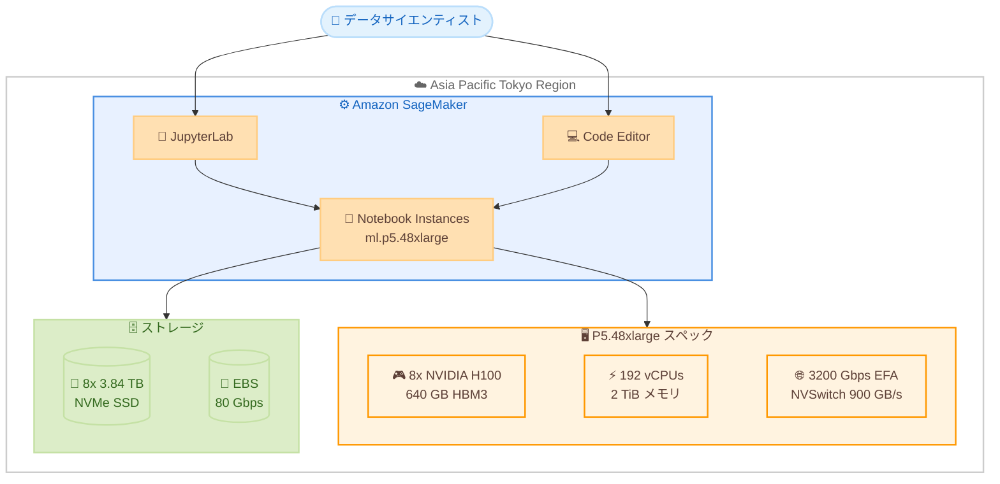

# Amazon SageMaker - P5.48xl インスタンスのリージョン拡大 (Notebook Instances)

**リリース日**: 2026 年 5 月 27 日
**サービス**: Amazon SageMaker
**機能**: P5.48xlarge インスタンスの SageMaker Notebook Instances での利用可能リージョン拡大

📊 [このアップデートのインフォグラフィックを見る](https://takech9203.github.io/aws-news-summary/20260527-p5-48xl-region-expansion-sagemaker-notebook-instances.html)

## 概要

Amazon SageMaker Notebook Instances において、P5.48xlarge インスタンスがアジアパシフィック (東京) リージョンで利用可能になった。P5.48xlarge は NVIDIA H100 Tensor Core GPU を 8 基搭載した高性能インスタンスであり、大規模言語モデル (LLM) のトレーニングや生成 AI ワークロードに最適化されている。

今回のリージョン拡大により、東京リージョンのユーザーは SageMaker Notebook Instances 上で P5.48xlarge インスタンスを直接利用し、深層学習やハイパフォーマンスコンピューティング (HPC) のワークロードを実行できるようになった。前世代の GPU ベース EC2 インスタンスと比較して、最大 4 倍高速なトレーニング時間と最大 40% のコスト削減を実現する。

**アップデート前の課題**

- P5.48xlarge インスタンスを SageMaker Notebook Instances で利用できるリージョンが限定されていた
- 東京リージョンのユーザーは、大規模 AI/ML ワークロードの実行時に他リージョンへのデータ転送が必要だった
- データレジデンシー要件がある日本のユーザーにとって、高性能 GPU インスタンスへのアクセスが制限されていた

**アップデート後の改善**

- 東京リージョンで P5.48xlarge インスタンスが SageMaker Notebook Instances で直接利用可能になった
- データを国内に保持しながら、最新の H100 GPU による高性能なトレーニング環境を構築可能になった
- レイテンシーの削減とデータ転送コストの排除により、開発効率が向上した

## アーキテクチャ図



P5.48xlarge インスタンスは 8 基の NVIDIA H100 GPU と 3200 Gbps EFA ネットワークを備え、SageMaker Notebook Instances 上で大規模 AI/ML ワークロードを実行するための高性能な計算環境を提供する。

## サービスアップデートの詳細

### 主要機能

1. **NVIDIA H100 Tensor Core GPU**
   - 8 基の H100 GPU を搭載し、合計 640 GB の HBM3 メモリを提供
   - GPU 間通信は NVSwitch により 900 GB/s の帯域幅を実現
   - FP8、FP16、BF16、TF32 などの混合精度演算をサポート

2. **高帯域ネットワーキング**
   - 3200 Gbps の Elastic Fabric Adapter (EFA) ネットワーク帯域幅
   - GPUDirect RDMA による GPU 間の低レイテンシー通信
   - EBS 帯域幅 80 Gbps による高速なデータ I/O

3. **大容量ストレージ**
   - 8 x 3.84 TB NVMe SSD インスタンスストレージ (合計約 30.72 TB)
   - 大規模データセットのローカルキャッシュに最適
   - EBS ボリュームとの組み合わせによる柔軟なストレージ構成

## 技術仕様

### P5.48xlarge インスタンススペック

| 項目 | 詳細 |
|------|------|
| GPU | 8x NVIDIA H100 Tensor Core |
| GPU メモリ | 640 GB HBM3 |
| vCPU | 192 |
| システムメモリ | 2 TiB |
| インスタンスストレージ | 8x 3.84 TB NVMe SSD |
| ネットワーク帯域幅 | 3200 Gbps (EFAv2) |
| EBS 帯域幅 | 80 Gbps |
| GPU 間接続 | NVSwitch (900 GB/s) |
| GPUDirect RDMA | 対応 |

### API 変更履歴

| 日付 | サービス | 変更内容 |
|------|----------|----------|
| 2026/05/27 | [Amazon SageMaker Service](https://awsapichanges.com/archive/changes/0a7d57-api.sagemaker.html) | 7 updated api methods - HyperPod 共有環境サポート、p6 インスタンスサポート追加 |

## 設定方法

### 前提条件

1. AWS アカウントに SageMaker へのアクセス権限があること
2. 東京リージョン (ap-northeast-1) で P5 インスタンスのサービスクォータが確保されていること
3. 適切な IAM ロールが設定されていること

### 手順

#### ステップ 1: サービスクォータの確認

```bash
aws service-quotas get-service-quota \
  --service-code sagemaker \
  --quota-code L-3F5B4A67 \
  --region ap-northeast-1
```

P5.48xlarge インスタンスを使用するために、SageMaker Notebook Instances 用の ml.p5.48xlarge のサービスクォータが 1 以上であることを確認する。必要に応じてクォータ引き上げをリクエストする。

#### ステップ 2: Notebook Instance の作成

```bash
aws sagemaker create-notebook-instance \
  --notebook-instance-name "p5-notebook" \
  --instance-type ml.p5.48xlarge \
  --role-arn arn:aws:iam::123456789012:role/SageMakerExecutionRole \
  --volume-size-in-gb 500 \
  --region ap-northeast-1
```

ml.p5.48xlarge インスタンスタイプを指定して SageMaker Notebook Instance を作成する。EBS ボリュームサイズは用途に応じて調整する。

#### ステップ 3: Notebook Instance の起動と接続

```bash
aws sagemaker start-notebook-instance \
  --notebook-instance-name "p5-notebook" \
  --region ap-northeast-1
```

作成した Notebook Instance を起動し、SageMaker コンソールまたは JupyterLab から接続してワークロードを実行する。

## メリット

### ビジネス面

- **データレジデンシーの確保**: 日本国内にデータを保持しながら最高性能の GPU インスタンスを利用可能
- **コスト削減**: 前世代 GPU インスタンスと比較して最大 40% のトレーニングコスト削減を実現
- **市場投入時間の短縮**: 最大 4 倍高速なトレーニングにより、AI/ML プロジェクトのデリバリーを加速

### 技術面

- **圧倒的な GPU 性能**: 8 基の H100 GPU による 640 GB HBM3 メモリで大規模モデルのトレーニングが可能
- **高速データ転送**: 3200 Gbps EFA と NVSwitch により、分散トレーニングの通信ボトルネックを解消
- **大容量ローカルストレージ**: 約 30.72 TB の NVMe SSD により、大規模データセットの高速アクセスを実現

## デメリット・制約事項

### 制限事項

- P5.48xlarge はサービスクォータの引き上げが必要な場合がある (デフォルトクォータが 0 の場合)
- 高コストなインスタンスであるため、使用していない時間は必ず停止する必要がある
- 起動に時間がかかる場合がある (キャパシティの確保状況に依存)

### 考慮すべき点

- 開発・テスト段階では小規模なインスタンスを使用し、本番トレーニング時のみ P5 を利用するコスト最適化戦略を検討する
- Notebook Instance は単一インスタンスでの利用に限定されるため、マルチノード分散トレーニングには SageMaker Training Jobs の利用を検討する

## ユースケース

### ユースケース 1: 大規模言語モデルのファインチューニング

**シナリオ**: 日本語に特化した LLM のファインチューニングを東京リージョン内で実行したい

**実装例**:
```python
import sagemaker
from sagemaker.huggingface import HuggingFace

# P5 Notebook Instance 上で直接ファインチューニングを実行
# 640 GB GPU メモリにより、数十億パラメータのモデルをロード可能
from transformers import AutoModelForCausalLM, Trainer

model = AutoModelForCausalLM.from_pretrained(
    "model-name",
    device_map="auto",  # 8 GPU に自動分散
    torch_dtype="bfloat16"
)
```

**効果**: データを日本国外に転送することなく、H100 GPU の性能を活用して高速にファインチューニングを完了できる

### ユースケース 2: 生成 AI モデルの実験・プロトタイピング

**シナリオ**: 画像生成やビデオ生成モデルの実験を、インタラクティブな Notebook 環境で迅速に実施したい

**実装例**:
```python
# JupyterLab 上でインタラクティブに実験
import torch
from diffusers import StableDiffusionXLPipeline

pipe = StableDiffusionXLPipeline.from_pretrained(
    "stabilityai/stable-diffusion-xl-base-1.0",
    torch_dtype=torch.float16,
    variant="fp16"
).to("cuda")

# 大容量 GPU メモリにより複数モデルの同時ロードが可能
```

**効果**: 30 TB 以上のローカル NVMe ストレージと 640 GB GPU メモリにより、大規模なモデルとデータセットを扱う実験を効率的に実行可能

### ユースケース 3: HPC ワークロードの探索的解析

**シナリオ**: 科学計算やシミュレーションの探索的解析を、マネージド環境で実施したい

**実装例**:
```python
# CUDA 対応の科学計算ライブラリを活用
import cupy as cp
import cudf

# H100 GPU の FP64 性能を活用した高精度計算
data = cp.random.random((100000, 100000), dtype=cp.float64)
result = cp.linalg.svd(data)
```

**効果**: SageMaker のマネージド環境により、インフラ管理の負荷なく H100 GPU の HPC 性能を活用した探索的解析が可能

## 料金

P5.48xlarge は高性能 GPU インスタンスであり、オンデマンド料金は時間単位で課金される。正確な料金は AWS 料金計算ツールまたは SageMaker 料金ページで確認すること。

### 料金に関する注意事項

| 項目 | 詳細 |
|------|------|
| 課金単位 | 秒単位 (最低 1 分) |
| 課金対象 | Notebook Instance が InService 状態の間 |
| 追加コスト | EBS ボリューム、データ転送費用が別途発生 |
| コスト最適化 | 未使用時は必ず停止、ライフサイクル設定で自動停止を推奨 |

## 利用可能リージョン

今回のアップデートにより、P5.48xlarge インスタンスが SageMaker Notebook Instances で利用可能になったリージョンは以下の通り。

- アジアパシフィック (東京) - ap-northeast-1

既存の利用可能リージョンと合わせて、P5 インスタンスの SageMaker での利用範囲が拡大された。

## 関連サービス・機能

- **Amazon EC2 P5 インスタンス**: SageMaker Notebook Instances の基盤となる EC2 インスタンスタイプ
- **Amazon SageMaker Training Jobs**: マルチノード分散トレーニングが必要な場合に利用
- **Amazon SageMaker HyperPod**: 大規模クラスタでのモデルトレーニング環境
- **Amazon SageMaker Studio**: IDE ベースの ML 開発環境 (JupyterLab、Code Editor)
- **AWS Elastic Fabric Adapter (EFA)**: P5 インスタンスの高帯域ネットワーク接続を提供

## 参考リンク

- 📊 [インフォグラフィック](https://takech9203.github.io/aws-news-summary/20260527-p5-48xl-region-expansion-sagemaker-notebook-instances.html)
- [公式発表 (What's New)](https://aws.amazon.com/about-aws/whats-new/2026/05/p5-48xl-region-expansion-sagemaker-notebook-instances/)
- [EC2 P5 インスタンスタイプ](https://aws.amazon.com/ec2/instance-types/p5/)
- [SageMaker Notebook Instances ドキュメント](https://docs.aws.amazon.com/sagemaker/latest/dg/nbi.html)
- [SageMaker Studio (JupyterLab)](https://docs.aws.amazon.com/sagemaker/latest/dg/studio-updated-jl.html)
- [SageMaker 料金ページ](https://aws.amazon.com/sagemaker-ai/pricing/)

## まとめ

P5.48xlarge インスタンスの東京リージョンへの拡大は、日本国内でデータレジデンシーを確保しながら最先端の AI/ML ワークロードを実行する必要があるユーザーにとって重要なアップデートである。8 基の NVIDIA H100 GPU と 640 GB HBM3 メモリにより、大規模言語モデルのトレーニングや生成 AI の実験を高速に実行できる。まずはサービスクォータの確認を行い、既存のワークロードを P5 インスタンスに移行することで性能とコスト効率の改善を検討することを推奨する。
