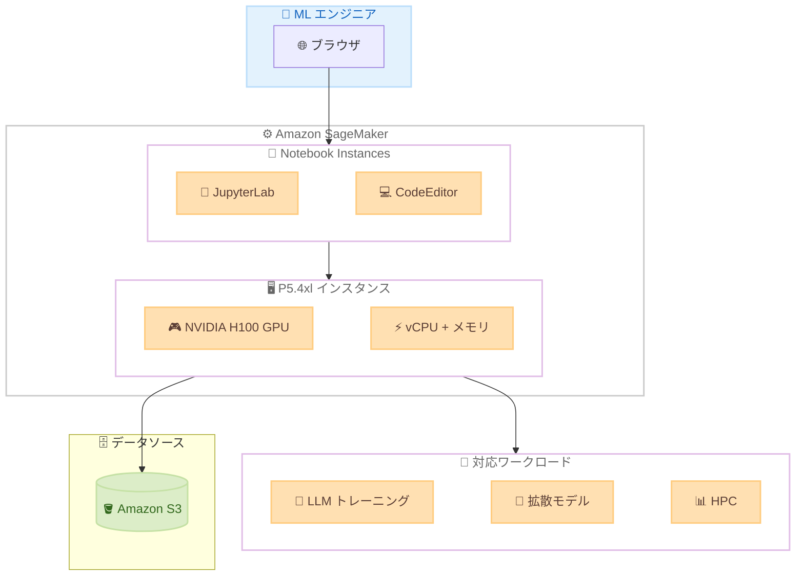

# Amazon SageMaker Notebook Instances - P5.4xl インスタンスタイプのサポート

**リリース日**: 2026 年 5 月 27 日
**サービス**: Amazon SageMaker
**機能**: P5.4xl インスタンスタイプによる Notebook Instances の GPU コンピューティング

📊 [このアップデートのインフォグラフィックを見る](https://takech9203.github.io/aws-news-summary/20260527-p5-4xl-new-instance-launch-sagemaker-notebook-instances.html)

## 概要

Amazon SageMaker Notebook Instances で EC2 P5.4xl インスタンスタイプが一般利用可能 (GA) になった。P5.4xl は NVIDIA H100 Tensor Core GPU を搭載しており、ディープラーニングおよびハイパフォーマンスコンピューティング (HPC) ワークロードに最適化されたインスタンスである。

このインスタンスタイプにより、前世代の GPU ベースインスタンスと比較して最大 4 倍のソリューション到達時間の短縮、および最大 40% の ML モデルトレーニングコスト削減が期待できる。生成 AI アプリケーション開発において、LLM や拡散モデルのトレーニング・デプロイをノートブック環境から直接実行する際のコスト効率が大幅に向上する。

**アップデート前の課題**

- SageMaker Notebook Instances で利用可能な GPU インスタンスは前世代のものが中心で、H100 GPU を活用できなかった
- 大規模モデルの実験や開発に十分な GPU コンピューティング性能をノートブック環境で確保するのが困難だった
- H100 GPU を利用するには SageMaker Training Job や EC2 インスタンスを別途起動する必要があった

**アップデート後の改善**

- P5.4xl インスタンスにより NVIDIA H100 Tensor Core GPU をノートブック環境から直接利用可能になった
- 前世代比最大 4 倍の性能向上により、開発イテレーションの高速化が実現した
- 最大 40% のコスト削減により、GPU を活用した ML 開発のコスト効率が改善された

## アーキテクチャ図



SageMaker Notebook Instances 上で P5.4xl インスタンスを利用する構成を示す。ブラウザから JupyterLab または CodeEditor にアクセスし、NVIDIA H100 GPU を搭載した P5.4xl インスタンス上で LLM トレーニングや拡散モデルの開発を実行できる。

## サービスアップデートの詳細

### 主要機能

1. **NVIDIA H100 Tensor Core GPU 搭載**
   - 最新世代の GPU アーキテクチャによる高性能コンピューティング
   - ディープラーニングおよび HPC ワークロードに最適化
   - FP8 精度のサポートによるトレーニング高速化

2. **コスト効率の向上**
   - 前世代 GPU インスタンスと比較して最大 40% のトレーニングコスト削減
   - P5.4xl サイズにより必要最小限の GPU リソースを確保し、過剰プロビジョニングを回避
   - ノートブック環境での直接実行により別途トレーニングジョブの起動が不要

3. **開発ワークフローの統合**
   - JupyterLab、CodeEditor、SageMaker Studio から直接利用可能
   - インタラクティブな開発環境で H100 GPU の性能をフル活用
   - プロトタイピングから小規模トレーニングまでシームレスに対応

## 技術仕様

### P5.4xl インスタンスの構成

| 項目 | 詳細 |
|------|------|
| GPU | NVIDIA H100 Tensor Core |
| インスタンスファミリー | P5 |
| インスタンスサイズ | 4xl |
| 性能向上 | 前世代比最大 4 倍の高速化 |
| コスト削減 | 最大 40% のトレーニングコスト削減 |
| 対応環境 | JupyterLab、CodeEditor、SageMaker Studio |

### API 変更履歴

| 日付 | サービス | 変更内容 |
|------|----------|----------|
| 2026/05/27 | [Amazon SageMaker Service](https://awsapichanges.com/archive/changes/0a7d57-api.sagemaker.html) | 7 updated api methods - HyperPod RIG 共有環境サポート、p6 インスタンスサポート追加 |

### 設定例

```python
import boto3

sagemaker = boto3.client('sagemaker')

# P5.4xl インスタンスでノートブックインスタンスを作成
response = sagemaker.create_notebook_instance(
    NotebookInstanceName='my-p5-notebook',
    InstanceType='ml.p5.4xlarge',
    RoleArn='arn:aws:iam::123456789012:role/SageMakerRole',
    VolumeSizeInGB=100,
    DirectInternetAccess='Enabled'
)
```

## 設定方法

### 前提条件

1. SageMaker の実行ロール (IAM Role) が設定済みであること
2. P5.4xl インスタンスのサービスクォータが確保されていること
3. 適切な VPC およびセキュリティグループが設定されていること

### 手順

#### ステップ 1: サービスクォータの確認

```bash
aws service-quotas get-service-quota \
    --service-code sagemaker \
    --quota-code L-1234ABCD \
    --region us-east-1
```

P5.4xl インスタンスを使用するために、Service Quotas でノートブックインスタンス用の P5 インスタンスクォータが十分であることを確認する。不足している場合はクォータ引き上げリクエストを送信する。

#### ステップ 2: ノートブックインスタンスの作成

```bash
aws sagemaker create-notebook-instance \
    --notebook-instance-name "my-p5-4xl-notebook" \
    --instance-type "ml.p5.4xlarge" \
    --role-arn "arn:aws:iam::123456789012:role/SageMakerExecutionRole" \
    --volume-size-in-gb 200
```

P5.4xl インスタンスタイプを指定してノートブックインスタンスを作成する。ストレージサイズは大規模モデルのデータセットを格納できるよう十分な容量を確保する。

#### ステップ 3: GPU の動作確認

ノートブック起動後、JupyterLab のターミナルまたはセルで GPU の認識を確認する。

```python
import torch
print(f"GPU available: {torch.cuda.is_available()}")
print(f"GPU name: {torch.cuda.get_device_name(0)}")
print(f"GPU memory: {torch.cuda.get_device_properties(0).total_mem / 1e9:.1f} GB")
```

NVIDIA H100 GPU が正しく認識されていることを確認する。

## メリット

### ビジネス面

- **コスト最適化**: 前世代比最大 40% のトレーニングコスト削減により、ML 開発の ROI が向上
- **開発速度の向上**: 最大 4 倍の性能向上によりイテレーション速度が加速し、市場投入までの時間を短縮
- **リソース統合**: ノートブック環境で直接 GPU コンピューティングが利用可能なため、インフラ管理の複雑さが軽減

### 技術面

- **最新 GPU アーキテクチャ**: NVIDIA H100 の FP8、TF32 精度サポートにより混合精度トレーニングが効率化
- **統合開発環境**: JupyterLab/CodeEditor からシームレスに GPU リソースを活用可能
- **スケーラビリティ**: P5.4xl サイズでコスト効率を維持しながら、必要に応じて上位サイズへの移行も容易

## デメリット・制約事項

### 制限事項

- P5.4xl はノートブックインスタンスの最大サイズではないため、超大規模モデルのフルトレーニングには分散トレーニングジョブの活用が推奨される
- 利用可能リージョンが限定されている (7 リージョン)
- サービスクォータの引き上げが必要な場合がある

### 考慮すべき点

- GPU インスタンスは停止しない限り課金が継続するため、使用しない時間帯のインスタンス管理が重要
- 大規模データセットを扱う場合、EBS ボリュームサイズやネットワーク帯域幅の設計が必要

## ユースケース

### ユースケース 1: LLM のファインチューニング開発

**シナリオ**: 社内ドキュメントに特化した LLM を構築するために、既存の基盤モデルをファインチューニングする開発作業を行う。

**実装例**:
```python
from transformers import AutoModelForCausalLM, Trainer, TrainingArguments

model = AutoModelForCausalLM.from_pretrained("meta-llama/Llama-3-8B")

training_args = TrainingArguments(
    output_dir="./results",
    per_device_train_batch_size=4,
    num_train_epochs=3,
    fp16=True,
    gradient_accumulation_steps=4
)

trainer = Trainer(model=model, args=training_args, train_dataset=dataset)
trainer.train()
```

**効果**: H100 GPU によりファインチューニングの実行時間が前世代比最大 4 倍短縮され、1 日で複数のパラメータ設定を試行可能になる。

### ユースケース 2: 画像生成モデルのプロトタイピング

**シナリオ**: 製品画像の自動生成のために拡散モデルを評価・カスタマイズする。

**実装例**:
```python
from diffusers import StableDiffusionPipeline
import torch

pipe = StableDiffusionPipeline.from_pretrained(
    "stabilityai/stable-diffusion-xl-base-1.0",
    torch_dtype=torch.float16
).to("cuda")

image = pipe("product photo, white background, professional lighting").images[0]
image.save("generated_product.png")
```

**効果**: H100 GPU の高いメモリ帯域幅により、SDXL クラスのモデルをノートブック環境でインタラクティブに実行でき、プロトタイプの迅速な検証が可能になる。

### ユースケース 3: 音声認識モデルの開発・評価

**シナリオ**: カスタマーサポートの通話録音を文字起こしするため、音声認識モデルの精度検証と追加トレーニングを行う。

**実装例**:
```python
from transformers import WhisperForConditionalGeneration, WhisperProcessor

model = WhisperForConditionalGeneration.from_pretrained("openai/whisper-large-v3")
model = model.to("cuda")

processor = WhisperProcessor.from_pretrained("openai/whisper-large-v3")

# バッチ推論で評価
results = []
for batch in dataloader:
    input_features = processor(batch["audio"], return_tensors="pt").input_features.to("cuda")
    predicted_ids = model.generate(input_features)
    transcription = processor.batch_decode(predicted_ids, skip_special_tokens=True)
    results.extend(transcription)
```

**効果**: 大規模な音声データセットに対する推論と評価をノートブック環境内で高速に実行でき、モデル選定の判断を迅速に行える。

## 料金

P5.4xl インスタンスの料金は AWS 公式料金ページを参照。一般的に P5 インスタンスファミリーは高性能 GPU を搭載するため、標準的なインスタンスと比較して時間単価は高くなる。ただし、性能向上により処理完了までの時間が短縮されるため、ジョブ単位でのコストは最大 40% 削減される。

### 料金例

| 項目 | 詳細 |
|------|------|
| 課金モデル | ノートブックインスタンスの稼働時間に基づく従量課金 |
| コスト最適化 | 不使用時のインスタンス停止により課金を抑制可能 |
| 削減効果 | 前世代 GPU 比で最大 40% のトレーニングコスト削減 |

※ 具体的な時間単価はリージョンにより異なるため、[SageMaker 料金ページ](https://aws.amazon.com/sagemaker/pricing/)を参照。

## 利用可能リージョン

- US East (N. Virginia) - us-east-1
- US East (Ohio) - us-east-2
- US West (Oregon) - us-west-2
- Asia Pacific (Mumbai) - ap-south-1
- Asia Pacific (Tokyo) - ap-northeast-1
- Asia Pacific (Jakarta) - ap-southeast-3
- South America (Sao Paulo) - sa-east-1

## 関連サービス・機能

- **Amazon EC2 P5 インスタンス**: SageMaker 外で P5 インスタンスを直接利用する場合の選択肢
- **SageMaker Training Jobs**: 大規模な分散トレーニングを実行する場合に活用
- **SageMaker HyperPod**: 大規模クラスタベースの ML トレーニング環境
- **Amazon S3**: トレーニングデータおよびモデルアーティファクトの保存先

## 参考リンク

- 📊 [インフォグラフィック](https://takech9203.github.io/aws-news-summary/20260527-p5-4xl-new-instance-launch-sagemaker-notebook-instances.html)
- [公式発表 (What's New)](https://aws.amazon.com/about-aws/whats-new/2026/03/p5-4xl-new-instance-launch-sagemaker-notebook-instances/)
- [SageMaker Notebook Instances ドキュメント](https://docs.aws.amazon.com/sagemaker/latest/dg/nbi.html)
- [SageMaker 料金ページ](https://aws.amazon.com/sagemaker/pricing/)
- [EC2 P5 インスタンスタイプ](https://aws.amazon.com/ec2/instance-types/p5/)

## まとめ

SageMaker Notebook Instances での P5.4xl インスタンスサポートにより、ML エンジニアは NVIDIA H100 GPU をノートブック環境から直接活用できるようになった。特に東京リージョン (ap-northeast-1) で利用可能であり、日本のユーザーにとって LLM のファインチューニングや生成 AI モデルの開発において、コスト効率と開発速度の両面で大きな改善が期待できる。GPU リソースを活用した ML 開発を行っている場合は、既存のインスタンスタイプからの移行を検討することを推奨する。
