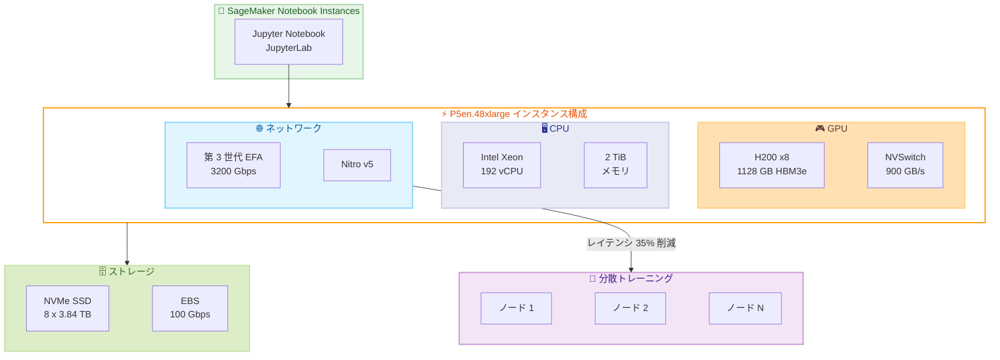

# Amazon SageMaker - Notebook Instances で P5en.48xlarge インスタンスタイプをサポート

**リリース日**: 2026 年 5 月 27 日
**サービス**: Amazon SageMaker
**機能**: P5en.48xlarge インスタンスタイプの Notebook Instances 対応

📊 [このアップデートのインフォグラフィックを見る](https://takech9203.github.io/aws-news-summary/20260527-p5en-new-instance-launch-sagemaker-notebook-instances.html)

## 概要

Amazon SageMaker Notebook Instances で Amazon EC2 P5en.48xlarge インスタンスタイプが一般利用可能 (GA) になった。P5en インスタンスは NVIDIA H200 GPU を 8 基搭載し、従来の P5 インスタンス (H100 GPU) と比較して GPU メモリが 1.7 倍、GPU メモリ帯域幅が 1.4 倍に強化されている。

P5en.48xlarge は第 3 世代 EFA (Elastic Fabric Adapter) と Nitro v5 を採用し、最大 3200 Gbps のネットワーク帯域幅を提供する。これにより、分散トレーニングワークロードにおけるコレクティブ通信のパフォーマンスが大幅に改善され、P5 と比較してレイテンシが最大 35% 削減される。

このアップデートにより、データサイエンティストやML エンジニアは SageMaker Notebook Instances 上で直接、大規模な深層学習モデルの開発・プロトタイピングを最新の GPU コンピュート環境で実行できるようになった。

**アップデート前の課題**

- SageMaker Notebook Instances で利用可能な最上位 GPU インスタンスは P5.48xlarge (H100 GPU) であり、最新の大規模言語モデルの実験には GPU メモリ容量が不足していた
- 分散トレーニングの通信性能が限定的で、マルチノードワークロードの準備に時間がかかっていた
- CPU と GPU 間の帯域幅がボトルネックとなり、データ前処理から学習開始までの待ち時間が長かった

**アップデート後の改善**

- H200 GPU の 1128 GB HBM3e メモリにより、より大規模なモデルをノートブック環境で直接実験可能になった
- 3200 Gbps EFA ネットワーキングにより、分散トレーニングコードの検証やデバッグが高速化された
- Gen5 PCIe による CPU-GPU 間帯域幅 4 倍改善で、データローディングパイプラインの効率が向上した

## アーキテクチャ図



P5en.48xlarge インスタンスの構成と SageMaker Notebook Instances からの利用フローを示す。第 3 世代 EFA と Nitro v5 によるネットワーク強化が分散トレーニングの通信性能を大幅に改善する。

## サービスアップデートの詳細

### 主要機能

1. **NVIDIA H200 GPU 搭載**
   - 8 基の H200 Tensor Core GPU を搭載
   - GPU あたり 141 GB の HBM3e メモリ (合計 1128 GB)
   - H100 比で GPU メモリ 1.7 倍、メモリ帯域幅 1.4 倍
   - NVSwitch による GPU 間 900 GB/s 接続

2. **第 3 世代 EFA ネットワーキング**
   - 最大 3200 Gbps のネットワーク帯域幅
   - Nitro v5 による低レイテンシ通信
   - P5 比でレイテンシ最大 35% 削減
   - GPUDirect RDMA サポートによる GPU 間直接通信

3. **強化された CPU-GPU 間帯域幅**
   - Gen5 PCIe による CPU-GPU 間接続
   - P5/P5e 比で CPU-GPU 間帯域幅最大 4 倍
   - Intel Sapphire Rapids (第 4 世代 Xeon Scalable) プロセッサ採用
   - 192 vCPU、2 TiB システムメモリ

## 技術仕様

### P5en.48xlarge インスタンス仕様

| 項目 | 詳細 |
|------|------|
| GPU | NVIDIA H200 Tensor Core x8 |
| GPU メモリ | 1128 GB HBM3e (合計) |
| GPU 間接続 | NVSwitch 900 GB/s |
| vCPU | 192 |
| システムメモリ | 2 TiB |
| ローカルストレージ | 8 x 3.84 TB NVMe SSD |
| ネットワーク帯域幅 | 最大 3200 Gbps (EFA) |
| EBS 帯域幅 | 100 Gbps |
| CPU | Intel Sapphire Rapids |
| CPU-GPU 接続 | Gen5 PCIe |

### P シリーズインスタンス比較

| 項目 | P5.48xlarge | P5e.48xlarge | P5en.48xlarge |
|------|------------|-------------|--------------|
| GPU | H100 x8 | H200 x8 | H200 x8 |
| GPU メモリ | 640 GB HBM3 | 1128 GB HBM3e | 1128 GB HBM3e |
| ネットワーク | 3200 Gbps | 3200 Gbps | 3200 Gbps |
| EBS 帯域幅 | 80 Gbps | 80 Gbps | 100 Gbps |
| CPU-GPU 接続 | Gen4 PCIe | Gen4 PCIe | Gen5 PCIe |
| Nitro | v4 | v4 | v5 |
| ネットワークレイテンシ | ベースライン | ベースライン | 35% 削減 |

### API 変更履歴

| 日付 | サービス | 変更内容 |
|------|----------|----------|
| 2026/05/27 | [Amazon SageMaker Service](https://awsapichanges.com/archive/changes/0a7d57-api.sagemaker.html) | 7 updated api methods - P5en/P6 インスタンスタイプの追加、HyperPod 共有環境サポート |

### IAM 権限

```json
{
    "Version": "2012-10-17",
    "Statement": [
        {
            "Effect": "Allow",
            "Action": [
                "sagemaker:CreateNotebookInstance",
                "sagemaker:UpdateNotebookInstance"
            ],
            "Resource": "arn:aws:sagemaker:*:*:notebook-instance/*"
        },
        {
            "Effect": "Allow",
            "Action": [
                "ec2:DescribeInstanceTypes"
            ],
            "Resource": "*"
        }
    ]
}
```

## 設定方法

### 前提条件

1. P5en.48xlarge インスタンスが利用可能なリージョンに AWS アカウントがあること
2. SageMaker Notebook Instances 用の IAM ロールが設定されていること
3. P5en インスタンスのサービスクォータが確保されていること (デフォルトは 0 の場合あり)

### 手順

#### ステップ 1: サービスクォータの確認と引き上げ申請

```bash
# 現在のクォータを確認
aws service-quotas get-service-quota \
    --service-code sagemaker \
    --quota-code L-12345678 \
    --region us-east-1
```

P5en インスタンスのクォータがデフォルトで 0 に設定されている場合は、Service Quotas コンソールから引き上げ申請を行う。

#### ステップ 2: ノートブックインスタンスの作成

```bash
# P5en.48xlarge でノートブックインスタンスを作成
aws sagemaker create-notebook-instance \
    --notebook-instance-name "my-p5en-notebook" \
    --instance-type ml.p5en.48xlarge \
    --role-arn arn:aws:iam::123456789012:role/SageMakerExecutionRole \
    --volume-size-in-gb 500 \
    --region us-east-1
```

指定したインスタンスタイプで SageMaker Notebook Instance を起動する。`--volume-size-in-gb` でアタッチする EBS ボリュームサイズを指定する。

#### ステップ 3: ノートブックインスタンスのステータス確認

```bash
# インスタンスのステータスを確認
aws sagemaker describe-notebook-instance \
    --notebook-instance-name "my-p5en-notebook" \
    --region us-east-1
```

ステータスが `InService` になったら、SageMaker コンソールまたは API から JupyterLab にアクセスできる。

## メリット

### ビジネス面

- **開発サイクルの短縮**: 大規模モデルのプロトタイピングをノートブック環境で直接実行でき、コードの反復速度が向上する
- **インフラ管理の簡素化**: SageMaker マネージド環境により、GPU クラスタの運用負荷なしに最新ハードウェアを利用可能
- **コスト効率**: 必要な時だけインスタンスを起動でき、使用していない時間の課金を回避できる

### 技術面

- **大規模モデル対応**: 1128 GB の GPU メモリにより、100B パラメータ超のモデルも単一インスタンスでロード可能
- **高速データ転送**: Gen5 PCIe と 100 Gbps EBS により、大規模データセットのロードが高速化
- **低レイテンシ通信**: Nitro v5 と第 3 世代 EFA により、分散トレーニングの同期オーバーヘッドが削減

## デメリット・制約事項

### 制限事項

- P5en.48xlarge は高コストなインスタンスタイプであり、小規模な実験には過剰スペックとなる可能性がある
- サービスクォータがデフォルトで低く設定されている場合があり、利用開始前に引き上げ申請が必要
- 利用可能リージョンが限定されている (4 リージョンのみ)

### 考慮すべき点

- ノートブックインスタンスは単一インスタンスでの実行であり、マルチノード分散トレーニングには SageMaker Training Jobs の利用が推奨される
- GPU メモリを最大限活用するには、モデルの精度設定 (FP8、BF16 など) やバッチサイズの最適化が必要
- 長時間のトレーニングジョブには、Notebook Instances ではなく SageMaker HyperPod や Training Jobs の利用を検討すべき

## ユースケース

### ユースケース 1: 大規模言語モデルのファインチューニング実験

**シナリオ**: データサイエンティストが 70B パラメータの基盤モデルをドメイン固有データでファインチューニングするためのコード開発とパラメータ探索を行う。

**実装例**:
```python
import torch
from transformers import AutoModelForCausalLM, AutoTokenizer

# H200 の大容量 GPU メモリを活用して 70B モデルをロード
model = AutoModelForCausalLM.from_pretrained(
    "meta-llama/Llama-3-70B",
    torch_dtype=torch.bfloat16,
    device_map="auto"
)

# 1128 GB GPU メモリで全パラメータをロード可能
tokenizer = AutoTokenizer.from_pretrained("meta-llama/Llama-3-70B")
```

**効果**: H100 では量子化やモデル並列化が必要だったモデルを、H200 の大容量メモリで直接ロードして実験可能。

### ユースケース 2: マルチモーダル AI モデルのプロトタイピング

**シナリオ**: 画像・テキスト・音声を統合するマルチモーダルモデルの開発において、大量のデータパイプラインと推論テストを実施する。

**実装例**:
```python
# Gen5 PCIe の高速 CPU-GPU 転送を活用したデータパイプライン
from torch.utils.data import DataLoader

# 大容量 NVMe SSD にデータセットをキャッシュ
dataset = MultiModalDataset(
    cache_dir="/home/ec2-user/SageMaker/data",  # NVMe SSD
    prefetch_factor=4
)

dataloader = DataLoader(
    dataset,
    batch_size=32,
    num_workers=16,  # 192 vCPU を活用
    pin_memory=True  # Gen5 PCIe 転送の高速化
)
```

**効果**: CPU-GPU 間帯域幅 4 倍により、データ前処理のボトルネックが解消され、GPU 稼働率が向上する。

### ユースケース 3: 分散トレーニングコードの検証

**シナリオ**: マルチノード分散トレーニングのコードをノートブック環境で開発・デバッグし、本番のトレーニングジョブに移行する前に動作確認を行う。

**実装例**:
```python
import torch.distributed as dist
from torch.nn.parallel import DistributedDataParallel

# 8 GPU での分散トレーニングを単一ノードで検証
# NVSwitch 900 GB/s による高速 All-Reduce
dist.init_process_group(backend="nccl")

model = DistributedDataParallel(
    model,
    device_ids=[local_rank],
    output_device=local_rank
)
```

**効果**: 3200 Gbps EFA とレイテンシ 35% 削減により、マルチ GPU 通信の動作検証が高速かつ正確に行える。

## 料金

P5en.48xlarge の SageMaker Notebook Instances の料金は、オンデマンド料金に基づく。正確な料金は AWS の料金ページで確認が必要。

### 料金例

| 項目 | 概算 |
|------|------|
| P5en.48xlarge オンデマンド (EC2 参考) | 約 $98/時間 |
| P5.48xlarge オンデマンド (EC2 参考) | 約 $98/時間 |
| EBS ストレージ (gp3) | $0.08/GB/月 |

※ SageMaker Notebook Instances の料金は EC2 オンデマンド料金と異なる場合がある。最新の料金は公式料金ページを参照。

## 利用可能リージョン

- US East (N. Virginia) - us-east-1
- US East (Ohio) - us-east-2
- US West (Oregon) - us-west-2
- Asia Pacific (Tokyo) - ap-northeast-1

## 関連サービス・機能

- **Amazon SageMaker Training Jobs**: マルチノード分散トレーニングの本番実行環境
- **Amazon SageMaker HyperPod**: 大規模 GPU クラスタによる継続的な ML トレーニング基盤
- **Amazon EC2 P5en Instances**: SageMaker 外での直接利用。EC2 UltraClusters で最大 20,000 GPU スケール
- **Amazon FSx for Lustre**: 大規模データセットの高性能共有ストレージ
- **AWS Elastic Fabric Adapter**: 高帯域・低レイテンシのノード間通信

## 参考リンク

- 📊 [インフォグラフィック](https://takech9203.github.io/aws-news-summary/20260527-p5en-new-instance-launch-sagemaker-notebook-instances.html)
- [公式発表 (What's New)](https://aws.amazon.com/about-aws/whats-new/2026/02/p5en-new-instance-launch-sagemaker-notebook-instances/)
- [SageMaker Notebook Instances ドキュメント](https://docs.aws.amazon.com/sagemaker/latest/dg/nbi.html)
- [Amazon EC2 P5en インスタンスタイプ](https://aws.amazon.com/ec2/instance-types/p5/)
- [SageMaker 料金ページ](https://aws.amazon.com/sagemaker/pricing/)

## まとめ

SageMaker Notebook Instances での P5en.48xlarge サポートにより、データサイエンティストは最新の NVIDIA H200 GPU と高速ネットワーキングをマネージド環境で即座に活用できるようになった。東京リージョンでも利用可能であり、国内の ML チームは大規模モデルの実験環境として積極的に検討すべきアップデートである。利用開始前にサービスクォータの確認・引き上げ申請を行うことを推奨する。
