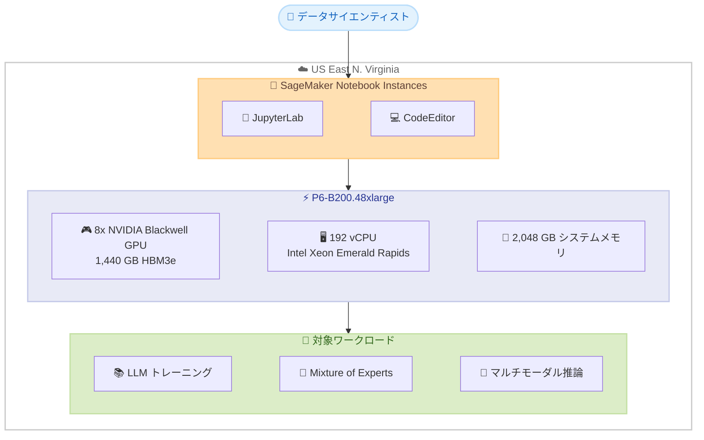

# Amazon SageMaker Notebook Instances - P6-B200 インスタンスのリージョン拡大

**リリース日**: 2026 年 5 月 27 日
**サービス**: Amazon SageMaker
**機能**: P6-B200 インスタンスの SageMaker Notebook Instances におけるリージョン拡大

📊 [このアップデートのインフォグラフィックを見る](https://takech9203.github.io/aws-news-summary/20260527-p6-b200-region-expansion-sagemaker-notebook-instances.html)

## 概要

Amazon EC2 P6-B200 インスタンスが SageMaker Notebook Instances において追加リージョンで一般提供 (GA) を開始した。今回のアップデートにより、US East (N. Virginia) リージョンで P6-B200 インスタンスが SageMaker Notebook Instances 上で利用可能になった。P6-B200 インスタンスは 8 基の NVIDIA Blackwell GPU を搭載し、1,440 GB の高帯域幅 GPU メモリと第 5 世代 Intel Xeon プロセッサ (Emerald Rapids) を備えている。

P6-B200 インスタンスは AI トレーニングにおいて P5en インスタンスと比較して最大 2 倍のパフォーマンスを提供する。ユーザーは SageMaker Notebook Instances の JupyterLab または CodeEditor 環境で、大規模な基盤モデル (LLM、Mixture of Experts モデル、マルチモーダル推論モデルなど) のインタラクティブな開発やファインチューニングを行うことができる。

**アップデート前の課題**

- SageMaker Notebook Instances で P6-B200 インスタンスを利用できるリージョンが限定されていた
- US East (N. Virginia) リージョンのユーザーは、大規模モデルの開発に P5en 以下のインスタンスを使用する必要があった
- データレジデンシー要件やレイテンシーの観点から、特定リージョンでの高性能 GPU リソースへのアクセスが制約されていた

**アップデート後の改善**

- US East (N. Virginia) リージョンで P6-B200 インスタンスが SageMaker Notebook Instances 上で利用可能になった
- P5en 比で最大 2 倍の AI トレーニングパフォーマンスをノートブック環境で直接活用できるようになった
- 1,440 GB の GPU メモリにより、数百億パラメータ規模のモデルをノートブック内で直接実験可能になった

## アーキテクチャ図



P6-B200 インスタンスを SageMaker Notebook Instances で利用する際の構成を示す。ユーザーは JupyterLab または CodeEditor から直接 NVIDIA Blackwell GPU を活用し、大規模モデルの開発やファインチューニングを行う。

## サービスアップデートの詳細

### 主要機能

1. **NVIDIA Blackwell GPU アーキテクチャ**
   - 8 基の NVIDIA Blackwell GPU を搭載
   - 1,440 GB の HBM3e 高帯域幅メモリ
   - P5en 比で 60% 増の GPU メモリ帯域幅
   - AI トレーニングで P5en 比最大 2 倍のパフォーマンス

2. **SageMaker Notebook Instances との統合**
   - JupyterLab 環境での直接利用
   - CodeEditor 環境でのインタラクティブ開発
   - 大規模基盤モデルのファインチューニングをノートブック内で完結

3. **対応ワークロード**
   - 大規模言語モデル (LLM) のトレーニングとファインチューニング
   - Mixture of Experts (MoE) モデルの実験
   - マルチモーダル推論モデルの開発
   - エンタープライズコパイロットやコンテンツ生成 (テキスト、画像、動画)

## 技術仕様

### P6-B200.48xlarge インスタンススペック

| 項目 | 詳細 |
|------|------|
| GPU | 8x NVIDIA Blackwell |
| GPU メモリ | 1,440 GB HBM3e |
| vCPU | 192 (Intel Xeon Emerald Rapids) |
| システムメモリ | 2,048 GB |
| P5en 比パフォーマンス | 最大 2 倍 (AI トレーニング) |
| GPU メモリ帯域幅 | P5en 比 60% 増 |
| インスタンス名 | ml.p6-b200.48xlarge |

### API 変更履歴

| 日付 | サービス | 変更内容 |
|------|----------|----------|
| 2026/05/27 | [Amazon SageMaker Service](https://awsapichanges.com/archive/changes/0a7d57-api.sagemaker.html) | 7 updated api methods - p6 インスタンスサポート追加 (CreateAIRecommendationJob 等) および HyperPod 共有環境サポート |

### 対応環境

| 環境 | サポート状況 |
|------|-------------|
| SageMaker Notebook Instances | 対応 |
| SageMaker Studio JupyterLab | 対応 |
| SageMaker Studio CodeEditor | 対応 |

## 設定方法

### 前提条件

1. AWS アカウントで P6-B200 インスタンスのサービスクォータが承認されていること
2. SageMaker の IAM ロールが適切に設定されていること
3. US East (N. Virginia) リージョンを使用すること

### 手順

#### ステップ 1: サービスクォータの確認と申請

```bash
# P6-B200 インスタンスのクォータを確認
aws service-quotas get-service-quota \
  --service-code sagemaker \
  --quota-code L-XXXXXXXX \
  --region us-east-1
```

P6-B200 インスタンスは高性能 GPU インスタンスのため、デフォルトのクォータが 0 に設定されている場合がある。AWS Service Quotas コンソールから引き上げを申請する。

#### ステップ 2: ノートブックインスタンスの作成

```bash
# P6-B200 インスタンスタイプでノートブックインスタンスを作成
aws sagemaker create-notebook-instance \
  --notebook-instance-name my-p6-notebook \
  --instance-type ml.p6-b200.48xlarge \
  --role-arn arn:aws:iam::123456789012:role/SageMakerRole \
  --region us-east-1
```

ml.p6-b200.48xlarge インスタンスタイプを指定して SageMaker Notebook Instance を作成する。

#### ステップ 3: ノートブックの起動と利用

```python
# ノートブック内で GPU を確認
import torch
print(f"GPU 数: {torch.cuda.device_count()}")
print(f"GPU 名: {torch.cuda.get_device_name(0)}")
print(f"GPU メモリ: {torch.cuda.get_device_properties(0).total_memory / 1e9:.1f} GB")
```

ノートブック起動後、PyTorch 等のフレームワークから NVIDIA Blackwell GPU にアクセスできることを確認する。

## メリット

### ビジネス面

- **開発サイクルの短縮**: ノートブック環境で直接大規模モデルを実験できるため、プロトタイピングから本番環境への移行が迅速になる
- **コスト効率の向上**: P5en 比 2 倍のパフォーマンスにより、同じワークロードをより短時間で完了し、時間課金コストを削減できる
- **リージョン選択肢の拡大**: US East (N. Virginia) での利用が可能になり、データレジデンシー要件を満たしつつ最高性能の GPU を活用できる

### 技術面

- **大規模モデルの直接実験**: 1,440 GB の GPU メモリにより、数百億パラメータ規模のモデルをメモリに展開可能
- **インタラクティブ開発**: JupyterLab/CodeEditor でリアルタイムにモデルの動作を確認しながら開発可能
- **最新 GPU アーキテクチャ**: NVIDIA Blackwell の最新機能 (FP8 演算、改良された Tensor Core 等) を活用可能

## デメリット・制約事項

### 制限事項

- 利用可能リージョンが現時点では限定的である (US East (N. Virginia) のみ追加)
- サービスクォータの引き上げ申請が必要な場合がある
- P6-B200 インスタンスは高コストであり、小規模な実験には過剰スペックとなる可能性がある

### 考慮すべき点

- GPU メモリ 1,440 GB を活用するには、モデルの並列化やメモリ最適化の知識が必要
- ノートブックの起動時間が通常インスタンスと比較して長くなる可能性がある
- 使用しない時間帯はインスタンスを停止してコストを管理する必要がある

## ユースケース

### ユースケース 1: 大規模 LLM のファインチューニング

**シナリオ**: エンタープライズ向けの数百億パラメータ規模の言語モデルを、自社データでファインチューニングしたい。

**実装例**:
```python
from transformers import AutoModelForCausalLM, Trainer, TrainingArguments

model = AutoModelForCausalLM.from_pretrained(
    "large-foundation-model",
    torch_dtype=torch.bfloat16,
    device_map="auto"
)

training_args = TrainingArguments(
    output_dir="./results",
    per_device_train_batch_size=4,
    gradient_accumulation_steps=8,
    bf16=True,
    num_train_epochs=3
)

trainer = Trainer(model=model, args=training_args, train_dataset=dataset)
trainer.train()
```

**効果**: 1,440 GB の GPU メモリにより、モデル全体をメモリに展開してフルファインチューニングが可能。P5en 比 2 倍の速度でトレーニング完了。

### ユースケース 2: Mixture of Experts モデルの実験

**シナリオ**: MoE アーキテクチャの異なるエキスパート構成を試行錯誤しながら最適な設計を見つけたい。

**実装例**:
```python
# MoE モデルの構成テスト
from transformers import MixtralForCausalLM

model = MixtralForCausalLM.from_pretrained(
    "mixtral-large-model",
    torch_dtype=torch.bfloat16,
    device_map="auto"
)

# ノートブック内でインタラクティブにエキスパート選択パターンを分析
expert_usage = analyze_expert_routing(model, eval_dataset)
visualize_expert_distribution(expert_usage)
```

**効果**: 大規模な MoE モデルをノートブック環境で直接ロードし、エキスパートルーティングの動作をインタラクティブに分析・可視化できる。

### ユースケース 3: マルチモーダルモデルの開発

**シナリオ**: テキスト、画像、動画を統合的に処理するマルチモーダルモデルのプロトタイプを開発したい。

**実装例**:
```python
# マルチモーダルモデルの推論テスト
from transformers import AutoProcessor, AutoModelForVision2Seq

model = AutoModelForVision2Seq.from_pretrained(
    "multimodal-large-model",
    torch_dtype=torch.bfloat16,
    device_map="auto"
)

processor = AutoProcessor.from_pretrained("multimodal-large-model")

# 画像+テキストの入力でインタラクティブにテスト
inputs = processor(images=test_image, text=prompt, return_tensors="pt")
outputs = model.generate(**inputs, max_new_tokens=512)
```

**効果**: 大量の GPU メモリを必要とするマルチモーダルモデルをノートブック内でリアルタイムにテストし、迅速にイテレーションできる。

## 料金

P6-B200 インスタンスの料金は EC2 P6 インスタンスの料金体系に基づく。SageMaker Notebook Instances では使用時間に応じた従量課金が適用される。

### 料金例

| 項目 | 詳細 |
|------|------|
| 課金単位 | 秒単位 (最低 60 秒) |
| 料金体系 | オンデマンド (時間課金) |
| 停止時 | コンピューティング料金は発生しない (ストレージ料金のみ) |

※ 具体的な時間単価は [Amazon SageMaker 料金ページ](https://aws.amazon.com/sagemaker/pricing/) を参照。P6-B200 は高性能インスタンスのため、利用時間の管理が重要。

## 利用可能リージョン

- US East (N. Virginia) - us-east-1 (今回追加)

※ 今後追加リージョンが発表される可能性がある。最新の対応リージョンは [AWS リージョン表](https://aws.amazon.com/about-aws/global-infrastructure/regional-product-services/) を参照。

## 関連サービス・機能

- **Amazon EC2 P6-B200**: SageMaker Notebook Instances の基盤となる GPU インスタンス。EC2 上で直接利用する場合はより柔軟な構成が可能
- **Amazon SageMaker Studio**: JupyterLab および CodeEditor 環境を提供するマネージド IDE。P6-B200 インスタンスと組み合わせて利用可能
- **Amazon SageMaker HyperPod**: 大規模分散トレーニング向けのマネージドクラスター。P6-B200 インスタンスでクラスターを構成可能
- **Amazon SageMaker Training Jobs**: ノートブックでの実験後、本番トレーニングジョブとして実行する際に利用

## 参考リンク

- 📊 [インフォグラフィック](https://takech9203.github.io/aws-news-summary/20260527-p6-b200-region-expansion-sagemaker-notebook-instances.html)
- [公式発表 (What's New)](https://aws.amazon.com/about-aws/whats-new/2026/06/p6-b200-region-expansion-sagemaker-notebook-instances/)
- [Amazon EC2 P6 インスタンスタイプ](https://aws.amazon.com/ec2/instance-types/p6/)
- [SageMaker Notebook Instances ドキュメント](https://docs.aws.amazon.com/sagemaker/latest/dg/nbi.html)
- [SageMaker Studio JupyterLab ガイド](https://docs.aws.amazon.com/sagemaker/latest/dg/studio-updated-jl.html)
- [SageMaker Studio CodeEditor ガイド](https://docs.aws.amazon.com/sagemaker/latest/dg/code-editor.html)
- [Amazon SageMaker 料金](https://aws.amazon.com/sagemaker/pricing/)

## まとめ

P6-B200 インスタンスの SageMaker Notebook Instances へのリージョン拡大により、US East (N. Virginia) リージョンのユーザーが NVIDIA Blackwell GPU の最高性能をノートブック環境で直接活用できるようになった。大規模基盤モデルの開発やファインチューニングを行う AI/ML チームは、サービスクォータの引き上げを申請し、P6-B200 インスタンスを活用することで開発効率を大幅に向上させることを推奨する。
