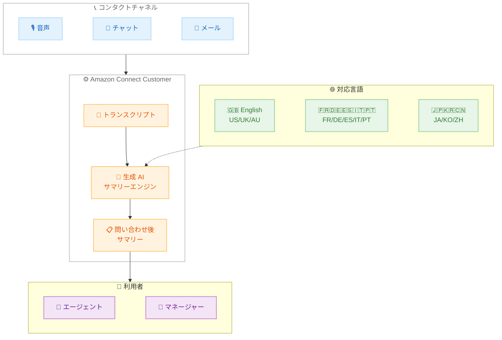

# Amazon Connect Customer - 生成 AI による問い合わせ後サマリーの 8 言語対応拡大

**リリース日**: 2026 年 5 月 28 日
**サービス**: Amazon Connect Customer
**機能**: 生成 AI による問い合わせ後サマリー (Post-Contact Summaries) の多言語対応

📊 [このアップデートのインフォグラフィックを見る](https://takech9203.github.io/aws-news-summary/20260528-amazon-connect-summary-languages.html)

## 概要

Amazon Connect Customer が、生成 AI による問い合わせ後サマリー機能を 8 つの新しい言語ファミリーに拡大した。新たにポルトガル語、フランス語、イタリア語、ドイツ語、スペイン語、中国語、日本語、韓国語がサポートされ、加えて英国英語やオーストラリア英語などの非米国英語バリエーションにも対応した。

この機能は、音声、チャット、メールのすべてのチャネルにおける顧客との会話から、構造化された簡潔なサマリーを自動生成する。これにより、エージェントやマネージャーはトランスクリプト全体を読む必要がなくなり、複数言語を跨いだグローバルなコンタクトセンター運営が効率化される。

**アップデート前の課題**

- 問い合わせ後サマリーの生成 AI 対応言語が限定されており、英語 (米国) 以外の言語で会話が行われた場合にサマリーを自動生成できなかった
- グローバルに展開するコンタクトセンターでは、各言語の問い合わせ内容を人手で要約する必要があり、アフターコンタクトワークに時間がかかっていた
- スーパーバイザーが他言語のサービス品質をモニタリングする際、翻訳やトランスクリプト確認に追加工数が発生していた

**アップデート後の改善**

- ポルトガル語、フランス語、イタリア語、ドイツ語、スペイン語、中国語、日本語、韓国語の 8 言語で問い合わせ後サマリーを自動生成可能になった
- 英国英語やオーストラリア英語など、地域固有のスペルや用語を反映したサマリーが生成されるようになった
- 会話の言語に合わせてサマリーが自動生成されるため、グローバルチームの業務効率が向上した

## アーキテクチャ図



音声、チャット、メールの各チャネルから取得されたトランスクリプトを生成 AI サマリーエンジンが処理し、会話の言語に応じた問い合わせ後サマリーを自動生成する。エージェントとマネージャーの双方がサマリーを活用できる。

## サービスアップデートの詳細

### 主要機能

1. **8 言語ファミリーの追加サポート**
   - ポルトガル語、フランス語、イタリア語、ドイツ語、スペイン語、中国語、日本語、韓国語
   - 各言語で自然な表現でサマリーが生成される
   - 会話の言語を自動検出してサマリーを生成

2. **非米国英語バリエーション対応**
   - 英国英語、オーストラリア英語、その他の地域ロケールをサポート
   - 地域固有のスペルや用語が正確に反映される
   - 例: colour (英国英語) vs color (米国英語) の使い分け

3. **全チャネル対応**
   - 音声通話、チャット、メールのすべてのチャネルで利用可能
   - チャネルを問わず一貫した品質のサマリーを生成
   - トランスクリプト全体を読む必要性を排除

## 技術仕様

### 対応言語一覧

| 言語 | 言語コード | 新規追加 |
|------|-----------|----------|
| 英語 (米国) | en-US | 既存 |
| 英語 (英国) | en-GB | 新規 |
| 英語 (オーストラリア) | en-AU | 新規 |
| ポルトガル語 | pt | 新規 |
| フランス語 | fr | 新規 |
| イタリア語 | it | 新規 |
| ドイツ語 | de | 新規 |
| スペイン語 | es | 新規 |
| 中国語 | zh | 新規 |
| 日本語 | ja | 新規 |
| 韓国語 | ko | 新規 |

### API 変更履歴

| 日付 | サービス | 変更内容 |
|------|----------|----------|
| 2026/05/28 | [Amazon Connect Customer Profiles](https://awsapichanges.com/archive/changes/364f28-profile.html) | 1 new 3 updated api methods - BatchPutProfileObject API の追加 |
| 2026/05/22 | [Amazon Q Connect](https://awsapichanges.com/archive/changes/f23ff3-wisdom.html) | 1 updated api method - ListSpans API にガードレール評価結果を追加 |

### サマリーの特徴

問い合わせ後サマリーは以下の構造化された情報を含む。

- 会話の要約 (問い合わせの理由と解決内容)
- 顧客のセンチメント
- アクションアイテム
- フォローアップが必要な事項

## 設定方法

### 前提条件

1. Amazon Connect インスタンスが作成済みであること
2. Contact Lens が有効化されていること
3. 問い合わせ後サマリー機能が有効であること

### 手順

#### ステップ 1: Contact Lens の言語設定確認

Amazon Connect 管理コンソールで Contact Lens の設定を確認し、対象言語のトランスクリプションが有効になっていることを確認する。

#### ステップ 2: 問い合わせ後サマリーの有効化

問い合わせ後サマリーが既に有効であれば、新しい言語のサポートは自動的に適用される。追加の設定変更は不要。

#### ステップ 3: サマリーの確認

コンタクト検索画面またはコンタクト詳細画面から、生成されたサマリーを確認する。サマリーは会話の言語に応じて自動的にその言語で生成される。

## メリット

### ビジネス面

- **グローバル運営の効率化**: 複数言語のコンタクトセンターを運営する企業が、統一されたフォーマットで問い合わせ品質を管理できる
- **アフターコンタクトワークの短縮**: エージェントがトランスクリプト全体を読む必要がなくなり、対応完了までの時間が短縮される
- **多言語品質モニタリング**: スーパーバイザーが各言語のサービス品質を迅速に把握し、改善アクションを取れる

### 技術面

- **自動言語検出**: 会話の言語を自動的に検出し、適切な言語でサマリーを生成するため、手動設定が不要
- **追加設定不要**: 既存のサマリー設定がそのまま利用でき、新言語サポートは自動的に有効化される
- **全チャネル統合**: 音声、チャット、メールを問わず一貫した方式でサマリーが生成される

## デメリット・制約事項

### 制限事項

- サマリーの品質は元のトランスクリプトの精度に依存する。音声認識の精度が低い言語では、サマリーの品質も影響を受ける可能性がある
- 言語バリエーションの細かい方言レベルまでの対応は保証されない
- 生成 AI によるサマリーのため、まれに不正確な要約が生成される可能性がある

### 考慮すべき点

- 機密情報や個人情報がサマリーに含まれる場合のデータ保護ポリシーの確認が必要
- サマリーの品質を定期的に確認し、ビジネス要件に合致しているか検証することを推奨

## ユースケース

### ユースケース 1: グローバルサポートセンターの品質管理

**シナリオ**: 欧州、アジア、南米に展開するグローバル企業が、各拠点の顧客対応品質を一元管理したい。

**実装例**:
```
各リージョンのコンタクトセンターで Contact Lens を有効化し、
問い合わせ後サマリー機能を利用。フランス語、ドイツ語、
日本語、ポルトガル語の各チームの対応品質を、
サマリーベースでスーパーバイザーが横断的にレビュー。
```

**効果**: 各言語のトランスクリプトを個別に確認する必要がなくなり、品質管理に要する時間を大幅に削減。問題のある対応を迅速に特定可能。

### ユースケース 2: 多言語対応エージェントの業務効率化

**シナリオ**: 日本語と英語の両方で顧客対応を行うバイリンガルエージェントが、シフト終了時のアフターコンタクトワークを効率化したい。

**実装例**:
```
日本語での問い合わせ -> 日本語でサマリーが自動生成
英語での問い合わせ -> 英語でサマリーが自動生成

エージェントはサマリーを確認し、
必要に応じて追記するだけでアフターコンタクトワーク完了。
```

**効果**: トランスクリプト全体の確認が不要になり、アフターコンタクトワークの時間を 50% 以上短縮。エージェントの次の対応への移行が高速化。

### ユースケース 3: コンプライアンスレビューの効率化

**シナリオ**: 金融サービス企業が、複数言語で行われた顧客対応のコンプライアンスチェックを効率的に実施したい。

**実装例**:
```
全言語の問い合わせサマリーを自動生成し、
コンプライアンスチームが構造化されたサマリーを元に
レビューを実施。問題のある対応のみ
フルトランスクリプトを確認するワークフローを構築。
```

**効果**: コンプライアンスレビューの対象をサマリーベースでトリアージでき、レビュー工数を削減しつつ網羅性を維持。

## 料金

問い合わせ後サマリーは Amazon Connect Contact Lens の機能として提供される。Contact Lens の料金体系に含まれ、追加の言語サポートに対する追加料金は発生しない。

### 料金例

| 項目 | 料金 (概算) |
|------|------------|
| Contact Lens 音声分析 (1 分あたり) | $0.015 |
| Contact Lens チャット分析 (1 メッセージあたり) | $0.0015 |

※ 料金はリージョンにより異なる。最新の料金は AWS 公式料金ページを参照。

## 利用可能リージョン

Amazon Connect Customer の問い合わせ後サマリーが利用可能なすべての AWS リージョンで、新しい言語サポートが利用可能。主要な対応リージョンは以下の通り。

- 米国東部 (バージニア北部)
- 米国西部 (オレゴン)
- アジアパシフィック (シドニー)
- アジアパシフィック (東京)
- アジアパシフィック (シンガポール)
- 欧州 (ロンドン)
- 欧州 (フランクフルト)
- カナダ (中部)

## 関連サービス・機能

- **Amazon Connect Contact Lens**: 会話分析基盤として、トランスクリプション、センチメント分析、サマリー生成を提供
- **Amazon Bedrock**: 生成 AI サマリーの基盤となる大規模言語モデルを提供
- **Amazon Q Connect**: エージェント向けリアルタイム推奨機能で、サマリーと併用して顧客対応品質を向上

## 参考リンク

- 📊 [インフォグラフィック](https://takech9203.github.io/aws-news-summary/20260528-amazon-connect-summary-languages.html)
- [公式発表 (What's New)](https://aws.amazon.com/about-aws/whats-new/2026/05/amazon-connect-summary-languages/)
- [ドキュメント - View generative AI-powered post-contact summaries](https://docs.aws.amazon.com/connect/latest/adminguide/contact-lens-post-contact-summary.html)
- [Amazon Connect 料金ページ](https://aws.amazon.com/connect/pricing/)
- [Amazon Connect Customer 公式サイト](https://aws.amazon.com/connect/)

## まとめ

今回のアップデートにより、Amazon Connect Customer の生成 AI 問い合わせ後サマリー機能が 8 つの新言語と非米国英語バリエーションに対応し、グローバルに展開するコンタクトセンターの運営効率が大幅に向上する。既存の設定に追加変更は不要で即座に利用可能なため、多言語対応のコンタクトセンターを運営している組織は、すぐにこの機能を活用してアフターコンタクトワークの短縮とサービス品質の可視化を推進することを推奨する。
