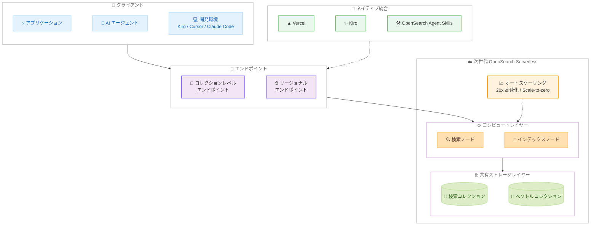

# Amazon OpenSearch Serverless - 次世代アーキテクチャの一般提供開始

**リリース日**: 2026年5月28日
**サービス**: Amazon OpenSearch Serverless
**機能**: 次世代 OpenSearch Serverless (NEXTGEN)

📊 [このアップデートのインフォグラフィックを見る](https://takech9203.github.io/aws-news-summary/20260528-amazon-opensearch-serverless-next-generation-generally-available.html)

## 概要

AWS は、Amazon OpenSearch Serverless の次世代アーキテクチャの一般提供 (GA) を発表した。この次世代版は、AI エージェントを構築する顧客向けに設計されたフルマネージドの検索およびベクトルエンジンであり、従来版と比較してオートスケーリングが 20 倍高速化され、数秒でリソースをプロビジョニングできる。Scale-to-zero と使用量ベースの課金により、ピーク負荷に合わせた OpenSearch クラスターのプロビジョニングと比較して最大 60% のコスト削減が可能となる。

次世代 OpenSearch Serverless は、コンピュートとストレージの完全な分離を新しい共有ストレージレイヤーによって実現する。これにより、トラフィックが少ない期間はコンピュートを縮小してコストを削減しつつ、トラフィックスパイクに対する即時対応能力を維持できる。また、ネットワーク接続性の簡素化として、コレクションレベルエンドポイントとリージョナルエンドポイントの 2 つのリソースベースエンドポイントが提供され、標準的な VPC API を使用したマルチ VPC やオンプレミスからの接続が容易になった。

**アップデート前の課題**

- OpenSearch Serverless のオートスケーリングが遅く、予測不可能なエージェントワークロードに対応困難だった
- コンピュートとストレージが密結合のため、低トラフィック時にも固定的なリソースコストが発生していた
- VPC エンドポイント構成が複雑で、マルチ VPC やオンプレミス接続に手間がかかった
- AI 開発プラットフォームとのネイティブ統合がなく、インフラ構築に追加作業が必要だった
- ゼロスケーリングができず、アイドル時にもコストが発生していた

**アップデート後の改善**

- オートスケーリングが 20 倍高速化され、数秒でリソースプロビジョニングが可能になった
- Scale-to-zero により、未使用時のコストがゼロになった
- コンピュートとストレージの完全分離により、それぞれ独立したスケーリングが可能になった
- リソースベースエンドポイントにより、ネットワーク接続構成が簡素化された
- Vercel や Kiro など AI 開発プラットフォームとのネイティブ統合が追加された
- OpenSearch Agent Skills により Claude Code、Cursor、Codex などのコーディングプラットフォームから OpenSearch 機能を利用可能になった

## アーキテクチャ図



次世代 OpenSearch Serverless のアーキテクチャでは、コンピュートとストレージが完全に分離され、それぞれ独立してスケーリングする。リソースベースエンドポイントを通じたアクセスと、AI 開発プラットフォームとのネイティブ統合が特徴となっている。

## サービスアップデートの詳細

### 主要機能

1. **20 倍高速なオートスケーリングと Scale-to-zero**
   - 従来版と比較して 20 倍高速なオートスケーリングを実現
   - 数秒でリソースをプロビジョニングし、予測不可能なエージェントワークロードに対応
   - Scale-to-zero により、リクエストがない場合はコンピュートリソースがゼロまで縮小
   - 使用量ベースの課金 (pay-per-usage) で、ピーク負荷プロビジョニング比最大 60% コスト削減

2. **コンピュートとストレージの完全分離**
   - 新しい共有ストレージレイヤーによる完全なデカップリング
   - コンピュートの独立したスケールアップ/ダウンが可能
   - 低トラフィック時はコンピュートを縮小しつつ、トラフィックスパイクへの即時対応を維持
   - コレクショングループごとにオートスケーリング状態の可視化が可能

3. **リソースベースエンドポイント**
   - コレクションレベルエンドポイント: 個別コレクションへの直接アクセス
   - リージョナルエンドポイント: リージョン内の全コレクションへの一元アクセス
   - 標準 VPC API を使用したマルチ VPC およびオンプレミス接続の簡素化
   - 従来の VPC エンドポイント設定の複雑さを解消

4. **AI 開発プラットフォーム統合**
   - Vercel との統合: Vercel Marketplace から直接 OpenSearch Serverless をプロビジョニング
   - Kiro との統合: 自然言語コマンドで検索インフラを構築
   - OpenSearch Agent Skills: Claude Code、Cursor、Codex などのコーディングプラットフォームから OpenSearch 機能を利用

5. **削除保護 (Deletion Protection)**
   - コレクション単位で削除保護を有効化/無効化可能
   - 誤操作によるコレクション削除を防止

## 技術仕様

### コレクションタイプ

| コレクションタイプ | 用途 | 説明 |
|------|------|------|
| SEARCH | 全文検索 | テキスト検索、ログ分析 |
| VECTORSEARCH | ベクトル検索 | RAG、セマンティック検索、AI エージェント |

### コレクショングループの世代

| 世代 | 説明 |
|------|------|
| CLASSIC | 従来のアーキテクチャ |
| NEXTGEN | 次世代アーキテクチャ (本アップデート) |

### API 変更履歴

| 日付 | サービス | 変更内容 |
|------|----------|----------|
| 2026/05/28 | [OpenSearch Service Serverless](https://awsapichanges.com/archive/changes/364f28-aoss.html) | 8 updated api methods - NEXTGEN コレクショングループ作成、削除保護、オートスケーリング可視化の追加 |

### 主要 API 変更詳細

| API メソッド | 変更内容 |
|------|------|
| `CreateCollectionGroup` | `generation` パラメータ追加 (CLASSIC / NEXTGEN) |
| `CreateCollection` | `deletionProtection` パラメータ追加 (ENABLED / DISABLED) |
| `UpdateCollection` | `deletionProtection` パラメータ追加 |
| `BatchGetCollectionGroup` | `currentCapacity` (オートスケーリング状態) と `generation` フィールド追加 |
| `ListCollectionGroups` | `generation` フィールドをレスポンスに追加 |
| `DeleteCollection` | レスポンスに `deletionProtection` ステータスを追加 |

### キャパシティ設定

```json
{
  "capacityLimits": {
    "maxIndexingCapacityInOCU": 10,
    "maxSearchCapacityInOCU": 10,
    "minIndexingCapacityInOCU": 0,
    "minSearchCapacityInOCU": 0
  },
  "generation": "NEXTGEN"
}
```

最小キャパシティを 0 OCU に設定することで Scale-to-zero を実現する。

## 設定方法

### 前提条件

1. AWS アカウントと適切な IAM 権限
2. OpenSearch Serverless へのアクセス権限 (`aoss:*` ポリシー)
3. 暗号化ポリシーとネットワークポリシーの設定

### 手順

#### ステップ 1: NEXTGEN コレクショングループの作成

```bash
aws opensearchserverless create-collection-group \
  --name "my-nextgen-group" \
  --generation "NEXTGEN" \
  --capacity-limits '{
    "maxIndexingCapacityInOCU": 10,
    "maxSearchCapacityInOCU": 10,
    "minIndexingCapacityInOCU": 0,
    "minSearchCapacityInOCU": 0
  }' \
  --description "Next generation collection group for AI agents"
```

NEXTGEN 世代を指定してコレクショングループを作成する。最小キャパシティを 0 に設定することで Scale-to-zero が有効になる。

#### ステップ 2: コレクションの作成

```bash
aws opensearchserverless create-collection \
  --name "my-vector-collection" \
  --type "VECTORSEARCH" \
  --collection-group-name "my-nextgen-group" \
  --deletion-protection "ENABLED" \
  --description "Vector search collection for RAG"
```

コレクショングループに紐づけてコレクションを作成する。削除保護を有効にすることで誤削除を防止する。

#### ステップ 3: オートスケーリング状態の確認

```bash
aws opensearchserverless batch-get-collection-group \
  --names "my-nextgen-group"
```

`currentCapacity` フィールドでインデキシングと検索のオートスケーリング状態を確認できる。`autoscalingStatus` が `ACTION_SCALING_UP`、`ACTION_SCALING_DOWN`、または `NO_ACTION` で現在の状態を示す。

## メリット

### ビジネス面

- **最大 60% のコスト削減**: Scale-to-zero と使用量ベース課金により、ピーク負荷に合わせたプロビジョニングが不要になる
- **運用負荷の軽減**: フルマネージドでオートスケーリングされるため、キャパシティプランニングが不要
- **開発速度の向上**: AI 開発プラットフォームとのネイティブ統合により、インフラ構築時間を短縮

### 技術面

- **20 倍高速なスケーリング**: 予測不可能なエージェントワークロードに数秒で対応
- **コンピュート/ストレージ分離**: 独立したスケーリングにより最適なリソース配分を実現
- **ネットワーク簡素化**: リソースベースエンドポイントにより VPC 設定の複雑さを解消
- **エージェント対応**: OpenSearch Agent Skills による自然なツール統合

## デメリット・制約事項

### 制限事項

- GA 時点で利用可能なコレクションタイプは検索 (SEARCH) とベクトル (VECTORSEARCH) の 2 種類のみ (TIMESERIES は未提供)
- CLASSIC 世代から NEXTGEN 世代へのインプレースマイグレーションはサポートされていない可能性がある (新規コレクショングループの作成が必要)
- Scale-to-zero からのコールドスタート時に数秒のレイテンシが発生する可能性がある

### 考慮すべき点

- 既存の CLASSIC コレクショングループからの移行計画が必要
- Scale-to-zero 後の初回リクエストのレイテンシ要件を確認すべき
- ネットワーク構成をリソースベースエンドポイントに切り替える際の互換性確認

## ユースケース

### ユースケース 1: AI エージェントの RAG バックエンド

**シナリオ**: 予測不可能なトラフィックパターンを持つ AI エージェントのナレッジベースとしてベクトル検索を使用する場合。エージェントのリクエスト量は時間帯やユーザー数に応じて大きく変動する。

**実装例**:
```bash
# NEXTGEN ベクトルコレクションの作成
aws opensearchserverless create-collection-group \
  --name "agent-rag-group" \
  --generation "NEXTGEN" \
  --capacity-limits '{
    "maxIndexingCapacityInOCU": 20,
    "maxSearchCapacityInOCU": 20,
    "minIndexingCapacityInOCU": 0,
    "minSearchCapacityInOCU": 0
  }'

aws opensearchserverless create-collection \
  --name "agent-knowledge-base" \
  --type "VECTORSEARCH" \
  --collection-group-name "agent-rag-group" \
  --deletion-protection "ENABLED"
```

**効果**: トラフィックが少ない夜間は自動的に Scale-to-zero し、ピーク時には 20 倍高速なオートスケーリングで即座に対応。従来のプロビジョニング型と比較して最大 60% のコスト削減を実現。

### ユースケース 2: 開発環境からの自然言語インフラ構築

**シナリオ**: Kiro や Claude Code を使用して開発を行っているチームが、コーディング中に検索インフラを自然言語で構築・管理したい場合。

**実装例**:
```
# Kiro での自然言語コマンド例
"商品カタログ用のベクトル検索コレクションを作成して、
 削除保護を有効にして"

# OpenSearch Agent Skills を使用した Claude Code での例
"OpenSearch にインデックスを作成して、
 embedding フィールドを 1536 次元で設定して"
```

**効果**: インフラ構築の専門知識がなくても、開発フローの中で自然言語により検索インフラを構築・管理できる。開発速度の向上と運用負荷の軽減を同時に実現。

### ユースケース 3: マルチ VPC 環境でのログ分析基盤

**シナリオ**: 複数の VPC にまたがるマイクロサービス環境で、各サービスのログを一元的に検索・分析したい場合。従来は VPC エンドポイントの設定が煩雑だった。

**実装例**:
```bash
# リージョナルエンドポイントを使用して複数 VPC からアクセス
# 各 VPC のセキュリティグループでリージョナルエンドポイントへのアクセスを許可

aws opensearchserverless create-collection-group \
  --name "log-analytics-group" \
  --generation "NEXTGEN" \
  --capacity-limits '{
    "maxIndexingCapacityInOCU": 50,
    "maxSearchCapacityInOCU": 20,
    "minIndexingCapacityInOCU": 2,
    "minSearchCapacityInOCU": 1
  }'

aws opensearchserverless create-collection \
  --name "app-logs" \
  --type "SEARCH" \
  --collection-group-name "log-analytics-group"
```

**効果**: リージョナルエンドポイントにより、VPC ごとの個別エンドポイント設定が不要になる。標準 VPC API を使用するため、既存のネットワーク設計に自然に統合できる。

## 料金

次世代 OpenSearch Serverless は使用量ベースの課金モデルを採用している。Scale-to-zero により未使用時のコストは発生しない。

### 料金例

| 使用パターン | 月額料金 (概算) |
|--------|------------------|
| 低トラフィック (Scale-to-zero 多用) | 従来比最大 60% 削減 |
| 中程度のトラフィック | OCU 使用量に応じた従量課金 |
| ピーク負荷時 | 自動スケーリング分のみ課金 |

詳細な料金情報は [Amazon OpenSearch Service 料金ページ](https://aws.amazon.com/opensearch-service/pricing/) を参照。

## 利用可能リージョン

次世代 OpenSearch Serverless は、Amazon OpenSearch Serverless が現在利用可能なすべての商用 AWS リージョンで利用可能。

## 関連サービス・機能

- **Amazon Bedrock**: AI エージェント構築プラットフォーム。OpenSearch Serverless をナレッジベースとして統合可能
- **OpenSearch Agent Skills**: Claude Code、Cursor、Codex から OpenSearch 機能を利用するためのツールキット
- **Kiro**: AWS 提供の AI IDE。次世代 OpenSearch Serverless とのネイティブ統合をサポート
- **Vercel**: フロントエンド開発プラットフォーム。Vercel Marketplace から OpenSearch Serverless を直接プロビジョニング可能
- **Amazon VPC**: リソースベースエンドポイントにより標準 VPC API で接続可能

## 参考リンク

- 📊 [インフォグラフィック](https://takech9203.github.io/aws-news-summary/20260528-amazon-opensearch-serverless-next-generation-generally-available.html)
- [公式発表 (What's New)](https://aws.amazon.com/about-aws/whats-new/2026/05/amazon-opensearch-serverless-next-generation-generally-available)
- [AWS News Blog](https://aws.amazon.com/blogs/aws/introducing-the-next-generation-of-amazon-opensearch-serverless-for-building-your-agentic-ai-applications)
- [技術ブログ (Big Data Blog)](https://aws.amazon.com/blogs/big-data/the-next-generation-of-amazon-opensearch-serverless-built-from-the-ground-up-for-agents/)
- [技術ドキュメント](https://docs.aws.amazon.com/opensearch-service/latest/developerguide/serverless-create.html)
- [料金ページ](https://aws.amazon.com/opensearch-service/pricing/)
- [OpenSearch Serverless マーケティングページ](https://aws.amazon.com/opensearch-service/features/serverless/)
- [OpenSearch Agent Skills (GitHub)](https://github.com/opensearch-project/opensearch-agent-skills)
- [API 変更履歴](https://awsapichanges.com/archive/changes/364f28-aoss.html)

## まとめ

次世代 Amazon OpenSearch Serverless は、AI エージェント時代の検索インフラとして設計された大規模なアーキテクチャ刷新である。20 倍高速なオートスケーリング、Scale-to-zero、コンピュート/ストレージ分離により、予測不可能なエージェントワークロードに対してコスト効率良く対応できる。特に AI エージェントの RAG バックエンドやベクトル検索を利用している組織は、コスト削減とパフォーマンス向上の両方を実現できるため、早期の移行検討を推奨する。
