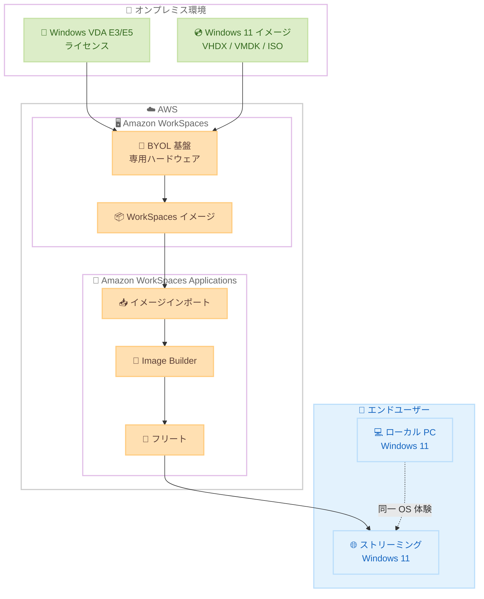

# Amazon WorkSpaces Applications - Windows Desktop OS サポート追加

**リリース日**: 2026 年 5 月 28 日
**サービス**: Amazon WorkSpaces Applications
**機能**: Windows Desktop OS (BYOL) サポート

📊 [このアップデートのインフォグラフィックを見る](https://takech9203.github.io/aws-news-summary/20260528-amazon-workspaces-applications-windows-desktop-OS.html)

## 概要

Amazon WorkSpaces Applications が Windows Desktop OS (Windows 11) のサポートを追加した。Bring Your Own License (BYOL) モデルを通じて、既存の Windows Desktop ライセンスを活用し、Windows 11 環境でのアプリケーションストリーミングおよびフルデスクトップストリーミングが可能になる。

これにより、ローカル環境とリモート環境で同一の Windows Desktop OS を使用できるため、ユーザーは同じワークフロー、ショートカット、ナビゲーションをそのまま適用でき、一貫したデスクトップ体験が提供される。また、Windows Server エディションでは動作しないアプリケーションを AWS 上でストリーミングすることも可能になる。

**アップデート前の課題**

- Amazon WorkSpaces Applications は Windows Server OS のみをサポートしており、Windows Desktop OS 専用のアプリケーションをストリーミングできなかった
- ローカル環境 (Windows 11) とリモート環境 (Windows Server) で OS が異なるため、UI やワークフローの違いによる認知負荷が発生していた
- Microsoft 365 Apps for enterprise など、Windows Desktop OS を必要とするアプリケーションの仮想化に制約があった

**アップデート後の改善**

- Windows 11 (24H2、25H2) を使用したアプリケーションおよびフルデスクトップのストリーミングが可能になった
- 既存の Windows VDA E3/E5 ライセンスを BYOL で活用し、OS 費用を削減できるようになった
- ローカルとリモートで同一の Windows Desktop OS を使用することで、一貫したユーザー体験を実現できるようになった

## アーキテクチャ図



既存の Windows Desktop ライセンスと OS イメージを Amazon WorkSpaces の BYOL 基盤にインポートし、Amazon WorkSpaces Applications のフリートとしてエンドユーザーにストリーミングする構成を示している。

## サービスアップデートの詳細

### 主要機能

1. **Windows Desktop OS BYOL サポート**
   - 既存の Windows VDA E3/E5 ライセンスを AWS の専用ハードウェアで使用可能
   - OS 費用が不要になり、コンピュートとストリーミングインフラのみの課金
   - Microsoft のライセンス要件に完全準拠した専用インフラ上で動作

2. **Windows 11 イメージの対応**
   - Windows 11 Version 24H2 (2024 年 10 月リリース) をサポート
   - Windows 11 Version 25H2 (2025 年 9 月リリース) をサポート
   - VM イメージ (VHDX、VMDK、OVF)、ISO、AMI からのインポートに対応

3. **既存 BYOL インフラとの統合**
   - Amazon WorkSpaces で既に BYOL を利用している場合、同じ専用インフラを共有
   - 追加の専用インフラプロビジョニング不要
   - WorkSpaces Personal、WorkSpaces Pools、WorkSpaces Applications が同一 BYOL アカウントで動作

4. **Microsoft 365 Apps for enterprise のストリーミング**
   - Windows Desktop OS 上で対象の Microsoft 365 Apps をストリーミング可能
   - Windows Server では利用できなかったエンタープライズアプリケーションに対応

## 技術仕様

### サポートされるインスタンスタイプ

| カテゴリ | インスタンスタイプ |
|---------|-------------------|
| Standard | stream.standard.medium / large / xlarge / 2xlarge |
| Compute-optimized | stream.compute.large / xlarge / 2xlarge / 4xlarge / 8xlarge |
| Memory-optimized | stream.memory.large / xlarge / 2xlarge / 4xlarge / 8xlarge |
| Graphics | stream.graphics.g4dn / g6 ファミリー (別途承認が必要) |

### サポートされる Windows バージョン

| OS バージョン | リリース時期 | 備考 |
|--------------|-------------|------|
| Windows 11 24H2 | 2024 年 10 月 | サポート対象 |
| Windows 11 25H2 | 2025 年 9 月 | サポート対象 |
| Windows 10 | - | WorkSpaces Applications では非サポート |

### 前提条件

| 項目 | 要件 |
|------|------|
| ライセンス | Microsoft VDA E3/E5 ユーザーライセンス (サブスクリプション) |
| 最小コミットメント | リージョンあたり月 50 WorkSpaces (AlwaysOn/On-Demand の組み合わせ可) |
| ネットワーク | イメージインポートに必要な HTTPS エンドポイントへのアクセス |
| 権限 | `workspaces:DescribeWorkspaceImages` を含むコンソールロール |

## 設定方法

### 前提条件

1. Microsoft VDA E3/E5 ライセンスを保有していること
2. AWS アカウントが BYOL に対応していること (未対応の場合はステップ 1 から実施)
3. リージョンあたり月 50 WorkSpaces の最小利用コミットメント

### 手順

#### ステップ 1: BYOL アカウントの有効化 (初回のみ)

```bash
# AWS コンソールで実施
# Services → Amazon WorkSpaces → Account Settings → BYOL セクション
# 「Get Started with BYOL」を選択し、IP/CIDR 範囲を指定
```

Amazon WorkSpaces のアカウント設定から BYOL を有効化する。管理ネットワークインターフェース用の IP/CIDR 範囲を指定する必要があり、一度設定すると変更できない点に注意する。

#### ステップ 2: BYOL イメージの作成

```bash
# Amazon WorkSpaces コンソールで「Import Image」を選択
# 以下のいずれかの方法でインポート:
# - VM import: カスタマイズ済みの VHDX/VMDK/OVF ファイル
# - ISO import: Microsoft からダウンロードした Windows ISO
# - AMI import: 既存の Amazon EC2 AMI
```

Windows 11 イメージを Amazon WorkSpaces にインポートする。既存の BYOL ユーザーは既存イメージをそのまま利用できる。

#### ステップ 3: Amazon WorkSpaces Applications へのイメージインポート

```bash
# Amazon WorkSpaces Applications コンソールで実施
# Images → Import Image → Amazon WorkSpaces Image を選択
# WorkSpaces Image ID (wsi-XXXXX) を入力
```

WorkSpaces で作成した BYOL イメージを Amazon WorkSpaces Applications にインポートする。

#### ステップ 4: フリートの作成とストリーミング開始

```bash
# Amazon WorkSpaces Applications コンソールで実施
# Fleets → Create Fleet → BYOL イメージを選択
# インスタンスタイプ、スケーリングポリシーを設定
```

BYOL イメージを使用してフリートを作成し、エンドユーザーへのストリーミングを開始する。

## メリット

### ビジネス面

- **コスト削減**: 既存の Windows VDA E3/E5 ライセンスを活用し、OS 費用を排除。RDS SAL 費用も不要
- **ユーザー生産性向上**: ローカルとリモートで同一の Windows 11 環境を提供し、環境切り替え時の認知負荷を排除
- **オンボーディング時間短縮**: 新しいデスクトップ環境への適応が不要になり、即座に業務開始可能

### 技術面

- **アプリケーション互換性拡大**: Windows Server で動作しないアプリケーションを AWS 上で仮想化可能
- **インフラ統合**: 既存の BYOL 専用インフラを WorkSpaces Personal、Pools、Applications で共有
- **柔軟なイメージ管理**: VM、ISO、AMI からのインポートに対応し、既存のイメージ作成ワークフローを活用可能

## デメリット・制約事項

### 制限事項

- マルチセッションの Windows 11 は Microsoft ライセンス制約により利用不可
- Windows 10 イメージは Amazon WorkSpaces Applications では非サポート (Windows 11 のみ)
- Graphics インスタンスの BYOL 有効化にはコンソールからではなく AWS サポートチケットが必要
- BYOL イメージの共有は同一組織 (同一ペイヤーアカウント) 内の BYOL 有効アカウントに限定

### 考慮すべき点

- リージョンあたり月 50 WorkSpaces の最小コミットメントが必要であり、小規模利用には適さない場合がある
- BYOL 用の IP/CIDR 範囲は一度設定すると変更不可のため、ネットワーク設計を事前に慎重に計画する必要がある
- Microsoft のライセンス要件を満たしていることの確認が必要

## ユースケース

### ユースケース 1: Windows Server 非対応アプリケーションの仮想化

**シナリオ**: 企業が使用する業務アプリケーションが Windows Desktop OS のみをサポートしており、従来の Amazon WorkSpaces Applications (Windows Server ベース) では動作しなかったケース。

**実装例**:
```
1. Windows 11 25H2 のカスタムイメージを作成
2. 業務アプリケーションをイメージにインストール
3. Amazon WorkSpaces Applications にインポート
4. フリートを作成してユーザーにストリーミング
```

**効果**: Windows Desktop OS 専用のアプリケーションを AWS 上で大規模にストリーミング配信でき、オンプレミスの VDI インフラを削減可能。

### ユースケース 2: ハイブリッドワーク環境の統一

**シナリオ**: 社員がオフィスでは Windows 11 PC を使用し、リモートワーク時は仮想デスクトップを使用するが、OS の違いにより操作感が異なっていたケース。

**実装例**:
```
1. 社内標準の Windows 11 イメージを BYOL でインポート
2. フルデスクトップストリーミングのフリートを構成
3. 自宅や外出先からも同一の Windows 11 環境にアクセス
```

**効果**: ローカルとリモートで完全に同一の OS 体験を提供し、場所を問わず一貫した生産性を維持。

### ユースケース 3: Microsoft 365 Apps のクラウドストリーミング

**シナリオ**: Microsoft 365 Apps for enterprise を仮想環境でストリーミングしたいが、ライセンス要件により Windows Desktop OS が必要だったケース。

**実装例**:
```
1. VDA E3/E5 ライセンスを確保
2. Windows 11 イメージに Microsoft 365 Apps をインストール
3. BYOL でインポートしフリートを作成
4. ユーザーにアプリケーション単位またはデスクトップ単位でストリーミング
```

**効果**: ライセンスコンプライアンスを維持しながら Microsoft 365 Apps を任意のデバイスにストリーミング配信可能。

## 料金

BYOL を使用することで、Windows OS のライセンス費用が不要となり、コンピュートとストリーミングインフラの費用のみが発生する。また、RDS SAL 費用も削減される。

具体的な料金は、選択するインスタンスタイプ、利用時間、ストリーミングプロトコルによって異なる。最新の料金情報は [Amazon WorkSpaces Applications 料金ページ](https://aws.amazon.com/workspaces-applications/pricing/) を参照。

## 利用可能リージョン

以下のリージョンで利用可能。

- 米国東部 (バージニア北部)
- 米国西部 (オレゴン)
- アジアパシフィック (ムンバイ)
- アジアパシフィック (ソウル)
- アジアパシフィック (シンガポール)
- アジアパシフィック (シドニー)
- アジアパシフィック (東京)
- カナダ (中部)
- 欧州 (フランクフルト)
- 欧州 (アイルランド)
- 欧州 (ロンドン)
- 欧州 (パリ)
- 南米 (サンパウロ)
- AWS GovCloud (米国西部)
- AWS GovCloud (米国東部)

## 関連サービス・機能

- **Amazon WorkSpaces Personal**: BYOL インフラを共有する仮想デスクトップサービス。同一の専用ハードウェアを使用可能
- **Amazon WorkSpaces Pools**: マルチセッション型の仮想デスクトップサービス。BYOL インフラを共有
- **AWS License Manager**: ライセンスの追跡・管理に使用可能

## 参考リンク

- 📊 [インフォグラフィック](https://takech9203.github.io/aws-news-summary/20260528-amazon-workspaces-applications-windows-desktop-OS.html)
- [公式発表 (What's New)](https://aws.amazon.com/about-aws/whats-new/2026/05/amazon-workspaces-applications-windows-desktop-OS/)
- [BYOL ドキュメント](https://docs.aws.amazon.com/appstream2/latest/developerguide/byol-windows-images.html)
- [Amazon WorkSpaces Applications ドキュメント](https://docs.aws.amazon.com/appstream2/)
- [Windows on AWS FAQ](https://aws.amazon.com/windows/faq/)

## まとめ

Amazon WorkSpaces Applications の Windows Desktop OS サポートは、Windows Server では動作しないアプリケーションの仮想化を可能にし、ハイブリッドワーク環境におけるユーザー体験の統一を実現する重要なアップデートである。既に Amazon WorkSpaces で BYOL を利用している組織は追加のインフラ構築なしで即座に利用開始でき、既存のライセンス投資を最大限に活用しながらコスト削減を実現できる。Windows Desktop OS 上でのアプリケーション配信を検討している組織は、BYOL の前提条件 (VDA E3/E5 ライセンス、月 50 WorkSpaces の最小コミットメント) を確認した上で導入を検討することを推奨する。
