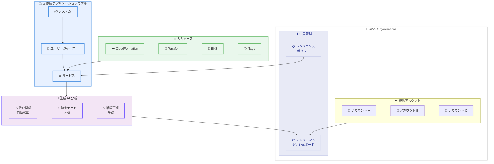

# AWS Resilience Hub - 次世代版の一般提供開始

**リリース日**: 2026 年 5 月 28 日
**サービス**: AWS Resilience Hub
**機能**: 次世代 AWS Resilience Hub (V2)

📊 [このアップデートのインフォグラフィックを見る](https://takech9203.github.io/aws-news-summary/20260528-aws-announces-next-gen-aws-resilience-hub.html)

## 概要

AWS は次世代 AWS Resilience Hub の一般提供 (GA) を発表した。この次世代版は、プラットフォームエンジニアリングチームおよびサイト信頼性エンジニアリング (SRE) チームが、重要な AWS ワークロードのレジリエンスを評価・強化するための中央拠点として機能する。

新しいアプリケーションモデル、生成 AI を活用した障害モード分析、組織全体のレジリエンスポリシー管理など、大幅に強化された機能を提供する。既存のユーザーは現在のエクスペリエンスを引き続き使用しながら、自身のペースで次世代版に移行できる。

**アップデート前の課題**

- レジリエンス評価がアプリケーション単位に限定されており、ビジネス価値の観点からの階層的なモデリングが困難だった
- 依存関係の可視性が限定的で、サービスが依存する AWS サービス、内部エンドポイント、サードパーティエンドポイントの最新情報を把握しにくかった
- レジリエンスポリシーを組織全体で統一的に定義・管理する仕組みがなく、各チームが個別に対応していた
- 障害モード分析を手動で行う必要があり、優先度付きの推奨事項を効率的に得ることが困難だった

**アップデート後の改善**

- 3 階層モデル (システム、ユーザージャーニー、サービス) によるビジネス価値ベースのアプリケーションモデリングが可能になった
- 依存関係の自動検出により、AWS サービス・内部エンドポイント・サードパーティエンドポイントへの依存を継続的に可視化できるようになった
- 生成 AI による障害モード分析で、AWS Well-Architected ベストプラクティスとレジリエンス分析フレームワークに基づいた優先度付き推奨事項が自動生成されるようになった
- AWS Organizations 統合により、全アカウント・全リージョンのレジリエンスポスチャーを単一ダッシュボードから監視可能になった

## アーキテクチャ図



次世代 AWS Resilience Hub は、3 階層のアプリケーションモデルを中心に、複数の入力ソースから依存関係を自動検出し、生成 AI で障害モード分析を実行する。AWS Organizations との統合により、組織全体のレジリエンスポスチャーを一元管理できる。

## サービスアップデートの詳細

### 主要機能

1. **3 階層アプリケーションモデル**
   - システム、ユーザージャーニー、サービスの 3 レベル階層でアプリケーションをモデル化
   - ビジネス価値を反映した構造で、アプリケーションがどのようにビジネスに貢献しているかを表現
   - ユーザージャーニーごとにレジリエンスポリシーを関連付け可能

2. **依存関係の自動検出**
   - AWS サービス、内部エンドポイント、サードパーティエンドポイントへの依存を自動的に検出
   - 時系列でのクエリ範囲指定 (時間単位・日単位の粒度) による依存関係の可視化
   - 依存関係のクリティカリティ (HARD/SOFT/UNKNOWN) の分類と管理

3. **生成 AI ベースの障害モード分析**
   - AWS Well-Architected ベストプラクティスに基づく分析
   - AWS Resilience Analysis Framework に基づく評価
   - 組織のレジリエンスポリシーに対する準拠性チェック
   - 優先度付きの具体的な推奨事項を自動生成

4. **モジュラーレジリエンスポリシー**
   - 中央チームが組織レベルでポリシーを定義
   - 可用性 SLO、マルチ AZ DR、マルチリージョン DR、データ回復の各コンポーネントを個別に設定
   - DR アプローチの選択: Active-Active、Hot Standby、Warm Standby、Pilot Light、Backup and Restore

5. **組織全体のレポートとダッシュボード**
   - AWS Organizations 統合による全アカウント・全リージョンの一元監視
   - S3 へのレポート出力設定
   - 達成可能性 (Achievability) の評価: 可用性 SLO、マルチ AZ RTO/RPO、マルチリージョン RTO/RPO

## 技術仕様

### 新しいデータモデル

| コンセプト | 説明 |
|------|------|
| System | 最上位の組織単位。複数のユーザージャーニーを含む |
| User Journey | ビジネス機能の単位。ポリシーを関連付け可能 |
| Service | 実際のインフラストラクチャリソースを含む技術的な単位 |
| Service Function | サービス内の機能単位。PRIMARY または SUPPLEMENTAL |
| Policy | レジリエンス目標を定義。RTO/RPO/SLO を設定 |
| Assertion | サービスに関するレジリエンス要件の宣言文 |
| Finding | 障害モード分析で検出された課題と推奨事項 |

### 障害カテゴリ

| カテゴリ | 説明 |
|------|------|
| SHARED_FATE | 共有運命 - 共通コンポーネントの障害が複数サービスに影響 |
| EXCESSIVE_LOAD | 過負荷 - キャパシティ超過による障害 |
| EXCESSIVE_LATENCY | 過剰レイテンシー - 許容範囲を超えた遅延 |
| MISCONFIGURATION_AND_BUGS | 設定ミス・バグ - 構成上の問題 |
| SINGLE_POINT_OF_FAILURE | 単一障害点 - 冗長性のない箇所 |

### 入力ソース

| タイプ | 説明 |
|------|------|
| CFN_STACK | CloudFormation スタックからのリソース検出 |
| TAGS | タグベースのリソースグルーピング |
| EKS | Amazon EKS クラスターとネームスペース |
| TERRAFORM | Terraform State ファイル |
| DESIGN_FILE | S3 上の設計ファイル |
| MONITORING | モニタリングベースの検出 |

### API 変更履歴

| 日付 | サービス | 変更内容 |
|------|----------|----------|
| 2026/05/28 | [resiliencehub](https://awsapichanges.com/archive/changes/364f28-resiliencehub.html) | 51 new api methods - 次世代 Resilience Hub の初期 SDK リリース |

### 主要な新規 API メソッド

```python
# システム管理
client.create_system(name='string', description='string', sharingEnabled=True|False)
client.list_systems(ouId='string', maxResults=123)

# サービス管理
client.create_service(name='string', policyArn='string', regions=['string'],
                      dependencyDiscovery='ENABLED'|'DISABLED')
client.list_services(systemArn='string', assessmentStatus='SUCCESS')

# ポリシー管理
client.create_policy(name='string', availabilitySlo={'target': 99.9},
                     multiAz={'rtoInMinutes': 30, 'rpoInMinutes': 5,
                              'disasterRecoveryApproach': 'HOT_STANDBY'})

# 障害モード分析
client.start_failure_mode_assessment(serviceArn='string')
client.list_failure_mode_findings(serviceArn='string', severity='HIGH')
client.get_failure_mode_finding(findingId='string', serviceArn='string')

# 依存関係
client.list_dependencies(serviceArn='string',
                         queryRangeGranularity='HOURLY'|'DAILY')

# V1 からの移行
client.import_app(v1AppArn='string', policyArn='string')
client.import_policy(v1PolicyArn='string')
```

## 設定方法

### 前提条件

1. AWS アカウントと適切な IAM 権限
2. 評価対象のリソースが存在する AWS アカウント
3. AWS Organizations の設定 (組織全体の管理を使用する場合)

### 手順

#### ステップ 1: レジリエンスポリシーの作成

```bash
aws resiliencehub-v2 create-policy \
  --name "production-standard" \
  --availability-slo '{"target": 99.95}' \
  --multi-az '{"rtoInMinutes": 30, "rpoInMinutes": 5, "disasterRecoveryApproach": "HOT_STANDBY"}' \
  --multi-region '{"rtoInMinutes": 120, "rpoInMinutes": 60, "disasterRecoveryApproach": "WARM_STANDBY"}' \
  --data-recovery '{"timeBetweenBackupsInMinutes": 60}'
```

レジリエンスポリシーを作成し、可用性 SLO、マルチ AZ/マルチリージョンの RTO/RPO 目標、データ回復間隔を定義する。

#### ステップ 2: システムとサービスの作成

```bash
# システムの作成
aws resiliencehub-v2 create-system \
  --name "e-commerce-platform" \
  --description "Main e-commerce platform" \
  --sharing-enabled

# サービスの作成
aws resiliencehub-v2 create-service \
  --name "order-service" \
  --policy-arn "arn:aws:resiliencehub:us-east-1:123456789012:policy/production-standard" \
  --regions '["us-east-1", "us-west-2"]' \
  --dependency-discovery "ENABLED"
```

3 階層モデルに基づいてシステムとサービスを作成する。サービスにはポリシーを関連付け、依存関係の自動検出を有効にする。

#### ステップ 3: 入力ソースの設定と障害モード分析の実行

```bash
# CloudFormation スタックを入力ソースとして追加
aws resiliencehub-v2 create-input-source \
  --service-arn "arn:aws:resiliencehub:us-east-1:123456789012:service/order-service" \
  --resource-configuration '{"cfnStackArn": "arn:aws:cloudformation:us-east-1:123456789012:stack/order-stack/xxx"}'

# 障害モード分析を開始
aws resiliencehub-v2 start-failure-mode-assessment \
  --service-arn "arn:aws:resiliencehub:us-east-1:123456789012:service/order-service"
```

入力ソースを設定してリソースを検出した後、障害モード分析を実行する。生成 AI がサービスのアーキテクチャを分析し、潜在的な障害モードと推奨事項を生成する。

#### ステップ 4: V1 からの移行 (既存ユーザー向け)

```bash
# 既存のポリシーをインポート
aws resiliencehub-v2 import-policy \
  --v1-policy-arn "arn:aws:resiliencehub:us-east-1:123456789012:resiliency-policy/existing-policy"

# 既存のアプリケーションをインポート
aws resiliencehub-v2 import-app \
  --v1-app-arn "arn:aws:resiliencehub:us-east-1:123456789012:app/existing-app" \
  --policy-arn "arn:aws:resiliencehub:us-east-1:123456789012:policy/imported-policy"
```

既存の Resilience Hub V1 のポリシーとアプリケーションを V2 にインポートする。手動で追加したリソースのスキップオプションも利用可能。

## メリット

### ビジネス面

- **ビジネス価値ベースのモデリング**: 3 階層モデルにより、技術的なインフラだけでなくビジネスへの影響を中心にレジリエンスを評価できる
- **組織全体のガバナンス**: AWS Organizations との統合で、マルチアカウント環境全体のレジリエンスポスチャーを統一的に管理できる
- **運用コストの削減**: 生成 AI による自動分析で、手動による障害モード分析の工数を大幅に削減できる

### 技術面

- **自動依存関係検出**: サービス間の依存関係を自動的に可視化し、隠れた単一障害点を早期に特定できる
- **Infrastructure as Code 対応**: CloudFormation、Terraform、EKS など複数の IaC ソースからリソースを自動検出する
- **API ファーストの設計**: 51 の新規 API メソッドにより、CI/CD パイプラインへの統合やプログラマティックな操作が容易

## デメリット・制約事項

### 制限事項

- V1 からの移行は段階的に行う必要があり、即座の完全移行は推奨されない
- 障害モード分析は AI ベースであるため、すべての障害パターンを網羅しているわけではない
- 分析実行ごとにコストが発生する (estimatedAssessmentCost フィールドで事前確認可能)

### 考慮すべき点

- V1 と V2 は並行して利用可能だが、データモデルが異なるためインポート後の調整が必要な場合がある
- 依存関係の自動検出にはサービスに対する適切な IAM 権限の付与が必要
- 組織全体の管理にはクロスアカウントロールの設定が必要

## ユースケース

### ユースケース 1: マルチアカウント環境のレジリエンス一元管理

**シナリオ**: プラットフォームエンジニアリングチームが、数十のアカウントに分散した本番ワークロードのレジリエンスポスチャーを統一的に把握・管理したい。

**実装例**:
```python
import boto3

client = boto3.client('resiliencehub-v2')

# 組織全体のシステム一覧を取得
systems = client.list_systems(ouId='ou-xxxx-xxxxxxxx')

# 各システムに紐づくサービスのアセスメント状況を確認
for system in systems['systemSummaries']:
    services = client.list_services(
        systemArn=system['systemArn'],
        assessmentStatus='FAILED'
    )
    for svc in services['serviceSummaries']:
        print(f"要対応: {svc['name']} - 未解決: {svc['openFindingsCount']} 件")
```

**効果**: 組織全体のレジリエンスリスクを一元的に可視化し、問題のあるサービスを迅速に特定できる。

### ユースケース 2: CI/CD パイプラインでのレジリエンス検証

**シナリオ**: デプロイパイプラインの一部として、インフラ変更がレジリエンスポリシーに準拠しているかを自動検証したい。

**実装例**:
```python
import boto3
import time

client = boto3.client('resiliencehub-v2')

# デプロイ後に障害モード分析を実行
response = client.start_failure_mode_assessment(
    serviceArn='arn:aws:resiliencehub:us-east-1:123456789012:service/order-service'
)

assessment_id = response['assessmentId']

# 分析完了を待機
while True:
    assessments = client.list_failure_mode_assessments(
        serviceArn='arn:aws:resiliencehub:us-east-1:123456789012:service/order-service'
    )
    current = next(a for a in assessments['assessmentSummaries']
                   if a['assessmentId'] == assessment_id)
    if current['assessmentStatus'] in ('SUCCESS', 'FAILED'):
        break
    time.sleep(30)

# HIGH 重大度の検出結果があればパイプラインを失敗させる
findings = client.list_failure_mode_findings(
    serviceArn='arn:aws:resiliencehub:us-east-1:123456789012:service/order-service',
    severity='HIGH',
    status='OPEN'
)

if findings['findingsSummary']:
    raise Exception(f"レジリエンスチェック失敗: {len(findings['findingsSummary'])} 件の重大な課題")
```

**効果**: インフラ変更によるレジリエンス劣化をデプロイ前に検出し、プロダクション環境の信頼性を維持できる。

### ユースケース 3: V1 から V2 への段階的移行

**シナリオ**: 既存の Resilience Hub V1 で管理している複数のアプリケーションを、ビジネスへの影響を最小化しながら V2 に移行したい。

**実装例**:
```python
import boto3

client = boto3.client('resiliencehub-v2')

# まずポリシーをインポート
policy_response = client.import_policy(
    v1PolicyArn='arn:aws:resiliencehub:us-east-1:123456789012:resiliency-policy/v1-policy',
    availabilitySlo={'target': 99.95},
    multiAzDisasterRecoveryApproach='HOT_STANDBY',
    multiRegionDisasterRecoveryApproach='WARM_STANDBY'
)

# アプリケーションをインポート
app_response = client.import_app(
    v1AppArn='arn:aws:resiliencehub:us-east-1:123456789012:app/v1-app',
    policyArn=policy_response['policy']['policyArn'],
    skipManuallyAddedResources=True
)

print(f"移行完了: {app_response['service']['serviceArn']}")
```

**効果**: 既存の設定を活かしながら段階的に V2 の新機能を活用でき、チームの学習コストを最小化できる。

## 料金

料金の詳細は公式発表には記載されていないが、API レスポンスに `estimatedAssessmentCost` フィールドが含まれており、分析実行ごとの従量課金モデルが想定される。

### 料金構造 (想定)

| 項目 | 詳細 |
|------|------|
| 障害モード分析 | 分析実行あたりの課金 (billableAssessmentUnitCount ベース) |
| サービス管理 | サービス数に応じた課金の可能性 |

最新の料金情報は [AWS Resilience Hub 料金ページ](https://aws.amazon.com/resilience-hub/pricing/) を参照。

## 利用可能リージョン

AWS Resilience Hub が現在提供されているすべての AWS リージョンで利用可能。詳細は [AWS リージョン表](https://aws.amazon.com/about-aws/global-infrastructure/regional-product-services/) を参照。

## 関連サービス・機能

- **AWS Well-Architected Framework**: 障害モード分析で参照されるベストプラクティスの基盤
- **AWS Organizations**: マルチアカウント環境での組織全体のレジリエンス管理を実現
- **AWS Fault Injection Service (FIS)**: レジリエンスの検証・テストに使用する障害注入サービス
- **Amazon CloudWatch**: 依存関係検出のモニタリングソースとして活用
- **AWS CloudFormation / Terraform**: リソース検出の入力ソースとして使用

## 参考リンク

- 📊 [インフォグラフィック](https://takech9203.github.io/aws-news-summary/20260528-aws-announces-next-gen-aws-resilience-hub.html)
- [公式発表 (What's New)](https://aws.amazon.com/about-aws/whats-new/2026/05/aws-announces-next-gen-aws-resilience-hub)
- [AWS News Blog](https://aws.amazon.com/blogs/aws/introducing-the-next-generation-of-aws-resilience-hub-for-generative-ai-based-sre-resilience-journey/)
- [製品ページ](https://aws.amazon.com/resilience-hub/)
- [移行ガイド](https://docs.aws.amazon.com/resilience-hub/latest/userguide/next-gen-migrating.html)
- [AWS マネジメントコンソール (V2)](https://console.aws.amazon.com/resiliencehub/v2/home)

## まとめ

次世代 AWS Resilience Hub は、生成 AI を活用した障害モード分析と 3 階層アプリケーションモデルにより、レジリエンス管理を大幅に高度化する重要なアップデートである。特に組織全体のレジリエンスガバナンスを実現する AWS Organizations 統合と、51 の新規 API による自動化の容易さが大きな特徴であり、プラットフォームエンジニアリングチームや SRE チームは早期の評価と段階的な移行を検討すべきである。
