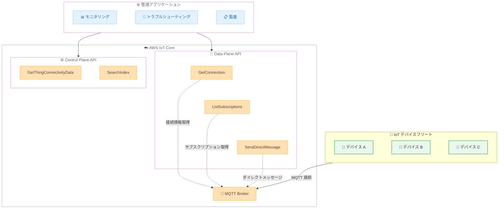

# AWS IoT Core - MQTT 接続管理 API の追加

**リリース日**: 2026年5月28日
**サービス**: AWS IoT Core
**機能**: MQTT 接続管理 API (GetConnection, ListSubscriptions)

📊 [このアップデートのインフォグラフィックを見る](https://takech9203.github.io/aws-news-summary/20260528-aws-iot-core-apis-mqtt.html)

## 概要

AWS IoT Core に MQTT 接続管理のための 2 つの新しい API (GetConnection および ListSubscriptions) が追加された。これにより、IoT デバイスの MQTT クライアント接続情報およびサブスクリプション情報にプログラムからアクセスできるようになり、接続性の問題のトラブルシューティング、クライアント動作のモニタリング、デバイスフリート全体の接続パターンの監査が容易になる。

既存の DeleteConnection API と合わせて、包括的な MQTT 接続管理エクスペリエンスが提供される。また、AWS IoT Data Plane には SendDirectMessage API も追加され、MQTT 接続されたデバイスへのダイレクトメッセージ送信が可能になった。

**アップデート前の課題**

- MQTT クライアントの接続状態や詳細情報を API 経由で取得する手段が限られていた
- デバイスのサブスクリプション状況を一覧で確認するには、別途モニタリングの仕組みを構築する必要があった
- 接続の問題が発生した際、ソケットレベルの情報 (IP アドレス、ポート等) を取得するのが困難だった
- 不要なサブスクリプションや重複したサブスクリプションを特定するための手段が不足していた

**アップデート後の改善**

- GetConnection API で接続状態、MQTT セッション詳細、ソケットレベルの情報を取得可能になった
- ListSubscriptions API で接続中および永続セッションを持つオフラインクライアントのトピックサブスクリプションを一覧取得可能になった
- IAM ポリシーによるきめ細かいアクセス制御で、ソケット情報の取得を制限可能
- SendDirectMessage API でデバイスへの直接メッセージ送信が可能になった

## アーキテクチャ図



AWS IoT Core の MQTT 接続管理 API を利用したアーキテクチャ。管理アプリケーションから Data Plane API および Control Plane API を通じてデバイスフリートの接続状態を監視・管理できる。

## サービスアップデートの詳細

### 主要機能

1. **GetConnection API**
   - 指定したクライアント ID の MQTT 接続情報を取得
   - 接続状態 (connected/disconnected)、接続時刻、切断時刻、切断理由を返却
   - オプションでソケットレベル情報を取得可能 (ソース IP/ポート、ターゲット IP/ポート、VPC エンドポイント ID)
   - KeepAlive 期間、CleanSession フラグ、セッション有効期限の情報も含む
   - IAM ポリシーによるきめ細かいアクセス制御に対応

2. **ListSubscriptions API**
   - 指定したクライアント ID の全トピックサブスクリプションを一覧取得
   - 各サブスクリプションのトピックフィルターと QoS レベルを返却
   - 接続中のクライアントだけでなく、永続セッションを持つオフラインクライアントにも対応
   - ページネーション対応 (nextToken, maxResults)
   - 重複・不要なサブスクリプションの特定に活用可能

3. **SendDirectMessage API**
   - 指定したクライアント ID にダイレクトメッセージを送信
   - トピック、コンテンツタイプ、レスポンストピック、ペイロードを指定可能
   - 確認応答 (confirmation) オプションおよびタイムアウト設定をサポート
   - ユーザープロパティやペイロードフォーマットインジケータに対応
   - MQTT 5.0 のプロトコル機能を活用

4. **Fleet Indexing の拡張**
   - GetThingConnectivityData API にソケット情報 (IP、ポート、VPC エンドポイント ID) フィールドが追加
   - SearchIndex API のレスポンスに KeepAlive 期間、CleanSession、セッション有効期限、クライアント ID が追加
   - GetIndexingConfiguration / UpdateIndexingConfiguration に connectivity フィルター設定が追加
   - 切断理由に `API_INITIATED_DISCONNECT` が新規追加

## 技術仕様

### API パラメータ

| API | メソッド | 主要パラメータ |
|-----|----------|----------------|
| GetConnection | Data Plane | clientId, includeSocketInformation |
| ListSubscriptions | Data Plane | clientId, nextToken, maxResults |
| SendDirectMessage | Data Plane | clientId, topic, payload, confirmation, timeout |
| GetThingConnectivityData | Control Plane | thingName, includeSocketInformation |

### GetConnection レスポンスフィールド

| フィールド | 型 | 説明 |
|------------|------|------|
| connected | Boolean | 現在の接続状態 |
| thingName | String | 関連付けられた Thing 名 |
| sourceIp | String | クライアントのソース IP |
| sourcePort | Integer | クライアントのソースポート |
| targetIp | String | IoT Core のターゲット IP |
| targetPort | Integer | IoT Core のターゲットポート |
| keepAliveDuration | Integer | KeepAlive 間隔 (秒) |
| connectedSince | Long | 接続開始タイムスタンプ |
| disconnectedSince | Long | 切断タイムスタンプ |
| disconnectReason | String | 切断理由 |
| sessionExpiry | Long | セッション有効期限 |
| vpcEndpointId | String | VPC エンドポイント ID |
| cleanSession | Boolean | CleanSession フラグ |
| clientId | String | MQTT クライアント ID |

### 切断理由 (disconnectReason) の値

| 値 | 説明 |
|----|------|
| AUTH_ERROR | 認証エラー |
| CLIENT_INITIATED_DISCONNECT | クライアント起因の切断 |
| CLIENT_ERROR | クライアントエラー |
| CONNECTION_LOST | 接続喪失 |
| DUPLICATE_CLIENTID | クライアント ID 重複 |
| FORBIDDEN_ACCESS | アクセス拒否 |
| MQTT_KEEP_ALIVE_TIMEOUT | KeepAlive タイムアウト |
| SERVER_ERROR | サーバーエラー |
| SERVER_INITIATED_DISCONNECT | サーバー起因の切断 |
| API_INITIATED_DISCONNECT | API 起因の切断 |
| THROTTLED | スロットリング |
| WEBSOCKET_TTL_EXPIRATION | WebSocket TTL 期限切れ |
| CUSTOMAUTH_TTL_EXPIRATION | カスタム認証 TTL 期限切れ |

### API 変更履歴

| 日付 | サービス | 変更内容 |
|------|----------|----------|
| 2026/05/28 | [AWS IoT Data Plane](https://awsapichanges.com/archive/changes/364f28-data-ats.iot.html) | 3 new api methods - GetConnection, ListSubscriptions, SendDirectMessage の追加 |
| 2026/05/28 | [AWS IoT](https://awsapichanges.com/archive/changes/364f28-iot.html) | 4 updated api methods - Fleet Indexing 関連 API に接続情報フィールドを追加 |

### IAM ポリシー例

```json
{
  "Version": "2012-10-17",
  "Statement": [
    {
      "Effect": "Allow",
      "Action": [
        "iot:GetConnection",
        "iot:ListSubscriptions",
        "iot:SendDirectMessage"
      ],
      "Resource": "arn:aws:iot:*:*:client/*"
    },
    {
      "Effect": "Allow",
      "Action": [
        "iot:GetThingConnectivityData",
        "iot:SearchIndex"
      ],
      "Resource": "*"
    }
  ]
}
```

## 設定方法

### 前提条件

1. AWS IoT Core が利用可能なリージョンの AWS アカウント
2. IoT デバイスが MQTT プロトコルで AWS IoT Core に接続済み
3. 適切な IAM 権限が設定されていること

### 手順

#### ステップ 1: デバイスの接続状態を確認

```bash
# 特定のクライアントの接続情報を取得
aws iot-data get-connection \
  --client-id "my-device-001"
```

指定したクライアント ID の接続状態、接続時刻、切断理由などの基本情報を取得する。

#### ステップ 2: ソケット情報を含む詳細情報の取得

```bash
# ソケットレベルの情報も含めて取得
aws iot-data get-connection \
  --client-id "my-device-001" \
  --include-socket-information
```

`--include-socket-information` フラグを指定することで、ソース IP/ポート、ターゲット IP/ポート、VPC エンドポイント ID といったネットワークレベルの情報も取得できる。

#### ステップ 3: サブスクリプション一覧の取得

```bash
# クライアントのサブスクリプション一覧を取得
aws iot-data list-subscriptions \
  --client-id "my-device-001" \
  --max-results 50
```

指定したクライアントが現在サブスクライブしている全トピックフィルターと QoS レベルを一覧で確認できる。永続セッションのオフラインクライアントにも対応している。

#### ステップ 4: ダイレクトメッセージの送信

```bash
# 特定のクライアントにメッセージを送信
aws iot-data send-direct-message \
  --client-id "my-device-001" \
  --topic "device/commands" \
  --payload '{"action": "reboot"}' \
  --confirmation
```

指定したクライアント ID に対してダイレクトにメッセージを送信する。`--confirmation` フラグにより、メッセージの配信確認を要求できる。

## メリット

### ビジネス面

- **運用コスト削減**: カスタムモニタリングソリューションの構築が不要になり、管理オーバーヘッドが低減
- **障害対応時間の短縮**: 接続問題の詳細な診断情報を即座に取得でき、MTTR を改善
- **セキュリティ監査の効率化**: 接続パターンの監査やアクセス元 IP の確認が API 経由で自動化可能

### 技術面

- **リアルタイム可視性**: デバイスの接続状態やネットワーク情報をリアルタイムで把握可能
- **きめ細かいアクセス制御**: IAM ポリシーでソケット情報の取得権限を分離でき、セキュリティを強化
- **スケーラブルなフリート管理**: Fleet Indexing との連携で大規模デバイスフリートの接続情報を効率的に検索・集約
- **自動化の促進**: API 経由でプログラマティックに接続管理が行えるため、自動復旧やアラート連携が容易

## デメリット・制約事項

### 制限事項

- ソケット情報の取得には `includeSocketInformation` パラメータの明示的な指定が必要
- ListSubscriptions API はページネーション対応だが、大規模なサブスクリプション数の場合は複数回の呼び出しが必要
- SendDirectMessage API の confirmation オプションにはタイムアウト制限がある
- API のスロットリング制限 (TPS) は AWS IoT Core の既存のサービスクォータに従う

### 考慮すべき点

- ソケット情報にはクライアントの IP アドレスが含まれるため、アクセス権限を適切に制限する必要がある
- 永続セッションを持たないクライアントが切断中の場合、ListSubscriptions の結果は空になる
- Fleet Indexing を活用する場合、インデックス設定の更新 (connectivity フィルター) が別途必要

## ユースケース

### ユースケース 1: 大規模 IoT デバイスフリートの接続ヘルスモニタリング

**シナリオ**: 製造業で数千台のセンサーデバイスを運用しており、接続状態をリアルタイムで把握し、異常を早期検知したい。

**実装例**:
```python
import boto3

iot_data = boto3.client('iot-data-plane')

# 特定デバイスの接続状態を確認
response = iot_data.get_connection(
    clientId='sensor-factory-floor-001',
    includeSocketInformation=True
)

if not response['connected']:
    print(f"デバイス切断検知: 理由={response['disconnectReason']}")
    print(f"切断時刻: {response['disconnectedSince']}")
    print(f"最終接続元IP: {response['sourceIp']}")
```

**効果**: 接続障害の迅速な検知と詳細な診断情報による問題解決時間の短縮。ネットワークレベルの情報により、IP アドレス変更やネットワーク経路の問題を特定できる。

### ユースケース 2: サブスクリプション監査とコスト最適化

**シナリオ**: IoT プラットフォームで多数のデバイスが各種トピックをサブスクライブしており、不要なサブスクリプションを整理してメッセージ配信コストを最適化したい。

**実装例**:
```python
import boto3

iot_data = boto3.client('iot-data-plane')

# デバイスのサブスクリプション一覧を取得
response = iot_data.list_subscriptions(
    clientId='device-001',
    maxResults=100
)

for sub in response['subscriptions']:
    print(f"トピック: {sub['topicFilter']}, QoS: {sub['qos']}")

# 重複・不要なサブスクリプションを特定
topic_filters = [s['topicFilter'] for s in response['subscriptions']]
duplicates = [t for t in topic_filters if topic_filters.count(t) > 1]
```

**効果**: 重複サブスクリプションの特定・削除によるメッセージ配信の効率化とコスト削減。QoS レベルの適正化による帯域使用量の最適化。

### ユースケース 3: セキュリティインシデント対応と接続監査

**シナリオ**: セキュリティインシデント発生時に、特定のデバイスの接続元 IP やネットワーク情報を確認し、不正アクセスの有無を調査したい。

**実装例**:
```python
import boto3

iot_data = boto3.client('iot-data-plane')
iot = boto3.client('iot')

# 不審なデバイスの接続情報を詳細取得
conn = iot_data.get_connection(
    clientId='suspicious-device',
    includeSocketInformation=True
)

print(f"接続元 IP: {conn['sourceIp']}:{conn['sourcePort']}")
print(f"VPC エンドポイント: {conn.get('vpcEndpointId', 'N/A')}")

# 不正と判断した場合、接続を切断
if conn['sourceIp'] not in allowed_ips:
    iot_data.delete_connection(clientId='suspicious-device')
    print("不正接続を切断しました")
```

**効果**: インシデント発生時の迅速な調査と対応。接続元の IP アドレスや VPC エンドポイント情報を活用した不正アクセスの特定と遮断。

## 料金

AWS IoT Core の MQTT 接続管理 API は、AWS IoT Core の既存の料金体系に含まれる。API 呼び出しに対する追加料金の詳細については、AWS IoT Core の料金ページを参照。

### 料金構成要素

| 項目 | 説明 |
|------|------|
| 接続料金 | デバイスが IoT Core に接続している時間に基づく |
| メッセージング料金 | 送受信されるメッセージ数に基づく |
| API 呼び出し | 管理 API の呼び出し回数に基づく |

## 利用可能リージョン

AWS IoT Core がサポートされている全ての AWS リージョンで利用可能。

## 関連サービス・機能

- **AWS IoT Device Management**: デバイスの登録、整理、モニタリングを行うサービス。Fleet Indexing と連携して大規模なデバイスフリートの接続管理を実現
- **AWS IoT Core Fleet Indexing**: デバイスの接続状態を含むメタデータのインデックス化と検索。今回のアップデートで接続詳細フィールドが追加
- **Amazon CloudWatch**: IoT Core のメトリクスやログと組み合わせて、接続管理 API の結果に基づくアラームやダッシュボードを構築
- **AWS IoT Device Defender**: デバイスのセキュリティ監査。接続管理 API の情報と組み合わせてセキュリティ体制を強化

## 参考リンク

- 📊 [インフォグラフィック](https://takech9203.github.io/aws-news-summary/20260528-aws-iot-core-apis-mqtt.html)
- [公式発表 (What's New)](https://aws.amazon.com/about-aws/whats-new/2026/05/aws-iot-core-apis-mqtt/)
- [AWS IoT Core ドキュメント](https://docs.aws.amazon.com/iot/latest/developerguide/)
- [AWS IoT Core API リファレンス](https://docs.aws.amazon.com/iot/latest/apireference/)
- [AWS IoT Core 料金ページ](https://aws.amazon.com/iot-core/pricing/)

## まとめ

AWS IoT Core に追加された MQTT 接続管理 API (GetConnection, ListSubscriptions, SendDirectMessage) により、IoT デバイスフリートの接続状態をプログラマティックに管理・監視する能力が大幅に向上した。特に大規模デバイスフリートを運用する組織にとって、トラブルシューティングの効率化、セキュリティ監査の自動化、サブスクリプション最適化によるコスト削減が期待できる。Fleet Indexing の拡張と合わせて、既存の IoT ワークロードに即座に活用することを推奨する。
