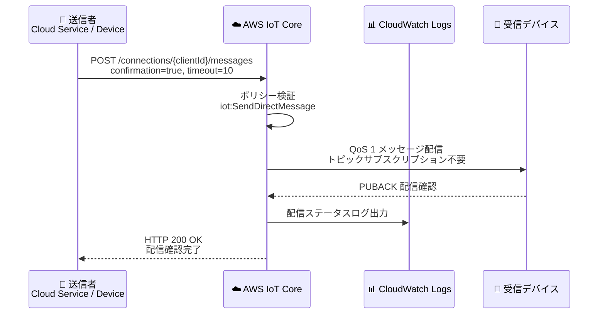

# AWS IoT Core - ダイレクトメッセージング (Point-to-Point 通信)

**リリース日**: 2026年5月28日
**サービス**: AWS IoT Core
**機能**: Direct Messaging (SendDirectMessage API)

📊 [このアップデートのインフォグラフィックを見る](https://takech9203.github.io/aws-news-summary/20260528-aws-iot-core-direct-messaging.html)

## 概要

AWS IoT Core がダイレクトメッセージング機能をサポートし、接続されたデバイスへのポイントツーポイント通信が可能になった。この機能により、従来のトピックベースの Pub/Sub モデルに依存することなく、MQTT クライアント ID を指定して特定のデバイスに直接メッセージを送信できる。

従来の AWS IoT Core では、特定のデバイスにメッセージを送信するにはデバイスがあらかじめトピックをサブスクライブしている必要があり、メッセージの配信確認も組み込みでは提供されていなかった。新しい SendDirectMessage API により、サブスクリプション不要のダイレクト配信と、オプションの配信確認 (PUBACK ベース) が実現され、IoT システムにおけるメッセージングの信頼性と可視性が大幅に向上する。

**アップデート前の課題**

- 特定デバイスへのメッセージ送信にはトピックへの Publish が必要で、デバイスが事前にそのトピックを Subscribe している必要があった
- メッセージが実際にデバイスに届いたかどうかを確認する組み込みの仕組みがなかった
- Pub/Sub モデルでは Publish-In と Publish-Out の 2 つのメッセージとして課金され、ポイントツーポイント通信のコストが高かった

**アップデート後の改善**

- MQTT クライアント ID を指定するだけで、トピックサブスクリプションなしに直接メッセージ配信が可能になった
- `confirmation=true` パラメータによりエンドツーエンドの配信確認 (PUBACK) を取得できるようになった
- ダイレクトメッセージは 1 メッセージとして課金され、Pub/Sub の 2 メッセージ課金と比較してコスト削減が可能になった
- CloudWatch Logs による配信状況と失敗理由の詳細な可視性が提供されるようになった

## アーキテクチャ図



送信者が HTTP POST で SendDirectMessage API を呼び出し、AWS IoT Core が受信デバイスへ直接メッセージを配信する。`confirmation=true` の場合、受信デバイスからの PUBACK を待機してから送信者に成功レスポンスを返す。

## サービスアップデートの詳細

### 主要機能

1. **ダイレクトメッセージ配信**
   - MQTT クライアント ID を指定して特定デバイスに直接メッセージを送信
   - 受信デバイスがトピックをサブスクライブしていなくてもメッセージを配信可能
   - HTTP POST リクエストで API を呼び出し (AWS CLI、curl、SDK 対応)

2. **配信確認 (Delivery Confirmation)**
   - `confirmation=true` を指定すると QoS 1 で配信し、PUBACK を待機
   - タイムアウト値を秒単位で指定可能 (`timeout` パラメータ)
   - 確認なし (`confirmation=false`) の場合は QoS 0 で即座に配信

3. **詳細なレスポンスコードとログ**
   - HTTP ステータスコードで配信結果を即座に把握 (200, 400, 403, 404, 413, 429, 500, 504)
   - CloudWatch Logs で配信状況と失敗理由を詳細に記録
   - traceId によるリクエストトレーサビリティ

## 技術仕様

### API エンドポイント

| 項目 | 詳細 |
|------|------|
| API 名 | SendDirectMessage |
| プロトコル | HTTP POST |
| エンドポイント | `https://{IoT_data_endpoint}/connections/{client_id}/messages` |
| ペイロード計測単位 | 5 KB 単位 |
| クライアント ID 最大長 | 128 文字 |
| 認証方式 | X.509 クライアント証明書 (ポート 8443)、IAM 署名 |

### レスポンスコード

| HTTP コード | 意味 | 推奨アクション |
|-------------|------|----------------|
| 200 OK | 配信成功 (confirmation=true の場合は PUBACK 受信済み) | - |
| 400 Bad Request | パラメータ不正 | トピック名、クライアント ID の検証 |
| 403 Forbidden | 権限不足 | IoT ポリシーの確認と更新 |
| 404 Not Found | 対象デバイス未接続 | デバイスの接続状態を確認 |
| 413 Payload Too Large | ペイロードサイズ超過 | ペイロードを削減 |
| 429 Too Many Requests | レート制限超過 | Exponential backoff の実装 |
| 504 Gateway Timeout | PUBACK タイムアウト | タイムアウト値の増加、受信側の確認 |

### API 変更履歴

| 日付 | サービス | 変更内容 |
|------|----------|----------|
| 2026/05/28 | [AWS IoT Data Plane](https://awsapichanges.com/archive/changes/364f28-data-ats.iot.html) | 3 new api methods - SendDirectMessage, ListSubscriptions, GetConnection |
| 2026/05/28 | [AWS IoT](https://awsapichanges.com/archive/changes/364f28-iot.html) | 4 updated api methods - GetIndexingConfiguration, GetThingConnectivityData, SearchIndex, UpdateIndexingConfiguration に接続情報フィールドを追加 |

### IAM ポリシー設定

```json
{
  "Version": "2012-10-17",
  "Statement": [
    {
      "Effect": "Allow",
      "Action": "iot:SendDirectMessage",
      "Resource": "arn:aws:iot:us-west-2:123456789012:client/targetDeviceId",
      "Condition": {
        "StringEquals": {
          "iot:Topic": "commands/reboot"
        }
      }
    }
  ]
}
```

受信側デバイスには `iot:Receive` 権限がターゲットトピックに対して必要。`iot:Subscribe` 権限は不要。

## 設定方法

### 前提条件

1. AWS IoT Core にデバイスが登録・接続されていること
2. 送信者に `iot:SendDirectMessage` ポリシーアクションが付与されていること
3. 受信者に `iot:Receive` ポリシーアクションが付与されていること
4. AWS IoT データエンドポイントの取得

### 手順

#### ステップ 1: IoT データエンドポイントの確認

```bash
aws iot describe-endpoint --endpoint-type iot:Data-ATS --region us-west-2
```

アカウント固有の IoT データエンドポイント URL を取得する。

#### ステップ 2: ダイレクトメッセージの送信 (AWS CLI)

```bash
aws iot-data send-direct-message \
    --client-id myDevice \
    --topic commands/reboot \
    --confirmation \
    --timeout 10 \
    --payload '{"action": "reboot"}' \
    --region us-west-2 \
    --endpoint-url https://{IoT_data_endpoint}
```

対象デバイスの MQTT クライアント ID を指定してメッセージを送信する。`--confirmation` フラグにより、デバイスからの PUBACK を待機する。

#### ステップ 3: ダイレクトメッセージの送信 (curl / X.509 証明書)

```bash
curl --tlsv1.2 \
    --cacert Amazon-root-CA-1.pem \
    --cert device.pem.crt \
    --key private.pem.key \
    --request POST \
    --data '{"action": "reboot"}' \
    "https://{IoT_data_endpoint}:8443/connections/myDevice/messages?topic=commands%2Freboot&confirmation=true&timeout=10"
```

X.509 クライアント証明書認証を使用してポート 8443 経由でダイレクトメッセージを送信する。トピック名は URL エンコードが必要。

#### ステップ 4: 受信側デバイスの設定

受信側の MQTT クライアントは以下の点を確認する。

- サブスクライブしていないトピックのメッセージも受信処理できること
- QoS 0 と QoS 1 の両方の受信メッセージを正しく処理できること
- QoS 1 メッセージに対して PUBACK を返すこと

## メリット

### ビジネス面

- **コスト削減**: Pub/Sub の 2 メッセージ課金 (Publish-In + Publish-Out) から 1 メッセージ課金になり、ポイントツーポイント通信のコストが削減される
- **運用効率向上**: 配信確認により、メッセージが確実にデバイスに届いたことをアプリケーションレベルで保証でき、リトライロジックの簡素化が可能
- **障害対応の迅速化**: CloudWatch Logs による詳細な配信ステータスと失敗理由により、問題の特定と解決が迅速になる

### 技術面

- **アーキテクチャの簡素化**: デバイスごとのサブスクリプション管理が不要になり、メッセージングアーキテクチャがシンプルになる
- **エンドツーエンドの配信保証**: PUBACK ベースの確認により、アプリケーション層での配信確認が実現
- **きめ細かなアクセス制御**: クライアント ID とトピックの組み合わせで IAM ポリシーによるアクセス制御が可能

## デメリット・制約事項

### 制限事項

- ダイレクトメッセージは AWS IoT Rules による処理対象外 (ルールエンジンでの処理不可)
- オフラインデバイスへのメッセージキューイングは非対応 (デバイスが接続中である必要がある)
- Retained メッセージはサポートされない
- クライアント ID は 128 文字以内で、ドル記号 ($) で開始できない
- トピック名は AWS IoT Core の予約トピックを使用できない

### 考慮すべき点

- 受信側 MQTT クライアントによっては、サブスクライブしていないトピックのメッセージを破棄する実装がある (クライアントライブラリの確認が必要)
- `confirmation=true` 使用時は、HTTP クライアントのタイムアウトを `timeout` パラメータより大きく設定する必要がある
- SendDirectMessage のレート制限 (requests-per-second) および受信接続あたりのアウトバウンド Publish 制限に注意が必要

## ユースケース

### ユースケース 1: デバイスへのコマンド送信と確認

**シナリオ**: 工場の制御システムから特定の IoT デバイスにリブートコマンドを送信し、コマンドが確実に受信されたことを確認したい。

**実装例**:
```bash
aws iot-data send-direct-message \
    --client-id factory-sensor-001 \
    --topic commands/reboot \
    --confirmation \
    --timeout 15 \
    --payload '{"action": "reboot", "reason": "firmware-update"}'
```

**効果**: 配信確認により、コマンドがデバイスに到達したことをシステムが即座に把握でき、未配信の場合はリトライや代替アクションを実行できる。

### ユースケース 2: 車両フリートへの個別設定配信

**シナリオ**: コネクテッドカーの車両管理システムから、特定の車両にナビゲーション設定やソフトウェア設定を個別に配信したい。

**実装例**:
```python
import boto3

client = boto3.client('iot-data')

response = client.send_direct_message(
    clientId='vehicle-VIN-12345',
    topic='config/navigation',
    confirmation=True,
    timeout=10,
    payload=b'{"mapVersion": "2026.05", "region": "JP"}'
)

print(f"配信結果: {response['message']}")
```

**効果**: 各車両のサブスクリプション管理が不要になり、フリート管理の複雑さが軽減される。配信確認により、OTA 設定の確実な適用を保証できる。

### ユースケース 3: スマートホームデバイスへの即座の制御

**シナリオ**: スマートホームアプリケーションから特定のスマートロックに解錠コマンドを送信し、解錠が受理されたことを即座に確認したい。

**実装例**:
```json
{
  "endpoint": "POST /connections/smart-lock-front-door/messages",
  "queryParams": {
    "topic": "control/unlock",
    "confirmation": "true",
    "timeout": "5"
  },
  "payload": {
    "action": "unlock",
    "requestedBy": "user-app",
    "timestamp": "2026-05-28T10:00:00Z"
  }
}
```

**効果**: 配信確認により、ユーザーに対して解錠コマンドがデバイスに到達したことを即座にフィードバックでき、UX が向上する。タイムアウト時には再試行を促すことが可能。

## 料金

ダイレクトメッセージは従来の Pub/Sub と異なる料金体系で課金される。

- **ダイレクトメッセージ (確認なし)**: 1 メッセージとして課金 (Pub/Sub の Publish-In + Publish-Out の 2 メッセージ分と比較して削減)
- **ダイレクトメッセージ (確認あり)**: 1 メッセージとして課金 (Pub/Sub の Publish-In + Publish-Out + Publish-Ack の 3 メッセージ分と比較して削減)
- **計測単位**: 5 KB 単位 (例: 8 KB のメッセージは 2 メッセージとしてカウント)

### 料金例

| 使用パターン | Pub/Sub の場合 | ダイレクトメッセージの場合 |
|--------|------------------|------------------|
| 確認なしメッセージ 100 万件 | 2 メッセージ x 100 万 = 200 万メッセージ分 | 1 メッセージ x 100 万 = 100 万メッセージ分 |
| 確認ありメッセージ 100 万件 | 3 メッセージ x 100 万 = 300 万メッセージ分 | 1 メッセージ x 100 万 = 100 万メッセージ分 |

具体的な単価は [AWS IoT Core 料金ページ](https://aws.amazon.com/iot-core/pricing/) を参照。

## 利用可能リージョン

AWS IoT Core が提供されているすべての AWS リージョンで利用可能 (中国リージョンおよび AWS GovCloud (US) を含む)。

## 関連サービス・機能

- **AWS IoT Core MQTT メッセージブローカー**: 従来の Pub/Sub メッセージングと併用可能。ダイレクトメッセージングはトピックベースのブロードキャストが不要な場合に使用
- **AWS IoT Device Management**: Fleet Indexing API にソケット情報フィールドが追加され、デバイス接続状態のより詳細な把握が可能に
- **Amazon CloudWatch Logs**: ダイレクトメッセージの配信ステータスと失敗理由のログを記録・分析
- **AWS IoT Core Rules Engine**: ダイレクトメッセージはルール処理対象外のため、ルール処理が必要な場合は従来の Pub/Sub を使用

## 参考リンク

- 📊 [インフォグラフィック](https://takech9203.github.io/aws-news-summary/20260528-aws-iot-core-direct-messaging.html)
- [公式発表 (What's New)](https://aws.amazon.com/about-aws/whats-new/2026/05/aws-iot-core-direct-messaging/)
- [ドキュメント - Direct Messaging](https://docs.aws.amazon.com/iot/latest/developerguide/direct-messaging.html)
- [料金ページ](https://aws.amazon.com/iot-core/pricing/)

## まとめ

AWS IoT Core のダイレクトメッセージング機能は、IoT デバイスへのポイントツーポイント通信をシンプルかつ低コストに実現する重要なアップデートである。特に配信確認機能により、ミッションクリティカルなデバイス制御シナリオにおいてエンドツーエンドの配信保証が得られる点が大きな価値となる。既存の Pub/Sub モデルと併用することで、ブロードキャスト通信と個別通信を適切に使い分けたアーキテクチャ設計が推奨される。
