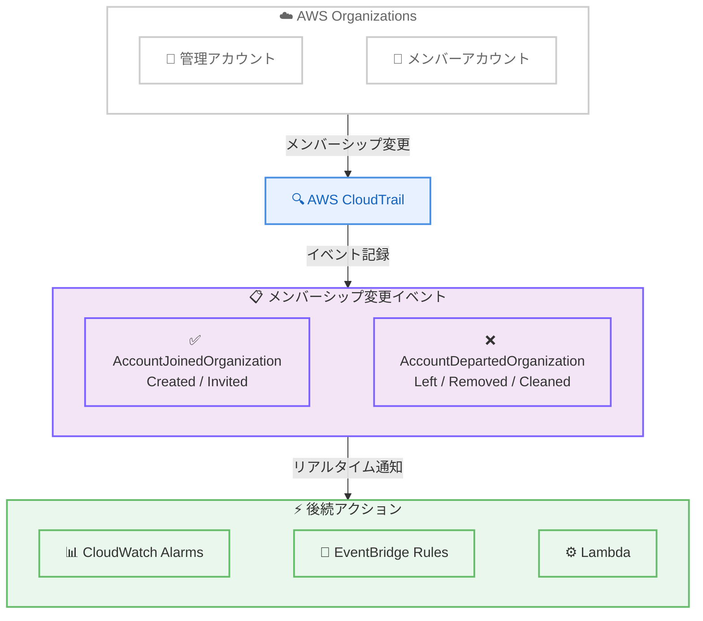

# AWS Organizations - CloudTrail によるアカウントメンバーシップ変更イベントの発行

**リリース日**: 2026年5月28日
**サービス**: AWS Organizations
**機能**: CloudTrail アカウントメンバーシップ変更イベント

📊 [このアップデートのインフォグラフィックを見る](https://takech9203.github.io/aws-news-summary/20260528-aws-organizations-cloudtrail.html)

## 概要

AWS Organizations が、組織内のアカウントメンバーシップ変更を自動的に AWS CloudTrail イベントとして発行する機能をリリースした。アカウントが組織に参加または離脱した際に、管理アカウントの CloudTrail に `AccountJoinedOrganization` および `AccountDepartedOrganization` イベントが記録される。

この機能により、セキュリティチームやクラウド管理者は組織構成の変更をリアルタイムで可視化でき、不正なアクティビティや潜在的なセキュリティインシデントを迅速に検知できるようになる。

**アップデート前の課題**

- 組織へのアカウント参加・離脱を自動的に検知する仕組みがなく、不正な変更が見過ごされる可能性があった
- メンバーシップ変更の監査には手動での確認や独自の監視ソリューションの構築が必要だった
- アカウントがどのような方法で組織を離脱したか (自発的離脱、管理者による削除、アカウントクローズ) を即座に判別する標準的な手段がなかった

**アップデート後の改善**

- `AccountJoinedOrganization` と `AccountDepartedOrganization` の 2 つの CloudTrail イベントが自動的に記録されるようになった
- CloudWatch Alarms や Amazon EventBridge ルールと連携し、リアルタイム通知が可能になった
- アカウントの参加方法 (Created / Invited) や離脱方法 (Left / Removed / Cleaned) が明確に記録される

## アーキテクチャ図



AWS Organizations でアカウントメンバーシップの変更が発生すると、CloudTrail が自動的にイベントを記録し、CloudWatch Alarms や EventBridge を通じてリアルタイムに通知・対応を行うアーキテクチャ。

## サービスアップデートの詳細

### 主要機能

1. **AccountJoinedOrganization イベント**
   - アカウントが組織に参加した際に発行される
   - 参加方法を記録: `Created` (新規作成) または `Invited` (招待による参加)
   - 参加タイムスタンプを含む

2. **AccountDepartedOrganization イベント**
   - アカウントが組織を離脱した際に発行される
   - 離脱方法を記録: `Left` (自発的離脱)、`Removed` (管理アカウントによる削除)、`Cleaned` (アカウントの完全クローズ)
   - 離脱タイムスタンプを含む

3. **リアルタイム通知連携**
   - CloudWatch Alarms との連携による即時アラート
   - Amazon EventBridge ルールによるイベント駆動型の自動対応
   - Lambda 関数と組み合わせたカスタムワークフローの構築が可能

## 技術仕様

### イベント構造

| 項目 | 詳細 |
|------|------|
| イベントソース | `organizations.amazonaws.com` |
| イベント名 (参加) | `AccountJoinedOrganization` |
| イベント名 (離脱) | `AccountDepartedOrganization` |
| 参加方法 | `Created` / `Invited` |
| 離脱方法 | `Left` / `Removed` / `Cleaned` |
| 記録先 | 管理アカウントの CloudTrail |

### EventBridge ルール設定例

```json
{
  "source": ["aws.organizations"],
  "detail-type": ["AWS API Call via CloudTrail"],
  "detail": {
    "eventSource": ["organizations.amazonaws.com"],
    "eventName": [
      "AccountJoinedOrganization",
      "AccountDepartedOrganization"
    ]
  }
}
```

## 設定方法

### 前提条件

1. AWS Organizations が有効化されていること
2. 管理アカウントで CloudTrail が有効になっていること
3. 通知を設定する場合は EventBridge または CloudWatch の権限があること

### 手順

#### ステップ 1: CloudTrail の確認

```bash
# 管理アカウントで CloudTrail の証跡を確認
aws cloudtrail describe-trails --query 'trailList[].{Name:Name,IsMultiRegion:IsMultiRegionTrail}'
```

管理アカウントに有効な CloudTrail 証跡が存在することを確認する。このイベントは追加設定なしで自動的に記録される。

#### ステップ 2: EventBridge ルールの作成

```bash
# メンバーシップ変更を検知する EventBridge ルールを作成
aws events put-rule \
  --name "OrgMembershipChangeRule" \
  --event-pattern '{
    "source": ["aws.organizations"],
    "detail-type": ["AWS API Call via CloudTrail"],
    "detail": {
      "eventName": ["AccountJoinedOrganization", "AccountDepartedOrganization"]
    }
  }' \
  --state ENABLED
```

Organizations のメンバーシップ変更イベントをキャプチャする EventBridge ルールを作成する。

#### ステップ 3: SNS トピックへの通知設定

```bash
# SNS トピックをターゲットとして追加
aws events put-targets \
  --rule "OrgMembershipChangeRule" \
  --targets "Id"="1","Arn"="arn:aws:sns:us-east-1:123456789012:OrgAlerts"
```

EventBridge ルールのターゲットとして SNS トピックを設定し、メールやチャットツールへの通知を有効にする。

## メリット

### ビジネス面

- **コンプライアンス強化**: 組織構成の変更が自動的に記録され、監査要件を満たしやすくなる
- **セキュリティインシデントの早期検知**: 不正なアカウント操作をリアルタイムで検知し、被害を最小化できる
- **運用コストの削減**: カスタム監視ソリューションの構築・保守が不要になる

### 技術面

- **ゼロ設定**: CloudTrail が有効であれば追加設定なしでイベントが記録される
- **イベント駆動型アーキテクチャとの親和性**: EventBridge と組み合わせて自動化ワークフローを構築可能
- **詳細なコンテキスト情報**: 参加・離脱の方法とタイムスタンプが記録され、インシデント調査に有用

## デメリット・制約事項

### 制限事項

- イベントは管理アカウントの CloudTrail にのみ記録される (委任管理者アカウントでの受信可否は要確認)
- 過去のメンバーシップ変更に対する遡及的なイベント発行は行われない
- CloudTrail が無効な場合はイベントを受信できない

### 考慮すべき点

- 大規模な組織再編時に大量のイベントが発生する可能性があり、通知のフィルタリング設計が重要
- EventBridge ルールのターゲットに適切なエラーハンドリングを設定する必要がある

## ユースケース

### ユースケース 1: 不正アカウント操作の検知

**シナリオ**: セキュリティチームが、組織から不正にアカウントが離脱されたことを即座に検知したい。

**実装例**:
```json
{
  "source": ["aws.organizations"],
  "detail": {
    "eventName": ["AccountDepartedOrganization"]
  }
}
```

**効果**: アカウントの不正な離脱を数分以内に検知し、セキュリティチームへの即時通知とインシデント対応プロセスの自動開始が可能になる。

### ユースケース 2: コンプライアンス監査ログの自動生成

**シナリオ**: コンプライアンスチームが、組織構成の変更履歴を自動的にログとして保持し、監査レポートに活用したい。

**実装例**:
```bash
# CloudTrail Insights から組織変更イベントを検索
aws cloudtrail lookup-events \
  --lookup-attributes AttributeKey=EventName,AttributeValue=AccountJoinedOrganization \
  --start-time "2026-05-01T00:00:00Z" \
  --end-time "2026-05-31T23:59:59Z"
```

**効果**: 期間を指定してメンバーシップ変更の履歴を取得でき、監査レポートの作成が自動化される。

### ユースケース 3: マルチアカウント環境のガバナンス強化

**シナリオ**: 大規模組織で、承認されていないアカウントの参加を検知し、自動的にセキュリティポリシーを適用したい。

**実装例**:
```python
import boto3
import json

def lambda_handler(event, context):
    detail = event['detail']
    event_name = detail['eventName']
    
    if event_name == 'AccountJoinedOrganization':
        account_id = detail['requestParameters']['accountId']
        join_method = detail['requestParameters']['joinMethod']
        
        # 新しいアカウントに SCP を自動適用
        org_client = boto3.client('organizations')
        org_client.attach_policy(
            PolicyId='p-xxxxxxxxxx',
            TargetId=account_id
        )
        
        # 通知送信
        sns_client = boto3.client('sns')
        sns_client.publish(
            TopicArn='arn:aws:sns:us-east-1:123456789012:OrgAlerts',
            Message=f'Account {account_id} joined via {join_method}',
            Subject='New Account Joined Organization'
        )
```

**効果**: 新規参加アカウントに対して自動的にセキュリティポリシーを適用し、ガバナンスの一貫性を維持できる。

## 料金

CloudTrail のメンバーシップ変更イベント記録自体に追加料金は発生しない。関連する料金は以下の通り。

| 項目 | 料金 |
|------|------|
| CloudTrail 管理イベント (最初の証跡) | 無料 |
| CloudTrail 管理イベント (追加の証跡) | $2.00 / 100,000 イベント |
| EventBridge ルール | $1.00 / 100 万イベント |
| SNS 通知 | $0.50 / 100 万リクエスト |

## 利用可能リージョン

すべての商用 AWS リージョン、AWS GovCloud (US) リージョン、および中国リージョンで利用可能。

## 関連サービス・機能

- **AWS CloudTrail**: 組織メンバーシップ変更イベントの記録基盤
- **Amazon EventBridge**: イベント駆動型のルーティングと自動化
- **AWS Organizations SCP**: サービスコントロールポリシーによるアカウントレベルのガバナンス
- **Amazon CloudWatch Alarms**: メトリクスベースのアラート設定
- **AWS Security Hub**: セキュリティ検出結果の統合管理

## 参考リンク

- 📊 [インフォグラフィック](https://takech9203.github.io/aws-news-summary/20260528-aws-organizations-cloudtrail.html)
- [公式発表 (What's New)](https://aws.amazon.com/about-aws/whats-new/2026/05/aws-organizations-cloudtrail/)
- [AWS Organizations ドキュメント](https://docs.aws.amazon.com/organizations/latest/userguide/)
- [AWS CloudTrail ドキュメント](https://docs.aws.amazon.com/awscloudtrail/latest/userguide/)
- [AWS Organizations 料金ページ](https://aws.amazon.com/organizations/pricing/)

## まとめ

AWS Organizations の CloudTrail メンバーシップ変更イベントは、マルチアカウント環境のセキュリティとガバナンスを大幅に強化する機能である。追加設定なしで自動的に有効化されるため、すべての Organizations ユーザーは即座にこの機能を活用できる。EventBridge ルールと組み合わせたリアルタイム通知の設定を推奨する。
