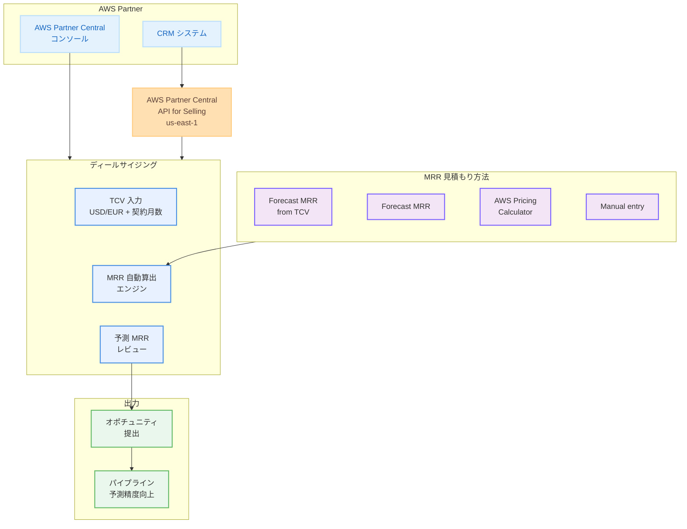

# AWS Partner Central - TCV によるディールサイジング機能

**リリース日**: 2026 年 5 月 28 日
**サービス**: AWS Partner Central
**機能**: Total Contract Value (TCV) を使用したディールサイジング

[このアップデートのインフォグラフィックを見る](https://takech9203.github.io/aws-news-summary/20260528-aws-partner-central-opportunity-deal-sizing-tcv.html)

## 概要

AWS Partner Central のオポチュニティ管理におけるディールサイジング機能が強化され、Total Contract Value (TCV、契約総額) を使用した見積もりが可能になった。パートナーは顧客との契約総額を入力するだけで、システムが自動的に月次経常収益 (MRR) を算出する。これにより、手動での MRR 計算が不要になり、オポチュニティの提出速度と予測精度が向上する。

本機能は AWS Partner Central のコンソールおよび AWS Partner Central API for Selling の両方で利用可能であり、CRM システムとの統合にも対応している。

**アップデート前の課題**

- パートナーが MRR を手動で計算する必要があり、計算ミスや見積もりの不正確さが生じていた
- 契約総額から月次収益への変換に時間がかかり、オポチュニティの提出が遅延していた
- パイプラインの予測精度にばらつきがあり、収益予測の信頼性が低かった

**アップデート後の改善**

- TCV と契約期間を入力するだけで MRR が自動算出されるようになった
- 手動計算が不要になり、オポチュニティの提出速度が大幅に向上した
- 統一された計算ロジックにより、パイプライン全体の予測精度が改善された

## アーキテクチャ図



パートナーはコンソールまたは API 経由で TCV を入力し、自動算出された MRR を確認してからオポチュニティを提出するワークフローを示している。

## サービスアップデートの詳細

### 主要機能

1. **TCV からの MRR 自動算出**
   - 契約総額 (TCV) を USD または EUR で入力
   - 契約期間を月数で指定
   - システムが自動的に予測 MRR を計算
   - 提出前にパートナーが予測値をレビュー可能

2. **複数の MRR 見積もり方法**
   - Forecast MRR from TCV: 今回追加された新機能
   - Forecast MRR: 既存の予測ベースの方法
   - AWS Pricing Calculator: AWS 料金計算ツールとの連携
   - Manual entry: 手動入力

3. **API 対応**
   - AWS Partner Central API for Selling を通じて利用可能
   - CRM システムとの自動連携が可能
   - プログラマティックなオポチュニティ管理をサポート

## 技術仕様

### ディールサイジング設定

| 項目 | 詳細 |
|------|------|
| 入力通貨 | USD、EUR |
| 入力項目 | TCV (契約総額)、契約期間 (月数) |
| 出力 | 予測 MRR (月次経常収益) |
| アクセス方法 | コンソール、API |
| API リージョン | US East (N. Virginia) |

### MRR 見積もり方法の比較

| 方法 | 入力 | 用途 |
|------|------|------|
| Forecast MRR from TCV | TCV + 契約月数 | 契約総額が確定している案件 |
| Forecast MRR | 予測パラメータ | 予測ベースの見積もり |
| AWS Pricing Calculator | 構成情報 | 技術構成から積み上げ |
| Manual entry | MRR 直接入力 | 特殊な料金体系の案件 |

## 設定方法

### 前提条件

1. AWS Partner Central アカウントを保有していること
2. オポチュニティの作成・更新権限があること
3. API を利用する場合は AWS Partner Central API for Selling へのアクセス権限があること

### 手順

#### ステップ 1: オポチュニティの作成または編集

AWS Partner Central コンソールにログインし、新規オポチュニティを作成するか、既存のオポチュニティを編集する。

#### ステップ 2: MRR 見積もり方法の選択

ディールサイジングセクションで「Forecast MRR from TCV」を選択する。

#### ステップ 3: TCV と契約期間の入力

契約総額 (TCV) を USD または EUR で入力し、契約期間を月数で指定する。

#### ステップ 4: 予測 MRR の確認と提出

システムが自動算出した予測 MRR を確認し、問題がなければオポチュニティを提出する。

### API を使用した連携

CRM システムとの統合には AWS Partner Central API for Selling を使用する。API は US East (N. Virginia) リージョンで利用可能。詳細は [AWS Partner Central API Documentation](https://docs.aws.amazon.com/partner-central/latest/selling-api/what-is-partner-central-api.html) を参照。

## メリット

### ビジネス面

- **オポチュニティ提出の迅速化**: 手動計算が不要になり、案件登録のリードタイムが短縮される
- **パイプライン予測精度の向上**: 統一された計算ロジックにより、収益予測の精度が改善される
- **営業生産性の向上**: パートナーの営業チームが計算作業ではなく顧客対応に集中できる

### 技術面

- **API 対応による自動化**: CRM システムとのシームレスな連携が可能
- **ヒューマンエラーの削減**: 手動計算による転記ミスや計算ミスが排除される
- **マルチ通貨対応**: USD と EUR の両方をサポートし、グローバルな案件管理に対応

## デメリット・制約事項

### 制限事項

- 入力通貨は USD と EUR のみに限定されている
- API は US East (N. Virginia) リージョンでのみ利用可能
- TCV から MRR への変換ロジックの詳細 (割引率の考慮など) は公開されていない

### 考慮すべき点

- 既存のオポチュニティを TCV ベースに切り替える場合、予測 MRR の値が以前の手動入力値と異なる可能性がある
- 非線形な支払いスケジュール (例: 初年度のみ高額) の場合、均等割りの MRR が実態と乖離する可能性がある

## ユースケース

### ユースケース 1: 大型エンタープライズ契約の登録

**シナリオ**: パートナーが 3 年間で $1,200,000 のエンタープライズ契約を獲得した。

**実装例**:
```
TCV: $1,200,000 USD
契約期間: 36 ヶ月
予測 MRR: 自動算出 (約 $33,333/月)
```

**効果**: 複雑な長期契約でも即座に MRR が算出され、パイプラインに正確に反映される。

### ユースケース 2: CRM 連携による大量案件の自動登録

**シナリオ**: パートナーの CRM システムに蓄積された複数の案件を API 経由で一括登録したい。

**実装例**:
```
AWS Partner Central API for Selling を使用し、
各案件の TCV と契約期間をプログラマティックに送信。
MRR は自動算出されるため、個別計算が不要。
```

**効果**: 数十件の案件を手動計算なしで迅速にパイプラインに反映できる。

### ユースケース 3: マルチリージョン案件の通貨対応

**シナリオ**: 欧州の顧客との契約を EUR で管理したい。

**実装例**:
```
TCV: EUR 500,000
契約期間: 24 ヶ月
予測 MRR: 自動算出 (約 EUR 20,833/月)
```

**効果**: 通貨変換の手間なく、EUR ベースの契約をそのまま登録できる。

## 料金

AWS Partner Central のディールサイジング機能は追加料金なしで利用可能。AWS Partner Central 自体はパートナー登録済みの組織であれば無料で利用できる。

## 利用可能リージョン

AWS Partner Central のコンソール機能はグローバルに利用可能。AWS Partner Central API for Selling は US East (N. Virginia) リージョンで提供されている。

## 関連サービス・機能

- **AWS Partner Central**: パートナー向けの統合管理ポータル。オポチュニティ管理、共同販売、トレーニングなどを提供
- **AWS Partner Central API for Selling**: プログラマティックなオポチュニティ管理を実現する API
- **AWS Pricing Calculator**: AWS サービスの料金見積もりツール。ディールサイジングの一手法として連携

## 参考リンク

- [インフォグラフィック](https://takech9203.github.io/aws-news-summary/20260528-aws-partner-central-opportunity-deal-sizing-tcv.html)
- [公式発表 (What's New)](https://aws.amazon.com/about-aws/whats-new/2026/05/aws-partner-central-opportunity-deal-sizing-tcv)
- [AWS Partner Central](https://partnercentral.awspartner.com/)
- [AWS Partner Central API Documentation](https://docs.aws.amazon.com/partner-central/latest/selling-api/what-is-partner-central-api.html)
- [Partner Central Sales Guide](https://docs.aws.amazon.com/partner-central/latest/selling-guide/what-is.html)

## まとめ

AWS Partner Central に TCV ベースのディールサイジング機能が追加されたことで、パートナーは契約総額から MRR を自動算出できるようになった。手動計算が不要になりオポチュニティの提出が迅速化されるため、パートナーの営業効率とパイプライン予測精度の両方が向上する。AWS パートナーは今すぐこの機能を活用し、既存のオポチュニティ管理プロセスを効率化することを推奨する。
