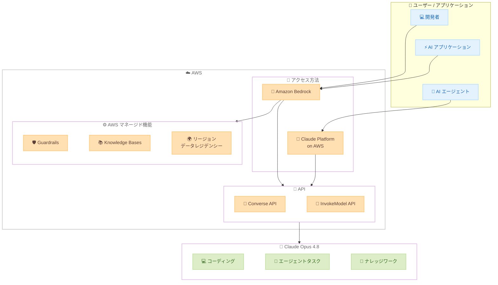

# Amazon Bedrock - Claude Opus 4.8 が AWS で利用可能に

**リリース日**: 2026 年 5 月 28 日
**サービス**: Amazon Bedrock
**機能**: Claude Opus 4.8 モデルアクセス

📊 [このアップデートのインフォグラフィックを見る](https://takech9203.github.io/aws-news-summary/20260528-claude-opus-4.8-aws.html)

## 概要

Anthropic の最新かつ最も高性能な汎用モデルである Claude Opus 4.8 が AWS で利用可能になりました。Amazon Bedrock を通じて、または Claude Platform on AWS (AWS コンソール経由の Anthropic ネイティブプラットフォーム) からアクセスできます。

Claude Opus 4.8 は、コーディング、エージェントタスク、ナレッジワークの 3 つの領域で大幅な改善を実現しています。特にエージェントタスクでは、障害を回避する経路を自律的に発見し、自身のエラーからリカバリし、必要に応じてユーザーに確認を求める能力が向上しています。プロダクション環境での長時間の自律実行、深い推論、一貫性が強化されており、本番 AI アプリケーションを構築する開発者やエンタープライズに最適です。

**アップデート前の課題**

- 以前のモデルではエージェントタスク実行中に障害が発生すると処理が停止することがあった
- 長時間の自律実行セッションにおける推論の一貫性に制約があった
- 大規模コードベースの文脈を維持しながらの長時間編集セッションに限界があった

**アップデート後の改善**

- エンジニアのようにコードベースを読解し、編集前に計画を立て、実リポジトリでの長時間セッション全体にわたりコンテキストを維持可能に
- 障害回避経路の自律的な発見、エラーからの自己回復、適切なタイミングでのユーザーへの確認要求が可能に
- 長文ドキュメントにまたがる情報統合、出力の自己検証、レビューに耐える構造化された成果物の提供が可能に

## アーキテクチャ図



Claude Opus 4.8 は Amazon Bedrock または Claude Platform on AWS を通じてアクセスし、Converse API や InvokeModel API 経由でモデルを呼び出します。Amazon Bedrock 経由の場合、Guardrails や Knowledge Bases などの AWS マネージド機能を組み合わせて利用できます。

## サービスアップデートの詳細

### 主要機能

1. **コーディング能力の強化**
   - エンジニアのようにコードベースを読解し、変更前に計画を策定
   - 実際のリポジトリにおける長時間のコーディングセッション全体でコンテキストを維持
   - 複雑なコード変更に対する精度と一貫性が向上

2. **エージェントタスクの改善**
   - 障害発生時に停止せず、代替経路を自律的に発見
   - 自身のエラーを検出し自動的にリカバリ
   - 適切なタイミングでユーザーに確認を求める判断能力の向上

3. **ナレッジワークの高度化**
   - 長文ドキュメント全体にわたる情報の統合・要約
   - 出力内容の自己検証による品質保証
   - 専門家のレビューに耐える構造化された成果物の提供

4. **プロダクション対応の強化**
   - 長時間の自律実行における安定性向上
   - 深い推論タスクでの一貫性の改善
   - 本番ワークロードに適した信頼性

### アクセス方法

| 方法 | 特徴 |
|------|------|
| Amazon Bedrock | AWS マネージド機能 (Guardrails、Knowledge Bases) と統合、リージョンデータレジデンシー |
| Claude Platform on AWS | Anthropic ネイティブプラットフォームに AWS コンソールからアクセス、統合 AWS 課金・認証 |

### API 変更履歴

| 日付 | サービス | 変更内容 |
|------|----------|----------|
| 2026/05/28 | [Amazon Bedrock Runtime](https://awsapichanges.com/archive/changes/364f28-bedrock-runtime.html) | 3 updated api methods - Converse、ConverseStream、CountTokens にシステムロールサポート追加 |
| 2026/05/28 | [Amazon Bedrock](https://awsapichanges.com/archive/changes/364f28-bedrock.html) | 1 updated api method - CreateCustomModel に ModelPackageArn サポート追加 |

## 設定方法

### 前提条件

1. AWS アカウントが有効であること
2. Amazon Bedrock へのアクセス権限 (IAM ポリシー) が設定されていること
3. 対象リージョンで Claude Opus 4.8 のモデルアクセスが有効化されていること

### 手順

#### ステップ 1: モデルアクセスの有効化

Amazon Bedrock コンソールで Claude Opus 4.8 のモデルアクセスをリクエストします。

```bash
# AWS CLI でモデルアクセス状況を確認
aws bedrock list-foundation-models \
  --by-provider "Anthropic" \
  --query "modelSummaries[?contains(modelId, 'claude-opus')]"
```

利用可能なモデル一覧から Claude Opus 4.8 のモデル ID を確認します。

#### ステップ 2: Converse API での呼び出し

```bash
# Converse API を使用して Claude Opus 4.8 を呼び出す
aws bedrock-runtime converse \
  --model-id "anthropic.claude-opus-4-8-v1" \
  --messages '[{"role": "user", "content": [{"text": "Hello, Claude Opus 4.8!"}]}]'
```

Converse API は Amazon Bedrock の統一推論 API であり、モデル間で一貫したインターフェースを提供します。

#### ステップ 3: Python SDK での利用

```python
import boto3
import json

client = boto3.client("bedrock-runtime")

response = client.converse(
    modelId="anthropic.claude-opus-4-8-v1",
    messages=[
        {
            "role": "user",
            "content": [
                {"text": "複雑なコードレビューを実施してください。"}
            ]
        }
    ],
    inferenceConfig={
        "maxTokens": 4096,
        "temperature": 0.7
    }
)

print(json.dumps(response["output"]["message"], indent=2, ensure_ascii=False))
```

Boto3 の `bedrock-runtime` クライアントを使用し、Converse API 経由でモデルを呼び出します。

## メリット

### ビジネス面

- **AI アプリケーションの品質向上**: より高精度な推論と一貫性により、本番環境での AI アプリケーションの信頼性が向上
- **開発生産性の改善**: コーディング支援の精度向上により、開発者の生産性が大幅に向上
- **運用コストの最適化**: エージェントタスクの自律性向上により、人的介入の頻度を削減

### 技術面

- **長時間エージェント実行の安定性**: 障害からの自動リカバリにより、複雑なワークフローの自動化が現実的に
- **AWS エコシステムとの統合**: Guardrails、Knowledge Bases、リージョンデータレジデンシーなどの既存 AWS 機能をそのまま活用可能
- **統一 API アクセス**: Converse API を通じた一貫したインターフェースにより、モデル切り替えが容易

## デメリット・制約事項

### 制限事項

- 利用可能リージョンが限定される可能性がある (リージョン別ドキュメントを確認のこと)
- 最上位モデルであるため、入出力トークンあたりのコストが他の Claude モデルより高い
- 大規模なプロンプトやコンテキストを使用する場合、レスポンスレイテンシが増加する可能性がある

### 考慮すべき点

- 既存の Claude Opus 4 / 4.5 / 4.6 / 4.7 ワークロードからの移行時は、プロンプトの動作確認を推奨
- コスト最適化のため、タスクの複雑さに応じて Sonnet / Haiku など下位モデルとの使い分けを検討
- Amazon Bedrock のスループットクォータに注意し、必要に応じてプロビジョンドスループットの利用を検討

## ユースケース

### ユースケース 1: 大規模コードベースの自律的リファクタリング

**シナリオ**: 数十万行のレガシーコードベースを新しいアーキテクチャパターンに移行する必要がある

**実装例**:
```python
response = client.converse(
    modelId="anthropic.claude-opus-4-8-v1",
    messages=[
        {
            "role": "user",
            "content": [
                {"text": "以下のコードベースを分析し、マイクロサービスアーキテクチャへのリファクタリング計画を策定してください。各ステップで変更するファイルと理由を明示してください。"},
                {"text": code_content}
            ]
        }
    ],
    inferenceConfig={"maxTokens": 8192}
)
```

**効果**: 長時間にわたるコンテキスト維持と計画策定能力により、大規模リファクタリングの一貫した支援が可能に

### ユースケース 2: 自律型カスタマーサポートエージェント

**シナリオ**: 複雑な技術的問い合わせに対して、ドキュメント検索・問題診断・解決策提案を自律的に行うエージェント

**実装例**:
```python
# Amazon Bedrock Knowledge Bases と組み合わせたエージェント構成
response = client.converse(
    modelId="anthropic.claude-opus-4-8-v1",
    messages=conversation_history,
    toolConfig={
        "tools": [
            {
                "toolSpec": {
                    "name": "search_knowledge_base",
                    "description": "技術ドキュメントを検索",
                    "inputSchema": {"json": {"type": "object", "properties": {"query": {"type": "string"}}}}
                }
            }
        ]
    }
)
```

**効果**: 障害回避とエラーリカバリ能力の向上により、人的介入なしで複雑な問い合わせを解決

### ユースケース 3: 長文ドキュメントの専門的分析

**シナリオ**: 数百ページの技術仕様書や契約書を分析し、構造化されたレポートを生成する

**実装例**:
```python
response = client.converse(
    modelId="anthropic.claude-opus-4-8-v1",
    messages=[
        {
            "role": "user",
            "content": [
                {"text": "以下の技術仕様書を分析し、リスク要因・改善提案・優先度付き推奨事項を含む構造化レポートを作成してください。"},
                {"document": {"format": "pdf", "name": "spec.pdf", "source": {"s3Location": {"uri": "s3://bucket/spec.pdf"}}}}
            ]
        }
    ]
)
```

**効果**: 長文にわたる情報統合と自己検証能力により、専門家レビューに耐える高品質な分析成果物を生成

## 料金

公式発表時点では具体的な料金情報は記載されていません。Amazon Bedrock の料金ページで最新の入出力トークン単価を確認してください。一般的に、Opus クラスのモデルは Sonnet や Haiku と比較して入出力トークンあたりのコストが高く設定されています。

### 料金体系

| 課金方式 | 説明 |
|----------|------|
| オンデマンド | 入力トークン数と出力トークン数に基づく従量課金 |
| プロビジョンドスループット | 予約容量による時間単位の固定料金 |

## 利用可能リージョン

公式発表ではリージョン情報の詳細は記載されておらず、リージョン別ドキュメントページで確認するよう案内されています。Amazon Bedrock での Claude モデルの一般的な提供パターンとして、US East (N. Virginia)、US West (Oregon)、Europe (Frankfurt) などの主要リージョンから順次展開されることが多いため、最新の対応状況は公式ドキュメントを参照してください。

## 関連サービス・機能

- **Amazon Bedrock Guardrails**: モデル出力に対するセーフティフィルタリングやコンテンツ制御を適用可能
- **Amazon Bedrock Knowledge Bases**: RAG パターンによりナレッジベースと連携し、最新情報に基づく回答を生成
- **Amazon Bedrock AgentCore**: 自律型エージェントのデプロイ・管理基盤として Claude Opus 4.8 と連携
- **Claude Platform on AWS**: AWS コンソールから Anthropic のネイティブプラットフォームに直接アクセスする代替手段

## 参考リンク

- 📊 [インフォグラフィック](https://takech9203.github.io/aws-news-summary/20260528-claude-opus-4.8-aws.html)
- [公式発表 (What's New)](https://aws.amazon.com/about-aws/whats-new/2026/05/claude-opus-4.8-aws/)
- [Amazon Bedrock ドキュメント](https://docs.aws.amazon.com/bedrock/latest/userguide/)
- [Amazon Bedrock 料金ページ](https://aws.amazon.com/bedrock/pricing/)
- [Amazon Bedrock サポートモデル一覧](https://docs.aws.amazon.com/bedrock/latest/userguide/models-supported.html)

## まとめ

Claude Opus 4.8 の AWS での提供開始は、本番 AI アプリケーションの品質と自律性を大きく引き上げるアップデートです。特にエージェントタスクでの障害自動リカバリ、長時間コーディングセッションでのコンテキスト維持、ナレッジワークでの自己検証能力は、エンタープライズ AI ワークロードの信頼性向上に直結します。既存の Amazon Bedrock 環境をお使いの場合は、モデルアクセスを有効化し、コスト効果の高いユースケースから段階的に導入することを推奨します。
