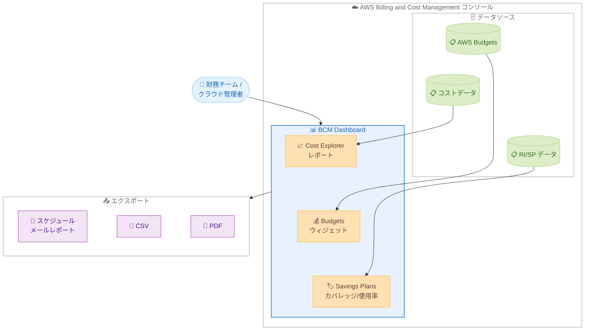

# AWS Billing and Cost Management - BCM Dashboards に Budgets ウィジェットを追加

**リリース日**: 2026 年 5 月 28 日
**サービス**: AWS Billing and Cost Management (BCM)
**機能**: BCM Dashboards Budgets ウィジェット

📊 [このアップデートのインフォグラフィックを見る](https://takech9203.github.io/aws-news-summary/20260528-monitor-aws-budgets-using-dashboards.html)

## 概要

AWS Billing and Cost Management (BCM) が、BCM Dashboards 内に Budgets ウィジェットを追加するサポートを発表した。これにより、コスト管理コンソールを組織にとって最も重要なビューでカスタマイズできる柔軟性が提供される。

従来、予算のパフォーマンスを確認するには別のコンソールページに移動する必要があったが、今回のアップデートにより、AWS Budgets を Cost Explorer レポート、Savings Plans および Reserved Instance のカバレッジ・使用率レポートと並べて、単一のカスタマイズされたダッシュボード内でモニタリングできるようになった。

**アップデート前の課題**

- 予算の実績確認には BCM コンソール内の別ページへ遷移する必要があった
- コスト分析レポートと予算ステータスを同時に確認できず、ページ切り替えが頻繁に発生していた
- ステークホルダーへの予算状況の共有には手動でデータを収集する必要があった

**アップデート後の改善**

- BCM Dashboards に 1 つ以上の Budgets ウィジェットを追加し、予算名、予算額、実際の支出、予測額を表示可能になった
- Cost Explorer レポート、Savings Plans、RI レポートと予算情報を単一ダッシュボードで統合的にモニタリング可能になった
- ダッシュボードのエクスポート機能と完全に統合され、スケジュールメールレポートや CSV/PDF ダウンロードに予算データを含められるようになった

## アーキテクチャ図

BCM Dashboards が各データソースからコスト情報、予算情報、RI/Savings Plans 情報を集約し、単一ダッシュボード上に統合表示する構成を示している。エクスポート機能により、ダッシュボード全体のデータを外部配信可能。

## サービスアップデートの詳細

### 主要機能

1. **Budgets ウィジェットの追加**
   - 任意の BCM Dashboard に 1 つ以上の Budgets ウィジェットを配置可能
   - ウィジェットには予算名、予算額、実際の支出額、予測額が表示される
   - 複数のウィジェットを追加してチーム別やプロジェクト別に予算を分割表示可能

2. **ウィジェット内フィルタリング**
   - 予算名によるフィルタリング
   - しきい値によるフィルタリング
   - 予算タイプによるフィルタリング
   - ウィジェット内で直接フィルタ操作が可能

3. **ダッシュボードエクスポート統合**
   - スケジュールメールレポートに予算データを含めることが可能
   - CSV 形式でのダウンロード
   - PDF 形式でのダウンロード
   - 既存のダッシュボードエクスポート機能とシームレスに統合

## 技術仕様

### ウィジェット表示項目

| 項目 | 詳細 |
|------|------|
| 予算名 | 設定した Budget の名称 |
| 予算額 | 設定した予算上限額 |
| 実際の支出 | 現在の実績支出額 |
| 予測額 | 期間終了時の予測支出額 |

### フィルタリングオプション

| フィルタ種別 | 説明 |
|-------------|------|
| 名前 | 予算名で絞り込み |
| しきい値 | アラートしきい値の状態で絞り込み |
| 予算タイプ | コスト予算、使用量予算、RI 予算、SP 予算で絞り込み |

### エクスポート形式

| 形式 | 用途 |
|------|------|
| スケジュールメール | 定期的なステークホルダーへの配信 |
| CSV | データ分析、他ツールとの連携 |
| PDF | レポート共有、アーカイブ |

## 設定方法

### 前提条件

1. AWS Billing and Cost Management コンソールへのアクセス権限
2. BCM Dashboards の作成・編集権限
3. AWS Budgets が設定済みであること

### 手順

#### ステップ 1: BCM Dashboard を開く

AWS マネジメントコンソールから Billing and Cost Management に移動し、左側ナビゲーションの「Dashboards」を選択する。既存のダッシュボードを選択するか、新規ダッシュボードを作成する。

#### ステップ 2: Budgets ウィジェットを追加

ダッシュボードの編集モードで「ウィジェットの追加」を選択し、利用可能なウィジェットリストから「Budgets」を選択する。

#### ステップ 3: ウィジェットの設定

表示したい予算をフィルタで選択する。名前、しきい値、予算タイプのフィルタを適用して、必要な予算情報のみを表示するように構成する。

#### ステップ 4: エクスポートの設定

ダッシュボードのエクスポート設定から、スケジュールメール配信を設定する。予算ウィジェットのデータもエクスポートに含まれる。

## メリット

### ビジネス面

- **運用効率の向上**: コンソールページ間の切り替えが不要になり、予算モニタリングの時間を短縮
- **ステークホルダーへの可視性向上**: ダッシュボードのエクスポート機能により、手動データ収集なしで予算状況を共有可能
- **意思決定の迅速化**: コスト実績と予算の比較を単一画面で確認でき、即座に対応判断が可能

### 技術面

- **カスタマイズ性**: 組織の要件に合わせてダッシュボードレイアウトを自由に構成可能
- **統合ビュー**: Cost Explorer、Savings Plans、RI レポートと予算データを同一ダッシュボードに統合
- **自動レポーティング**: スケジュールメールによる定期配信で手動オペレーションを削減

## デメリット・制約事項

### 制限事項

- Budgets ウィジェットはコンソール UI 上での操作が前提であり、API による自動構成の詳細は公式ドキュメントの確認が必要
- ウィジェットの表示はリアルタイムではなく、AWS Budgets のデータ更新頻度に依存する
- ダッシュボードごとに追加可能なウィジェット数の上限が存在する可能性がある

### 考慮すべき点

- 多数の予算を管理している場合、フィルタを適切に設定しないとウィジェットの情報量が過多になる可能性がある
- エクスポートされるレポートの容量は、追加するウィジェット数に比例して増加する

## ユースケース

### ユースケース 1: マルチアカウント環境での部門別予算モニタリング

**シナリオ**: 大規模組織で各事業部門に AWS アカウントを割り当てており、CFO オフィスが全部門の予算執行状況を一元的に監視したい。

**実装例**:
- 部門別の Cost Budget を事前に作成
- BCM Dashboard に部門ごとの Budgets ウィジェットを配置
- 週次スケジュールメールで経営層に自動配信

**効果**: 手動でのデータ集約作業が不要になり、予算超過の早期検知とコスト最適化の意思決定が迅速化する。

### ユースケース 2: プロジェクト単位のコスト追跡

**シナリオ**: 開発チームが複数のプロジェクトを並行して進めており、プロジェクトマネージャーがそれぞれのクラウドコストを予算内に収める必要がある。

**実装例**:
- プロジェクトごとにコストタグを設定し、対応する Budget を作成
- プロジェクトポートフォリオ用ダッシュボードに Budgets ウィジェットを配置
- Cost Explorer レポートと並べて配置し、コスト傾向と予算の対比を一目で確認

**効果**: プロジェクトの予算超過リスクをリアルタイムに近い形で把握でき、コスト管理の負荷を軽減する。

### ユースケース 3: FinOps チームの日次モニタリング

**シナリオ**: FinOps チームが毎朝のスタンドアップで全社のクラウドコスト状況を確認し、異常を検知したい。

**実装例**:
- 全社レベルの Budget と主要サービス別の Budget を作成
- 統合ダッシュボードに Budgets ウィジェット + Cost Explorer ウィジェット + Savings Plans カバレッジウィジェットを配置
- 日次 PDF レポートを FinOps チームに自動配信

**効果**: 複数ページを巡回する必要がなくなり、朝の確認作業が効率化。予算超過予測を早期に捉え、是正アクションを迅速に実施可能。

## 料金

Budgets ウィジェットの利用に追加料金は発生しない。ただし、AWS Budgets 自体の料金体系は引き続き適用される。

### 料金例

| 項目 | 料金 |
|------|------|
| Budgets ウィジェット | 無料 |
| AWS Budgets (最初の 2 つ) | 無料 |
| AWS Budgets (3 つ目以降) | 各 $0.02/日 |
| Budgets レポート | 各 $0.01/レポート配信 |

## 利用可能リージョン

すべての AWS 商用リージョンで利用可能。

## 関連サービス・機能

- **AWS Budgets**: 予算の作成・管理を行うサービス。今回のウィジェットはこのデータを表示する
- **AWS Cost Explorer**: コストと使用量の可視化・分析ツール。同じダッシュボード上に共存可能
- **Savings Plans**: コスト節約プランのカバレッジ・使用率レポートをダッシュボードで並行表示可能
- **Reserved Instances**: RI のカバレッジ・使用率レポートもダッシュボード統合の対象

## 参考リンク

- 📊 [インフォグラフィック](https://takech9203.github.io/aws-news-summary/20260528-monitor-aws-budgets-using-dashboards.html)
- [公式発表 (What's New)](https://aws.amazon.com/about-aws/whats-new/2026/05/monitor-aws-budgets-using-dashboards)
- [BCM Dashboards ユーザーガイド](https://docs.aws.amazon.com/cost-management/latest/userguide/dashboards.html)
- [AWS Budgets 料金ページ](https://aws.amazon.com/aws-cost-management/aws-budgets/pricing/)

## まとめ

BCM Dashboards への Budgets ウィジェット追加により、コスト管理における「統合ビュー」の実現が大きく前進した。財務チームやクラウド管理者は、コスト分析と予算モニタリングを単一画面で完結でき、ページ遷移の手間やデータ収集の手動作業が不要になる。既に AWS Budgets を活用している組織は、すぐに BCM Dashboards にウィジェットを追加し、FinOps ワークフローの効率化を検討することを推奨する。
