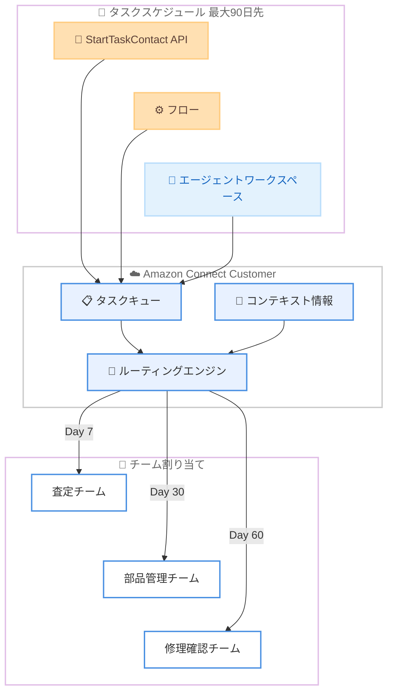

# Amazon Connect Customer - タスクの最大 90 日先までのスケジュール機能

**リリース日**: 2026 年 5 月 29 日
**サービス**: Amazon Connect Customer
**機能**: タスクスケジュールの最大 90 日先への拡張

[このアップデートのインフォグラフィックを見る](https://takech9203.github.io/aws-news-summary/20260529-amazon-connect-customer-tasks-90day-schedule.html)

## 概要

Amazon Connect Customer のタスク機能において、タスクのスケジュール設定が最大 90 日先まで可能になった。これまでの制限から大幅に拡張され、組織は長期的なフォローアップ業務の計画、ルーティング、追跡を効率的に行えるようになる。

このアップデートにより、例えば保険チームが自動車修理クレームを管理する際に、査定員の訪問、部品の入荷確認、修理完了後のフォローアップなど、それぞれのタスクを適切なタイミングで適切なチームにルーティングし、関連するクレーム情報をコンテキストとして付与しながらスケジュールできる。

タスクのスケジュールは、StartTaskContact API、フロー、またはエージェントワークスペースから設定可能である。

**アップデート前の課題**

- 以前は StartTaskContact API の `ScheduledTime` パラメータで最大 6 日先までしかタスクをスケジュールできなかった
- 長期的なフォローアップが必要な業務では、外部システムでリマインダーを管理するか、手動でタスクを再作成する必要があった
- 保険クレーム処理や医療フォローアップなど、数週間から数ヶ月にわたるワークフローを Connect 内で完結できなかった

**アップデート後の改善**

- タスクを最大 90 日先までスケジュール可能になり、長期的なフォローアップ業務を一元管理できるようになった
- 外部リマインダーシステムが不要になり、Connect 内でワークフロー全体を管理できるようになった
- スケジュールされたタスクには関連コンテキスト情報を付与でき、適切なタイミングで適切なチームに自動ルーティングされる

## アーキテクチャ図



保険クレーム処理の例: 3 つのフォローアップタスクを異なる将来の日付にスケジュールし、それぞれ適切なチームに自動ルーティングするフローを示している。

## サービスアップデートの詳細

### 主要機能

1. **90 日先までのタスクスケジュール**
   - StartTaskContact API の `ScheduledTime` パラメータの上限が 6 日から 90 日に拡張
   - Unix Epoch 秒形式でスケジュール日時を指定
   - 過去の日時は指定不可

2. **複数のスケジュール方法**
   - StartTaskContact API: プログラムによる自動化に最適
   - フロー内の Create task ブロック: ビジュアルフローデザイナーで設定
   - エージェントワークスペース: エージェントが手動でスケジュール作成

3. **コンテキスト情報の付与**
   - スケジュールタスクにカスタム属性を設定可能
   - `PreviousContactId` や `RelatedContactId` で関連コンタクトとリンク
   - タスクテンプレートによる構造化された情報管理

## 技術仕様

### スケジュール関連パラメータ

| 項目 | 詳細 |
|------|------|
| パラメータ名 | `ScheduledTime` |
| データ型 | Timestamp (Unix Epoch 秒) |
| 最小値 | 現在時刻より未来 |
| 最大値 | 現在時刻から 90 日後まで |
| 必須 | いいえ (省略時は即時実行) |
| API | StartTaskContact |

### タスクの有効期限

| 項目 | 詳細 |
|------|------|
| デフォルト期間 | 最大 7 日 |
| テンプレート使用時 | 最大 90 日に延長可能 |
| カスタム設定 | `SegmentAttributes` の `ExpiryDuration` で分単位指定 |

### 設定方法

### 前提条件

1. Amazon Connect Customer インスタンスが作成済みであること
2. タスクを使用するためのフローが設定済みであること
3. 適切な IAM 権限が付与されていること

### 手順

#### ステップ 1: StartTaskContact API でスケジュールタスクを作成

```bash
aws connect start-task-contact \
  --instance-id "xxxxxxxx-xxxx-xxxx-xxxx-xxxxxxxxxxxx" \
  --name "修理完了フォローアップ" \
  --description "自動車修理完了後の顧客確認コール" \
  --contact-flow-id "xxxxxxxx-xxxx-xxxx-xxxx-xxxxxxxxxxxx" \
  --scheduled-time 1753833600 \
  --attributes '{"ClaimId":"CLM-2026-001","RepairType":"Auto"}' \
  --references '{"ClaimDoc":{"Type":"URL","Value":"https://example.com/claims/001"}}'
```

`--scheduled-time` に Unix Epoch 秒形式で最大 90 日先の日時を指定する。上記の例では特定の将来日時にタスクがエージェントにルーティングされるようスケジュールしている。

#### ステップ 2: タスクテンプレートで有効期限を延長

タスクテンプレートを使用して、タスクの有効期限を最大 90 日に設定する。Connect 管理コンソールで [Routing] > [Task templates] からテンプレートを作成し、Expiry Duration を設定する。

#### ステップ 3: フローで Create task ブロックを使用

フローデザイナーで Create task ブロックを追加し、スケジュール時刻とコンテキスト情報を設定する。Contact Expiry 設定で有効期限を調整し、長期タスクの自動終了を防止する。

## メリット

### ビジネス面

- **長期ワークフローの一元管理**: 保険クレーム、医療フォローアップ、契約更新など数ヶ月にわたるプロセスを Connect 内で完結できる
- **業務効率の向上**: 外部リマインダーシステムや手動タスク再作成が不要になり、管理コストを削減
- **顧客体験の改善**: 適切なタイミングで適切な担当者にフォローアップが自動的にルーティングされ、対応漏れを防止

### 技術面

- **API 互換性**: 既存の StartTaskContact API の `ScheduledTime` パラメータの上限拡張であり、既存コードへの影響が最小限
- **柔軟なスケジュール方法**: API、フロー、エージェント UI の 3 通りの方法でスケジュール可能
- **コンテキスト保持**: スケジュールされたタスクにカスタム属性や参照情報を付与でき、将来実行時にも情報が保持される

## デメリット・制約事項

### 制限事項

- オープンタスク数にはサービスクォータの制限が適用される
- `PreviousContactId` を使用する場合、チェーン内のリンクタスクは最大 12 件まで
- スケジュール時刻は過去の日時を指定できない

### 考慮すべき点

- 90 日先のタスクをスケジュールする場合、タスクテンプレートで有効期限も合わせて延長する必要がある (デフォルトは 7 日)
- 長期スケジュールされたタスクは、組織変更やプロセス変更の影響を受ける可能性がある
- スケジュール済みタスクのキャンセルや変更には StopContact API を使用する

## ユースケース

### ユースケース 1: 保険クレーム処理のフォローアップ

**シナリオ**: 自動車保険のクレーム処理において、査定訪問 (7 日後)、部品確認 (30 日後)、修理完了確認 (60 日後) の各フェーズで異なるチームにフォローアップタスクを自動スケジュールする。

**実装例**:
```python
import boto3
from datetime import datetime, timedelta

client = boto3.client('connect')

# 各フェーズのタスクをスケジュール
phases = [
    {"name": "査定員訪問確認", "days": 7, "queue": "adjuster-queue"},
    {"name": "部品入荷確認", "days": 30, "queue": "parts-queue"},
    {"name": "修理完了フォローアップ", "days": 60, "queue": "followup-queue"},
]

for phase in phases:
    scheduled = datetime.now() + timedelta(days=phase["days"])
    client.start_task_contact(
        InstanceId="instance-id",
        Name=phase["name"],
        ContactFlowId="flow-id",
        ScheduledTime=scheduled,
        Attributes={"ClaimId": "CLM-2026-001", "Phase": phase["name"]}
    )
```

**効果**: クレーム処理全体のフォローアップを自動化し、対応漏れを防止しつつエージェントの負荷を軽減。

### ユースケース 2: 契約更新リマインダー

**シナリオ**: SaaS サブスクリプションの契約更新が 90 日後に迫っている顧客に対し、60 日前、30 日前、7 日前の段階的なリマインダータスクをスケジュールする。

**実装例**:
```python
import boto3
from datetime import datetime, timedelta

client = boto3.client('connect')

renewal_date = datetime(2026, 8, 27)
reminders = [
    {"days_before": 60, "priority": "low"},
    {"days_before": 30, "priority": "medium"},
    {"days_before": 7, "priority": "high"},
]

for reminder in reminders:
    scheduled = renewal_date - timedelta(days=reminder["days_before"])
    client.start_task_contact(
        InstanceId="instance-id",
        Name=f"契約更新リマインダー ({reminder['days_before']}日前)",
        ContactFlowId="renewal-flow-id",
        ScheduledTime=scheduled,
        Attributes={
            "CustomerId": "CUST-001",
            "RenewalDate": renewal_date.isoformat(),
            "Priority": reminder["priority"]
        }
    )
```

**効果**: 契約更新率の向上と、段階的なアプローチによる顧客離脱の防止。

### ユースケース 3: 医療機関の定期フォローアップ

**シナリオ**: 患者の退院後、1 週間後の状態確認、1 ヶ月後の経過観察、3 ヶ月後の定期検診リマインダーを自動スケジュールする。

**実装例**:
```python
import boto3
from datetime import datetime, timedelta

client = boto3.client('connect')

discharge_date = datetime.now()
followups = [
    {"name": "退院後状態確認", "days": 7},
    {"name": "経過観察コール", "days": 30},
    {"name": "定期検診リマインダー", "days": 90},
]

for followup in followups:
    scheduled = discharge_date + timedelta(days=followup["days"])
    client.start_task_contact(
        InstanceId="instance-id",
        Name=followup["name"],
        ContactFlowId="medical-followup-flow-id",
        ScheduledTime=scheduled,
        Attributes={
            "PatientId": "PAT-2026-001",
            "DischargeDate": discharge_date.isoformat(),
            "FollowupType": followup["name"]
        }
    )
```

**効果**: 患者ケアの継続性を確保し、フォローアップ漏れによる再入院リスクを低減。

## 料金

Amazon Connect Customer のタスク機能の料金体系に基づく。タスクスケジュールの期間延長による追加料金はない。

### 料金例

| 使用量 | 月額料金 (概算) |
|--------|------------------|
| タスク 1 件あたり | $0.04 (タスクコンタクト料金) |
| 1,000 タスク/月 | 約 $40 |

※ 料金は利用リージョンにより異なる。最新の料金は [Amazon Connect 料金ページ](https://aws.amazon.com/connect/pricing/)を参照。

## 利用可能リージョン

すべての商用リージョンおよび AWS GovCloud (US) リージョンで Amazon Connect Customer が提供されているリージョンで利用可能。

主なリージョン:
- 米国東部 (バージニア北部)
- 米国西部 (オレゴン)
- アジアパシフィック (東京)
- アジアパシフィック (シンガポール)
- アジアパシフィック (シドニー)
- 欧州 (フランクフルト)
- 欧州 (ロンドン)
- AWS GovCloud (US-West)

## 関連サービス・機能

- **Amazon Connect Tasks**: タスクの作成、ルーティング、追跡の基盤機能
- **Amazon Connect Flows**: タスクの自動作成やルーティングロジックを定義するビジュアルフローデザイナー
- **Amazon Connect Customer Profiles**: タスクに顧客プロファイル情報を関連付け、エージェントにコンテキストを提供
- **Amazon EventBridge**: Connect イベントと連携し、外部システムからのタスク作成を自動化

## 参考リンク

- [インフォグラフィック](https://takech9203.github.io/aws-news-summary/20260529-amazon-connect-customer-tasks-90day-schedule.html)
- [公式発表 (What's New)](https://aws.amazon.com/about-aws/whats-new/2026/05/amazon-connect-customer-tasks-90day-schedule)
- [タスクのドキュメント](https://docs.aws.amazon.com/connect/latest/adminguide/tasks.html)
- [StartTaskContact API リファレンス](https://docs.aws.amazon.com/connect/latest/APIReference/API_StartTaskContact.html)
- [料金ページ](https://aws.amazon.com/connect/pricing/)

## まとめ

Amazon Connect Customer のタスクスケジュール機能が最大 90 日先まで拡張されたことで、長期的なフォローアップ業務を Connect 内で完結できるようになった。保険クレーム処理、契約更新管理、医療フォローアップなど、数週間から数ヶ月にわたるワークフローを持つ組織にとって、外部リマインダーシステムへの依存を減らし業務効率を向上させる重要なアップデートである。既存の StartTaskContact API の互換性が維持されているため、`ScheduledTime` パラメータの値を変更するだけで即座に活用を開始できる。
