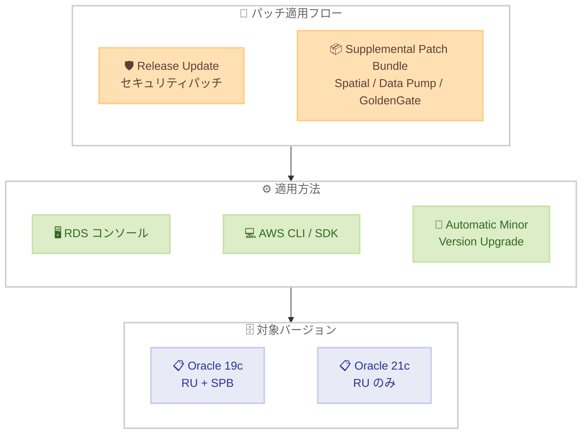

# Amazon RDS for Oracle - 2026 年 4 月 Release Update および Supplemental Patch Bundle サポート

**リリース日**: 2026 年 5 月 29 日
**サービス**: Amazon RDS for Oracle
**機能**: Oracle 2026 年 4 月 Release Update (RU) および Supplemental Patch Bundle (SPB) のサポート

📊 [このアップデートのインフォグラフィックを見る](https://takech9203.github.io/aws-news-summary/20260529-amazon-rds-oracle-supports-april-2026-release-update-supplemental-patch-bundle.html)

## 概要

Amazon RDS for Oracle が Oracle 2026 年 4 月 Release Update (RU) および Supplemental Patch Bundle (SPB) をサポートした。RU にはセキュリティ更新が含まれており、SPB には Oracle Spatial、Oracle Data Pump、Oracle GoldenGate など特定のユースケース向けに Oracle が推奨する追加パッチが含まれている。

今回のリリースでは、Oracle Database 19c が RU と SPB の両方をサポートし、Oracle Database 21c が RU をサポートする。なお、SPB は以前「Oracle Spatial Patch Bundle」と呼ばれていたが、2026 年 4 月リリースから名称が変更されている。

**アップデート前の課題**

- Oracle データベースのセキュリティパッチ適用に手動作業が必要だった
- 以前の RU/SPB バージョンでは最新のセキュリティ脆弱性に対応できていなかった
- Oracle Spatial、Data Pump、GoldenGate 利用時に推奨パッチが適用されていない環境ではパフォーマンスや安定性の問題が発生する可能性があった

**アップデート後の改善**

- 2026 年 4 月時点の最新セキュリティパッチを RDS コンソール、SDK、CLI から簡単に適用可能になった
- SPB エンジンバージョン `19.0.0.0.ru-2026-04.spb-1.r1` が利用可能になり、Oracle Spatial 等の追加パッチを一括適用できるようになった
- Automatic Minor Version Upgrade 機能を有効化することでメンテナンスウィンドウ中に自動的にパッチを適用できるようになった

## アーキテクチャ図



Release Update とSupplemental Patch Bundle を RDS コンソール、CLI、または自動アップグレード機能を通じて Oracle 19c / 21c インスタンスに適用するフローを示している。

## サービスアップデートの詳細

### 主要機能

1. **Release Update (RU) サポート**
   - Oracle データベース製品向けのセキュリティ更新を含む
   - Oracle 19c および 21c の両方で利用可能
   - AWS は最新の RU へのアップグレードを推奨

2. **Supplemental Patch Bundle (SPB) サポート**
   - Oracle Spatial、Oracle Data Pump、Oracle GoldenGate 向けの追加パッチを含む
   - Oracle 19c でのみ利用可能
   - エンジンバージョン: `19.0.0.0.ru-2026-04.spb-1.r1`
   - 旧称「Oracle Spatial Patch Bundle」から 2026 年 4 月リリースで名称変更

3. **段階的ロールアウトポリシー**
   - AWS Organizations のアップグレードロールアウトポリシーを使用して自動マイナーバージョンアップグレードを段階的に適用可能
   - 非本番環境で検証した後に本番環境へ適用するワークフローを実現

## 技術仕様

### サポート対象バージョン

| Oracle バージョン | Release Update | Supplemental Patch Bundle |
|-------------------|:--------------:|:-------------------------:|
| Oracle 19c | 対応 | 対応 |
| Oracle 21c | 対応 | 非対応 |

### SPB エンジンバージョン

| 項目 | 詳細 |
|------|------|
| エンジンバージョン文字列 | `19.0.0.0.ru-2026-04.spb-1.r1` |
| 含まれるパッチ | Oracle Spatial、Oracle Data Pump、Oracle GoldenGate |
| 旧名称 | Oracle Spatial Patch Bundle |

## 設定方法

### 前提条件

1. Amazon RDS for Oracle インスタンスが稼働していること
2. Oracle 19c または 21c を使用していること
3. RDS インスタンスへの変更権限 (IAM) を有していること

### 手順

#### ステップ 1: Release Update の適用 (AWS CLI)

```bash
aws rds modify-db-instance \
  --db-instance-identifier my-oracle-instance \
  --engine-version 19.0.0.0.ru-2026-04.r1 \
  --apply-immediately
```

Oracle 19c インスタンスに 2026 年 4 月の Release Update を即時適用する。`--no-apply-immediately` に変更すると次のメンテナンスウィンドウで適用される。

#### ステップ 2: Supplemental Patch Bundle の適用 (AWS CLI)

```bash
aws rds modify-db-instance \
  --db-instance-identifier my-oracle-instance \
  --engine-version 19.0.0.0.ru-2026-04.spb-1.r1 \
  --apply-immediately
```

Oracle 19c インスタンスに SPB を適用する。SPB は RU を含むため、個別に RU を適用する必要はない。

#### ステップ 3: Automatic Minor Version Upgrade の有効化

```bash
aws rds modify-db-instance \
  --db-instance-identifier my-oracle-instance \
  --auto-minor-version-upgrade \
  --apply-immediately
```

今後のパッチが自動的にメンテナンスウィンドウ中に適用されるように設定する。

#### ステップ 4: コンソールでの SPB 適用 (新規インスタンス作成時)

RDS コンソールでインスタンスを作成する際に「Supplemental Patch Bundle Engine Versions」チェックボックスを選択し、SPB バージョンを指定する。

## メリット

### ビジネス面

- **セキュリティコンプライアンスの維持**: 最新のセキュリティパッチを適用することで、規制要件やセキュリティポリシーへの準拠を維持できる
- **運用コストの削減**: 手動パッチ適用の作業が不要となり、自動アップグレード機能で運用負荷を軽減できる
- **ダウンタイムリスクの低減**: 段階的ロールアウトにより本番環境への影響を最小化できる

### 技術面

- **脆弱性対策の最新化**: Oracle Critical Patch Update (CPU) 2026 年 4 月のセキュリティ修正を含む最新パッチを適用可能
- **Oracle 関連機能の安定性向上**: SPB により Oracle Spatial、Data Pump、GoldenGate の推奨パッチが一括適用される
- **柔軟なデプロイメント**: 即時適用、メンテナンスウィンドウ適用、自動適用から選択可能

## デメリット・制約事項

### 制限事項

- SPB は Oracle 19c のみで利用可能であり、Oracle 21c では利用できない
- パッチ適用時にインスタンスの再起動が発生するため、短時間のダウンタイムが必要
- SPB の適用には RU が前提条件として必要

### 考慮すべき点

- パッチ適用前にスナップショットを取得し、ロールバック計画を策定することを推奨
- Oracle GoldenGate や Data Pump を使用していない場合でも SPB を適用するとすべてのパッチが含まれる
- 段階的ロールアウトを使用する場合、AWS Organizations の設定が必要

## ユースケース

### ユースケース 1: セキュリティコンプライアンス対応

**シナリオ**: 金融機関で Oracle 19c を使用しており、四半期ごとのセキュリティパッチ適用が規制要件として求められている。

**実装例**:
```bash
# 非本番環境で先に適用して検証
aws rds modify-db-instance \
  --db-instance-identifier oracle-staging \
  --engine-version 19.0.0.0.ru-2026-04.r1 \
  --apply-immediately

# 検証後、本番環境にメンテナンスウィンドウで適用
aws rds modify-db-instance \
  --db-instance-identifier oracle-production \
  --engine-version 19.0.0.0.ru-2026-04.r1 \
  --no-apply-immediately
```

**効果**: 規制要件を満たしつつ、段階的な適用により本番環境のリスクを最小化できる。

### ユースケース 2: Oracle Spatial を使用した地理空間データ処理

**シナリオ**: 物流企業で Oracle Spatial を使用したルート最適化システムを運用しており、Spatial の推奨パッチを適用したい。

**実装例**:
```bash
# SPB を適用して Spatial 関連パッチを含む
aws rds modify-db-instance \
  --db-instance-identifier oracle-logistics \
  --engine-version 19.0.0.0.ru-2026-04.spb-1.r1 \
  --apply-immediately
```

**効果**: Oracle Spatial の安定性とパフォーマンスが向上し、地理空間クエリの信頼性が改善される。

### ユースケース 3: GoldenGate を使用したデータレプリケーション

**シナリオ**: オンプレミスの Oracle データベースから RDS for Oracle へのリアルタイムレプリケーションに GoldenGate を使用しており、推奨パッチの適用が必要。

**実装例**:
```bash
# 自動マイナーバージョンアップグレードを有効化し、
# SPB バージョンで新規 Read Replica を作成
aws rds create-db-instance-read-replica \
  --db-instance-identifier oracle-replica \
  --source-db-instance-identifier oracle-primary \
  --auto-minor-version-upgrade
```

**効果**: GoldenGate のレプリケーション安定性が向上し、データ同期の信頼性が改善される。

## 料金

Release Update および Supplemental Patch Bundle の適用自体に追加料金は発生しない。通常の Amazon RDS for Oracle インスタンスの料金のみが適用される。

| 項目 | 料金 |
|------|------|
| パッチ適用 | 無料 |
| RDS for Oracle インスタンス | 通常のインスタンス料金 |
| Oracle ライセンス | License Included または BYOL モデルに依存 |

## 利用可能リージョン

Amazon RDS for Oracle が利用可能なすべてのリージョンで利用可能。詳細は [AWS リージョン表](https://aws.amazon.com/about-aws/global-infrastructure/regional-product-services/) を参照。

## 関連サービス・機能

- **Amazon RDS Automatic Minor Version Upgrade**: メンテナンスウィンドウ中に自動的にマイナーバージョンアップグレードを適用する機能
- **AWS Organizations**: 段階的ロールアウトポリシーによるアップグレード管理に使用
- **Amazon RDS Multi-AZ**: パッチ適用時のダウンタイムを最小化するための高可用性構成

## 参考リンク

- 📊 [インフォグラフィック](https://takech9203.github.io/aws-news-summary/20260529-amazon-rds-oracle-supports-april-2026-release-update-supplemental-patch-bundle.html)
- [公式発表 (What's New)](https://aws.amazon.com/about-aws/whats-new/2026/05/amazon-rds-oracle-supports-april-2026-release-update-supplemental-patch-bundle)
- [Oracle April 2026 CPU Advisory (AppendixDB)](https://www.oracle.com/security-alerts/cpuapr2026.html#AppendixDB)
- [RDS for Oracle マイナーバージョンアップグレードロールアウト](https://docs.aws.amazon.com/AmazonRDS/latest/UserGuide/USER_UpgradeDBInstance.Oracle.Minor.html#oracle-minor-version-upgrade-rollout)
- [Amazon RDS for Oracle 製品ページ](https://aws.amazon.com/rds/oracle/)
- [料金ページ](https://aws.amazon.com/rds/oracle/pricing/)

## まとめ

Amazon RDS for Oracle が 2026 年 4 月の Release Update と Supplemental Patch Bundle をサポートしたことで、Oracle 19c / 21c ユーザーは最新のセキュリティパッチと推奨パッチを容易に適用できるようになった。特に Oracle Spatial、Data Pump、GoldenGate を使用している環境では SPB の適用を推奨する。セキュリティコンプライアンス要件がある組織は、段階的ロールアウト機能を活用して非本番環境での検証後に本番環境へ適用するワークフローを検討すべきである。
