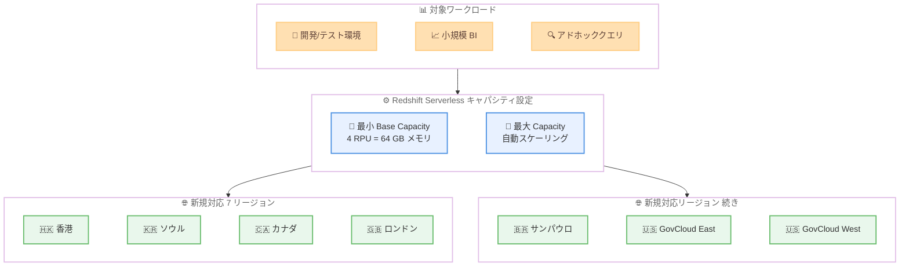

# Amazon Redshift Serverless - 4 RPU 最小キャパシティが 7 リージョンに拡大

**リリース日**: 2026 年 5 月 29 日
**サービス**: Amazon Redshift Serverless
**機能**: 4-RPU Minimum Capacity の追加リージョン対応

📊 [このアップデートのインフォグラフィックを見る](https://takech9203.github.io/aws-news-summary/20260529-amazon-redshift-serverless-4-rpu-seven-regions.html)

## 概要

Amazon Redshift Serverless の 4 RPU 最小ベースキャパシティが 7 つの追加 AWS リージョンで利用可能になりました。従来の最小 8 RPU から半分の 4 RPU で開始できるため、小規模なワークロードや開発環境において、より低コストで Redshift Serverless を利用できます。

4 RPU 構成では 64 GB のメモリが提供され、最小限のコンピュートリソースとメモリで十分なワークロードに最適です。1 時間あたり $1.50 からという低価格で利用でき、秒単位の課金により実際の使用量に応じた支払いが可能です。今回のリージョン拡大により、アジア太平洋 (香港)、アジア太平洋 (ソウル)、カナダ (中部)、欧州 (ロンドン)、南米 (サンパウロ)、AWS GovCloud (US-East)、AWS GovCloud (US-West) の 7 リージョンで 4 RPU 構成が利用可能になりました。

**アップデート前の課題**

- 上記 7 リージョンでは Redshift Serverless の最小ベースキャパシティが 8 RPU であり、小規模なワークロードにはオーバースペックだった
- 開発・テスト環境やアドホッククエリ用途でも最低 8 RPU 分のコストが発生していた
- 小規模なデータウェアハウスの運用コストを最適化する手段が限られていた

**アップデート後の改善**

- 7 つの追加リージョンで 4 RPU (64 GB メモリ) から Redshift Serverless を開始可能に
- 最小コストが半減し、小規模ワークロードのコスト効率が大幅に向上
- 開発・テスト環境の維持コストを削減しながら、本番環境と同じ Serverless アーキテクチャを利用可能

## アーキテクチャ図



4 RPU の最小ベースキャパシティにより、小規模なワークロードを低コストで実行しながら、需要の増加に応じて自動的にスケールアップします。

## サービスアップデートの詳細

### 主要機能

1. **4 RPU 最小ベースキャパシティ**
   - 従来の最小 8 RPU から半分の 4 RPU で Redshift Serverless を開始可能
   - 1 RPU = 16 GB メモリのため、4 RPU で 64 GB のメモリを提供
   - 最大 32 TB の Redshift マネージドストレージをサポート
   - テーブルあたり最大 100 列の制約あり

2. **7 リージョンへの拡大**
   - アジア太平洋 (香港)
   - アジア太平洋 (ソウル)
   - カナダ (中部)
   - 欧州 (ロンドン)
   - 南米 (サンパウロ)
   - AWS GovCloud (US-East)
   - AWS GovCloud (US-West)

3. **コスト最適化**
   - 1 時間あたり $1.50 からの低価格で利用可能
   - 秒単位の課金により、ワークロード実行時間分のみ支払い
   - キャパシティ予約 (1 年または 3 年) との組み合わせで追加割引が可能

## 技術仕様

### RPU 構成比較

| 項目 | 4 RPU | 8 RPU |
|------|-------|-------|
| メモリ | 64 GB | 128 GB |
| 最大ストレージ | 32 TB | 制限なし |
| テーブルあたり最大列数 | 100 列 | 制限なし |
| 最低料金/時間 | $1.50 | $3.00 |
| 対象ワークロード | 小規模/開発 | 中〜大規模/本番 |

### 4 RPU が利用可能なリージョン (今回追加分)

| リージョン | リージョンコード |
|-----------|-----------------|
| アジア太平洋 (香港) | ap-east-1 |
| アジア太平洋 (ソウル) | ap-northeast-2 |
| カナダ (中部) | ca-central-1 |
| 欧州 (ロンドン) | eu-west-2 |
| 南米 (サンパウロ) | sa-east-1 |
| AWS GovCloud (US-East) | us-gov-east-1 |
| AWS GovCloud (US-West) | us-gov-west-1 |

## 設定方法

### 前提条件

1. 対象リージョンで Amazon Redshift Serverless が利用可能であること
2. Redshift Serverless のワークグループを作成するための適切な IAM 権限があること
3. VPC およびセキュリティグループが設定済みであること

### 手順

#### ステップ 1: ワークグループの作成 (4 RPU)

```bash
# AWS CLI で 4 RPU のワークグループを作成
aws redshift-serverless create-workgroup \
  --workgroup-name my-dev-workgroup \
  --namespace-name my-namespace \
  --base-capacity 4 \
  --region ap-northeast-2
```

ベースキャパシティを 4 に設定して新しいワークグループを作成します。これにより最小 4 RPU で動作するサーバーレスエンドポイントが作成されます。

#### ステップ 2: 既存ワークグループのベースキャパシティ変更

```bash
# 既存のワークグループのベースキャパシティを 4 RPU に変更
aws redshift-serverless update-workgroup \
  --workgroup-name my-existing-workgroup \
  --base-capacity 4
```

既存のワークグループのベースキャパシティを 8 RPU から 4 RPU に引き下げることで、コストを最適化できます。

#### ステップ 3: キャパシティ設定の確認

```bash
# ワークグループの設定を確認
aws redshift-serverless get-workgroup \
  --workgroup-name my-dev-workgroup \
  --query 'workgroup.{Name:workgroupName,BaseCapacity:baseCapacity,Status:status}'
```

ワークグループのベースキャパシティが 4 RPU に設定されていることを確認します。

## メリット

### ビジネス面

- **コスト削減**: 最小構成のコストが半減し、小規模なデータウェアハウスの運用コストを大幅に削減可能
- **参入障壁の低下**: より低いコストで Redshift Serverless を導入でき、小規模チームや PoC に最適
- **マルチリージョン対応**: 7 リージョンへの拡大により、データレジデンシー要件を満たしながら低コスト運用が可能

### 技術面

- **開発環境の最適化**: 本番と同じアーキテクチャで開発・テスト環境を低コストで維持可能
- **自動スケーリングの維持**: 4 RPU をベースに、ワークロードの増加に応じて自動的にスケールアップ
- **Serverless の全機能を利用可能**: ベースキャパシティが低くても、Redshift Serverless のすべての機能にアクセス可能

## デメリット・制約事項

### 制限事項

- 4 RPU 構成ではテーブルあたり最大 100 列に制限される
- マネージドストレージは最大 32 TB に制限される
- コンピュートリソースが限られるため、大規模なクエリや複雑な結合ではパフォーマンスが低下する可能性がある

### 考慮すべき点

- ワークロードの特性を評価し、4 RPU で十分なパフォーマンスが得られるか事前にテストすることを推奨
- 本番環境で使用する場合は、自動スケーリングの上限 (Max RPU) を適切に設定してコストを制御する必要がある
- 100 列制限に該当するテーブルがある場合は、8 RPU 以上のベースキャパシティが必要

## ユースケース

### ユースケース 1: 開発・テスト環境のコスト最適化

**シナリオ**: 本番環境は 32 RPU で運用しているが、開発・テスト環境は小規模なデータセットで十分。環境ごとに独立した Redshift Serverless ワークグループを維持したい。

**実装例**:
```bash
# 開発環境用ワークグループを 4 RPU で作成
aws redshift-serverless create-workgroup \
  --workgroup-name dev-analytics \
  --namespace-name dev-namespace \
  --base-capacity 4 \
  --max-capacity 16
```

**効果**: 開発環境のベースコストを $1.50/時間に抑えながら、必要時には 16 RPU まで自動スケール。本番環境と同じ SQL やクエリを低コストでテスト可能。

### ユースケース 2: 小規模チームの BI 環境

**シナリオ**: 5-10 名程度のデータアナリストチームが日常的なレポート作成とアドホッククエリを実行。データ量は数 TB 程度で、同時クエリ数も少ない。

**実装例**:
```bash
# 小規模 BI チーム用のワークグループ
aws redshift-serverless create-workgroup \
  --workgroup-name bi-team \
  --namespace-name bi-namespace \
  --base-capacity 4 \
  --max-capacity 32
```

**効果**: 通常時は 4 RPU の低コストで運用し、複数ユーザーが同時にクエリを実行する時間帯のみ自動スケール。月額コストを大幅に削減。

### ユースケース 3: アジア太平洋リージョンでのデータレジデンシー対応

**シナリオ**: 韓国市場向けのアプリケーションデータを韓国リージョン内で分析する必要がある。データ量は小規模だが、データレジデンシー要件によりソウルリージョンでの処理が必須。

**実装例**:
```bash
# ソウルリージョンで 4 RPU のワークグループを作成
aws redshift-serverless create-workgroup \
  --workgroup-name kr-analytics \
  --namespace-name kr-namespace \
  --base-capacity 4 \
  --region ap-northeast-2
```

**効果**: データレジデンシー要件を満たしながら、最小限のコストで分析環境を構築。必要に応じてスケーリング可能な柔軟性を維持。

## 料金

Amazon Redshift Serverless は RPU-hours 単位で秒ごとに課金されます。4 RPU 構成では 1 時間あたり $1.50 から利用可能です。

### 料金例

| 構成 | 利用時間/日 | 月額料金 (概算) |
|------|------------|-----------------|
| 4 RPU / 8 時間/日 | 営業時間のみ | 約 $360 |
| 4 RPU / 24 時間/日 | 常時稼働 | 約 $1,080 |
| 8 RPU / 8 時間/日 | 営業時間のみ | 約 $720 |
| 8 RPU / 24 時間/日 | 常時稼働 | 約 $2,160 |

※ 実際の料金はリージョンにより異なります。キャパシティ予約 (1 年/3 年) を利用することで追加の割引が適用されます。最新の料金は [Redshift 料金ページ](https://aws.amazon.com/redshift/pricing/) を参照してください。

## 利用可能リージョン

4 RPU 最小キャパシティは、今回追加された 7 リージョンを含め、Amazon Redshift Serverless が提供されているリージョンで順次利用可能になっています。

**今回追加されたリージョン:**
- アジア太平洋 (香港) - ap-east-1
- アジア太平洋 (ソウル) - ap-northeast-2
- カナダ (中部) - ca-central-1
- 欧州 (ロンドン) - eu-west-2
- 南米 (サンパウロ) - sa-east-1
- AWS GovCloud (US-East) - us-gov-east-1
- AWS GovCloud (US-West) - us-gov-west-1

## 関連サービス・機能

- **Amazon Redshift Serverless Reservations**: キャパシティ予約により 4 RPU 構成でもさらなるコスト削減が可能
- **Amazon Redshift マネージドストレージ**: 4 RPU 構成で最大 32 TB のストレージを利用可能
- **Amazon Redshift Data API**: アプリケーションからサーバーレスエンドポイントに接続してクエリを実行

## 参考リンク

- 📊 [インフォグラフィック](https://takech9203.github.io/aws-news-summary/20260529-amazon-redshift-serverless-4-rpu-seven-regions.html)
- [公式発表 (What's New)](https://aws.amazon.com/about-aws/whats-new/2026/05/amazon-redshift-serverless-4-rpu-seven-regions/)
- [ドキュメント - Serverless capacity](https://docs.aws.amazon.com/redshift/latest/mgmt/serverless-capacity.html)
- [ドキュメント - Capacity reservations](https://docs.aws.amazon.com/redshift/latest/mgmt/serverless-billing-reserved.html#serverless-billing-reserved-works)
- [料金ページ](https://aws.amazon.com/redshift/pricing/)
- [Redshift Serverless 機能ページ](https://aws.amazon.com/redshift/redshift-serverless/)

## まとめ

Amazon Redshift Serverless の 4 RPU 最小ベースキャパシティが 7 つの追加リージョンに拡大されたことで、これらのリージョンでより低コストにサーバーレスデータウェアハウスを運用できるようになりました。特に開発・テスト環境、小規模チームの分析ワークロード、データレジデンシー要件のあるユースケースにおいて、コスト効率の高い分析基盤の構築を検討することを推奨します。
