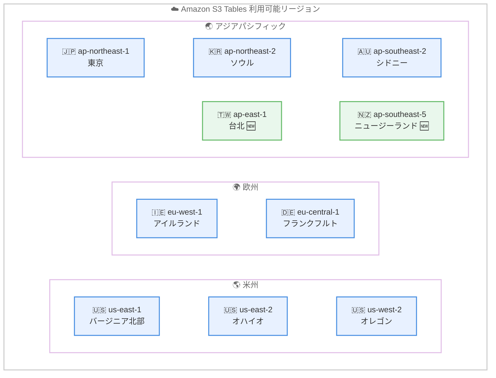

# Amazon S3 Tables - アジアパシフィック 2 リージョンへの拡大

**リリース日**: 2026 年 5 月 29 日
**サービス**: Amazon S3 Tables
**機能**: アジアパシフィック (台北) およびアジアパシフィック (ニュージーランド) リージョンでの提供開始

📊 [このアップデートのインフォグラフィックを見る](https://takech9203.github.io/aws-news-summary/20260529-amazon-s3-tables-aws-regions.html)

## 概要

Amazon S3 Tables がアジアパシフィック (台北) およびアジアパシフィック (ニュージーランド) リージョンで利用可能になりました。S3 Tables は Apache Iceberg をネイティブにサポートするクラウドオブジェクトストアであり、大規模な表形式データの保存と管理を効率化します。

S3 Tables はテーブルの継続的なメンテナンス (コンパクション、スナップショット管理、不要ファイルの削除) を自動的に実行し、データレイクの成長に伴うクエリ効率の最適化とストレージコストの削減を実現します。Apache Iceberg 標準に準拠しているため、AWS およびサードパーティのクエリエンジンからデータにアクセスできます。

今回のリージョン拡大により、台北およびニュージーランドに拠点を持つ組織がデータレジデンシー要件を満たしながら S3 Tables を活用できるようになりました。

**アップデート前の課題**

- アジアパシフィック地域では東京、ソウル、シドニーのみで S3 Tables が利用可能だった
- 台北やニュージーランドのデータレジデンシー要件がある場合、S3 Tables を利用できなかった
- 該当地域のワークロードでは他リージョンへのデータ転送が必要で、レイテンシーとコストが増加していた

**アップデート後の改善**

- アジアパシフィック (台北: ap-east-1) で S3 Tables が利用可能になった
- アジアパシフィック (ニュージーランド: ap-southeast-5) で S3 Tables が利用可能になった
- 台北およびニュージーランドのデータレジデンシー要件に対応可能になった

## アーキテクチャ図



今回のアップデートで追加された 2 リージョン (台北、ニュージーランド) を含む、S3 Tables の利用可能リージョン全体像を示しています。

## サービスアップデートの詳細

### 主要機能

1. **Apache Iceberg ネイティブサポート**
   - クラウドオブジェクトストアとして初めて Apache Iceberg を組み込みでサポート
   - 汎用 S3 バケットの Iceberg テーブルと比較して最大 10 倍のトランザクション/秒を実現
   - Iceberg REST Catalog API を公開し、標準的なクエリエンジンから直接アクセス可能

2. **自動テーブルメンテナンス**
   - コンパクション: 小さなオブジェクトを統合してクエリパフォーマンスを向上
   - スナップショット管理: テーブルの履歴を自動管理
   - 不要ファイルの削除: 参照されなくなったファイルを自動クリーンアップ
   - ソートコンパクションと Z-Order コンパクションをサポート

3. **Intelligent-Tiering ストレージクラス**
   - アクセスパターンに基づいてストレージコストを自動最適化
   - パフォーマンスへの影響や運用オーバーヘッドなし
   - 最大 80% のストレージコスト削減が可能

## 技術仕様

### 対応クエリエンジン

| エンジン | 対応状況 |
|----------|----------|
| Amazon Athena | 対応 |
| Amazon Redshift | 対応 |
| Amazon EMR (Spark) | 対応 |
| Apache Spark | 対応 |
| Apache Flink | 対応 |
| Trino | 対応 |
| DuckDB | 対応 |
| Snowflake | 対応 |
| Dremio | 対応 |
| Starburst | 対応 |

### テーブルバケットの仕様

| 項目 | 詳細 |
|------|------|
| 耐久性 | 99.999999999% (11 ナイン) |
| 可用性 | 99.99% |
| データ形式 | Apache Iceberg |
| API | Iceberg REST Catalog API |
| カタログ統合 | AWS Glue Data Catalog |
| アクセス制御 | AWS IAM、AWS Lake Formation |
| レプリケーション | クロスリージョンテーブルレプリケーション対応 |

### エンドポイント形式

新リージョンのエンドポイントは以下の形式です。

| リージョン | エンドポイント |
|------------|----------------|
| アジアパシフィック (台北) | s3tables.ap-east-1.amazonaws.com |
| アジアパシフィック (ニュージーランド) | s3tables.ap-southeast-5.amazonaws.com |

## 設定方法

### 前提条件

1. AWS アカウントが対象リージョンで有効であること
2. IAM ユーザーまたはロールに S3 Tables の操作権限があること
3. AWS CLI v2 または AWS SDK が最新バージョンであること

### 手順

#### ステップ 1: テーブルバケットの作成

```bash
aws s3tables create-table-bucket \
  --name my-table-bucket \
  --region ap-east-1
```

アジアパシフィック (台北) リージョンにテーブルバケットを作成します。

#### ステップ 2: テーブルの作成

```bash
aws s3tables create-table \
  --table-bucket-arn arn:aws:s3tables:ap-east-1:123456789012:bucket/my-table-bucket \
  --namespace my-namespace \
  --name my-table \
  --format ICEBERG \
  --schema '{
    "fields": [
      {"name": "id", "type": "int", "required": true},
      {"name": "name", "type": "string", "required": false},
      {"name": "created_at", "type": "timestamp", "required": false}
    ]
  }'
```

テーブルバケット内に Apache Iceberg 形式のテーブルを作成します。

#### ステップ 3: クエリエンジンからのアクセス

```sql
-- Amazon Athena からクエリを実行
SELECT * FROM my_namespace.my_table
WHERE created_at >= current_date - interval '7' day
LIMIT 100;
```

AWS Glue Data Catalog と統合されているため、Athena や Redshift から直接テーブルにアクセスできます。

## メリット

### ビジネス面

- **データレジデンシー対応**: 台北およびニュージーランドの規制要件に準拠したデータ管理が可能
- **レイテンシー削減**: 地理的に近いリージョンを利用することで、エンドユーザーへの応答時間が短縮
- **コスト最適化**: データ転送コストの削減と Intelligent-Tiering によるストレージコストの自動最適化

### 技術面

- **高パフォーマンス**: 汎用 S3 バケットと比較して最大 10 倍のトランザクションスループット
- **運用負荷削減**: テーブルメンテナンスが完全自動化されており、手動でのコンパクションやスナップショット管理が不要
- **エコシステム互換性**: Apache Iceberg 標準により、多数のクエリエンジンやツールとの互換性を確保

## デメリット・制約事項

### 制限事項

- S3 Tables レプリケーションは AWS GovCloud (US) リージョンでは利用不可
- テーブルバケットは通常の S3 バケットとは異なるリソースであり、既存の S3 バケットを変換することはできない
- 一部のリージョンではまだ利用できないため、マルチリージョン構成の設計時に考慮が必要

### 考慮すべき点

- コンパクション処理にはオブジェクト処理料金とデータ処理料金が発生する
- オブジェクトモニタリング料金 (1,000 オブジェクトあたり $0.025) が追加コストとして発生
- 既存の Iceberg テーブルからの移行には計画的なデータ移行が必要

## ユースケース

### ユースケース 1: 台湾の金融データ分析基盤

**シナリオ**: 台湾の金融機関がデータレジデンシー要件に準拠しながら、大量のトランザクションデータを分析したい

**実装例**:
```bash
# 台北リージョンにテーブルバケットを作成
aws s3tables create-table-bucket \
  --name financial-analytics \
  --region ap-east-1

# トランザクションテーブルを作成
aws s3tables create-table \
  --table-bucket-arn arn:aws:s3tables:ap-east-1:123456789012:bucket/financial-analytics \
  --namespace transactions \
  --name daily_transactions \
  --format ICEBERG
```

**効果**: 台湾のデータ規制に準拠しつつ、S3 Tables の自動コンパクションと Intelligent-Tiering により、運用コストとクエリレイテンシーを最小化

### ユースケース 2: ニュージーランドの IoT データレイク

**シナリオ**: ニュージーランドで運用される IoT センサーネットワークのデータを低レイテンシーで蓄積・分析したい

**実装例**:
```python
import boto3

s3tables = boto3.client('s3tables', region_name='ap-southeast-5')

# テーブルバケット作成
s3tables.create_table_bucket(name='iot-sensor-data')

# センサーデータテーブル作成
s3tables.create_table(
    tableBucketARN='arn:aws:s3tables:ap-southeast-5:123456789012:bucket/iot-sensor-data',
    namespace='sensors',
    name='temperature_readings',
    format='ICEBERG'
)
```

**効果**: ニュージーランド国内でデータを保持しながら、S3 Tables の高いトランザクションスループットにより、リアルタイムに近い IoT データ分析を実現

### ユースケース 3: アジアパシフィック地域のマルチリージョン分析

**シナリオ**: アジアパシフィック全域でビジネスを展開する企業が、各リージョンのデータを統合的に分析したい

**実装例**:
```sql
-- Amazon Athena でクロスリージョンのデータを統合クエリ
-- 各リージョンの S3 Tables を Glue Data Catalog 経由で参照
SELECT region, COUNT(*) as order_count, SUM(amount) as total_amount
FROM unified_catalog.orders
WHERE order_date >= current_date - interval '30' day
GROUP BY region
ORDER BY total_amount DESC;
```

**効果**: S3 Tables のクロスリージョンレプリケーションを活用し、台北やニュージーランドを含むアジアパシフィック全域のデータを低レイテンシーで横断分析

## 料金

S3 Tables の料金は全リージョンで同じ料金体系が適用されます (リージョンにより単価は異なる場合あり)。

### 料金例 (1 TB のテーブル、月間 500,000 GET リクエスト)

| コンポーネント | 月額料金 (概算) |
|----------------|-----------------|
| ストレージ (1 TB) | $27.14 |
| PUT リクエスト | $0.15 |
| GET リクエスト | $0.20 |
| オブジェクトモニタリング | $0.26 |
| コンパクション (オブジェクト) | $0.06 |
| コンパクション (データ) | $0.73 |
| **合計** | **$28.54** |

テーブルバケットの作成自体は無料です。

## 利用可能リージョン

今回の拡大により、S3 Tables は以下のリージョンで利用可能です。

| リージョン名 | リージョンコード | 備考 |
|--------------|------------------|------|
| 米国東部 (バージニア北部) | us-east-1 | |
| 米国東部 (オハイオ) | us-east-2 | |
| 米国西部 (オレゴン) | us-west-2 | |
| 欧州 (アイルランド) | eu-west-1 | |
| 欧州 (フランクフルト) | eu-central-1 | |
| アジアパシフィック (東京) | ap-northeast-1 | |
| アジアパシフィック (ソウル) | ap-northeast-2 | |
| アジアパシフィック (シドニー) | ap-southeast-2 | |
| アジアパシフィック (台北) | ap-east-1 | 🆕 今回追加 |
| アジアパシフィック (ニュージーランド) | ap-southeast-5 | 🆕 今回追加 |

## 関連サービス・機能

- **Amazon Athena**: S3 Tables に対してサーバーレスでインタラクティブクエリを実行
- **Amazon Redshift**: S3 Tables をデータウェアハウスの外部テーブルとして参照
- **AWS Glue Data Catalog**: S3 Tables のメタデータ管理とカタログ統合
- **Amazon EMR**: Apache Spark や Flink を使用した大規模データ処理
- **AWS Lake Formation**: テーブルレベルのきめ細かいアクセス制御

## 参考リンク

- 📊 [インフォグラフィック](https://takech9203.github.io/aws-news-summary/20260529-amazon-s3-tables-aws-regions.html)
- [公式発表 (What's New)](https://aws.amazon.com/about-aws/whats-new/2026/05/amazon-s3-tables-aws-regions/)
- [Amazon S3 Tables ドキュメント](https://docs.aws.amazon.com/AmazonS3/latest/userguide/s3-tables.html)
- [S3 Tables エンドポイントとリージョン](https://docs.aws.amazon.com/AmazonS3/latest/userguide/s3-tables-endpoints.html)
- [Amazon S3 料金ページ](https://aws.amazon.com/s3/pricing/)

## まとめ

Amazon S3 Tables がアジアパシフィック (台北) およびアジアパシフィック (ニュージーランド) リージョンで利用可能になり、これらの地域でのデータレジデンシー要件への対応とレイテンシー削減が可能になりました。台湾やニュージーランドでデータ分析基盤を構築している組織は、S3 Tables の自動テーブルメンテナンスと高いトランザクションスループットを活用し、運用負荷を大幅に削減できます。既に S3 Tables を利用中の組織はクロスリージョンレプリケーションによるアジアパシフィック全域のデータ統合も検討に値します。
