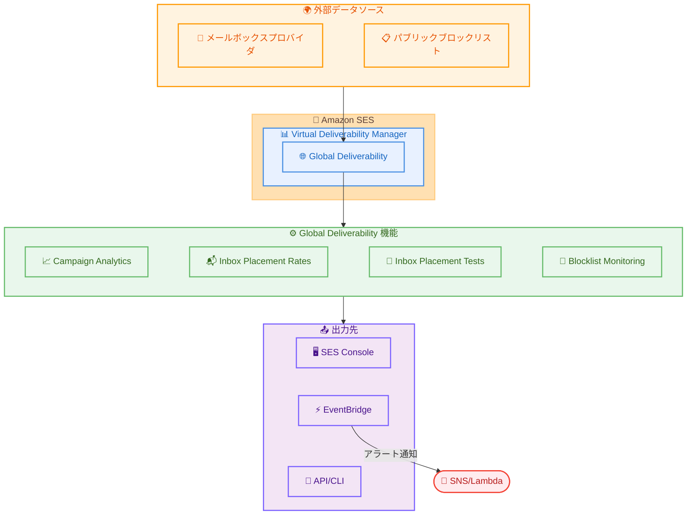

# Amazon SES - Global Deliverability (受信ボックス配置メトリクスとブロックリストモニタリング)

**リリース日**: 2026 年 5 月 29 日
**サービス**: Amazon Simple Email Service (SES)
**機能**: Global Deliverability (Virtual Deliverability Manager)

📊 [このアップデートのインフォグラフィックを見る](https://takech9203.github.io/aws-news-summary/20260529-amazon-ses-global-deliverability.html)

## 概要

Amazon SES が Virtual Deliverability Manager の新機能として「Global Deliverability」をリリースした。この機能により、送信メールの受信ボックス配置率 (Inbox Placement Rate) の可視化、送信前のコンテンツテスト、およびパブリックブロックリストのモニタリングが可能になる。

従来の Virtual Deliverability Manager では、配信率、バウンス率、苦情率、開封率、クリック率といった E2E のメール配信メトリクスを確認できたが、実際に受信者のスパムフォルダに振り分けられたメールの割合を把握することはできなかった。今回のアップデートにより、業界の代表的なサンプルデータに基づいて受信ボックス配置率を ISP レベルで確認でき、送信前にメールコンテンツのテストも実施できるようになった。

**アップデート前の課題**

- 送信メールのうち何通がスパムフォルダに配置されたか把握できなかった
- メールコンテンツが主要メールボックスプロバイダでどのように扱われるか、送信前に確認する手段がなかった
- ドメインや IP がブロックリストに掲載されたことを能動的に検知する仕組みがなかった

**アップデート後の改善**

- 送信ドメインとキャンペーン単位で受信ボックス配置率を確認可能になった
- 送信前にシードリストテストでメールコンテンツの配置率を事前検証できるようになった
- ドメインと専用 IP のブロックリスト掲載を 1 時間ごとに自動チェックし、EventBridge 経由でアラート通知が可能になった
- Amazon SES 以外のプロバイダ経由で送信されたメールのメトリクスも追跡可能になった

## アーキテクチャ図



Global Deliverability は外部のメールボックスプロバイダやブロックリストからデータを収集し、SES コンソール、EventBridge、API を通じてメトリクスとアラートを提供する。

## サービスアップデートの詳細

### 主要機能

1. **Campaign Analytics (キャンペーン分析)**
   - 監視対象ドメインからの送信メールに対するキャンペーンごとの配信性能と エンゲージメントメトリクスを表示
   - 業界の代表的なサンプルデータに基づいて算出
   - Amazon SES 以外のプロバイダ経由で送信されたメールも追跡対象

2. **Inbox Placement Rates (受信ボックス配置率)**
   - ISP レベルでの受信ボックス配置率を提供
   - 監視対象ドメインに対して 1 時間ごとに更新
   - 送信ドメインおよびキャンペーン単位での確認が可能

3. **Inbox Placement Tests (受信ボックス配置テスト)**
   - 主要メールボックスプロバイダのシードアカウントにテストメールを送信
   - 実際の受信者に送信する前に配置率と認証の問題を事前に検出
   - リージョンに依存しないテスト実行が可能

4. **Blocklist Monitoring (ブロックリストモニタリング)**
   - 専用 IP と送信ドメインを主要ブロックリストオペレーターに対して 1 時間ごとにチェック
   - リスト掲載時に VDM Advisor 経由でプロアクティブなアラートを送信
   - EventBridge 連携による自動化対応が可能

## 技術仕様

### Global Deliverability の動作範囲

| 項目 | 詳細 |
|------|------|
| 有効化単位 | リージョン単位で有効化 |
| ドメインモニタリング | リージョン、アカウント、送信プロバイダを跨いで追跡 |
| IP モニタリング | 有効化したリージョン内の専用 IP のみ |
| Inbox Placement Tests | リージョン非依存 |
| 更新頻度 | 1 時間ごと |
| アラート連携 | EventBridge |

### 含まれるリソース (基本プラン)

| リソース | 月間含有量 |
|----------|-----------|
| 監視ドメイン数 | 5 ドメイン |
| 監視 IP 数 | 12 IP |
| シードリストテスト | 25 テスト |

### 設定方法

#### 前提条件

1. Amazon SES アカウントが設定済みであること
2. Virtual Deliverability Manager が有効化されていること
3. 送信ドメインの検証が完了していること

#### ステップ 1: Global Deliverability の有効化

SES コンソールの Virtual Deliverability Manager 設定ページから Global Deliverability を有効化する。

```bash
# AWS CLI で VDM アカウント設定を確認
aws sesv2 get-account
```

現在の VDM 設定状態を確認し、Global Deliverability の有効化準備を行う。

#### ステップ 2: 監視ドメインの設定

```bash
# 送信ドメインの一覧を確認
aws sesv2 list-email-identities --identity-type DOMAIN
```

Global Deliverability で監視するドメインを SES コンソールから選択する。

#### ステップ 3: EventBridge ルールの設定 (オプション)

```bash
# ブロックリスト掲載時のアラートルールを作成
aws events put-rule \
  --name "ses-blocklist-alert" \
  --event-pattern '{
    "source": ["aws.ses"],
    "detail-type": ["SES Blocklist Alert"]
  }' \
  --state ENABLED
```

ブロックリスト掲載を検知した際に SNS や Lambda で通知を受け取るための EventBridge ルールを作成する。

## メリット

### ビジネス面

- **エンゲージメント最大化**: スパムフォルダ配置を減らすことで、受信者に実際に閲覧されるメールの割合を向上
- **プロアクティブな問題対応**: ブロックリスト掲載を早期に検知し、レピュテーション悪化前に対処可能
- **送信前リスク軽減**: コンテンツテストにより、大量送信前に配置率の問題を事前に把握

### 技術面

- **ISP レベルの可視性**: メールボックスプロバイダごとの配置率を確認でき、問題の特定が容易
- **EventBridge 連携**: ブロックリストアラートを既存の自動化ワークフローに統合可能
- **クロスプロバイダ追跡**: Amazon SES 以外のプロバイダ経由の送信も含めた統合的なメトリクス

## デメリット・制約事項

### 制限事項

- 受信ボックス配置率は業界のサンプルデータに基づく推定値であり、実際の配置率とは差異が生じる可能性がある
- IP モニタリングは有効化したリージョン内の専用 IP のみが対象
- 月額 $1,250/リージョン/アカウントの追加コストが発生する

### 考慮すべき点

- 基本プランに含まれるリソース (5 ドメイン、12 IP、25 テスト) を超過した場合は追加料金が発生する
- 複数リージョンで有効化する場合、それぞれのリージョンで個別に料金が発生する
- ドメインモニタリングはリージョン横断で動作するが、IP モニタリングはリージョン固有

## ユースケース

### ユースケース 1: マーケティングキャンペーンの最適化

**シナリオ**: E コマース企業が週次のプロモーションメールを数百万通送信しており、最近エンゲージメント率が低下している。

**実装例**:
```bash
# キャンペーン送信前にシードリストテストを実行
# SES コンソールの Inbox Placement Tests から新しいテストを作成
# 1. テストメールのコンテンツを指定
# 2. テスト対象のメールボックスプロバイダを選択
# 3. 結果を確認してコンテンツを最適化
```

**効果**: 送信前にスパム判定される可能性の高いコンテンツを特定し修正することで、受信ボックス配置率を改善しエンゲージメント率を向上させる。

### ユースケース 2: レピュテーション管理の自動化

**シナリオ**: SaaS 企業がトランザクションメールを大量に送信しており、IP レピュテーションの低下を早期に検知して対処したい。

**実装例**:
```bash
# EventBridge ルールで Lambda を呼び出し、自動対応を実装
aws events put-targets \
  --rule "ses-blocklist-alert" \
  --targets "Id"="1","Arn"="arn:aws:lambda:us-east-1:123456789012:function:handle-blocklist-alert"
```

**効果**: ブロックリスト掲載時に即座に通知を受け取り、送信 IP の切り替えやウォームアップの再開などの対応を自動化できる。

### ユースケース 3: マルチプロバイダ環境での統合モニタリング

**シナリオ**: 大企業が Amazon SES と他のメール送信プロバイダを併用しており、全ての送信チャネルの配信パフォーマンスを一元管理したい。

**実装例**:
```bash
# 監視ドメインを設定すると、SES 以外のプロバイダ経由の送信も追跡可能
# SES コンソールの Campaign Analytics から統合メトリクスを確認
# ISP ごとの配置率を比較して、問題のあるプロバイダや設定を特定
```

**効果**: 送信プロバイダに依存しない統合的な配信パフォーマンスの可視化により、全体最適な送信戦略の策定が可能になる。

## 料金

Global Deliverability は VDM の追加サブスクリプションとして提供される。

### 料金体系

| 項目 | 料金 |
|------|------|
| 月額基本料金 | $1,250/月 (リージョン/アカウント単位) |
| 含有ドメイン数 | 5 ドメイン |
| 含有 IP 数 | 12 IP |
| 含有テスト数 | 25 シードリストテスト/月 |
| 追加ドメイン | $25/ドメイン |
| 追加 IP | $12.50/IP |
| 追加テスト | $10/テスト |

VDM 自体の料金 (メール送信 1,000 通あたり $0.07 から) は別途発生する。

## 利用可能リージョン

Amazon SES が利用可能な全ての AWS 商用リージョンで利用可能。主要リージョンは以下の通り。

- 米国東部 (バージニア北部、オハイオ)
- 米国西部 (オレゴン)
- アジアパシフィック (東京、シンガポール、シドニー、ムンバイ、ソウル)
- 欧州 (アイルランド、フランクフルト、ロンドン)
- カナダ (中部)
- 南米 (サンパウロ)

## 関連サービス・機能

- **Amazon SES Virtual Deliverability Manager**: Global Deliverability の上位機能。メール配信の E2E メトリクス可視化を提供
- **Amazon EventBridge**: ブロックリストアラートの配信先として連携し、自動化ワークフローを構築可能
- **Amazon CloudWatch**: SES メトリクスの監視とダッシュボード作成に利用

## 参考リンク

- 📊 [インフォグラフィック](https://takech9203.github.io/aws-news-summary/20260529-amazon-ses-global-deliverability.html)
- [公式発表 (What's New)](https://aws.amazon.com/about-aws/whats-new/2026/05/amazon-ses-global-deliverability/)
- [ドキュメント - Global Deliverability](https://docs.aws.amazon.com/ses/latest/dg/vdm-global-deliverability.html)
- [料金ページ](https://aws.amazon.com/ses/pricing/)
- [Amazon SES リージョン一覧](https://docs.aws.amazon.com/general/latest/gr/ses.html)

## まとめ

Amazon SES の Global Deliverability は、メール送信者にとって長年の課題であった「実際に受信ボックスに届いているかどうか」の可視性を大幅に向上させる機能である。特に大量メール送信を行う企業にとって、送信前テスト機能とブロックリストモニタリングの組み合わせにより、配信パフォーマンスの維持と改善をプロアクティブに実施できるようになる。月額 $1,250 のコストは小規模な利用には割高だが、メール配信がビジネスクリティカルな組織にとっては十分な投資対効果が期待できる。
