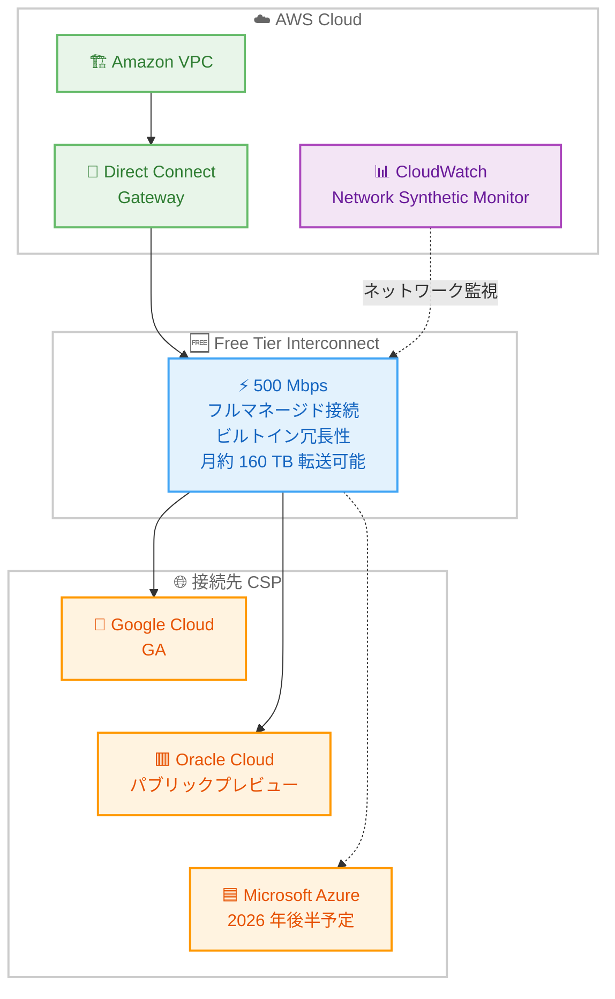

# AWS Interconnect - multicloud 無料 500 Mbps ティア提供開始

**リリース日**: 2026 年 5 月 29 日
**サービス**: AWS Interconnect
**機能**: AWS Interconnect - multicloud Free Tier (無料 500 Mbps マルチクラウド接続)

[このアップデートのインフォグラフィックを見る](https://takech9203.github.io/aws-news-summary/20260529-aws-interconnect-multicloud-offers-free-500-mbps-tier.html)

## 概要

AWS は AWS Interconnect - multicloud の無料 500 Mbps ティアの提供開始を発表しました。これにより、AWS と他のパブリッククラウド間のワークロードをプライベートに接続することがより容易になります。Free Tier Interconnect は、有料オファリングと同じネットワークパス、ファシリティ、デバイスレジリエンシーを備えたフルマネージドの 500 Mbps インターコネクトを AWS 側の料金なしで提供します。

500 Mbps の帯域幅により、月あたり約 160 TB のデータ転送が可能であり、マルチクラウドワークロード、データレプリケーション、ハイブリッドアプリケーションアーキテクチャを AWS Interconnect の課金なしでサポートできます。さらに、各 Free Tier マルチクラウドインターコネクトには Amazon CloudWatch Network Synthetic Monitor が追加料金なしで含まれており、クラウド間のネットワークヘルスとパフォーマンスを監視できます。

なお、接続先の CSP 側のインフラストラクチャに対する料金は、各 CSP が独自に設定・課金します。Interconnect を作成する前に、接続先 CSP の料金を確認することが推奨されます。現在、Google Cloud が GA パートナー、Oracle Cloud Infrastructure (OCI) がパブリックプレビュー、Microsoft Azure が 2026 年後半に対応予定です。

**アップデート前の課題**

- AWS Interconnect - multicloud を試用・評価するにはコミットメントが必要で、小規模なテストにもコストが発生していた
- マルチクラウド接続の PoC (概念実証) を開始する際に、帯域幅プランの選択と料金見積りが必要だった
- クラウド間のネットワークヘルス監視には別途 CloudWatch の設定やコストが発生していた

**アップデート後の改善**

- AWS 側の料金なしで 500 Mbps のフルマネージドマルチクラウド接続を利用開始可能になった
- 月あたり約 160 TB のデータ転送を無料枠内で実行でき、実質的なワークロードの運用が可能
- Amazon CloudWatch Network Synthetic Monitor が無料で付属し、追加設定なしでクラウド間のネットワーク監視が可能になった
- 有料プランと同じレジリエンシーレベルで評価・テストを実施でき、本番移行時の差異が少ない

## アーキテクチャ図



AWS VPC から Direct Connect Gateway を経由し、Free Tier の 500 Mbps インターコネクトで他の CSP に接続するアーキテクチャです。CloudWatch Network Synthetic Monitor が無料で付属し、接続のヘルスとパフォーマンスを監視します。

## サービスアップデートの詳細

### 主要機能

1. **無料 500 Mbps マルチクラウド接続**
   - AWS 側の料金なしで 500 Mbps のフルマネージドインターコネクトを提供
   - 有料プランと同じネットワークパス、ファシリティ、デバイスレジリエンシーを維持
   - 月あたり約 160 TB のデータ転送容量

2. **CloudWatch Network Synthetic Monitor の無料付属**
   - 各 Free Tier インターコネクトに Amazon CloudWatch Network Synthetic Monitor が追加料金なしで含まれる
   - クラウド間のネットワークヘルスとパフォーマンスをプロアクティブに監視
   - 接続の品質問題を早期に検知可能

3. **既存のエンタープライズグレード機能の継承**
   - ビルトイン冗長性 (4 接続モデルと ECMP ロードバランシング)
   - MACsec 暗号化による転送中データの保護
   - API、CLI、コンソールからの管理

## 技術仕様

### Free Tier の仕様

| 項目 | 詳細 |
|------|------|
| 帯域幅 | 500 Mbps |
| 月間転送量目安 | 約 160 TB |
| 冗長性 | ビルトイン (有料プランと同等) |
| ネットワーク監視 | CloudWatch Network Synthetic Monitor 付属 |
| 制限 | 顧客あたりリージョンごとに 1 本、GA 済み CSP ごとに 1 本 |
| 接続タイプ | ローカル (Tier 1) のみ |
| 対応 CSP | Google Cloud (GA)、OCI (パブリックプレビュー) |
| AWS 側料金 | 無料 |
| CSP 側料金 | 各 CSP が独自に設定 |

### 利用条件

| 条件 | 内容 |
|------|------|
| 数量制限 | 顧客あたり、リージョンあたり、CSP あたり 1 本 |
| 接続範囲 | ローカル (Tier 1) インターコネクトのみ |
| CSP 要件 | AWS と GA 済みの CSP への接続のみ対象 |
| 規約 | AWS Service Terms に準拠 |

## 設定方法

### 前提条件

1. AWS アカウントが有効であること
2. Direct Connect Gateway が作成済みであること
3. 接続先 CSP のアカウントおよび料金を事前に確認済みであること
4. 適切な IAM 権限が設定されていること

### 手順

#### ステップ 1: AWS Direct Connect コンソールにアクセス

AWS Direct Connect コンソールを開き、ナビゲーションメニューから「AWS Interconnect」を選択します。

#### ステップ 2: Free Tier インターコネクトの作成

```bash
# 500 Mbps Free Tier インターコネクトを作成
aws interconnect create-connection \
  --description "Free Tier - MultiCloud Evaluation" \
  --bandwidth "500Mbps" \
  --attach-point '{"directConnectGateway": "dxgw-xxxxxxxx"}' \
  --environment-id "env-gcp-us-east1" \
  --remote-account '{"identifier": "project-id@example.com"}' \
  --tags '{"Purpose": "FreeTier", "Environment": "Evaluation"}'
```

500 Mbps の帯域幅を指定して接続を作成します。Free Tier の条件を満たす場合、AWS 側の課金は発生しません。

#### ステップ 3: CSP 側での接続承認

```bash
# アクティベーションキーを確認
aws interconnect get-connection \
  --identifier "conn-xxxxxxxx"
```

生成されたアクティベーションキーを使用して、接続先 CSP 側のコンソールまたは API で接続を承認します。CSP 側の料金が発生する可能性があるため、事前に確認してください。

#### ステップ 4: ネットワーク監視の確認

```bash
# CloudWatch Network Synthetic Monitor の状態確認
aws cloudwatch describe-alarms \
  --alarm-name-prefix "Interconnect-FreeTier"
```

Free Tier に付属する CloudWatch Network Synthetic Monitor が自動的に設定されます。追加の設定なしでクラウド間のネットワーク監視が開始されます。

## メリット

### ビジネス面

- **ゼロコストでのマルチクラウド評価**: AWS 側の料金なしでマルチクラウド接続を評価・テストでき、PoC の初期投資を削減
- **本番品質での検証**: 有料プランと同じレジリエンシーとパフォーマンスで検証でき、本番移行時の差異を最小化
- **段階的な導入**: 無料枠で開始し、需要の増加に応じて帯域幅をアップグレードする段階的な導入戦略が可能

### 技術面

- **十分な転送容量**: 月あたり約 160 TB の転送が可能で、多くのワークロードに対応できる実用的な帯域幅
- **統合監視**: CloudWatch Network Synthetic Monitor が無料付属し、追加の監視ツール導入なしでネットワークヘルスを可視化
- **エンタープライズグレードのセキュリティ**: MACsec 暗号化とプライベート接続により、無料枠であってもセキュリティ水準を維持

## デメリット・制約事項

### 制限事項

- 顧客あたりリージョンごとに 1 本、かつ GA 済み CSP ごとに 1 本の制限があり、複数の Free Tier 接続は利用不可
- ローカル (Tier 1) インターコネクトのみが対象であり、リージョナルやグローバルな接続は無料枠の対象外
- CSP 側の料金は各 CSP が独自に設定するため、AWS 側が無料でも接続先で料金が発生する可能性がある

### 考慮すべき点

- Free Tier はあくまで AWS 側の料金が無料であり、接続先 CSP の料金ページを必ず確認してからインターコネクトを作成すること
- パブリックプレビュー中の OCI への Free Tier 接続は、GA 後に条件が変更される可能性がある
- 500 Mbps を超える帯域幅が必要になった場合は、有料プランへのアップグレードが必要

## ユースケース

### ユースケース 1: マルチクラウド PoC の低コスト実施

**シナリオ**: マルチクラウド戦略を検討している企業が、AWS と Google Cloud 間のプライベート接続を初期投資なしで評価したい。

**実装例**:
```bash
# Free Tier でマルチクラウド PoC 環境を構築
aws interconnect create-connection \
  --description "MultiCloud POC - Zero Cost" \
  --bandwidth "500Mbps" \
  --attach-point '{"directConnectGateway": "dxgw-poc"}' \
  --environment-id "env-gcp-us-east1" \
  --remote-account '{"identifier": "poc-project@example.com"}' \
  --tags '{"Purpose": "POC", "CostCenter": "Innovation"}'
```

**効果**: AWS 側の料金ゼロでマルチクラウド接続を 30 日以上評価可能。月 160 TB の転送容量で実際のワークロードパターンを用いた現実的なテストが実施でき、投資判断の精度が向上する。

### ユースケース 2: クラウド間データレプリケーション

**シナリオ**: AWS 上のデータベースから Google Cloud のデータウェアハウスへ定期的にデータを同期する必要があるが、転送量は月 50 TB 程度で大規模ではない。

**実装例**:
```bash
# データレプリケーション用の Free Tier 接続
aws interconnect create-connection \
  --description "Data Replication - AWS to GCP" \
  --bandwidth "500Mbps" \
  --attach-point '{"directConnectGateway": "dxgw-data"}' \
  --environment-id "env-gcp-asia-northeast1" \
  --remote-account '{"identifier": "data-project@example.com"}' \
  --tags '{"Purpose": "DataReplication", "DataFlow": "AWS-to-GCP"}'
```

**効果**: 月 50 TB 程度のデータレプリケーションであれば Free Tier の 160 TB 容量内で十分に対応可能。プライベート接続により転送データのセキュリティを確保しつつ、AWS Interconnect の料金を節約できる。

### ユースケース 3: ハイブリッドアプリケーションの開発・テスト

**シナリオ**: 本番環境では高帯域幅の有料プランを使用しているが、開発・テスト環境でもマルチクラウド接続が必要。コスト削減のために開発環境は無料枠で運用したい。

**実装例**:
```bash
# 開発環境用の Free Tier 接続
aws interconnect create-connection \
  --description "Dev/Test Environment - Free Tier" \
  --bandwidth "500Mbps" \
  --attach-point '{"directConnectGateway": "dxgw-dev"}' \
  --environment-id "env-gcp-us-west1" \
  --remote-account '{"identifier": "dev-project@example.com"}' \
  --tags '{"Purpose": "Development", "Environment": "Dev"}'
```

**効果**: 開発・テスト環境のマルチクラウド接続コストをゼロに削減。本番環境と同じアーキテクチャパターンで開発できるため、環境差異による問題を事前に検知可能。

## 料金

AWS Interconnect - multicloud の Free Tier は、AWS 側の料金が無料です。

### Free Tier 料金

| 項目 | 料金 |
|------|------|
| AWS Interconnect 500 Mbps (Free Tier) | 無料 |
| CloudWatch Network Synthetic Monitor | 無料 (Free Tier に付属) |
| 接続先 CSP 側の料金 | 各 CSP が独自に設定 |

### 制限を超えた場合

| シナリオ | 対応 |
|----------|------|
| 500 Mbps 以上の帯域幅が必要 | 有料プランへのアップグレード |
| 同一リージョンで 2 本目の接続 | 有料プラン |
| リージョナル / グローバル接続 | 有料プラン |

## 利用可能リージョン

AWS Direct Connect コンソールから AWS Interconnect を利用可能なリージョンで Free Tier を利用できます。Free Tier はローカル (Tier 1) インターコネクトに限定されるため、利用可能な接続先は同一地域内の CSP ロケーションに限られます。

## 関連サービス・機能

- **AWS Interconnect - multicloud**: 本 Free Tier のベースとなるサービス。有料プランでは 500 Mbps 以上の帯域幅やリージョナル / グローバル接続が利用可能
- **AWS Interconnect - last mile**: Lumen をパートナーとしたブランチオフィスやデータセンターからの AWS へのラストマイル接続サービス
- **AWS Direct Connect**: Interconnect - multicloud の接続先として Direct Connect Gateway を使用
- **Amazon CloudWatch Network Synthetic Monitor**: Free Tier に無料付属するネットワーク監視機能。クラウド間の接続品質をプロアクティブに監視
- **Amazon VPC**: Interconnect を通じた接続の起点となるネットワーク環境

## 参考リンク

- [インフォグラフィック](https://takech9203.github.io/aws-news-summary/20260529-aws-interconnect-multicloud-offers-free-500-mbps-tier.html)
- [公式発表 (What's New)](https://aws.amazon.com/about-aws/whats-new/2026/05/aws-interconnect-multicloud-offers-free-500-mbps-tier)
- [AWS Interconnect ユーザーガイド](https://docs.aws.amazon.com/interconnect/latest/userguide/)
- [AWS Direct Connect コンソール](https://console.aws.amazon.com/directconnect/)

## まとめ

AWS Interconnect - multicloud の無料 500 Mbps ティアにより、マルチクラウド接続の評価・導入ハードルが大幅に低下しました。月あたり約 160 TB の転送容量と CloudWatch Network Synthetic Monitor の無料付属により、実用的なワークロードを AWS 側のコストなしで運用できます。マルチクラウド戦略を検討中の企業は、まず Free Tier でプライベート接続を体験し、有料プランへの段階的なスケールアップを計画することを推奨します。ただし、接続先 CSP 側の料金は独自に発生するため、事前確認を忘れないようにしてください。
