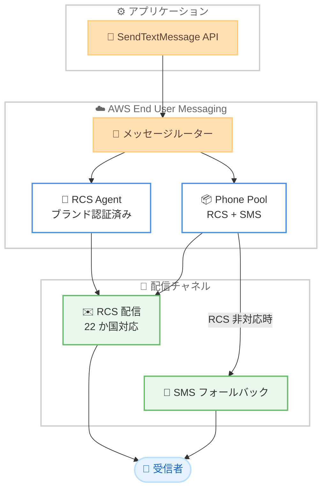

# AWS End User Messaging - RCS for Business が 20 か国追加で利用可能に

**リリース日**: 2026 年 5 月 29 日
**サービス**: AWS End User Messaging
**機能**: RCS for Business 国際展開拡大 (22 か国対応)

📊 [このアップデートのインフォグラフィックを見る](https://takech9203.github.io/aws-news-summary/20260529-aws-rcs-countries.html)

## 概要

AWS End User Messaging の RCS (Rich Communication Services) for Business が新たに 20 か国で利用可能となり、対応国数が合計 22 か国に拡大した。これまで米国とカナダのみで提供されていた RCS メッセージングが、ヨーロッパ、南米、中米、アジアの主要市場に一気に拡大され、企業はグローバルなリッチメッセージング戦略を AWS 上で展開できるようになった。

RCS は SMS の次世代規格であり、認証済みのブランドアイデンティティから送信されるメッセージにより、受信者は信頼できるビジネスメッセージを受け取ることができる。既存の SendTextMessage API をそのまま使用して新しい国へメッセージを送信でき、アプリケーション側の変更は不要。受信者のデバイスが RCS に対応していない場合は、自動的に SMS にフォールバックされるため、確実な配信が保証される。

**アップデート前の課題**

- RCS for Business は米国とカナダの 2 か国のみでしか利用できなかった
- グローバルにリッチメッセージングを展開するには、国ごとに別のプロバイダーを利用する必要があった
- ヨーロッパや南米の顧客に対してブランド認証済みメッセージを送信できず、SMS のみに制限されていた

**アップデート後の改善**

- 22 か国に対して統一された API で RCS メッセージを送信可能になった
- 既存のコードを変更することなく、新しい国へのメッセージ送信が即座に開始できる
- 認証済みブランドメッセージにより、フィッシング対策と顧客エンゲージメントの向上が実現できる

## アーキテクチャ図



SendTextMessage API を呼び出すと、AWS End User Messaging がルーティングを行い、RCS 対応デバイスにはリッチメッセージを配信し、非対応デバイスには自動的に SMS へフォールバックする。

## サービスアップデートの詳細

### 主要機能

1. **20 か国追加対応**
   - 新規対応国: オーストリア、ブラジル、コロンビア、チェコ、デンマーク、ドミニカ共和国、フランス、ドイツ、グアテマラ、イタリア、メキシコ、オランダ、ノルウェー、ペルー、ポーランド、シンガポール、スロバキア、スペイン、スウェーデン、英国
   - 既存対応国: 米国、カナダ
   - 合計 22 か国で RCS メッセージングが利用可能

2. **既存 API での即座の利用**
   - SendTextMessage API をそのまま使用可能
   - アプリケーションの変更不要
   - AWS RCS Agent ARN を origination identity として指定するだけで RCS 配信

3. **自動 SMS フォールバック**
   - Phone Pool を使用した場合、RCS 非対応デバイスには自動的に SMS で配信
   - 25 秒の RCS 配信タイムアウト後に SMS フォールバックが発動
   - 配信率 100% を目指した信頼性の高いメッセージング

4. **ブランド認証済みメッセージ**
   - 企業のロゴ、ブランドカラー、表示名が受信者に表示される
   - フィッシングメッセージとの区別が容易
   - 顧客の信頼性とエンゲージメント向上

## 技術仕様

### 対応国一覧

| 地域 | 国名 | ISO コード |
|------|------|-----------|
| 北米 | 米国、カナダ | US, CA |
| ヨーロッパ | オーストリア、チェコ、デンマーク、フランス、ドイツ、イタリア、オランダ、ノルウェー、ポーランド、スロバキア、スペイン、スウェーデン、英国 | AT, CZ, DK, FR, DE, IT, NL, NO, PL, SK, ES, SE, GB |
| 南米 | ブラジル、コロンビア、ペルー | BR, CO, PE |
| 中米・カリブ | グアテマラ、ドミニカ共和国、メキシコ | GT, DO, MX |
| アジア | シンガポール | SG |

### 送信パターン

| パターン | 説明 | SMS フォールバック | 推奨用途 |
|----------|------|-------------------|----------|
| Pool ベース | Pool ID を指定し、サービスが最適な ID を選択 | あり | 本番環境の全ユースケース |
| アカウントレベル | origination identity を省略 | あり | シンプルな単一ユースケース |
| ダイレクト送信 | RCS Agent ARN を直接指定 | なし | RCS 限定配信 |

### メッセージタイプ

| タイプ | 説明 | 課金 |
|--------|------|------|
| RCS Basic | 160 文字以内のテキストメッセージ | 1 メッセージ単位 |
| RCS Single | 160 文字超のテキストメッセージ | 1 メッセージ単位で課金 |

## 設定方法

### 前提条件

1. AWS End User Messaging へのアクセス権限を持つ AWS アカウント
2. RCS 対応のテストデバイス (Android または iOS 18 以降の iPhone)
3. AWS CLI または SDK (boto3 等) の設定

### 手順

#### ステップ 1: RCS Agent の作成

```bash
aws pinpoint-sms-voice-v2 create-rcs-agent \
    --deletion-protection-enabled
```

AWS RCS Agent を作成する。レスポンスから `RcsAgentId` と `RcsAgentArn` を保存する。

#### ステップ 2: テスト登録の提出

```bash
aws pinpoint-sms-voice-v2 create-registration \
    --registration-type TEST_RCS_LAUNCH_REGISTRATION
```

テスト登録を作成し、ブランドアセット (ロゴ、バナー、ブランドカラー) と企業情報を登録フィールドに設定して提出する。通常数分以内に承認される。

#### ステップ 3: テストデバイスの追加

```bash
aws pinpoint-sms-voice-v2 create-verified-destination-number \
    --destination-phone-number +12065550100 \
    --rcs-agent-id rcs-a1b2c3d4
```

テストデバイスを登録する。デバイスに届くテスター招待を承認する必要がある。

#### ステップ 4: RCS メッセージの送信

```python
import boto3

client = boto3.client('pinpoint-sms-voice-v2')

response = client.send_text_message(
    DestinationPhoneNumber='+442071234567',
    OriginationIdentity='arn:aws:sms-voice:us-east-1:123456789012:rcs-agent/rcs-a1b2c3d4',
    MessageBody='Your order has been shipped. Track it here: https://example.com/track',
    MessageType='TRANSACTIONAL'
)

print(f"Message ID: {response['MessageId']}")
```

SendTextMessage API で RCS Agent ARN を origination identity として指定し、新規対応国の電話番号へメッセージを送信する。

#### ステップ 5: SMS フォールバック付き Pool の設定

```bash
# Pool を作成
aws pinpoint-sms-voice-v2 create-pool \
    --origination-identity rcs-a1b2c3d4 \
    --message-type TRANSACTIONAL

# SMS 番号を Pool に追加
aws pinpoint-sms-voice-v2 associate-origination-identity \
    --pool-id pool-a1b2c3d4e5f6g7h8i \
    --origination-identity phone-number-id
```

RCS Agent と SMS 電話番号を含む Phone Pool を作成することで、RCS 非対応デバイスへの自動 SMS フォールバックが有効になる。

## メリット

### ビジネス面

- **グローバルリーチの拡大**: 22 か国の顧客にブランド認証済みのリッチメッセージを配信でき、マーケティングと顧客コミュニケーションの幅が大幅に拡大
- **コード変更不要**: 既存の SendTextMessage API 実装をそのまま活用でき、新しい国への展開に追加開発コストが不要
- **ブランド信頼性の向上**: 認証済みビジネスアイデンティティからのメッセージにより、フィッシング対策と開封率向上の両立が可能

### 技術面

- **統一 API**: SMS と RCS で同一の API を使用し、チャネルの切り替えがインフラ側で自動処理される
- **自動フォールバック**: Phone Pool 構成により RCS 非対応時の SMS フォールバックが透過的に実行され、配信の信頼性が確保される
- **配信ステータス追跡**: EventBridge と CloudWatch による詳細な配信レシートとメトリクスにより、チャネル別の配信状況を可視化可能

## デメリット・制約事項

### 制限事項

- RCS は全てのデバイスで対応しているわけではなく、非対応デバイスでは SMS フォールバックとなりリッチ機能が失われる
- RCS Agent の登録には国ごとのキャリア承認プロセスが必要で、本番環境での利用開始までに時間がかかる場合がある
- 日本はまだ対応国に含まれていない

### 考慮すべき点

- 料金は送信先の国によって大きく異なるため、コスト計画時に注意が必要
- 一部の国では RCS Agent の登録に高額な初期費用や月額費用が発生する (例: ノルウェーの初期費用 $802.95)
- Agent メンテナンス費用として全国共通で月額 $200 が必要

## ユースケース

### ユースケース 1: グローバル EC のトランザクション通知

**シナリオ**: 国際的な EC サイトが、注文確認・配送通知・配達完了メッセージを世界各国の顧客に送信する。

**実装例**:
```python
import boto3

client = boto3.client('pinpoint-sms-voice-v2')

# Pool ベース送信で自動フォールバック付き
response = client.send_text_message(
    DestinationPhoneNumber='+4915123456789',  # ドイツの顧客
    OriginationIdentity='pool-a1b2c3d4e5f6g7h8i',
    MessageBody='Your order #12345 has been shipped. Estimated delivery: June 2.',
    MessageType='TRANSACTIONAL'
)
```

**効果**: ブランド認証済みメッセージにより顧客が安心して配送情報を確認でき、フィッシングメッセージとの混同を防止。RCS 非対応デバイスにも SMS で確実に到達。

### ユースケース 2: 多国籍企業の OTP 認証

**シナリオ**: SaaS プロバイダーがヨーロッパと南米の顧客に対して二要素認証コードを送信する。

**実装例**:
```python
import boto3

client = boto3.client('pinpoint-sms-voice-v2')

response = client.send_text_message(
    DestinationPhoneNumber='+5511987654321',  # ブラジルの顧客
    OriginationIdentity='pool-otp-dedicated',
    MessageBody='Your verification code is 847293. Valid for 5 minutes.',
    MessageType='TRANSACTIONAL'
)
```

**効果**: ブランド認証により正規の認証コードであることが一目で分かり、SMS スプーフィング攻撃からの保護を強化。送達確認により未到達時のリトライ制御も可能。

### ユースケース 3: マーケティングキャンペーンの国際展開

**シナリオ**: 小売チェーンがヨーロッパ複数国の顧客にセール情報やプロモーションメッセージを配信する。

**実装例**:
```python
import boto3

client = boto3.client('pinpoint-sms-voice-v2')

# 各国の顧客に同一 API でプロモーション配信
countries_numbers = [
    ('+33612345678', 'FR'),   # フランス
    ('+34612345678', 'ES'),   # スペイン
    ('+39312345678', 'IT'),   # イタリア
]

for number, country in countries_numbers:
    response = client.send_text_message(
        DestinationPhoneNumber=number,
        OriginationIdentity='pool-marketing',
        MessageBody='Summer Sale! 30% off all items this weekend. Shop now: https://example.com/sale',
        MessageType='PROMOTIONAL'
    )
```

**効果**: 単一の API と Pool 設定で複数国への配信を実現。ブランド認証によりスパムフィルタを回避しやすく、開封率と CTR の向上が期待できる。

## 料金

RCS メッセージングの料金は送信先の国によって異なる。課金は配信成功時のみ発生し、未配信メッセージには課金されない。

### 主要国の料金例

| 国 | RCS Basic | RCS Single |
|----|-----------|-----------|
| 米国 | $0.00700/セグメント + キャリア費 $0.00494 | 同左 |
| 英国 | $0.0520/メッセージ | $0.0731/メッセージ |
| ドイツ | $0.0900/メッセージ | $0.1190/メッセージ |
| フランス | $0.0730/メッセージ | $0.1014/メッセージ |
| ブラジル | $0.0300/メッセージ | $0.0463/メッセージ |
| シンガポール | $0.0392/メッセージ | $0.0746/メッセージ |
| ポーランド | $0.0322/メッセージ | $0.0577/メッセージ |

### RCS Agent 関連費用

- Agent メンテナンス費用: 全国共通で月額 $200
- 国ごとのキャリアパススルー費用が別途発生 (初期費用、年間費用、月額費用は国により異なる)

## 利用可能リージョン

AWS End User Messaging が利用可能な全ての AWS リージョンで RCS for Business を使用可能。

## 関連サービス・機能

- **Amazon SNS**: RCS のインバウンドメッセージを SNS トピックで受信し、Lambda で処理可能
- **Amazon EventBridge**: 配信レシートやメッセージイベントの監視・ルーティングに使用
- **Amazon CloudWatch**: RCS 配信メトリクスの監視、アラート設定に使用
- **AWS End User Messaging SMS**: 同一サービス内の SMS 機能。RCS フォールバック先として連携

## 参考リンク

- 📊 [インフォグラフィック](https://takech9203.github.io/aws-news-summary/20260529-aws-rcs-countries.html)
- [公式発表 (What's New)](https://aws.amazon.com/about-aws/whats-new/2026/05/aws-rcs-countries/)
- [RCS for Business ドキュメント](https://docs.aws.amazon.com/sms-voice/latest/userguide/rcs.html)
- [RCS メッセージ送信ガイド](https://docs.aws.amazon.com/sms-voice/latest/userguide/rcs-send-message.html)
- [料金ページ](https://aws.amazon.com/end-user-messaging/pricing/)

## まとめ

AWS End User Messaging の RCS for Business が 22 か国に拡大したことで、企業はグローバルなリッチメッセージング戦略を単一の AWS API で実現できるようになった。既存の SendTextMessage API がそのまま利用可能で移行コストがゼロであるため、現在 SMS を使用している企業は Phone Pool の設定を追加するだけで RCS の恩恵を受けられる。日本はまだ対応国に含まれていないが、シンガポールが対応したことでアジア展開の足がかりとなるため、グローバルメッセージング基盤の検討を開始することを推奨する。
