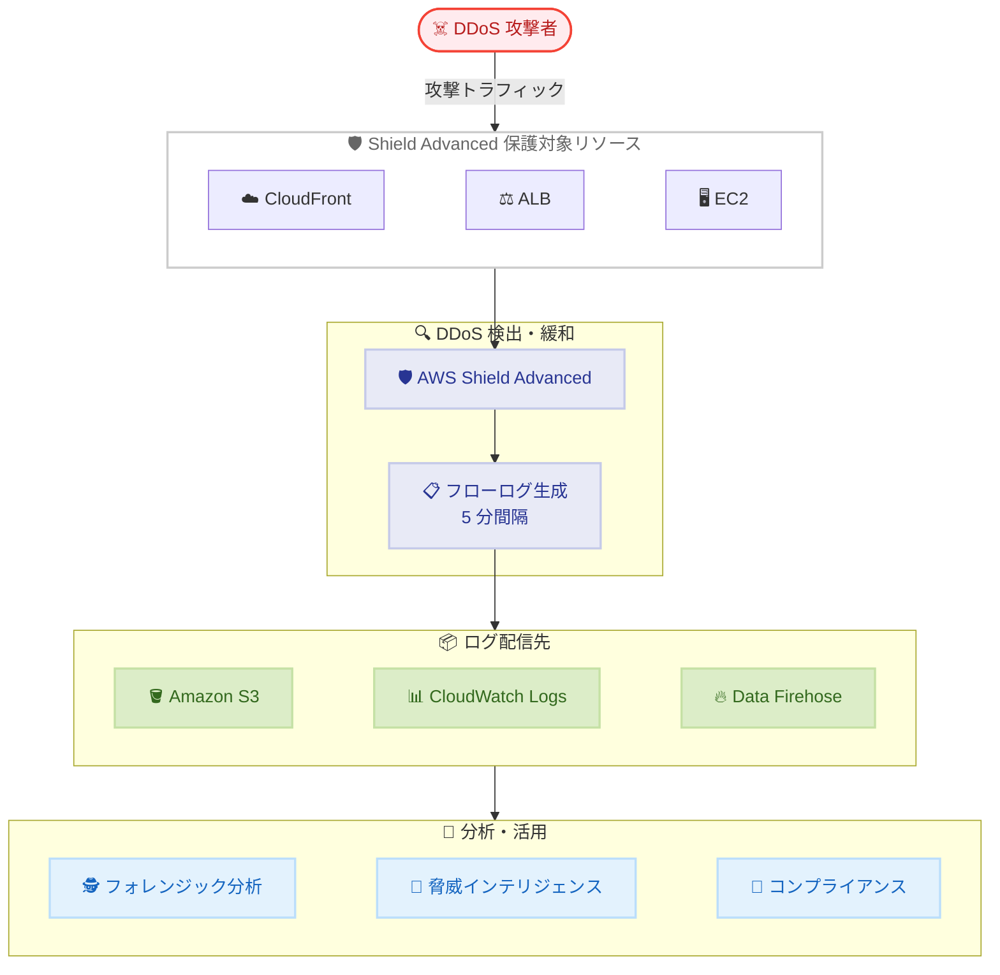

# AWS Shield Advanced - DDoS 攻撃フローログ

**リリース日**: 2026 年 5 月 29 日
**サービス**: AWS Shield Advanced
**機能**: DDoS 攻撃フローログ (DDoS Attack Flow Logs)

:bar_chart: [このアップデートのインフォグラフィックを見る](https://takech9203.github.io/aws-news-summary/20260529-aws-shield-ddos.html)

## 概要

AWS Shield Advanced に DDoS 攻撃フローログ機能が追加された。この機能により、DDoS 攻撃中に保護対象リソースへ到達するトラフィックのパケットレベルの詳細を記録し、フォレンジック分析やコンプライアンス目的で活用できるようになる。

フローログには送信元/宛先 IP アドレス、ポート番号、プロトコル、パケット数、バイト数、送信元国情報などが含まれ、攻撃の全容を把握するための重要なデータソースとなる。ログデータはアクティブな攻撃中に 5 分間隔で自動的に配信先へパブリッシュされる。

セキュリティチーム、SOC (Security Operations Center) アナリスト、コンプライアンス担当者にとって、攻撃後のインシデント調査、脅威インテリジェンスの収集、規制対応レポートの作成を大幅に効率化する機能である。

**アップデート前の課題**

- DDoS 攻撃中のパケットレベルの詳細情報を直接取得する手段がなかった
- フォレンジック分析には Shield Advanced コンソールのイベント概要情報や CloudWatch メトリクスに頼る必要があった
- コンプライアンス監査で攻撃トラフィックの詳細なエビデンスを提示することが困難だった

**アップデート後の改善**

- パケットレベルの詳細 (IP、ポート、プロトコル、国情報など) を自動的に記録可能になった
- Amazon S3、Amazon CloudWatch Logs、Amazon Data Firehose の 3 つの配信先を選択可能になった
- 攻撃中のデータが 5 分間隔で自動配信されるため、リアルタイムに近い分析が可能になった

## アーキテクチャ図



DDoS 攻撃が検出されると Shield Advanced がフローログを生成し、選択した配信先へ 5 分間隔で自動的にパブリッシュする。

## サービスアップデートの詳細

### 主要機能

1. **パケットレベルの可視性**
   - 送信元/宛先 IP アドレスの記録
   - ポート番号とプロトコル情報の記録
   - パケット数およびバイト数のカウント
   - 送信元国情報の付与

2. **柔軟な配信先選択**
   - Amazon S3: 長期保存やバッチ分析向け
   - Amazon CloudWatch Logs: リアルタイム監視やアラート連携向け
   - Amazon Data Firehose: ストリーミング分析や外部 SIEM 連携向け

3. **攻撃時限定の自動配信**
   - DDoS 攻撃がアクティブな場合のみログを生成
   - 5 分間隔で配信先へ自動パブリッシュ
   - 平常時はログが生成されないためコストを抑制

## 技術仕様

### フローログフィールド

| 項目 | 詳細 |
|------|------|
| 送信元 IP アドレス | 攻撃トラフィックの発信元 IP |
| 宛先 IP アドレス | 保護対象リソースの IP |
| 送信元ポート | トラフィックの送信元ポート番号 |
| 宛先ポート | トラフィックの宛先ポート番号 |
| プロトコル | 使用プロトコル (TCP、UDP、ICMP など) |
| パケット数 | 記録期間内のパケット総数 |
| バイト数 | 記録期間内のバイト総数 |
| 送信元国 | 送信元 IP のジオロケーション情報 |

### 配信間隔

| 項目 | 詳細 |
|------|------|
| 配信間隔 | 5 分 |
| 生成条件 | DDoS 攻撃がアクティブな場合のみ |
| 配信先数 | 1 つ以上選択可能 |

## 設定方法

### 前提条件

1. AWS Shield Advanced サブスクリプションが有効であること
2. 保護対象リソースが Shield Advanced で保護されていること
3. 配信先サービス (S3、CloudWatch Logs、Data Firehose) に対する適切な IAM 権限が設定されていること

### 手順

#### ステップ 1: 配信先の準備

```bash
# S3 バケットを配信先とする場合の例
aws s3 mb s3://my-shield-flow-logs-bucket --region us-east-1
```

フローログの保存先となる S3 バケットを作成する。CloudWatch Logs を使用する場合はロググループ、Data Firehose を使用する場合は配信ストリームを事前に作成する。

#### ステップ 2: フローログ配信の設定

```bash
# Shield Advanced コンソールまたは API でフローログ配信を有効化
# 保護対象リソースに対してログ配信先を指定
aws shield configure-attack-flow-logs \
  --resource-arn arn:aws:elasticloadbalancing:us-east-1:123456789012:loadbalancer/app/my-alb/1234567890 \
  --log-destination-configs "arn:aws:s3:::my-shield-flow-logs-bucket"
```

保護対象リソースの ARN と配信先を指定してフローログ配信を設定する。

#### ステップ 3: ログの確認

```bash
# S3 に配信されたログを確認
aws s3 ls s3://my-shield-flow-logs-bucket/ --recursive
```

攻撃が発生した際にログが正常に配信されていることを確認する。テスト目的では Shield Advanced コンソールのイベント履歴と照合する。

## メリット

### ビジネス面

- **コンプライアンス対応の強化**: 規制要件に対して DDoS 攻撃の詳細なエビデンスを提示可能
- **インシデント対応の迅速化**: 攻撃パターンを詳細に分析し、再発防止策の策定を効率化
- **保険・監査対応**: サイバー保険の請求や監査レポートに具体的なデータを提供可能

### 技術面

- **フォレンジック分析の高度化**: パケットレベルの詳細データにより攻撃手法の特定が容易
- **脅威インテリジェンスの充実**: 送信元国情報やパターン分析によりプロアクティブな防御に活用
- **既存ツールとの統合**: S3、CloudWatch Logs、Data Firehose 経由で既存の SIEM やアナリティクスツールと連携可能

## デメリット・制約事項

### 制限事項

- Shield Advanced サブスクリプション (月額 $3,000 + データ転送料) が必須
- ログは DDoS 攻撃がアクティブな場合のみ生成されるため、平常時のベースライン比較には使用不可
- 5 分間隔の配信のため、完全なリアルタイム分析には遅延が生じる

### 考慮すべき点

- 大規模な DDoS 攻撃時にはフローログのデータ量が膨大になる可能性があり、配信先のストレージコストに注意が必要
- 配信先の IAM ポリシーとリソースポリシーの適切な設定が必要

## ユースケース

### ユースケース 1: インシデント後のフォレンジック分析

**シナリオ**: 金融機関の Web アプリケーションが DDoS 攻撃を受けた後、セキュリティチームが攻撃の全容を調査する。

**実装例**:
```bash
# S3 に保存されたフローログを Athena で分析
# 攻撃の送信元国別トラフィック量を集計
SELECT source_country, COUNT(*) as packet_count, SUM(bytes) as total_bytes
FROM shield_flow_logs
WHERE attack_id = 'A-12345678'
GROUP BY source_country
ORDER BY total_bytes DESC;
```

**効果**: 攻撃の送信元国、使用プロトコル、攻撃パターンを特定し、WAF ルールの最適化や将来の防御戦略に活用できる。

### ユースケース 2: リアルタイム脅威インテリジェンス連携

**シナリオ**: SOC チームが DDoS 攻撃中にリアルタイムで脅威情報を SIEM に取り込み、攻撃の進行を監視する。

**実装例**:
```json
{
  "DeliveryStreamName": "shield-flow-logs-to-splunk",
  "S3DestinationConfiguration": {
    "BucketARN": "arn:aws:s3:::backup-shield-logs",
    "Prefix": "shield-flow-logs/"
  },
  "HttpEndpointDestinationConfiguration": {
    "EndpointConfiguration": {
      "Url": "https://http-inputs-your-splunk.splunkcloud.com:443"
    }
  }
}
```

**効果**: Data Firehose 経由で SIEM にストリーミング配信し、攻撃中のリアルタイム可視化と自動アラートを実現できる。

### ユースケース 3: コンプライアンスレポートの自動生成

**シナリオ**: PCI DSS や SOC 2 監査に備えて、DDoS 攻撃イベントの詳細記録を自動的に保存・レポート化する。

**実装例**:
```bash
# CloudWatch Logs Insights で攻撃サマリーレポートを生成
aws logs start-query \
  --log-group-name "/aws/shield/flow-logs" \
  --start-time $(date -d '30 days ago' +%s) \
  --end-time $(date +%s) \
  --query-string 'stats count(*) as attack_events, sum(bytes) as total_bytes by bin(1d) as day'
```

**効果**: 監査対応に必要な DDoS 攻撃の時系列記録とトラフィック詳細を自動的に蓄積し、レポート作成工数を削減できる。

## 料金

DDoS 攻撃フローログ自体の追加料金は発表時点で明示されていない。ただし、以下の費用が関連する。

### 関連コスト

| 項目 | 料金 |
|------|------|
| Shield Advanced サブスクリプション | $3,000/月 (1 年契約) |
| データ転送 (CloudFront 経由) | $0.025/GB |
| データ転送 (ALB/EC2 経由) | $0.050/GB |
| S3 ストレージ | 標準の S3 料金 |
| CloudWatch Logs 取り込み | 標準の CloudWatch Logs 料金 |
| Data Firehose 配信 | 標準の Data Firehose 料金 |

## 利用可能リージョン

AWS Shield Advanced が利用可能なすべてのリージョンで使用可能。Shield Advanced は以下を含む主要リージョンで提供されている。

- 米国東部 (バージニア北部、オハイオ)
- 米国西部 (オレゴン、北カリフォルニア)
- 欧州 (アイルランド、フランクフルト、ロンドン、パリ、ストックホルム、ミラノ)
- アジアパシフィック (東京、大阪、シンガポール、シドニー、ムンバイ、ソウル、香港)
- その他のグローバルリージョン

## 関連サービス・機能

- **AWS WAF**: Shield Advanced と連携してアプリケーション層の DDoS 攻撃を防御。フローログと WAF ログを組み合わせた包括的な分析が可能
- **Amazon CloudWatch**: Shield Advanced メトリクスと組み合わせて DDoS 攻撃の検出・緩和状況をモニタリング
- **AWS Firewall Manager**: 複数アカウントにまたがる Shield Advanced 保護の一元管理。フローログ設定の組織全体への展開に活用
- **Amazon Athena**: S3 に保存されたフローログの ad-hoc クエリ分析に最適
- **Amazon Data Firehose**: フローログのリアルタイムストリーミング配信。外部 SIEM やアナリティクスツールとの連携に使用

## 参考リンク

- :bar_chart: [インフォグラフィック](https://takech9203.github.io/aws-news-summary/20260529-aws-shield-ddos.html)
- [公式発表 (What's New)](https://aws.amazon.com/about-aws/whats-new/2026/05/aws-shield-ddos/)
- [ドキュメント - Shield Advanced イベントの可視性](https://docs.aws.amazon.com/waf/latest/developerguide/ddos-viewing-events.html)
- [料金ページ](https://aws.amazon.com/shield/pricing/)

## まとめ

AWS Shield Advanced の DDoS 攻撃フローログは、DDoS 攻撃に対する可視性をパケットレベルまで拡張する重要な機能強化である。フォレンジック分析、脅威インテリジェンス、コンプライアンス対応のすべてにおいて、これまで取得が困難だった詳細データを自動的に収集・配信できるようになった。Shield Advanced を利用している組織は、セキュリティ運用の高度化とコンプライアンス対応の効率化のために、速やかにフローログ配信の設定を検討することを推奨する。
