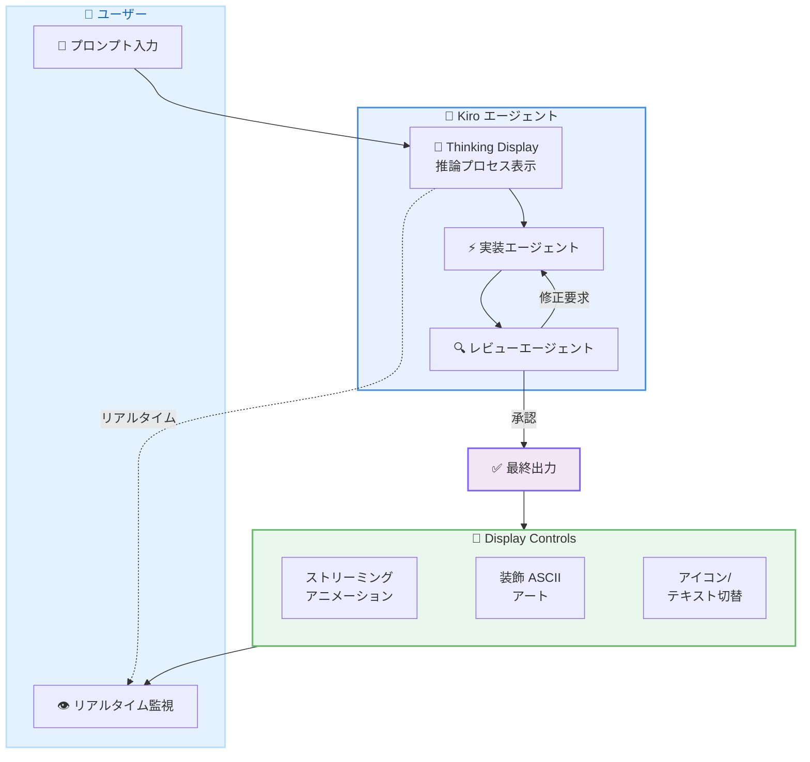

# Kiro - Thinking Display、Subagent Review Loops、Display Controls

**リリース日**: 2026 年 5 月 29 日
**サービス**: Kiro
**機能**: Thinking Display / Subagent Review Loops / Display Controls

[このアップデートのインフォグラフィックを見る](https://takech9203.github.io/aws-news-summary/20260529-kiro-changelog-2026-05-29.html)

## 概要

Kiro の最新リリースでは、エージェントの動作をより透明かつ自律的にする 3 つの主要機能が追加された。Thinking Display によりモデルの推論プロセスをリアルタイムでストリーミング表示できるようになり、Subagent Review Loops によりサブエージェントパイプラインが自身の作業をレビューして修正するセルフコレクティングワークフローが実現した。また、Display Controls により出力のレンダリング方法を細かく制御できるようになった。

加えて、メッセージおよびシェル出力のストリーミング中のレンダリングパフォーマンスが大幅に改善されている。

**アップデート前の課題**

- エージェントがどのような推論プロセスを経て回答に至ったか、ユーザーには見えなかった
- サブエージェントパイプラインの出力に品質の問題があっても、ユーザーに渡されるまで修正の機会がなかった
- ストリーミングアニメーションや装飾的な ASCII アート、アイコン表示などの制御ができず、アクセシビリティへの配慮が不十分だった
- ストリーミング中のメッセージおよびシェル出力のレンダリングが遅かった

**アップデート後の改善**

- Thinking Display によりモデルの推論をリアルタイムで追跡でき、誤った方向に進んだ場合に早期に発見可能になった
- Subagent Review Loops により、マルチエージェントパイプラインがセルフコレクティングワークフローとして機能し、品質の高い出力を自動的に保証できるようになった
- Display Controls により、ストリーミングアニメーション、装飾的 ASCII アート、アイコン表示をユーザーの好みやアクセシビリティ要件に合わせて制御可能になった
- ストリーミング中のレンダリングパフォーマンスが目に見えて向上した

## アーキテクチャ図



Subagent Review Loops の仕組みを示す図。実装エージェントの出力をレビューエージェントが検査し、基準を満たすまでループする構造になっている。

## サービスアップデートの詳細

### 主要機能

1. **Thinking Display**
   - モデルの推論プロセスをリアルタイムでストリーミング表示する機能
   - エージェントがどのようにして問題を分析し、アプローチを選択したかを可視化
   - ユーザーはモデルのロジックを追跡し、誤った方向に進んだ場合に早期に発見できる
   - デフォルトで有効化されており、`/settings` > `Display` > `Show thinking` から切り替え可能
   - 設定変更は次のチャットセッションから適用される

2. **Subagent Review Loops**
   - サブエージェントパイプラインが自身の作業をレビューし修正できる仕組み
   - レビューステージが実装者にタスクを差し戻し、品質基準を満たすまでループ
   - すべての修正が完了してからユーザーに結果を返す
   - コードレビューやリファクタリングなどのユースケースに最適
   - マルチエージェントパイプラインをセルフコレクティングワークフローに変換

3. **Display and Accessibility Settings**
   - `/settings display` コマンドで出力のレンダリング方法を制御
   - ストリーミングアニメーションのオン/オフ切り替え
   - 装飾的な ASCII アートの表示/非表示
   - アイコン表示とテキストのみの表示の切り替え
   - 変更は即座に反映され、再起動不要

4. **パフォーマンス改善**
   - メッセージのストリーミング中のレンダリング速度が大幅に向上
   - シェル出力のストリーミング表示も高速化
   - 長いコード生成やコマンド実行結果の表示がよりスムーズに

## 技術仕様

### 設定項目

| 項目 | 設定パス | デフォルト値 |
|------|----------|--------------|
| Thinking Display | `/settings` > `Display` > `Show thinking` | 有効 |
| ストリーミングアニメーション | `/settings display` | 有効 |
| 装飾 ASCII アート | `/settings display` | 有効 |
| アイコン表示 | `/settings display` | アイコン |

### Subagent Review Loops の動作

| フェーズ | 説明 |
|----------|------|
| 実装フェーズ | サブエージェントがタスクを実行し成果物を生成 |
| レビューフェーズ | レビューエージェントが成果物を検査し品質基準と照合 |
| 修正ループ | 基準未達の場合、実装エージェントに差し戻して修正を要求 |
| 完了 | 基準を満たした時点でユーザーに結果を返却 |

## 設定方法

### 前提条件

1. Kiro IDE または Kiro CLI がインストール済みであること
2. Kiro アカウントにサインイン済みであること

### 手順

#### ステップ 1: Thinking Display の設定

Kiro のチャットセッション内で以下を実行する。

```
/settings
```

`Display` セクションから `Show thinking` のトグルを切り替える。設定変更は次のチャットセッションから適用される。

#### ステップ 2: Display Controls の設定

```
/settings display
```

ストリーミングアニメーション、装飾 ASCII アート、アイコン/テキスト表示を個別に制御する。変更は即座に反映され、再起動は不要。

#### ステップ 3: Subagent Review Loops の活用

Subagent Review Loops はサブエージェントパイプラインの一部として自動的に動作する。コードレビューやリファクタリングなど品質保証が重要なタスクで、パイプラインがレビューと修正を自律的に繰り返す。

## メリット

### ビジネス面

- **開発効率の向上**: Subagent Review Loops により、ユーザーが手動でレビューして差し戻す工程が削減され、開発サイクルが短縮される
- **品質の向上**: セルフコレクティングワークフローにより、最終出力の品質が一貫して高くなる
- **チーム全体のアクセシビリティ**: Display Controls により、視覚的な好みやアクセシビリティ要件が異なるチームメンバー全員が快適に利用可能

### 技術面

- **デバッグの容易さ**: Thinking Display によりモデルの推論過程が可視化され、期待と異なる結果の原因特定が容易になる
- **自律的な品質保証**: Subagent Review Loops によりパイプライン内で品質チェックが自動化され、人間の介入なしに修正が行われる
- **レンダリング性能の改善**: ストリーミング中の表示がより高速になり、特に長い出力を伴うタスクでの体験が向上する
- **カスタマイズ性**: 装飾要素の制御により、帯域幅が制限された環境やスクリーンリーダーを使用する環境でも快適に動作する

## デメリット・制約事項

### 制限事項

- Thinking Display の設定変更は現在のセッションには適用されず、次のチャットセッションから有効になる
- Subagent Review Loops は無限ループを防ぐためのループ回数制限がある可能性がある (詳細はドキュメント参照)
- Review Loops によりタスク完了までの時間が長くなる場合がある (品質とのトレードオフ)

### 考慮すべき点

- Thinking Display を有効にすると、出力量が増加するため、トークン消費量が若干増える可能性がある
- Subagent Review Loops を使用するタスクでは、ループ回数に応じてクレジット消費が増加する可能性がある
- Display Controls のテキストのみモードでは、一部の視覚的なコンテキスト情報が失われる

## ユースケース

### ユースケース 1: コードレビューの自動化

**シナリオ**: 大規模なリファクタリングタスクをエージェントに依頼する際、コード品質を保証したい。

**効果**: Subagent Review Loops により、実装エージェントが生成したコードをレビューエージェントが自動的に検査し、コーディング規約違反やバグの可能性がある箇所を修正させる。ユーザーに返される最終結果は複数回のセルフレビューを経た高品質なコードとなる。

### ユースケース 2: エージェントの推論プロセスの教育的活用

**シナリオ**: チームの新しいメンバーが、エージェントがどのように複雑な設計判断を行っているかを理解したい。

**効果**: Thinking Display を有効にすることで、エージェントがどのような情報を参照し、どのような比較検討を経て特定のアーキテクチャパターンを選択したかがリアルタイムで可視化される。これにより、暗黙知の共有やベストプラクティスの理解促進に活用できる。

### ユースケース 3: アクセシビリティ対応環境での利用

**シナリオ**: スクリーンリーダーを使用している開発者が Kiro を効率的に利用したい。

**効果**: Display Controls でアイコンをテキストのみの表示に切り替え、装飾的 ASCII アートを非表示にすることで、スクリーンリーダーが読み上げる内容がクリーンになり、重要な情報に集中できる。ストリーミングアニメーションをオフにすることで、読み上げの中断も防止できる。

## 利用可能リージョン

グローバル (Kiro はグローバルサービスとして提供)

## 関連サービス・機能

- **Kiro Rewind Conversations**: 2026 年 5 月 20 日リリースの会話巻き戻し機能。Thinking Display と組み合わせて推論の分岐点を特定し、別のアプローチを探索可能
- **Kiro Effort Control**: モデルごとの推論労力設定。Thinking Display と併用することで、推論の深さとパフォーマンスのバランスを視覚的に確認可能
- **Claude Opus 4.8**: 同日に Kiro で利用可能になった最新モデル。Thinking Display により Opus 4.8 の高度な推論能力を直接観察できる

## 参考リンク

- [インフォグラフィック](https://takech9203.github.io/aws-news-summary/20260529-kiro-changelog-2026-05-29.html)
- [Kiro Changelog](https://kiro.dev/changelog/)
- [Kiro ドキュメント](https://kiro.dev/docs/)
- [Kiro ダウンロード](https://kiro.dev/downloads/)

## まとめ

今回のリリースは、Kiro のエージェント動作の透明性と自律性を大幅に向上させるアップデートである。Thinking Display により「なぜその判断をしたか」が可視化され、Subagent Review Loops により品質保証が自動化された。開発者は Display Controls でアクセシビリティ要件に合わせた表示カスタマイズが可能になり、パフォーマンス改善によりストリーミング体験も向上している。特に Subagent Review Loops は、コードレビューやリファクタリングの自動化において、エージェント駆動開発の品質を次のレベルに引き上げる重要な機能である。
