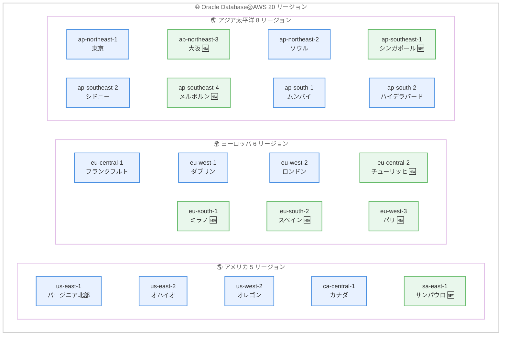

# Oracle Database@AWS - 20 リージョンへの拡大

**リリース日**: 2026 年 5 月 29 日
**サービス**: Oracle Database@AWS
**機能**: 8 つの新規リージョンでの一般提供開始 (合計 20 リージョン)

📊 [このアップデートのインフォグラフィックを見る](https://takech9203.github.io/aws-news-summary/20260529-oracle-database-aws-available-twenty-regions.html)

## 概要

Oracle Database@AWS が新たに 8 つの AWS リージョンで一般提供を開始し、利用可能なリージョンが合計 20 に拡大された。Oracle Database@AWS は、AWS データセンター内に物理的に配置された OCI マネージド Oracle Exadata システムへのアクセスを提供するサービスであり、Oracle データベースワークロードを AWS 環境内でシームレスに運用できる。

今回の拡大により、ヨーロッパ、アジア太平洋、南米の各地域でデータレジデンシー要件を満たしながら、オンプレミスの Oracle Exadata および Oracle Real Application Clusters (RAC) アプリケーションを AWS に移行することが可能になった。特に大阪リージョン (ap-northeast-3) が追加されたことで、日本国内での東京リージョンとのマルチリージョン構成が実現可能になった点は注目に値する。

**アップデート前の課題**

- Oracle Database@AWS は 2025 年 7 月の GA 時点で米国東部 (バージニア北部) と米国西部 (オレゴン) の 2 リージョンのみで提供されていた
- その後段階的にリージョンが追加されたが、ヨーロッパ南部やアジア太平洋の一部リージョンでは利用できなかった
- 日本では東京リージョンのみの提供であり、DR 構成のために別の方法を検討する必要があった
- データレジデンシー要件が厳しい地域のユーザーは、Oracle Database@AWS を活用できなかった

**アップデート後の改善**

- 20 リージョンでの利用が可能になり、グローバルなワークロード配置の柔軟性が大幅に向上
- 大阪リージョンの追加により、日本国内での東京-大阪マルチリージョン DR 構成が可能に
- EU 南部 (ミラノ、スペイン)、パリ、チューリッヒでの利用開始により、GDPR 等のデータレジデンシー要件への対応が容易に
- シンガポール、メルボルン、サンパウロの追加で、東南アジア、オセアニア、南米のカバレッジが拡大

## アーキテクチャ図



Oracle Database@AWS の全 20 リージョンの分布図。🆕 マークが今回新たに追加された 8 リージョンを示している。

## サービスアップデートの詳細

### 主要機能

1. **新規 8 リージョンでの一般提供**
   - EU-Central-2 (チューリッヒ)、EU-South-1 (ミラノ)、EU-South-2 (スペイン)、EU-West-3 (パリ)
   - AP-Northeast-3 (大阪)、AP-Southeast-1 (シンガポール)、AP-Southeast-4 (メルボルン)
   - SA-East-1 (サンパウロ)
   - 各リージョンで Oracle Exadata Database Service および Oracle Autonomous Database が利用可能

2. **既存機能の全リージョン対応**
   - Amazon Redshift との Zero-ETL 統合
   - Amazon S3 へのバックアップ (最大 11 ナインの耐久性)
   - Amazon VPC Lattice によるネットワーク接続
   - AWS IAM、Amazon EventBridge、AWS CloudFormation、Amazon CloudWatch との統合

3. **マルチリージョン DR 構成の実現**
   - 東京-大阪間での Oracle Data Guard 構成が可能に
   - 欧州内での複数リージョンを活用した可用性向上
   - 各リージョンの Availability Zone 内に物理配置

## 技術仕様

### サポート構成

| 項目 | 詳細 |
|------|------|
| システムモデル | Exadata.X11M |
| データベースサーバー | デフォルト 2 台、最大 32 台 |
| ストレージサーバー | デフォルト 3 台、最大 64 台 |
| ストレージ容量 | ストレージサーバーあたり 80 TB |
| サポート DB バージョン | Oracle Database 19c、Oracle Database 23ai |
| SCAN リスナーポート | デフォルト 1521 (カスタム: 1024-8999) |
| VM クラスター作成時間 | 最大 6 時間 (サイズに依存) |

### AWS サービス統合

| AWS サービス | 統合内容 |
|------|------|
| Amazon VPC Lattice | S3、Redshift 等への接続パス提供 |
| AWS IAM | 認証・認可 |
| Amazon EventBridge | データベースライフサイクルイベントの監視 |
| AWS CloudFormation | インフラの自動化 |
| Amazon CloudWatch | メトリクス収集・監視 (namespace: `AWS/ODB`) |
| AWS CloudTrail | API 操作のログ記録 |
| Amazon S3 | バックアップ |
| Amazon Redshift | Zero-ETL 分析 |

### デプロイオプション

| オプション | 説明 |
|------|------|
| Exadata VM Cluster | Oracle Enterprise Edition のフルインストール |
| Autonomous VM Cluster | AI/ML による完全マネージドデータベース |

## 設定方法

### 前提条件

1. AWS アカウントおよび OCI アカウント
2. AWS Marketplace を通じた Oracle からのプライベートオファーの有効化
3. 適切な IAM 権限の設定

### 手順

#### ステップ 1: プライベートオファーのリクエスト

AWS Marketplace を通じて Oracle にプライベートオファーをリクエストする。AWS と Oracle の営業チームがリクエストを受け取り、アカウントのアクティベーションを行う。

#### ステップ 2: ODB ネットワークの作成

```bash
# AWS CLI を使用した ODB ネットワークの作成例
aws odb create-odb-network \
  --display-name "my-odb-network" \
  --availability-zone "ap-northeast-3a" \
  --client-subnet-cidr "10.0.0.0/24" \
  --backup-subnet-cidr "10.0.1.0/24" \
  --domain-name-prefix "myodb"
```

ODB ネットワークは AWS データセンター内の OCI インフラをホストするプライベート分離ネットワークとして機能する。Availability Zone、CIDR レンジ、ドメイン名プレフィックスを指定する。

#### ステップ 3: Exadata インフラストラクチャの作成

AWS マネジメントコンソールのダッシュボードから Exadata インフラストラクチャを作成する。データベースサーバー数、ストレージサーバー数を指定し、必要なコンピュートおよびストレージリソースを構成する。

#### ステップ 4: VM クラスターの作成と ODB ピアリングの設定

VM クラスターを作成し、ODB ピアリングを設定して EC2 アプリケーションサーバーが稼働する VPC との接続を確立する。VPC ルートテーブルにクライアント接続 CIDR を追加する。

#### ステップ 5: データベースの作成

OCI コンソールを使用して Oracle データベースを作成・管理する。Oracle Database 19c または 23ai を選択し、必要なデータベースパラメータを設定する。

## メリット

### ビジネス面

- **データレジデンシー要件への対応**: 20 リージョンのカバレッジにより、各国・地域の規制に準拠したデータ配置が可能
- **AWS Marketplace 統合**: 単一請求書による支払い、AWS の支出コミットメントへの計上が可能
- **移行コスト削減**: オンプレミス Oracle Exadata からの移行において、アプリケーション変更を最小限に抑制

### 技術面

- **低レイテンシー接続**: AWS データセンター内に物理配置されるため、EC2 インスタンスとの間で高速・低レイテンシーの通信が可能
- **AWS ネイティブ統合**: CloudWatch、CloudTrail、EventBridge 等の AWS サービスとシームレスに連携
- **Zero-ETL 分析**: Amazon Redshift との Zero-ETL 統合により、データパイプライン構築不要でリアルタイム分析が可能

## デメリット・制約事項

### 制限事項

- データベースの作成・管理は OCI コンソールで行う必要があり、AWS コンソールのみでは完結しない
- Exadata インフラストラクチャは作成後に AWS コンソールから変更不可 (OCI コンソールを使用)
- VM クラスターの作成に最大 6 時間を要する場合がある
- AWS Marketplace のプライベートオファーを通じた契約が必須であり、即座に利用開始できない

### 考慮すべき点

- 料金は Oracle が設定するため、AWS の標準的な従量課金モデルとは異なる
- OCI と AWS の両方のコンソールを使い分ける運用スキルが必要
- Oracle ライセンスの管理 (BYOL またはライセンス込み) を適切に計画する必要がある

## ユースケース

### ユースケース 1: 日本国内マルチリージョン DR 構成

**シナリオ**: 基幹系 Oracle データベースを AWS 上で運用しており、東京リージョンの障害に備えた DR 環境を国内で構築したい企業。

**実装例**:
```
プライマリ: ap-northeast-1 (東京) - Oracle Database@AWS + Exadata VM Cluster
スタンバイ: ap-northeast-3 (大阪) - Oracle Database@AWS + Oracle Data Guard
アプリ層:  EC2 + Route 53 フェイルオーバー
```

**効果**: 日本国内のデータレジデンシー要件を満たしつつ、リージョン障害に対する事業継続性を確保。RTO/RPO を最小化した DR 構成を実現。

### ユースケース 2: 欧州データレジデンシー準拠の分析基盤

**シナリオ**: 欧州の GDPR 要件に準拠しながら、Oracle データベースのデータを Amazon Redshift で分析したい企業。

**実装例**:
```
データベース: eu-central-2 (チューリッヒ) - Oracle Database@AWS
分析基盤:   eu-central-2 (チューリッヒ) - Amazon Redshift (Zero-ETL 統合)
可視化:     Amazon QuickSight
```

**効果**: データが EU 域内から移動することなく、Zero-ETL 統合によりパイプライン構築不要でリアルタイム分析を実現。

### ユースケース 3: グローバル展開アプリケーションの Oracle DB 移行

**シナリオ**: オンプレミスの Oracle RAC 環境をグローバルに展開しており、各地域のユーザーに低レイテンシーでサービスを提供したい企業。

**実装例**:
```
北米:      us-east-1 (バージニア北部)  - Oracle Database@AWS
欧州:      eu-west-1 (ダブリン)        - Oracle Database@AWS
アジア:    ap-northeast-1 (東京)      - Oracle Database@AWS
南米:      sa-east-1 (サンパウロ)     - Oracle Database@AWS
フロント:  Amazon CloudFront + ALB + EC2
```

**効果**: アプリケーション変更を最小限に抑えながら、各リージョンのユーザーに対して低レイテンシーの Oracle データベースアクセスを提供。20 リージョンの選択肢により最適な配置が可能。

## 料金

Oracle Database@AWS の料金は Oracle が設定し、AWS Marketplace のプライベートオファーを通じて提供される。

### 料金モデル

| 項目 | 詳細 |
|------|------|
| 課金方式 | Oracle が設定するプライベートオファー |
| 支払い | AWS Marketplace 経由の単一請求書 |
| ライセンスオプション | BYOL (既存ライセンス持ち込み) またはライセンス込み |
| AWS コミットメント | AWS 支出コミットメント (EDP 等) への計上可能 |
| サポート | Oracle Support Rewards プログラム利用可能 |

具体的な料金は Oracle の営業チームに確認が必要。

## 利用可能リージョン

以下の 20 リージョンで利用可能。

| 地域 | リージョン | ロケーション |
|------|-----------|------------|
| 北米 | us-east-1 | バージニア北部 |
| 北米 | us-east-2 | オハイオ |
| 北米 | us-west-2 | オレゴン |
| 北米 | ca-central-1 | カナダ中部 |
| 南米 | sa-east-1 | サンパウロ 🆕 |
| 欧州 | eu-central-1 | フランクフルト |
| 欧州 | eu-central-2 | チューリッヒ 🆕 |
| 欧州 | eu-west-1 | ダブリン |
| 欧州 | eu-west-2 | ロンドン |
| 欧州 | eu-west-3 | パリ 🆕 |
| 欧州 | eu-south-1 | ミラノ 🆕 |
| 欧州 | eu-south-2 | スペイン 🆕 |
| アジア太平洋 | ap-northeast-1 | 東京 |
| アジア太平洋 | ap-northeast-2 | ソウル |
| アジア太平洋 | ap-northeast-3 | 大阪 🆕 |
| アジア太平洋 | ap-southeast-1 | シンガポール 🆕 |
| アジア太平洋 | ap-southeast-2 | シドニー |
| アジア太平洋 | ap-southeast-4 | メルボルン 🆕 |
| アジア太平洋 | ap-south-1 | ムンバイ |
| アジア太平洋 | ap-south-2 | ハイデラバード |

## 関連サービス・機能

- **Amazon Redshift**: Zero-ETL 統合による Oracle データベースからのリアルタイム分析
- **Amazon S3**: Oracle データベースのバックアップ先として利用、最大 11 ナインの耐久性
- **Amazon VPC Lattice**: ODB ネットワークと AWS サービス間の接続パス提供
- **AWS CloudFormation**: Oracle Database@AWS インフラのコード化・自動化
- **Amazon EventBridge**: データベースライフサイクルイベントのモニタリングと自動化

## 参考リンク

- 📊 [インフォグラフィック](https://takech9203.github.io/aws-news-summary/20260529-oracle-database-aws-available-twenty-regions.html)
- [公式発表 (What's New)](https://aws.amazon.com/about-aws/whats-new/2026/05/oracle-database-aws-available-twenty-regions/)
- [AWS Blog - Introducing Oracle Database@AWS](https://aws.amazon.com/blogs/aws/introducing-oracle-databaseaws-for-simplified-oracle-exadata-migrations-to-the-aws-cloud/)

## まとめ

Oracle Database@AWS の 20 リージョンへの拡大により、グローバル企業が Oracle ワークロードを AWS 上で運用する際の地理的制約が大幅に緩和された。特に日本のユーザーにとっては、大阪リージョンの追加により東京-大阪間のマルチリージョン DR 構成が可能になった点が大きな進展である。オンプレミス Oracle Exadata 環境からの移行を検討している企業は、データレジデンシー要件と AWS ネイティブサービスとの統合メリットを考慮し、Oracle Database@AWS の導入評価を開始することを推奨する。
