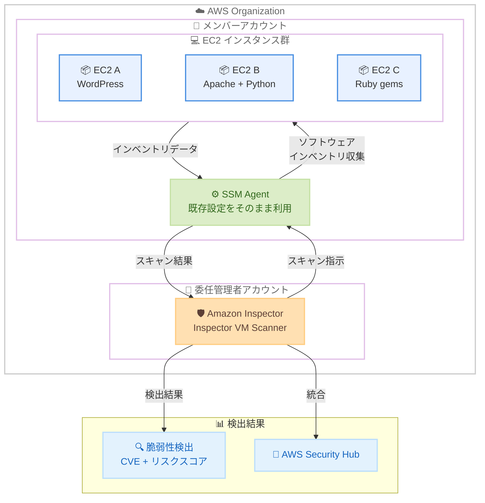

# Amazon Inspector - EC2 エージェントベーススキャンの改善 (Inspector VM Scanner)

**リリース日**: 2026 年 5 月 31 日
**サービス**: Amazon Inspector
**機能**: Inspector VM Scanner (エージェントベース EC2 スキャンの新スキャンエンジン)

[このアップデートのインフォグラフィックを見る](https://takech9203.github.io/aws-news-summary/20260531-amazon-inspector-ec2-agent-scanning-improvements.html)

## 概要

Amazon Inspector が EC2 インスタンス向けのエージェントベーススキャンを大幅に改善する新スキャンエンジン「Inspector VM Scanner」をリリースした。このアップデートにより、検出カバレッジの拡大と CPU 使用率の削減を同時に実現し、本番ワークロードへの影響を最小限に抑えながらより広範な脆弱性検出が可能になる。

Inspector VM Scanner は従来のエージェントベーススキャンエンジンを完全に置き換えるモダンアーキテクチャで、WordPress、Apache HTTP Server、Python パッケージ、Ruby gems など、より広範なソフトウェアエコシステムの脆弱性を検出できる。これにより、エージェントベーススキャンとエージェントレススキャンの検出カバレッジが同等になり、どちらのスキャン方式を使用しても一貫した脆弱性検出結果が得られるようになった。

**アップデート前の課題**

- エージェントベーススキャンはエージェントレススキャンと比較して検出カバレッジが限定的で、一部のソフトウェアエコシステムの脆弱性を検出できなかった
- スキャン実行時の CPU 使用率が高く、本番ワークロードへのパフォーマンス影響が懸念されていた
- エージェントベースとエージェントレスで検出結果に差異が生じ、スキャン方式の選択が脆弱性管理に影響を与えていた

**アップデート後の改善**

- WordPress、Apache HTTP Server、Python パッケージ、Ruby gems などの脆弱性検出が可能になり、エージェントレススキャンと同等のカバレッジを実現
- モダンアーキテクチャによりスキャン時の CPU 使用率が削減され、本番ワークロードへの影響が最小化
- スキャン方式に関係なく一貫した脆弱性検出結果が得られるようになった

## アーキテクチャ図



Inspector VM Scanner は既存の SSM Agent を活用して EC2 インスタンスのソフトウェアインベントリを収集し、拡張されたエコシステム検出エンジンで脆弱性を評価する。委任管理者アカウントから組織全体への一括有効化が可能。

## サービスアップデートの詳細

### 主要機能

1. **Inspector VM Scanner - 新スキャンエンジン**
   - 従来のエージェントベーススキャンエンジンを完全に置き換えるモダンアーキテクチャ
   - パフォーマンスに最適化された設計
   - 追加のエージェントインストールは不要

2. **拡張エコシステム検出**
   - WordPress の脆弱性検出
   - Apache HTTP Server の脆弱性検出
   - Python パッケージの脆弱性検出
   - Ruby gems の脆弱性検出
   - エージェントレススキャンと同等のカバレッジを実現

3. **CPU 使用率の削減**
   - スキャン中の CPU 消費が大幅に削減
   - 本番ワークロードへの影響を最小化
   - リソース効率の向上

## 技術仕様

### スキャン方式の比較

| 項目 | エージェントベース (Inspector VM Scanner) | エージェントレス |
|------|------------------------------------------|------------------|
| 前提条件 | SSM Agent が必要 | SSM Agent 不要 |
| スキャン方式 | SSM Agent 経由でインベントリ収集 | EBS スナップショットから分析 |
| 検出カバレッジ | WordPress, Apache, Python, Ruby gems 等 | WordPress, Apache, Python, Ruby gems 等 |
| CPU 影響 | 削減済み (Inspector VM Scanner) | なし (スナップショットベース) |
| リアルタイム性 | 高い (継続的スキャン) | やや低い (スナップショット取得間隔) |
| 月額料金 | $1.258/インスタンス | $1.75/インスタンス + EBS スナップショット費用 |

### 対応ソフトウェアエコシステム

| カテゴリ | 対応ソフトウェア |
|----------|------------------|
| CMS | WordPress |
| Web サーバー | Apache HTTP Server |
| プログラミング言語パッケージ | Python パッケージ |
| プログラミング言語パッケージ | Ruby gems |
| OS パッケージ | 従来通り対応 (Amazon Linux, Ubuntu, RHEL 等) |

### 有効化に必要な条件

| 項目 | 要件 |
|------|------|
| IAM インスタンスプロファイル | 追加のロール不要 |
| SSM Agent | 既存の設定がそのまま動作 |
| Inspector の有効化 | EC2 スキャンが有効であること |
| オプトイン | Inspector コンソールまたは API で明示的に有効化 |

## 設定方法

### 前提条件

1. Amazon Inspector が有効化されていること
2. EC2 インスタンスに SSM Agent がインストール・設定されていること
3. EC2 スキャンが有効化されていること

### 手順

#### ステップ 1: コンソールから Inspector VM Scanner を有効化

Amazon Inspector コンソールにアクセスし、EC2 スキャン設定から Inspector VM Scanner へのオプトインを実行する。

#### ステップ 2: AWS CLI で有効化する場合

```bash
# Inspector VM Scanner を有効化 (スタンドアロンアカウント)
aws inspector2 update-configuration \
  --ec2-configuration '{"scanMode": "EC2_SSM_AGENT_BASED"}'
```

Inspector の設定を更新して新しい VM Scanner を有効化する。

#### ステップ 3: AWS Organizations 全体で有効化する場合

```bash
# 委任管理者アカウントから組織全体に適用
aws inspector2 update-org-ec2-deep-inspection-configuration \
  --org-package-paths '["/"}'
```

委任管理者アカウントから Organizations 全体に Inspector VM Scanner を一括で有効化する。個別のメンバーアカウントでの操作は不要。

#### ステップ 3: 有効化の確認

```bash
# 現在のスキャン設定を確認
aws inspector2 get-configuration
```

Inspector VM Scanner が正常に有効化されていることを確認する。

## メリット

### ビジネス面

- **セキュリティカバレッジの向上**: これまでエージェントレスでしか検出できなかった脆弱性がエージェントベースでも検出可能になり、セキュリティ体制が強化される
- **運用コストの削減**: スキャンによる CPU 使用率が低下することで、スキャン実行のためにインスタンスサイズを余分に確保する必要がなくなる
- **一貫したセキュリティポスチャ**: スキャン方式の違いによる検出漏れがなくなり、コンプライアンス要件への対応が容易になる

### 技術面

- **ゼロ変更での移行**: 既存の SSM Agent 設定がそのまま動作し、追加の IAM ロールも不要なため、移行の技術的リスクが極めて低い
- **パフォーマンス改善**: モダンアーキテクチャにより CPU 使用率が削減され、本番環境での安定性が向上
- **検出精度の統一**: エージェントベースとエージェントレスの検出結果が同等になり、セキュリティ評価の一貫性が確保される

## デメリット・制約事項

### 制限事項

- オプトインが必要で、自動的には有効化されない
- SSM Agent が正常に動作していることが引き続き前提条件
- 従来のスキャンエンジンからの移行はオプトイン後に自動的に行われるため、ロールバックの可否について確認が必要

### 考慮すべき点

- オプトイン直後はベースラインスキャンが実行されるため、一時的に検出結果が増加する可能性がある
- 拡張されたエコシステム検出により、これまで見つかっていなかった脆弱性が新たに報告される可能性がある (セキュリティチームの対応負荷が一時的に増加)
- 組織全体で有効化する場合、全メンバーアカウントへの影響を事前に検証することを推奨

## ユースケース

### ユースケース 1: WordPress ホスティング環境のセキュリティ強化

**シナリオ**: 複数の WordPress サイトを EC2 上でホスティングしている企業が、WordPress コア・プラグイン・テーマの脆弱性を継続的に監視したい。

**実装例**:
```bash
# Inspector VM Scanner を有効化
aws inspector2 update-configuration \
  --ec2-configuration '{"scanMode": "EC2_SSM_AGENT_BASED"}'

# WordPress が稼働する EC2 のスキャン結果を確認
aws inspector2 list-findings \
  --filter-criteria '{"resourceType": [{"comparison": "EQUALS", "value": "AWS_EC2_INSTANCE"}]}'
```

**効果**: WordPress プラグインの既知の脆弱性を自動的に検出し、パッチ適用の優先順位付けが可能になる。エージェントベースのため継続的な監視が実現。

### ユースケース 2: Python/Ruby アプリケーションの脆弱性管理

**シナリオ**: EC2 上で Python Django アプリケーションと Ruby on Rails アプリケーションを運用しており、依存パッケージの脆弱性を検出したい。

**実装例**:
```bash
# 組織全体で Inspector VM Scanner を有効化
aws inspector2 update-org-ec2-deep-inspection-configuration \
  --org-package-paths '["/"]'

# Python パッケージに関する検出結果をフィルタリング
aws inspector2 list-findings \
  --filter-criteria '{"title": [{"comparison": "PREFIX", "value": "CVE"}], "resourceType": [{"comparison": "EQUALS", "value": "AWS_EC2_INSTANCE"}]}'
```

**効果**: pip や gem でインストールされたパッケージの脆弱性を自動検出し、アプリケーションレイヤーのセキュリティリスクを可視化できる。

### ユースケース 3: エージェントレスからエージェントベースへの移行による最適化

**シナリオ**: 現在エージェントレススキャンを利用しているが、SSM Agent が既にデプロイされている環境で、コスト削減とリアルタイム性向上を図りたい。

**実装例**:
```bash
# 現在のスキャン設定を確認
aws inspector2 get-configuration

# Inspector VM Scanner を有効化 (エージェントベースに切り替え)
aws inspector2 update-configuration \
  --ec2-configuration '{"scanMode": "EC2_SSM_AGENT_BASED"}'
```

**効果**: エージェントレス ($1.75/インスタンス + EBS スナップショット費用) からエージェントベース ($1.258/インスタンス) への移行により、Inspector VM Scanner の拡張カバレッジにより検出精度を維持しながらコストを約 28% 削減できる。

## 料金

Inspector VM Scanner は追加料金なしで利用可能。既存の Amazon Inspector エージェントベース EC2 スキャンの料金が適用される。

### 料金例

| 構成 | 月額料金 (概算) |
|------|------------------|
| 10 インスタンス (常時稼働) | $12.58 |
| 50 インスタンス (常時稼働) | $62.90 |
| 100 インスタンス (常時稼働) | $125.80 |
| 10 インスタンス (月 15 日稼働、平均 5 インスタンス) | $6.29 |

※ 料金は US East (N. Virginia) リージョンの参考価格。15 日間の無料トライアルあり。

## 利用可能リージョン

Amazon Inspector が利用可能なすべての AWS リージョンで提供。追加費用なし。

主要なリージョン:
- 米国: us-east-1, us-east-2, us-west-1, us-west-2
- 欧州: eu-west-1, eu-west-2, eu-central-1 等
- アジア太平洋: ap-northeast-1 (東京), ap-northeast-3 (大阪), ap-southeast-1, ap-southeast-2 等

## 関連サービス・機能

- **AWS Systems Manager (SSM Agent)**: Inspector VM Scanner がインベントリ収集に使用する基盤。既存の SSM Agent 設定がそのまま利用可能
- **AWS Security Hub**: Inspector の検出結果を集約し、セキュリティポスチャの一元管理を実現
- **Amazon Inspector エージェントレススキャン**: Inspector VM Scanner により、エージェントベースと同等のカバレッジが実現。用途に応じて使い分けが可能
- **AWS Organizations**: 委任管理者から組織全体への一括有効化をサポート
- **Amazon EventBridge**: Inspector の検出結果をトリガーとした自動修復ワークフローの構築に活用

## 参考リンク

- [インフォグラフィック](https://takech9203.github.io/aws-news-summary/20260531-amazon-inspector-ec2-agent-scanning-improvements.html)
- [公式発表 (What's New)](https://aws.amazon.com/about-aws/whats-new/2026/05/amazon-inspector-ec2-agent-scanning-improvements)
- [Amazon Inspector ドキュメント](https://docs.aws.amazon.com/inspector/latest/user/what-is-inspector.html)
- [Amazon Inspector 料金ページ](https://aws.amazon.com/inspector/pricing/)
- [Amazon Inspector よくある質問](https://aws.amazon.com/inspector/faqs/)

## まとめ

Amazon Inspector の Inspector VM Scanner は、エージェントベース EC2 スキャンのカバレッジとパフォーマンスを大幅に改善する重要なアップデートである。既存の SSM Agent 設定を変更することなくオプトインするだけで、WordPress や Python パッケージなどの脆弱性検出が可能になり、同時に CPU 使用率も削減される。EC2 上でアプリケーションを運用するすべてのチームに対して、早期のオプトインを推奨する。
