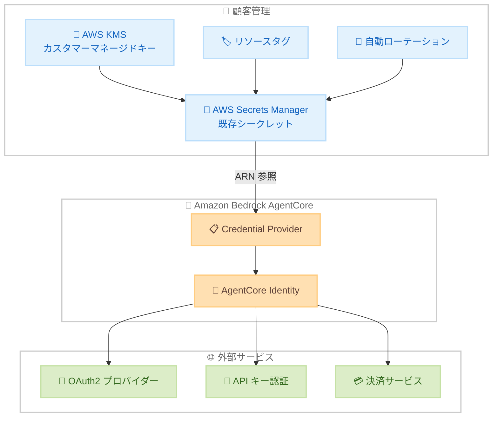

# Amazon Bedrock AgentCore Identity - Bring Your Own Secrets 対応

**リリース日**: 2026 年 6 月 1 日
**サービス**: Amazon Bedrock AgentCore Identity
**機能**: AWS Secrets Manager の既存シークレット ARN 参照による Credential Provider 構成

📊 [このアップデートのインフォグラフィックを見る](https://takech9203.github.io/aws-news-summary/20260601-agentcore-identity-secrets-manager.html)

## 概要

Amazon Bedrock AgentCore Identity の Credential Provider で、AWS Secrets Manager の既存シークレット ARN を直接参照できるようになった。これにより、組織固有のガバナンスポリシーに基づいてシークレットを完全に管理した上で、AgentCore Identity と連携できる。

**アップデート前の課題**

- AgentCore Identity がサービスマネージドシークレットとしてシークレットを自動作成・管理していたため、作成時にリソースタグを付与できなかった
- カスタマーマネージドキー (CMK) によるシークレットの暗号化ができなかった
- 組織固有のガバナンスコントロール (リソースポリシー、自動ローテーション設定など) をシークレット作成時に適用できなかった
- 厳格なコンプライアンス要件を持つチームにとって、サービスマネージドアプローチが障壁となっていた

**アップデート後の改善**

- AWS Secrets Manager で自社のガバナンスポリシーに従ってシークレットを作成・管理し、その ARN を AgentCore Identity の Credential Provider で参照可能になった
- CMK による暗号化、タグ付け戦略、自動ローテーション、リソースポリシーを自由に設定可能になった
- シークレットの作成・分類・管理に対する完全なオーナーシップを顧客が保持できるようになった

## アーキテクチャ図



顧客が AWS Secrets Manager で管理するシークレットを AgentCore Identity の Credential Provider から ARN で参照し、外部サービスへの認証に使用するフローを示している。

## サービスアップデートの詳細

### 主要機能

1. **既存シークレット ARN の直接参照**
   - Credential Provider 構成時に `secretId` パラメータで既存の Secrets Manager シークレット ARN を指定可能
   - `apiKeySecretSource` または `clientSecretSource` を `EXTERNAL` に設定することで外部シークレット参照モードを有効化
   - JSON キーの指定により、1 つのシークレット内の特定のフィールドを参照可能

2. **対応する Credential Provider タイプ**
   - API キー Credential Provider: API キーシークレットの外部参照
   - OAuth2 Credential Provider: クライアントシークレットの外部参照 (Google、GitHub、Slack、Salesforce、Microsoft、Atlassian、LinkedIn 等に対応)
   - Payment Credential Provider: 決済関連シークレットの外部参照 (Coinbase CDP、Stripe Privy)

3. **シークレットソースの選択制**
   - `MANAGED`: 従来のサービスマネージドシークレット (引き続き利用可能)
   - `EXTERNAL`: 顧客管理の既存シークレットを ARN で参照

## 技術仕様

### API パラメータ

| 項目 | 詳細 |
|------|------|
| 新規パラメータ | `apiKeySecretConfig` / `clientSecretConfig` |
| 設定値 | `secretId` (シークレット ARN)、`jsonKey` (JSON キー名) |
| ソース選択 | `apiKeySecretSource` / `clientSecretSource`: `MANAGED` or `EXTERNAL` |
| レスポンス | `apiKeySecretArn` / `clientSecretArn` にシークレット ARN を返却 |

### API 変更履歴

| 日付 | サービス | 変更内容 |
|------|----------|----------|
| 2026/05/29 | [Amazon Bedrock AgentCore Control](https://awsapichanges.com/archive/changes/96246a-bedrock-agentcore-control.html) | 9 updated api methods - Credential Provider で外部シークレット参照をサポート |

### 更新された API メソッド

| メソッド名 | 変更内容 |
|-----------|----------|
| CreateApiKeyCredentialProvider | `apiKeySecretConfig`、`apiKeySecretSource` パラメータ追加 |
| CreateOauth2CredentialProvider | 各 OAuth2 プロバイダー設定に `clientSecretConfig`、`clientSecretSource` 追加 |
| CreatePaymentCredentialProvider | 各決済プロバイダー設定にシークレット設定パラメータ追加 |
| UpdateApiKeyCredentialProvider | 外部シークレット参照への変更をサポート |
| UpdateOauth2CredentialProvider | 外部シークレット参照への変更をサポート |
| GetApiKeyCredentialProvider | レスポンスにシークレットソース情報を追加 |
| GetOauth2CredentialProvider | レスポンスにシークレットソース情報を追加 |
| GetPaymentCredentialProvider | レスポンスにシークレットソース情報を追加 |

### IAM ポリシー設定例

```json
{
  "Version": "2012-10-17",
  "Statement": [
    {
      "Effect": "Allow",
      "Action": [
        "secretsmanager:GetSecretValue"
      ],
      "Resource": "arn:aws:secretsmanager:us-east-1:123456789012:secret:my-agent-secret-*"
    },
    {
      "Effect": "Allow",
      "Action": [
        "kms:Decrypt"
      ],
      "Resource": "arn:aws:kms:us-east-1:123456789012:key/your-cmk-key-id"
    }
  ]
}
```

## 設定方法

### 前提条件

1. AWS Secrets Manager にシークレットが作成済みであること
2. AgentCore Identity が当該シークレットへの `secretsmanager:GetSecretValue` 権限を持つこと
3. CMK で暗号化している場合、AgentCore Identity が `kms:Decrypt` 権限を持つこと

### 手順

#### ステップ 1: AWS Secrets Manager でシークレットを作成

```bash
aws secretsmanager create-secret \
  --name "agentcore/my-oauth-client-secret" \
  --description "OAuth2 client secret for AgentCore Identity" \
  --secret-string '{"clientSecret": "your-secret-value"}' \
  --kms-key-id "arn:aws:kms:us-east-1:123456789012:key/your-cmk-key-id" \
  --tags '[{"Key": "Environment", "Value": "Production"}, {"Key": "Team", "Value": "AI-Platform"}]'
```

組織のガバナンスポリシーに従い、CMK による暗号化とリソースタグを付与してシークレットを作成する。

#### ステップ 2: AgentCore Identity Credential Provider を構成

```bash
aws bedrock-agentcore-control create-api-key-credential-provider \
  --name "my-external-api-key-provider" \
  --api-key-secret-source "EXTERNAL" \
  --api-key-secret-config '{
    "secretId": "arn:aws:secretsmanager:us-east-1:123456789012:secret:agentcore/my-api-key-AbCdEf",
    "jsonKey": "apiKey"
  }'
```

`apiKeySecretSource` を `EXTERNAL` に設定し、`apiKeySecretConfig` で既存シークレットの ARN と JSON キーを指定する。

#### ステップ 3: シークレットのリソースポリシーを設定

```bash
aws secretsmanager put-resource-policy \
  --secret-id "agentcore/my-oauth-client-secret" \
  --resource-policy '{
    "Version": "2012-10-17",
    "Statement": [
      {
        "Effect": "Allow",
        "Principal": {
          "Service": "bedrock-agentcore.amazonaws.com"
        },
        "Action": "secretsmanager:GetSecretValue",
        "Resource": "*"
      }
    ]
  }'
```

AgentCore Identity サービスがシークレットを読み取れるよう、リソースポリシーを設定する。

## メリット

### ビジネス面

- **コンプライアンス要件への対応**: 組織のセキュリティポリシーに完全準拠したシークレット管理が可能
- **監査対応の強化**: リソースタグによる分類と AWS CloudTrail による一元的なアクセス追跡が可能
- **運用コストの削減**: 既存のシークレット管理ワークフローをそのまま活用でき、追加の管理プロセスが不要

### 技術面

- **暗号化の完全制御**: CMK によるシークレット暗号化で、キーのローテーションや無効化を自社で管理
- **自動ローテーション対応**: Secrets Manager のローテーション機能を活用し、定期的なシークレット更新を自動化
- **組織ポリシーとの統合**: AWS Organizations の SCP や Secrets Manager のリソースポリシーによるアクセス制御が可能

## デメリット・制約事項

### 制限事項

- AgentCore Identity サービスがシークレットを読み取るための IAM 権限設定が追加で必要
- シークレットのローテーション時に AgentCore Identity 側の動作に影響がないよう、ローテーション戦略の設計が必要
- EXTERNAL モードではシークレットの可用性・整合性の責任が顧客側に移る

### 考慮すべき点

- 既存の MANAGED モードから EXTERNAL モードへの移行時には、シークレットの再作成と Credential Provider の更新が必要
- クロスアカウントでのシークレット参照にはリソースポリシーと KMS キーポリシーの両方の設定が必要

## ユースケース

### ユースケース 1: 金融機関のコンプライアンス対応

**シナリオ**: 金融機関が AI エージェントを構築する際、全てのシークレットに対して CMK 暗号化、タグによる分類、90 日ごとの自動ローテーションを組織ポリシーとして義務付けている。

**実装例**:
```bash
aws secretsmanager create-secret \
  --name "agentcore/trading-api-secret" \
  --kms-key-id "arn:aws:kms:us-east-1:123456789012:key/compliance-cmk" \
  --tags '[{"Key": "DataClassification", "Value": "Confidential"}, {"Key": "RotationDays", "Value": "90"}]' \
  --secret-string '{"apiKey": "trading-api-key-value"}'

aws bedrock-agentcore-control create-api-key-credential-provider \
  --name "trading-agent-provider" \
  --api-key-secret-source "EXTERNAL" \
  --api-key-secret-config '{"secretId": "arn:aws:secretsmanager:us-east-1:123456789012:secret:agentcore/trading-api-secret-AbCdEf", "jsonKey": "apiKey"}'
```

**効果**: 組織のセキュリティ監査要件を満たしながら、AgentCore Identity を活用した AI エージェントの認証を実現。

### ユースケース 2: マルチアカウント環境での一元管理

**シナリオ**: セキュリティアカウントでシークレットを一元管理し、複数のワークロードアカウントの AgentCore Identity から参照したい。

**実装例**:
```json
{
  "Version": "2012-10-17",
  "Statement": [
    {
      "Effect": "Allow",
      "Principal": {
        "AWS": "arn:aws:iam::111122223333:root"
      },
      "Action": "secretsmanager:GetSecretValue",
      "Resource": "*",
      "Condition": {
        "StringEquals": {
          "aws:PrincipalServiceName": "bedrock-agentcore.amazonaws.com"
        }
      }
    }
  ]
}
```

**効果**: シークレットの一元管理によりセキュリティガバナンスを維持しつつ、複数アカウントでの AI エージェント展開を実現。

### ユースケース 3: OAuth2 連携の SaaS アプリケーション統合

**シナリオ**: 複数の SaaS (Salesforce、GitHub、Slack) と連携する AI エージェントを構築する際、各サービスのクライアントシークレットを組織の既存のシークレット管理基盤で統一管理したい。

**実装例**:
```bash
aws bedrock-agentcore-control create-oauth2-credential-provider \
  --name "salesforce-agent-provider" \
  --credential-provider-vendor "SalesforceOauth2" \
  --oauth2-provider-config-input '{
    "salesforceOauth2ProviderConfig": {
      "clientId": "your-salesforce-client-id",
      "clientSecretSource": "EXTERNAL",
      "clientSecretConfig": {
        "secretId": "arn:aws:secretsmanager:us-east-1:123456789012:secret:saas/salesforce-client-AbCdEf",
        "jsonKey": "clientSecret"
      }
    }
  }'
```

**効果**: 既存のシークレットローテーション・監視基盤を活用し、SaaS 連携のセキュリティを組織標準で統一管理。

## 料金

本機能自体に追加料金は発生しない。関連する料金は以下の通り。

| サービス | 料金 |
|----------|------|
| AWS Secrets Manager | シークレットあたり $0.40/月 + API コールあたり $0.05/10,000 回 |
| AWS KMS (CMK 使用時) | CMK あたり $1.00/月 + API コールあたり $0.03/10,000 回 |
| Amazon Bedrock AgentCore | AgentCore の利用料金に準拠 |

## 利用可能リージョン

14 の AWS リージョンで利用可能。

| リージョン名 | リージョンコード |
|-------------|-----------------|
| US East (N. Virginia) | us-east-1 |
| US East (Ohio) | us-east-2 |
| US West (Oregon) | us-west-2 |
| Canada (Central) | ca-central-1 |
| Asia Pacific (Mumbai) | ap-south-1 |
| Asia Pacific (Seoul) | ap-northeast-2 |
| Asia Pacific (Singapore) | ap-southeast-1 |
| Asia Pacific (Sydney) | ap-southeast-2 |
| Asia Pacific (Tokyo) | ap-northeast-1 |
| Europe (Frankfurt) | eu-central-1 |
| Europe (Ireland) | eu-west-1 |
| Europe (London) | eu-west-2 |
| Europe (Paris) | eu-west-3 |
| Europe (Stockholm) | eu-north-1 |

## 関連サービス・機能

- **AWS Secrets Manager**: シークレットの保存・管理・自動ローテーションを提供するサービス。本機能の中核
- **AWS KMS**: CMK によるシークレット暗号化を実現。キーポリシーによるアクセス制御も可能
- **Amazon Bedrock AgentCore**: AI エージェントの構築・実行基盤。Identity コンポーネントが外部サービスとの認証を担当
- **AWS CloudTrail**: シークレットへのアクセスログを記録し、監査対応を支援
- **AWS Organizations**: SCP によるシークレット管理ポリシーの組織全体への適用

## 参考リンク

- 📊 [インフォグラフィック](https://takech9203.github.io/aws-news-summary/20260601-agentcore-identity-secrets-manager.html)
- [公式発表 (What's New)](https://aws.amazon.com/about-aws/whats-new/2026/06/agentcore-identity-secrets-manager/)
- [Amazon Bedrock AgentCore Identity ドキュメント](https://docs.aws.amazon.com/bedrock-agentcore/latest/devguide/resource-providers.html)
- [AWS Secrets Manager 料金](https://aws.amazon.com/secrets-manager/pricing/)
- [AWS KMS 料金](https://aws.amazon.com/kms/pricing/)

## まとめ

Amazon Bedrock AgentCore Identity の Bring Your Own Secrets 機能により、厳格なガバナンス要件を持つ組織でも AgentCore Identity を活用した AI エージェントの構築が容易になった。CMK 暗号化、タグ付け、自動ローテーション、リソースポリシーなど、既存のシークレット管理ワークフローをそのまま適用できるため、セキュリティチームとの調整コストを大幅に削減できる。AI エージェント導入を検討している企業は、組織のシークレット管理ポリシーとの整合性を確認し、EXTERNAL モードでの Credential Provider 構成を推奨する。
